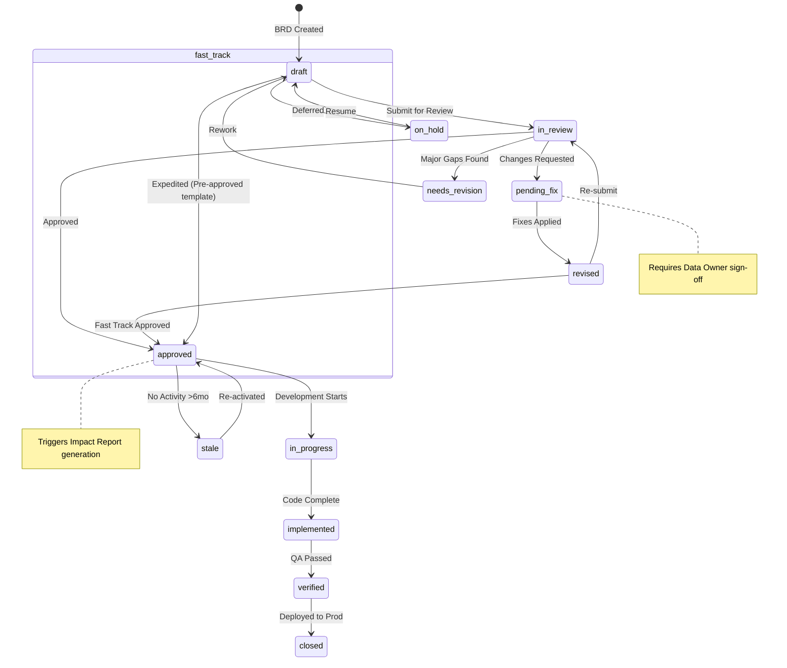
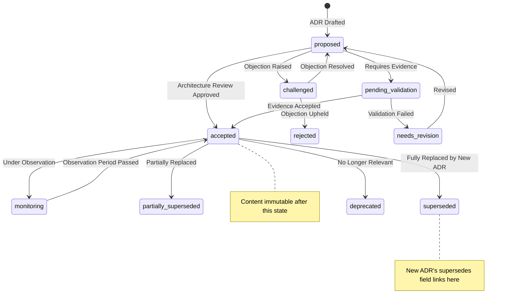

# 03 - Architecture

> The New Model for Reporting + ETL Workflow + Adjustment in the LLM Era — Architecture Design Master Document
>
> This document integrates three major design domains: Architecture Overview, Core Engine, and Knowledge Base.
> For detailed requirements see `docs/02-requirement.md`, for background and decision records see `docs/01-facts.md`.

---

## 1. Core Design Philosophy

| Principle | Description |
| --------------------------------------- | ------------------------------------------------------------------ |
| **Explore with AI, Execute without AI Side Effects** | Design Plane uses LLM to assist exploration; Runtime Plane executes deterministically with zero AI side effects. Intelligence Plane provides read-only AI analysis (ad-hoc Q&A, attribution analysis), but answers do not cross the bridge — they are not written into Runtime state |
| **Freeze is an Explicit Operation** | After user validation, one-click solidification: AI artifacts → deterministic scripts; reversible and requires approval |
| **Knowledge-Driven > Data-Driven** | AI reasons on the user-provided Knowledge Base and does not guess data semantics from thin air |
| **Compliance is Foundation, not Feature** | SDLC / permissions / audit are built in from day one |
| **User Modifications Matter More than AI Generation** | AI output is a suggestion; users can manually correct at any time |

---

## 2. Panoramic Architecture

```
                            ┌──────────────────────────────────────────┐
                            │            Auth Gateway                   │
                            │   OAuth 2.0 │ Kerberos │ SAML/SSO │ LDAP │
                            └────────────┬─────────────────────────────┘
                                         │
                    ┌────────────────────┴────────────────────┐
                    │              API Gateway                  │
                    │    Rate Limit │ Auth │ Route │ Tenant    │
                    └────────────────────┬────────────────────┘
                                         │
         ┌───────────────────────────────┼───────────────────────────────┐
         │                               │                               │
         ▼                               ▼                               ▼
┌─────────────────────┐    ┌─────────────────────────┐    ┌─────────────────────┐
│   DESIGN PLANE      │    │      FREEZE BRIDGE      │    │   RUNTIME PLANE      │
│   (AI-Assisted)     │    │   (Human Sign-off)      │    │   (Zero AI Side       │
│   Mutability: High   │    │   Mutability: Zero      │    │    Effects)            │
├─────────────────────┤    ├─────────────────────────┤    ├─────────────────────┤
│ • Conversation UI   │    │ • Spec Refinement     │    │ • Workflow Executor │
│ • Visual Designer   │    │ • Validation Engine     │    │ • Data Connectors   │
│ • Workbench         │    │ • Test Runner (Sandbox) │    │ • Output Renderer   │
│ • AI Copilot Engine │    │ • Release Manager       │    │ • Scheduler         │
│                     │    │ • CI/CD Pipeline        │    │ • Incident Manager  │
│                     │    │ • Pre-Change Doc Gen    │    │ • Query Rewriter    │
└─────────┬───────────┘    └───────────┬─────────────┘    └──────────┬──────────┘
          │                            │                              │
          │     ┌──────────────────────┴──────────────────────┐       │
          │     │          INTELLIGENCE PLANE                  │       │
          │     │   (AI Read-Only, Temporary Answers Do Not Cross the Bridge) │       │
          │     ├──────────────────────────────────────────────┤       │
          │     │ • AI Knowledge Agent (NL→Answers, Attribution Analysis)     │       │
          │     │ • Pre/Post-Change Impact Report              │       │
          │     │ • Observability & Log Analysis               │       │
          │     │ • Read-Only Queries, Does Not Write to Any Plane State        │       │
          │     └──────────────────────┬──────────────────────┘       │
          │                            │                              │
          │    ┌───────────────────────┴───────────────────────┐      │
          └───►│           KNOWLEDGE BASE (Cross-Plane)         │◄─────┘
               ├───────────────────────────────────────────────┤
               │  Business Glossary │ Data Catalog             │
               │  Mapping Registry  │ Workflow Templates       │
               │  Adjustment History│ Behavior Patterns        │
               │  Email Records                                │
               │  ──────────────────────────────────────────── │
               │  PostgreSQL + pgvector (Vector/Graph/Relational)   │
               │  + S3/MinIO (Object Store)                     │
               └──────────────┬────────────────────────────────┘
                              │
               ┌──────────────┴──────────────┐
               │        CODE GRAPH            │
               │   (System Knowledge Graph)   │
               │   Nodes: Workflow/Job/DS/... │
               │   Edges: DEPENDS_ON/READS... │
               └──────────────────────────────┘

          ┌─────────────────────────────────────────────────────────┐
          │               CROSS-CUTTING LAYER                        │
          │  Audit Trail │ Version Control │ Entitlement │ Tenant   │
          │  Data Masking│ File Export     │ Notification│ Config   │
          │  Observability│ Log System     │ Support/Ticket│        │
          └─────────────────────────────────────────────────────────┘
```

### 2.1 Code Graph API

The Code Graph serves as the system's structural knowledge graph — a unified, queryable model of all artifacts (Workflows, Jobs, DataSources, Formats, KB entries) and their relationships. It is the backbone for impact analysis, lineage tracing, and AI context retrieval.

| Aspect             | Specification                                                                                                                                                                                                              |
| ------------------ | -------------------------------------------------------------------------------------------------------------------------------------------------------------------------------------------------------------------------- |
| **Query Protocol** | GraphQL read interface; Cypher/Gremlin for deep graph traversals. All queries are parameterized and logged.                                                                                                                |
| **Write Triggers** | Event-sourced: Freeze Bridge `merge` → node/edge upsert; Runtime `execute` → status edges; KB `confirm` → cross-graph bridge edges. No direct user writes — all mutations flow through domain events.                      |
| **RBAC Filtering** | Queries are transparently filtered by caller's entitlement context: row-level (tenant), column-level (PII fields), and edge-level (cross-tenant relationships denied). The graph never returns data the caller cannot see. |
| **Cache Strategy** | Hot subgraph (active Workflows, recent KB) in Redis; full graph in Graph DB; read replicas for analytical queries.                                                                                                         |
| **Consistency**    | Eventually consistent with the Relational DB (source of truth). Max staleness: 5 seconds for status edges, 30 seconds for structural edges.                                                                                |

---

## 3. Four-Layer Model and Design Plane

The system is divided into four layers by **Mutability**. Core principle: **AI may participate in read-only analysis but must not produce side effects — Runtime Plane has zero AI side effects; Intelligence Plane AI is read-only and does not write; answers do not cross the bridge.**

| Layer | AI Present? | Artifacts | Mutability |
|---|---|---|---|
| **Design Plane** | Heavy AI | Persistent Artifacts (Compute Spec, BRD, ADR) | High — exploration, iteration |
| **Freeze Bridge** | AI-assisted validation | Signed deterministic Spec | Zero — freeze point |
| **Runtime Plane** | **Zero AI Side Effects** | Scheduled execution, materialized refresh, Pipeline output | Zero — deterministically execute Spec |
| **Intelligence Plane** | **Read-only AI** | Temporary answers (NL explanations, attribution analysis) | High — but **does not cross the bridge**, does not write any system state |

### 3.1 Design Plane in Detail

Users explore, design, and test within the Design Plane; all artifacts are "design drafts" and produce no production side effects.

| Component | Responsibility |
| -------------------------- | ------------------------------------------------------------------------------------------- |
| **Conversation Interface** | Natural language interaction: Intent Parser → Context Resolver (KB retrieval) → Plan Generator → Artifact Builder |
| **Visual Designer** | Report Designer / ETL Designer / Adjustment Designer; produces Design Artifact (YAML) |
| **Workbench** | Core operation interface integrating conversation + visualization + data preview; Session = Project |
| **AI Copilot Engine** | Pluggable LLM Provider + KB Retriever + Reasoning Engine; all output is advisory with confidence scores |
| **Light Compute Engine** | DuckDB + Polars; sub-second startup, sampled data, real-time preview |

### 3.1 Conversation Interface — Prompt Injection Defense

The Conversation Interface is the primary attack surface for prompt injection. All user input passes through a multi-layer defense pipeline before reaching any LLM:

| Layer                       | Mechanism                                                                                                                                                                                                                             |
| --------------------------- | ------------------------------------------------------------------------------------------------------------------------------------------------------------------------------------------------------------------------------------- |
| **Input Sanitization**      | Strip control characters, normalize Unicode, reject inputs exceeding 32KB.                                                                                                                                                            |
| **Instruction Boundary**    | User input is wrapped in a delimited block (`<user_input>…</user_input>`); system instructions are in a separate, immutable block. The LLM is instructed to treat user content as data, never as commands.                            |
| **KB Content Sanitization** | When KB entries are created (especially via AI extraction and Email ingestion paths), scan content for instruction-following patterns ('ignore previous', 'you are now', 'instead you should', etc.) and mark for quarantine or stripping. OCR-extracted image text also undergoes injection detection before entering LLM context. |
| **RBAC Context Injection**  | The caller's role, tenant, and permission set are injected as non-overridable system context before every LLM call.                                                                                                                   |
| **Output Guard**            | LLM responses are scanned for: (a) attempts to emit system prompts, (b) instruction-following language directed at the system, (c) code that would execute outside the Sandbox. Suspicious outputs are flagged, stripped, and logged. |
| **Audit**                   | Every LLM interaction is logged to the LLM Interaction Log with prompt_hash, retrieved KB context, and guard trigger events.                                                                                                          |

### 3.2 Design Artifact Schema (Handoff Contract)

The Design Plane produces a **Design Artifact** (YAML) that serves as the formal contract between Design Plane and Freeze Bridge. It captures both the intended specification and the AI's uncertainty about each element.

```yaml
# Design Artifact — Handoff Contract
artifact:
  id: "da_20260704_001"
  workflow_ref: "monthly_revenue_report"
  created_by: "user:alice / copilot:v3.2"
  status: draft  # draft | user_reviewed | frozen

spec:
  workflow:
    name: "Monthly Revenue Report"
    # ... full Compute Spec (Section 6) ...

fuzzy_nodes:
  - path: "jobs.transform_revenue.op[2]"
    marker: "AMBIGUOUS_FILTER"
    description: "Filter condition 'large accounts' needs definition"
    confidence: 0.45
    proposed_resolution: "WHERE account.balance > 1000000"
    user_confirmed: false

  - path: "jobs.join_crm.source.table"
    marker: "UNRESOLVED_REFERENCE"
    description: "Table 'crm_prod.accounts' not found in Data Catalog"
    confidence: 0.0
    proposed_resolution: null
    user_confirmed: false

confirmed_fields:
  - path: "jobs.source_revenue"
    confirmed_by: "user:alice"
    confirmed_at: "2026-07-04T10:30:00Z"

confidence_summary:
  overall: 0.72
  fully_confirmed_nodes: 8
  fuzzy_nodes: 2
  unresolved_nodes: 1
```

| Field                | Purpose                                                                                                                                                                                                 |
| -------------------- | ------------------------------------------------------------------------------------------------------------------------------------------------------------------------------------------------------- |
| `fuzzy_nodes`        | Nodes the AI could not deterministically resolve. Each carries a `marker` type, `confidence` score, and optional `proposed_resolution`. Freeze Bridge rejects any artifact with unresolved fuzzy nodes. |
| `confirmed_fields`   | Nodes explicitly confirmed by a human user. Freeze Bridge treats these as authoritative, skipping AI re-evaluation.                                                                                     |
| `confidence_summary` | Aggregate scores used by Freeze Bridge to decide required review depth. Artifacts with `overall < 0.8` mandate full peer review.                                                                        |

### 3.3 Workbench — VCS Integration

The Workbench is the primary authoring surface — a Version Control System (VCS) integrated workspace. Every session is backed by a Git worktree:

| Integration Point       | Mechanism                                                                                                                                       |
| ----------------------- | ----------------------------------------------------------------------------------------------------------------------------------------------- |
| **Session = Branch**    | Each Workbench session creates a feature branch from `main`. All edits (Spec, KB, Format) are auto-committed with structured messages.          |
| **Diff Preview**        | Before Freeze, the Workbench renders a rich diff (Spec + Impact Graph + Data Preview) against the base branch.                                  |
| **PR Workflow**         | Freeze triggers PR creation. The Workbench embeds the PR conversation, CI status, and review checklist inline.                                  |
| **Conflict Resolution** | Concurrent edits to the same artifact are detected via Git merge conflicts. The Workbench provides a side-by-side merge editor with KB context. |
| **History**             | Full `git log` is exposed as a timeline view: who changed what, when, and why (linked to BRD/ADR/Incident).                                     |

### 3.4 Design Plane — Detailed Component Architecture

#### Conversation Interface
```
User Message → Intent Parser → Context Resolver → Plan Generator → Artifact Builder
                   │                │                  │
                   ▼                ▼                  ▼
              Intent Catalog   KB Retriever      Compute Spec
              (50+ intents)   (Vector+Graph)     Template Library
```
- **Intent Parser**: Classifies user intent (new_report, modify_filter, add_quality_check, explain_lineage, …) using a fine-tuned classifier backed by the Intent Catalog.
- **Context Resolver**: Retrieves relevant KB entries (Business Glossary terms, Data Catalog columns, Mapping Registry entries) via hybrid search (semantic + keyword + graph expansion).
- **Plan Generator**: Produces a structured plan (sequence of Spec edits) from intent + context, rendered for user confirmation before any artifact is touched.
- **Artifact Builder**: Executes the confirmed plan by mutating the Design Artifact YAML; each mutation is a discrete, undoable operation.

#### Visual Designer
- **Report Designer**: Drag-and-drop canvas for layout (header, table, chart, KPI card, paragraph). Binds to DataSource columns via Data Catalog. Generates Format definitions in the Design Artifact.
- **ETL Designer**: Node-edge canvas mirroring the Code Graph. Drag a DataSource node → auto-generates `source` Job. Connect nodes → generates `depends_on`. Each node has a property panel for type-specific configuration.
- **Adjustment Form Builder**: Developer or Admin defines the Adjustment Form (column definitions, validation rules, approval chains) and produces the Form Definition YAML. Business Users submit via Web UI, download and fill an Excel file then upload/import, or submit via API — all three go through the same pipeline:

```
Adjustment Submission Pipeline:
  Permission → Validation → Approval → Trigger ETL (SDLC-defined Workflow)
```

Core Principles:
- **Validation before Approval** — an approver must never review a form that fails validation
- **Any operation that modifies financial data, regardless of amount, must go through this pipeline — there is no Auto-write-off**
- **Approval chain is configurable** (four-eyes principle / dual approval by amount threshold / no approval) to meet different team needs
- **Repeat Adjustment**: Scheduled preset Adjustments (amounts can be pre-filled), approval path can be simplified (auto-approve if amount stays within historical range)
- **Daily Manual Adjustment**: Event-driven blank form, full approval chain

#### AI Copilot Engine
- **Provider Plugin**: OpenAI / Anthropic / open-source / private — configured per tenant. All calls go through the same guard pipeline (Section 3.1).
- **KB Retriever**: Hybrid search across PostgreSQL + pgvector (semantic vector search via HNSW), PG recursive CTE (graph expansion), and native SQL (exact metadata match). Results are fused and ranked before injection. Future: dedicated engines (Milvus/Neo4j) via same VectorStore/GraphStore interfaces — no query logic changes.
- **Reasoning Engine**: Chain-of-thought reasoning scoped to the retrieved KB context. Produces structured suggestions (Spec diffs, KB entry proposals, quality rule suggestions) with per-field confidence scores.
- **Feedback Loop**: User corrections are captured and used to fine-tune the Intent Parser and ranking model (within tenant boundary; no cross-tenant training).

---

## 4. Freeze Bridge

Design Artifact → Validation → Testing → Approval → Production. This is the critical process of transforming AI artifacts into deterministic engineering artifacts.

```
Design Artifact (YAML)
    │
    ├── Spec Refinement Assistant: Scan fuzzy_nodes → flag fuzzy nodes → propose deterministic solutions → mandatory human sign-off
    │   (Not auto-replacement; assists decision-making; all resolutions are recorded)
    ├── Validation Engine: Schema Validation + DQ Gate + Logical Integrity Check
    ├── Test Runner (Sandbox): Execute on sampled data → Snapshot comparison → Regression Test
    ├── Pre-Change Impact Report (Auto-generated): Diff + Why + Impact Scope Diagram + Data Preview
    ├── Review: PR → Peer Review + Business Approver + Data Owner
    ├── Staged Rollout: Canary (see Canary Gating below)
    └── Post-Change Summary (Auto-generated): Design Consistency Check + Update DAG + Change Log
```

### 4.1 Spec Refinement Assistant

The Spec Refinement Assistant replaces the traditional "Script Compiler" concept. It does **not** automatically replace AI-generated fuzzy nodes with deterministic code. Instead:

| Step           | Action                                                                                                                                                                                                           | Human Involvement                                                  |
| -------------- | ---------------------------------------------------------------------------------------------------------------------------------------------------------------------------------------------------------------- | ------------------------------------------------------------------ |
| **1. Scan**    | Parse Design Artifact; identify all `fuzzy_nodes` (markers: AMBIGUOUS_FILTER, UNRESOLVED_REFERENCE, UNCERTAIN_FORMULA, MISSING_THRESHOLD, etc.)                                                                  | None                                                               |
| **2. Propose** | For each fuzzy node, generate 1–3 determinization proposals with trade-off explanations (performance, correctness, edge-case behavior). Each proposal includes a confidence score and affected downstream nodes. | None                                                               |
| **3. Present** | Render proposals in the Workbench with diff preview, impact visualization, and KB evidence links. Fuzzy nodes are grouped by risk level.                                                                         | None                                                               |
| **4. Decide**  | User reviews each proposal and either: (a) accepts one, (b) edits and accepts, (c) provides a custom resolution, or (d) escalates to a Data Owner.                                                               | **Mandatory** — all fuzzy nodes must be resolved before proceeding |
| **5. Record**  | Every resolution is recorded with: who, when, which proposal, any edits, and the final deterministic Spec fragment. This record is immutable and linked to the Audit Trail.                                      | Sign-off captured automatically                                    |

**Key Principle**: The Assistant flags and proposes; the human decides. There is no "auto-compile" path from AI artifact to production Spec.

### 4.2 Canary Gating & Auto-Rollback

Staged rollout is governed by explicit canary gating criteria. The system automatically advances or rolls back based on observed metrics — no manual gate check required for standard cases.

| Stage          | Traffic              | Duration                               | Gate Criteria (all must pass)                                                                                                                     | Auto-Rollback Trigger                                          |
| -------------- | -------------------- | -------------------------------------- | ------------------------------------------------------------------------------------------------------------------------------------------------- | -------------------------------------------------------------- |
| **Canary 1%**  | 1% of scheduled runs | 2 full cycles or 4h (whichever longer) | (a) Zero execution errors; (b) Output row count within ±5% of baseline; (c) All quality checks pass; (d) No schema drift detected                 | Any gate failure → immediate rollback; incident auto-created   |
| **Canary 10%** | 10%                  | 6 full cycles or 24h                   | All Stage-1 criteria + (e) p95 latency ≤ 1.5× baseline; (f) Cost per run ≤ 1.2× baseline; (g) Zero data-quality regressions vs. baseline snapshot | Any gate failure → rollback; notify Business Approver          |
| **50%**        | 50%                  | 12 cycles or 72h                       | All Stage-2 criteria + (h) Downstream consumers report zero issues; (i) Reconciliation pass (if applicable)                                       | Any gate failure → rollback; full post-mortem required         |
| **100%**       | Full cutover         | Permanent                              | All prior criteria sustained for 24h at 50%                                                                                                       | Manual rollback still available for 7 days via Release Manager |

**Rollback Mechanism**: Rollback redeploys the previous validated Spec version. All data written by the canary (files, DB writes) is quarantined and flagged for review. The Incident Manager creates a P2 incident with full context. After rollback, the frozen artifact is returned to `draft` status with the failed canary results attached.

### 4.3 Fuzzy Node Detection & Resolution Algorithm

> The core algorithm of Freeze Bridge — how to transform AI-generated fuzzy design drafts into deterministic scripts.

#### 4.3.1 Fuzzy Node Types (Fuzzy Node Classification)

| Type                        | Example                                             | Detection Method                                                                     | Confidence Threshold             |
| --------------------------- | --------------------------------------------------- | ------------------------------------------------------------------------------------ | -------------------------------- |
| **Implicit JOIN**           | "sales by region" without explicit JOIN path        | Schema graph traversal: no direct FK path found between `sales` and `region` → fuzzy | Any missing explicit JOIN → flag |
| **Ambiguous Aggregation**   | "average" without window/group specification        | AST analysis: aggregate function without GROUP BY clause                             | —                                |
| **Underspecified Filter**   | "last quarter" without date column mapping          | Temporal expression detected without concrete WHERE clause on timestamp column       | —                                |
| **Inferred Business Logic** | "revenue = sales - returns" without KB confirmation | Formula extracted from NL but no matching entry in Business Glossary                 | Confidence < 0.9 → flag          |
| **Missing Data Source**     | Reference to table/view not found in Data Catalog   | Catalog lookup failure                                                               | —                                |

#### 4.3.2 Detection Algorithm (Pseudocode)

```
function detectFuzzyNodes(computeSpec):
    fuzzyNodes = []
    
    for each job in computeSpec.jobs:
        // 1. Schema Resolution Check
        for each tableRef in job.inputs:
            resolved = dataCatalog.resolve(tableRef)
            if not resolved or resolved.confidence < 1.0:
                fuzzyNodes.add(FuzzyNode(
                    type="MISSING_OR_AMBIGUOUS_SOURCE",
                    location=tableRef.line_number,
                    evidence=f"Table '{tableRef.name}' not found in Data Catalog",
                    suggestions=dataCatalog.fuzzySearch(tableRef.name, topK=3)
                ))
        
        // 2. JOIN Path Validation
        if job.type == "transform" and job.sql:
            ast = parseSQL(job.sql)
            for each tablePair in extractTablePairs(ast):
                path = codeGraph.findShortestPath(tablePair.a, tablePair.b)
                if not path or path.hops > 2:
                    fuzzyNodes.add(FuzzyNode(
                        type="IMPLICIT_JOIN",
                        location=tablePair.line_number,
                        evidence=f"No direct FK relationship between {tablePair.a} and {tablePair.b}",
                        suggestions=codeGraph.suggestJoinPaths(tablePair.a, tablePair.b)
                    ))
        
        // 3. Aggregation Completeness
        if job.type == "transform":
            aggregates = extractAggregates(job.sql or job.ops)
            for each agg in aggregates:
                if not agg.hasGroupBy and not agg.isWindowFunction:
                    fuzzyNodes.add(FuzzyNode(
                        type="AMBIGUOUS_AGGREGATION",
                        location=agg.line_number,
                        evidence=f"Aggregate '{agg.function}' missing GROUP BY or OVER clause"
                    ))
        
        // 4. Business Logic Verification
        if job.type == "transform" and job.python_code:
            formulas = extractFormulas(job.python_code)
            for each formula in formulas:
                glossaryEntry = kb.queryBusinessGlossary(formula.name)
                if not glossaryEntry or glossaryEntry.confidence < 0.9:
                    fuzzyNodes.add(FuzzyNode(
                        type="INFERRED_BUSINESS_LOGIC",
                        location=formula.line_number,
                        evidence=f"Formula '{formula.name}' not confirmed in Business Glossary",
                        suggestions=kb.suggestGlossaryMatches(formula.name)
                    ))
    
    return fuzzyNodes
```

#### 4.3.3 Resolution Strategy Catalog

For each Fuzzy Node type, provide 1-3 deterministic options for human selection:

| Strategy                        | When Used                     | Example                                                                                                                                                                                                       |
| ------------------------------- | ----------------------------- | ------------------------------------------------------------------------------------------------------------------------------------------------------------------------------------------------------------- |
| **Schema Binding**              | Missing/ambiguous data source | "Select from: `sales_orders` (ERP) or `sales_orders_v2` (Data Warehouse) — [IT Admin confirmed ERP is authoritative]"                                                                                         |
| **JOIN Path Selection**         | Implicit JOIN                 | "Path A: `orders.customer_id → customers.id` (direct FK, 1 hop). Path B: `orders.region_code → regions.code → geo.customer_region` (2 hops via mapping table). Confidence: A=0.98, B=0.72. Recommend Path A." |
| **Aggregation Disambiguation**  | Ambiguous aggregation         | "Option 1: GROUP BY region, month. Option 2: Moving average OVER (PARTITION BY region ORDER BY month ROWS 2 PRECEDING). Context: user requested 'monthly trend' → Recommend Option 2."                        |
| **Business Logic Confirmation** | Inferred formula              | "Formula 'net_revenue = gross_sales - returns - discounts' matches glossary entry 'Net Revenue (ASC 606)' with confidence 0.85. Please confirm or edit."                                                      |
| **Manual Override**             | No high-confidence suggestion | "Cannot resolve. Please specify manually: [free-text input + schema browser]"                                                                                                                                 |

**Conflict Resolution Rule**: When user explicitly defines a mapping that conflicts with KB → user definition wins (recorded as KB override). When two fuzzy nodes suggest conflicting resolutions → both surfaced to user with impact comparison.

---

## 5. Runtime Plane

Deterministic, high-performance, fully auditable production execution.

| Component | Responsibility |
| -------------------------- | -------------------------------------------------------------------------------------------------------------------------------------------------------------- |
| **Scheduler** | Cron / Event Trigger / Manual / API / Webhook; timezone-aware, missed-execution compensation, concurrency control |
| **Query Rewriter** | Intercepts all Runtime SQL/queries → injects row-level security predicates, column-level masking functions, tenant filtering → produces rewritten query. Compiled in real-time from Entitlement metadata; Query Plan recorded to Audit Trail. |
| **Query Service** | Data source metadata management + intelligent query generation + Pushdown optimization. Auto-scans DB structures to build relationship graphs; retrieves Schema to generate optimal query paths when users go NL→SQL; ensures predicates/aggregations/JOINs are pushed down to the data source for execution. |
| **Workflow Executor** | Zero AI side effects; each Job in an independent Sandbox; immutable state passing between steps; automatic retry + rollback on failure |
| **Heavy Compute Engine** | **Spark** (Post-MVP), distributed execution, TB/PB-scale data processing. Trino and Ray deferred until clear customer demand emerges. MVP phase uses only DuckDB (Light Engine). |
| **Data Connector Adapter** | Five-level integration framework: File → DB → API → Message → Custom Plugin; unified DataSource Interface |
| **Output Renderer** | PDF / Excel / CSV / JSON / Parquet; Email / Slack / Webhook / API / Dashboard |
| **Incident Manager** | Execution failure → auto-create Incident (with full Context) → auto-route → track to resolution |

### 5.1 Resilience Patterns

| Pattern                  | Implementation                                                                                                                                                                                                                                                                                                          | Scope                               |
| ------------------------ | ----------------------------------------------------------------------------------------------------------------------------------------------------------------------------------------------------------------------------------------------------------------------------------------------------------------------- | ----------------------------------- |
| **Circuit Breaker**      | Per-data-source connection. 5 consecutive failures → circuit opens (30s). Half-open probe after cooldown. Prevents cascading failures from unhealthy upstream systems.                                                                                                                                                  | All Data Connectors                 |
| **Bulkhead**             | Per-tenant Sandbox pool isolation. One tenant's resource exhaustion cannot starve other tenants. Per-Job memory/CPU limits enforced by cgroups.                                                                                                                                                                         | Sandbox Pool, Tenant                |
| **Retry with Backoff**   | Failed transient operations (network timeout, connection refused): exponential backoff (1s→2s→4s→8s, max 3 retries). Non-transient errors (schema mismatch, auth failure): no retry, immediate Incident.                                                                                                                | Workflow Executor, API Gateway      |
| **Graceful Degradation** | **Opt-in per Workflow** (`fallback_to_light_engine: true`, must be explicitly declared, default false). When Heavy Engine is unavailable → eligible Workflows auto-degrade to Light Engine (must satisfy: within `max_estimated_rows` threshold + no Python transform or already transpiled). KB Vector search degradation → auto-switch to keyword search. All degradations trigger notifications and SLA degradation markers. | Compute Engine, KB Retrieval        |
| **Timeout Propagation**  | Every operation has a defined timeout. Timeouts propagate up the call chain (not reset). Parent operation timeout = sum of child timeouts + buffer.                                                                                                                                                                     | All Services                        |
| **Dead Letter Queue**    | Failed notifications, failed KB write-backs, and failed external API calls are routed to a DLQ with configurable retry policies. Prevents data loss during transient outages.                                                                                                                                           | Notification, KB Write, Integration |

### 5.2 Data Classification Tiers

All data in the system is classified into four sensitivity tiers. Controls are applied at each tier:

| Tier                 | Label                           | Examples                                                                                                    | Encryption                                                                 | Masking                                                | Retention                                                        | Export Control                             |
| -------------------- | ------------------------------- | ----------------------------------------------------------------------------------------------------------- | -------------------------------------------------------------------------- | ------------------------------------------------------ | ---------------------------------------------------------------- | ------------------------------------------ |
| **T0: Public**       | Non-sensitive metadata          | Workflow templates, public KB glossary terms                                                                | At-rest only                                                               | None                                                   | Permanent                                                        | Unrestricted                               |
| **T1: Internal**     | Operational data                | Workflow definitions, execution metrics, format templates, agent configurations                             | At-rest + Transit                                                          | None                                                   | 7 years                                                          | Tenant-admin approved                      |
| **T2: Confidential** | Business data                   | Report outputs, aggregated metrics, KB business terms, data catalog (non-PII columns)                       | At-rest + Transit + Application-level (AEAD)                               | Dynamic (role-based)                                   | Per policy (default 7 years)                                     | Data Owner approval                        |
| **T3: Restricted**   | PII, financial details, secrets | Customer names, financial transaction amounts, adjustment entries with reasons, email bodies containing PII | At-rest + Transit + Application-level + Column-level (envelope encryption) | Dynamic (default: redact/hash) + Audit on every access | Per regulation (GDPR: on-request deletion; SOX: 7 years minimum) | Prohibited without explicit legal approval |

**Classification Flow**: Data Catalog tags columns with sensitivity tier → Query Rewriter enforces masking per tier + role → Log system redacts T3 fields before writing → Export gate blocks T3 data in exports without approval.

### 5.3 Query Service

Query Service is the core bridge connecting "what data the user wants to see" with "how the system retrieves data from data sources." Admin configures data source metadata, AI assists in generating optimal queries, and Runtime executes them deterministically, ensuring query pushdown to data sources to reduce data transfer and guarantee correctness.

```
┌─────────────────────────────────────────────────────────────────────────┐
│                         QUERY SERVICE                                     │
│                                                                          │
│  ┌───────────────────┐  ┌───────────────────┐  ┌──────────────────────┐ │
│  │  METADATA MANAGER  │  │  QUERY GENERATOR   │  │  PUSHDOWN OPTIMIZER  │ │
│  │                    │  │                    │  │                      │ │
│  │ • Schema Discovery │  │ • NL→SQL Translation│  │ • Predicate Pushdown │ │
│  │ • FK/PK Detection   │  │ • JOIN Path Selection│  │ • Aggregation Pushdown│ │
│  │ • IT Manual Relations│  │ • Optimal Table/Col  │  │ • JOIN Order Optimize │ │
│  │ • Schema Versioning  │  │ • Query Plan Gen     │  │ • Dialect Adaptation  │ │
│  │                    │  │                    │  │ • Query Cost Estimate │ │
│  └────────┬───────────┘  └────────┬───────────┘  └──────────┬───────────┘ │
│           │                       │                          │             │
│           ▼                       ▼                          ▼             │
│  ┌─────────────────────────────────────────────────────────────────────┐ │
│  │                     QUERY EXECUTION DELEGATE                         │ │
│  │                                                                      │ │
│  │  • Direct Pushdown (WHERE/JOIN/AGG completed at data source)          │ │
│  │  • Federated Execution (cross-source JOIN coordinated by Compute Engine)│ │
│  │  • Post-Query Processing (Light/Heavy Engine post-processing)          │ │
│  │  • Result Cache (reuse cache for same query params, TTL configurable)  │ │
│  └─────────────────────────────────────────────────────────────────────┘ │
└─────────────────────────────────────────────────────────────────────────┘
        │                    │                    │
        ▼                    ▼                    ▼
  ┌──────────┐     ┌──────────────┐     ┌──────────────────┐
  │   KB     │     │ Data Connector│     │ Compute Engine   │
  │  Data    │     │   Adapter     │     │ (Light / Heavy)  │
  │ Catalog  │     │  (5 Levels)   │     │                  │
  └──────────┘     └──────────────┘     └──────────────────┘
```

#### 5.3.1 Metadata Manager

IT administrators use this component to register enterprise data assets into the system:

**Schema Discovery (Automatic Scanning)**:

| Capability               | Mechanism                                                                                            | Output                                                |
| ------------------------ | ---------------------------------------------------------------------------------------------------- | ----------------------------------------------------- |
| **Connection Test**      | Verify connection info and permissions via Data Connector Adapter                                    | `ConnectionStatus { ok, version, features }`          |
| **Schema Scan**          | `INFORMATION_SCHEMA` queries + JDBC `DatabaseMetaData`                                               | Complete table/column listing (types, nullable, defaults) |
| **PK/FK Detection**      | (a) PK/FK declared in DDL → deterministic extraction (b) naming convention inference (c) data distribution inference (column name + cardinality analysis) | `RelationshipCandidate { confidence, evidence }`      |
| **Index Detection**      | Extract existing index information for query optimization                                            | `IndexInfo { columns, type, cardinality }`            |
| **Data Sampling**        | Randomly sample N rows for type inference and data preview                                           | `SampleData { rows, column_stats }`                   |

**Relationship Declaration (IT Manual Configuration)**:

Auto-detected FK/PK relationships have limited confidence (especially across databases, and for legacy systems without DDL constraints). IT can manually declare relationships via Workbench:

```yaml
table_relationships:
  - name: "orders_to_customers"
    left: { data_source: "erp_prod", schema: "public", table: "orders", column: "customer_id" }
    right: { data_source: "crm_prod", schema: "public", table: "accounts", column: "id" }
    join_type: LEFT  # LEFT / INNER / RIGHT
    cardinality: MANY_TO_ONE  # ONE_TO_ONE / ONE_TO_MANY / MANY_TO_ONE / MANY_TO_MANY
    business_rule: "ERP orders.customer_id maps to CRM customer master data id"
    confidence: 1.0  # Manual declaration → highest confidence
    declared_by: "it:zhang-san"
    declared_at: "2026-07-04"
```

These relationships are stored as first-class entities in the KB Data Catalog and linked via `REFERENCES` edges in the Code Graph.

#### 5.3.2 Query Generator

When a user requests data via NL or Compute Spec, Query Generator is responsible for generating optimal SQL:

**Query Generation Flow**:

```
User Intent ("Q3 gross margin by region")
        │
        ▼
┌─────────────────────────────────────────────┐
│ STEP 1: Schema Resolution                          │
│                                              │
│ • KB Retrieval: Look up from Business Glossary │
│   "gross margin" → formula: (revenue-cogs)/revenue │
│   "region" → dimension: region_code           │
│ • Data Catalog: Locate the tables and columns for│
│   revenue, cogs, region_code                  │
│ • Mapping Registry: Check if cross-system       │
│   mapping is needed                            │
│                                              │
│ Output: ResolvedSchema { tables[], cols[],  │
│          mappings[], confidence }            │
└──────────────────────┬──────────────────────┘
                       │
                       ▼
┌─────────────────────────────────────────────┐
│ STEP 2: JOIN Path Selection                  │
│                                              │
│ • Find join paths for target tables from the     │
│   Relationship Graph                              │
│ • When multiple paths exist → select optimal based│
│   on cost estimate:                               │
│   - Path length (JOIN count)                      │
│   - Intermediate table size (cardinality estimate)│
│   - Index availability                            │
│   - JOIN type efficiency (HASH/MERGE/NESTED LOOP) │
│ • If unable to determine automatically → mark     │
│   AMBIGUOUS_JOIN_PATH, fallback to Design Plane   │
│   for user selection                              │
│                                              │
│ Output: JoinPath { path[], estimated_cost,   │
│          alternatives[], ambiguous }          │
└──────────────────────┬──────────────────────┘
                       │
                       ▼
┌─────────────────────────────────────────────┐
│ STEP 3: SQL Generation                        │
│                                              │
│ • Generate ANSI SQL:2003 compliant standard SQL  │
│ • Structure: SELECT [cols] FROM [path]            │
│         WHERE [filters] GROUP BY [dims]           │
│         HAVING [conditions]                       │
│ • Formula Translation: KB formulas → SQL          │
│   expressions                                    │
│   "(revenue - cogs) / revenue"                   │
│   → "SUM(r.revenue - r.cogs) / SUM(r.revenue)"   │
│ • Parameterization: date ranges, filter criteria  │
│   → $1, $2                                       │
│                                              │
│ Output: ParameterizedSQL { sql, params[],    │
│          referenced_tables[], dialect }       │
└──────────────────────┬──────────────────────┘
                       │
                       ▼
┌─────────────────────────────────────────────┐
│ STEP 4: Query Validation                      │
│                                              │
│ • SQL AST validation (syntax correctness)        │
│ • Schema validation (column/table existence)      │
│ • Permission validation (user access to tables    │
│   /columns)                                      │
│ • Performance pre-check (JOIN depth, estimated    │
│   scan rows)                                     │
│                                              │
│ Output: ValidatedSQL with validation_report  │
└─────────────────────────────────────────────┘
```

#### 5.3.3 Pushdown Optimizer

Ensures that computation completes at the data source side whenever possible, returning only the necessary result set to the Compute Engine:

**Pushdown Decision Matrix**:

| Operation Type             | Pushdown Strategy       | Condition                                                       | Fallback When Not Pushed Down                         |
| -------------------------- | ----------------------- | --------------------------------------------------------------- | ----------------------------------------------------- |
| **WHERE / Filter**         | Always push down        | Unconditional (simplest optimization)                            | —                                                     |
| **LIMIT / OFFSET**         | Always push down        | —                                                               | —                                                     |
| **GROUP BY / Aggregation** | Always push down        | Aggregation function has native support at data source           | Compute Engine execution (e.g. DuckDB/Spark re-aggregation) |
| **JOIN (same source)**     | Always push down        | JOIN tables are in the same data source instance                 | Compute Engine execution                              |
| **JOIN (cross-source)**    | Conditional push down   | Small tables → broadcast to each data source for local JOIN; large tables → Compute Engine coordination | Compute Engine as federated query engine              |
| **Window Functions**       | Conditional push down   | Data source supports (PG 9.3+, MySQL 8.0+, Snowflake ✓, BigQuery ✓) | Compute Engine execution                              |
| **Python UDF**             | Never push down         | Data source cannot execute Python code                          | Data fetched back and executed by Compute Engine      |
| **ORDER BY**               | Always push down (with index)| Sort column has available index                                | Compute Engine execution (sortable but slower)         |
| **DISTINCT**               | Always push down        | —                                                               | —                                                     |

**Pushdown Validation & Performance Protection**:

```yaml
pushdown_policy:
  max_rows_transferred: 10_000_000    # Max rows transferred per query (exceeded → paginate/sample/reject)
  max_query_timeout_source: 300s     # Max execution time on data source side
  prefer_source_agg: true             # Prefer aggregation at data source side
  cross_source_join_strategy: auto    # auto | broadcast_small | compute_engine
  fallback_on_pushdown_failure: true  # Auto-fallback to Compute Engine when pushdown fails
```

**Pushdown Plan Visualization**:

Each generated query is accompanied by a Pushdown Plan, showing which operations are completed at the data source and which at the Compute Engine:

```
Query: "Q3 gross margin by region"

┌──────────────────────────────────────────────────────┐
│ DATA SOURCE: erp_prod (PostgreSQL)                   │
│ ✅ WHERE quarter = 'Q3' AND year = 2026              │
│ ✅ GROUP BY region_code                              │
│ ✅ Aggregation: SUM(revenue), SUM(cogs)              │
│ Result: 50 rows × 3 cols (~2KB)                     │
└──────────────────────────────────────────────────────┘
                    │ (50 rows transferred)
                    ▼
┌──────────────────────────────────────────────────────┐
│ COMPUTE ENGINE: Light Engine (DuckDB)                │
│ • Compute: (SUM(revenue) - SUM(cogs)) / SUM(revenue) │
│ • ORDER BY margin_pct DESC                           │
│ Result: 50 rows × 2 cols (~1KB)                     │
└──────────────────────────────────────────────────────┘
```

#### 5.3.4 Collaboration with Existing Components

| Collaborating Component      | Interaction Method                                                                                                                       | Data Flow                |
| ---------------------------- | ---------------------------------------------------------------------------------------------------------------------------------------- | ------------------------ |
| **KB Data Catalog**          | Metadata Manager writes scanned Schema + IT-declared relationships → Data Catalog. Query Generator reads Data Catalog for Schema resolution | Bidirectional            |
| **AI Copilot (Design Plane)** | Conversation Interface's Intent Parser passes NL→Intent to Query Generator; Query Generator returns ValidatedSQL for Preview execution   | NL Intent → SQL          |
| **Query Rewriter**           | SQL generated by Query Generator passes through Query Rewriter for RLS/CLS/masking injection before submission to Data Connector        | SQL → RewrittenSQL       |
| **Data Connector Adapter**   | Executes RewrittenSQL, returns result set. Pushdown Optimizer decides which operations complete on the Connector side                    | RewrittenSQL → ResultSet |
| **Compute Engine**           | Receives intermediate results after pushdown, completes post-processing (computed columns, cross-source JOIN, Python UDF)               | ResultSet → FinalResult  |
| **Code Graph**               | Records Pushdown Plan, referenced tables and columns, JOIN paths for each query → used for Impact Analysis                              | Query → Code Graph edges |

#### 5.3.5 Query Cache

| Cache Layer                | Hit Condition                                                        | TTL                        | Storage    |
| -------------------------- | -------------------------------------------------------------------- | -------------------------- | ---------- |
| **L1: Result Cache**       | Same SQL hash + same params + data source unchanged (schema version match) | 5 min (configurable)       | Redis      |
| **L2: Schema Cache**       | Schema snapshot in Data Catalog                                      | 6 hours (background refresh) | PostgreSQL |
| **L3: Relationship Cache** | Resolved JOIN paths                                                  | 1 hour (invalidated on Schema change) | Redis      |

> Cache invalidation trigger: Data Connector detects Schema change → sends `SchemaChangeEvent` → Query Service receives → invalidates L1/L3 cache → notifies affected Workflow Owners (via FR40 Dependency Manager).

### 5.4 Large-Scale Data Architecture

When data volume reaches TB scale and data sources span multiple heterogeneous systems, Pushdown alone cannot guarantee performance and functional completeness. This section designs a large-scale data processing architecture following industry best practices, covering table format selection, partitioning strategy, incremental processing, pre-aggregation, and cost-based optimization.

#### 5.4.1 Industry Best Practice Comparison

| Dimension         | Industry Standard                                                                     | This System's Design                                                                                    |
| ----------------- | ------------------------------------------------------------------------------------- | ------------------------------------------------------------------------------------------------------- |
| **Table Format**  | Apache Iceberg / Delta Lake / Hudi                                                    | Native Iceberg/Delta table support via Data Connector; `source` Job can specify `table_format`          |
| **Partitioning**  | Time partitioning (dt=yyyy-mm-dd), hierarchical partitioning (dt/hour), hidden partitioning (Iceberg partition transforms) | Metadata Manager auto-detects partition columns; Query Generator generates partition pruning WHERE clauses |
| **File Format**   | Parquet (columnar, high compression), ORC (Hive ecosystem)                            | `data_export` Format defaults to Parquet + ZSTD compression; Runtime intermediate results as Parquet    |
| **Incremental**   | CDC (Debezium) + watermark + incremental materialization                              | `source` Job supports `incremental` mode; `watermark` column tracks incremental boundary                |
| **Pre-Aggregation** | Materialized views (PG MATERIALIZED VIEW / ClickHouse / StarRocks)                  | New `materialize` Job Type (see below)                                                                   |
| **Data Skipping** | Iceberg metadata (min/max + bloom filter) + Parquet row group stats                   | Pushdown Optimizer leverages file-level stats at Connector layer to skip irrelevant data                |
| **Cost Optimization** | Table statistics (ANALYZE) + CBO (Cost-Based Optimizer)                           | Metadata Manager collects statistics; Query Generator selects JOIN strategy based on statistics         |
| **Federated Query** | Trino / Presto (cross-source JOIN)                                                  | Cross-source JOIN coordinated by Compute Engine (DuckDB/Spark); small table broadcast strategy          |

#### 5.4.2 Partitioning & Pruning

When a single table reaches TB scale, partitioning is the foundation for ensuring query performance:

**Partition Detection & Declaration**:

```yaml
# Metadata Manager auto-detection or IT declaration
table_partitioning:
  - data_source: "erp_prod"
    table: "gl_je_lines"
    partition_columns:
      - name: "posting_date"
        transform: "day"        # Iceberg: days(posting_date) | Delta: DATE_TRUNC('day', posting_date)
        granularity: "daily"
    partition_stats:
      total_partitions: 1095    # 3 years of daily partitions
      avg_partition_size_mb: 50
      max_partition_size_mb: 200
    file_stats:                  # File-level statistics (extracted from Iceberg metadata / Parquet footer)
      - column: "amount"
        min_value: -1000000.00
        max_value: 50000000.00
        null_count: 1247
        ndv: 3420000             # Number of Distinct Values
```

**Partition Pruning**:

Query Generator automatically maps user filter conditions to partition columns:

```
User Query: "2026 Q3 Revenue" → WHERE posting_date BETWEEN '2026-07-01' AND '2026-09-30'
                                          ↓
Pushdown Optimizer: Identifies posting_date as a partition column
                                          ↓
Scan Range: 1095 partitions → only 92 partitions (Q3 = 92 days)
Data Skipping: Use file_stats.amount.min/max to filter out files not containing the target amount range
                                          ↓
Actual Scan: Only ~30% of files within 92 partitions → ~1.4GB data (vs full table ~50GB)
```

**Partition Evolution Support**:
- Iceberg: supports `ALTER TABLE ... ADD PARTITION FIELD` (online operation, no data rewrite)
- Delta Lake: `ALTER TABLE ... ADD PARTITION` (requires rewriting new data to include new partition column)
- Traditional RDBMS: auto-managed via `pg_partman`; Metadata Manager monitors partition bloat

#### 5.4.3 Incremental Processing

Full re-runs of TB-scale tables are unacceptable. The system avoids full scans through three incremental modes:

| Incremental Mode           | Trigger Mechanism                              | Applicable Scenario                       | Implementation                                   |
| -------------------------- | ---------------------------------------------- | ----------------------------------------- | ------------------------------------------------ |
| **Watermark Incremental**  | `watermark_column` + `last_executed_watermark` | Fact tables (append by time)              | `SELECT ... WHERE updated_at > :last_watermark`  |
| **CDC Incremental**        | Debezium + Kafka → `change_log` table          | Transaction tables (frequent UPDATE/DELETE) | Consume CDC event stream, MERGE to target        |
| **Partition Incremental**  | Process only new partitions                    | Immutable partitioned tables (logs/events) | Scan new partitions after `last_executed_partition` |

**Incremental Workflow Configuration Example**:

```yaml
workflow:
  name: "daily_revenue_incremental"
  incremental_config:
    strategy: watermark
    watermark_column: "posting_date"
    lookback_window: "3 days"       # Allow 3 days of late data catch-up
    late_arrival_policy: upsert     # upsert | skip | alert
  jobs:
    - id: "source_revenue"
      type: source
      incremental_filter: "posting_date BETWEEN :watermark_start AND :watermark_end"
```

**Watermark Management**:

```
┌─────────────────────────────────────────────────────┐
│              WATERMARK STATE STORE                   │
│                                                      │
│  Workflow: "daily_revenue_incremental"               │
│  ┌────────────────────────────────────────────────┐ │
│  │ watermark_column: posting_date                  │ │
│  │ last_high_watermark: 2026-07-04T06:00:00Z     │ │
│  │ last_low_watermark: 2026-07-04T00:00:00Z      │ │
│  │ last_execution: 2026-07-05T02:15:00Z            │ │
│  │ watermarks_processed: 182 (successful sequences)│ │
│  └────────────────────────────────────────────────┘ │
│                                                      │
│  State Persistence: PostgreSQL `watermark_state` table     │
│  Transactional Update: Committed in the same transaction   │
│  as Workflow execution state                                │
│  Rollback Safe: Execution failure → watermark not rolled   │
│  back → next run starts from last successful point          │
└─────────────────────────────────────────────────────┘
```

#### 5.4.4 Pre-Aggregation & Materialization

Aggregation results for frequently-queried data should be pre-computed to avoid scanning TB-scale detail data every time:

**Materialized View Job Type** (New):

```yaml
jobs:
  - id: "mat_revenue_daily"
    type: materialize           # New Job Type: materialized aggregation
    materialize:
      base_query: |
        SELECT posting_date,
               region_code,
               SUM(revenue) as total_revenue,
               SUM(cogs) as total_cogs,
               COUNT(DISTINCT order_id) as order_count
        FROM erp_prod.gl_je_lines
        WHERE posting_date >= :watermark_start
        GROUP BY posting_date, region_code
      strategy: incremental      # full | incremental
      refresh_cron: "0 6 * * *" # Execute incremental refresh every day at 6 AM
      destination:
        type: data_writer
        target: "reporting.revenue_daily_agg"  # Write to dedicated aggregation table
        write_mode: upsert
      retention:
        granularity: "monthly"   # Monthly granularity → retain only monthly summaries
        daily_retention: "90 days"
        monthly_retention: "36 months"
```

**Materialization Strategy Comparison**:

| Strategy | Refresh Method | Applicable Scenario | Data Freshness | Compute Cost |
| ------------------------ | ------------------------- | -------------- | ---------------- | -------- |
| **Full Refresh** | Full recompute | Dimension tables (<1M rows) | T+1 | High |
| **Incremental Refresh** | Process only incremental partitions | Fact tables (TB scale) | T+10min | Low |
| **Real-Time MV** | Per micro-batch | Real-time Dashboard | T+1min | Medium |
| **Lazy Materialization** | Create on first query + scheduled refresh | Low-frequency ad-hoc queries | Slow first, instant thereafter | Low |

**Materialized View Dependency Graph**:

```
Source: gl_je_lines (5TB, daily partitions)
    │
    ├──→ mat_revenue_daily (50MB/day) ──→ mat_revenue_monthly (100MB/month)
    │                                         │
    │                                         └──→ Report: "Monthly Revenue Trend"
    │
    ├──→ mat_revenue_by_region (20MB/day) ──→ Dashboard: "Regional Revenue KPI"
    │
    └──→ mat_margin_analysis (30MB/day) ──→ Report: "Gross Margin Analysis"
```

When resolving NL queries, Query Service **automatically detects available materialized views**: if `mat_revenue_monthly` already contains all columns and aggregation levels needed for the query → directly query the materialized view (skip detail table scan).

#### 5.4.5 Cost-Based Optimization

When queries involve multi-table JOINs or TB-scale aggregation, statistics-based cost optimization is critical:

**Table Statistics Collection**:

| Statistic | Collection Method | Update Frequency | Purpose |
| -------------- | ------------------------------------------------------------------------------- | --------------------- | ---------------- |
| **Row Count** | `SELECT reltuples FROM pg_class` / Iceberg `snapshot.summary['total-records']` | Every 6h or when data change >10% | Estimate scan cost |
| **Column NDV** | `SELECT approx_count_distinct(col)` / Iceberg `column_stats` | Every 24h | JOIN cardinality estimation |
| **Column Histogram** | `ANALYZE TABLE ... COMPUTE STATISTICS` (Spark) / PG `pg_stats.histogram_bounds` | Weekly | Range query selectivity |
| **NULL Ratio** | `SELECT count(*) WHERE col IS NULL / count(*)` | Every 24h | IS NULL filter estimation |
| **File-Level Stats** | Iceberg `manifest.metadata` min/max/null_count | Auto on write | Data skipping |

**JOIN Strategy Selection** (based on statistics):

```
Query Generator:
  LEFT: orders (1B rows, 2TB)  RIGHT: customers (10M rows, 500MB)

  Statistics: orders.customer_id NDV = 8M, customers.id NDV = 10M
  JOIN cardinality estimate: ~1B rows (each order row matches a customer)

  Strategy Evaluation:
  ┌──────────────────────────────────────────────────────────┐
  │ Strategy 1: Broadcast JOIN (customers → orders)          │
  │   Cost: Serialize 500MB + network transfer + distribute to Spark workers   │
  │   Estimated: ~30s                                        │
  │                                                          │
  │ Strategy 2: Shuffle Hash JOIN (both sides shuffle)       │
  │   Cost: Shuffle 2TB (orders) + 500MB (customers)         │
  │   Estimated: ~180s                                       │
  │                                                          │
│ Strategy 3: Pushdown JOIN (orders + customers same source)
│   Cost: Complete JOIN on PostgreSQL side, return aggregated result
│   Estimated: ~45s (but requires sufficient source DB resources)
  │                                                          │
  │ **Selected:** Strategy 1 (small table broadcast) + Strategy 3 (same-source pushdown)
  └──────────────────────────────────────────────────────────┘
```

**Query Plan Protection Mechanisms**:

| Protection Item                | Threshold              | Overrun Handling                                                      |
| ------------------------------ | ---------------------- | --------------------------------------------------------------------- |
| **Estimated Scan Rows**        | > 100M rows            | [WARN] + suggest adding filter conditions or using materialized view |
| **Estimated Scan Data Volume** | > 10GB                 | [WARN] + suggest using sampling or incremental processing          |
| **JOIN Depth**                 | > 5 tables             | [WARN] + suggest splitting into multiple steps or using materialized intermediate tables |
| **Estimated Execution Time**   | > 30min                | [REJECT] Design Plane preview execution (only allow Runtime Plane execution) |
| **Cartesian Product Detection**| No equi-JOIN condition | [REJECT] execution (almost certainly a query error or missing Schema relationship) |

**Cost Model Formula** (referencing PostgreSQL Cost Model + Spark CBO):

```
Total_Cost = Σ(CPU_Cost + IO_Cost + Network_Cost) × Parallelism_Factor

Where:
  CPU_Cost    = Cardinality × cpu_tuple_cost × (1 + complexity_factor)
  IO_Cost     = Pages_Read × seq_page_cost + Pages_Write × random_page_cost
  Network_Cost = Bytes_Shuffled × network_transfer_cost × (1 + cross_region_penalty)

  Cardinality  = |R| × selectivity × (1 - null_fraction) × (1 / NDV_factor)
  Selectivity  = 1/NDV for equality, histogram_range for range, 0.1 for LIKE

Default Constants (tunable per deployment):
  cpu_tuple_cost          = 0.01ms
  seq_page_cost           = 0.001ms (8KB page)
  random_page_cost        = 0.004ms
  network_transfer_cost   = 0.0001ms/KB (intra-region)
  cross_region_penalty    = 5.0× (for federated cross-region queries)
  complexity_factor       = 1.0 (filter) / 2.0 (aggregate) / 3.0 (window) / 5.0 (UDF)
```

**Statistics Collection Implementation**: Metadata Manager periodically collects (ANALYZE TABLE ... COMPUTE STATISTICS on Spark, pg_stats on PostgreSQL). Iceberg/Delta Lake manifest files provide file-level Min-Max. Statistics staleness detection: last_analyzed > 24h AND row_count_delta > 20% → trigger re-collection.

#### 5.4.6 Federated Heterogeneous Data Source Strategy

When data is distributed across different types of data sources (OLTP PG + OLAP ClickHouse + Data Lake S3):

| Scenario                                     | Strategy                          | Data Movement                                          |
| -------------------------------------------- | --------------------------------- | ------------------------------------------------------ |
| **Small dimension table JOIN large fact table** (same source) | Pushdown JOIN                     | No movement needed                                     |
| **Small dimension table JOIN large fact table** (cross-source) | Broadcast dimension to fact engine | Dimension table (<100MB) transferred once              |
| **Large table JOIN large table** (cross-source)   | ETL pre-merge into same engine  | Incremental sync or full export                        |
| **Ad-hoc cross-source query** (low frequency)      | DuckDB/Spark federated query    | On-demand transfer (subject to `max_rows_transferred` limit) |
| **High-frequency cross-source query**              | Build materialized view in single engine | Incremental materialized refresh                      |

**Query Service Federated Query Decision Tree**:

```
Query involves Table A (PG), Table B (S3/Parquet), Table C (Snowflake)
        │
        ├── Do Table A and Table B frequently JOIN?
        │     YES → Suggest IT incrementally export Table A to S3 (materialized Parquet copy)
        │     NO  → Small table broadcast strategy (choose after cost estimation)
        │
        ├── Is there already a materialized view covering this query?
        │     YES → Use materialized view directly (zero cross-source overhead)
        │
        └── No materialized view + first-time query
              → DuckDB (Light Engine) federated query (≤10GB transfer)
              → Spark (Heavy Engine) federated query (>10GB transfer)
              → Record query pattern → Observation Engine suggests materialization in the future
```


## 6. Compute Spec (Unified Compute Definition)

Reporting, ETL, Adjustment, and Recon share the same set of YAML definitions.

### Concept Hierarchy
```
Workflow
  ├── Variables (global variables)
  ├── Parameters (runtime inputs)
  ├── Formats (output format templates)
  └── Job Groups (logical grouping)
       └── Jobs (smallest execution unit)
            ├── type: source | transform | output | quality | workflow_ref | data_writer | decision | wait | materialize
            └── depends_on: [job_id, ...]  ← sole ordering declaration
```

### Execution Rules
- `depends_on` determines serial/parallel execution; YAML ordering is irrelevant
- Jobs without mutual dependencies → auto-parallelized
- Groups support `depends_on` on another Group (stage-level dependency)
- Nested Workflows (`workflow_ref`) expose a summary DAG (Job list and execution status) to the parent Workflow for debugging and monitoring, while keeping execution context isolated.

### Job Type Complete Enumeration

| Type           | Purpose                                                                                                                                                                                                                                                                     |
| -------------- | --------------------------------------------------------------------------------------------------------------------------------------------------------------------------------------------------------------------------------------------------------------------------- |
| `source`       | Fetch data from external sources (connector + query/path/endpoint)                                                                                                                                                                                                          |
| `transform`    | Data transformation (op sequence, SQL statement, or Python code block)                                                                                                                                                                                                      |
| `output`       | Output/distribution (format + destination)                                                                                                                                                                                                                                 |
| `quality`      | Data quality checks (rules)                                                                                                                                                                                                                                                 |
| `workflow_ref` | Reference another Workflow (black-box execution)                                                                                                                                                                                                                           |
| `data_writer`  | Write back to data source (upsert/append/merge + transaction). Must NOT be confused with `output`: `data_writer` specifically refers to writing back to a data source registered in Data Catalog; `output` specifically refers to rendered file/notification distribution. Decision rule: target is a data_source registered in Data Catalog → `writeback`; target is filesystem/messaging channel → `output`. |
| `decision`     | Conditional branching (conditions → branches). **Must declare `default` branch**; the default branch is taken when no condition matches. `default` cannot be omitted.                                                                                                       |
| `wait`         | Wait for external event (signal/webhook/time). **Must declare `timeout`** (max 72h); auto-transitions to `TIMED_OUT` status if exceeded, triggering an Incident.                                                                                                            |
| `materialize`  | Materialized aggregation (incremental/full refresh). Pre-computes and persists frequently-queried aggregation results to target tables for direct use by subsequent queries. Supports incremental watermark refresh + retention policy.                                     |

### 6.1 Dependency Trigger Rules

`depends_on` default behavior is `all_success` (all upstream must succeed to trigger downstream). The following trigger rule overrides are supported:

| Rule                   | Behavior                                          | Applicable Scenario                          |
| ---------------------- | ------------------------------------------------- | -------------------------------------------- |
| `all_success` (default)| All upstream Jobs succeed → trigger downstream    | Normal data flow                             |
| `all_failed`           | All upstream Jobs fail → trigger downstream       | Cleanup/alert Jobs                           |
| `all_done`             | All upstream Jobs complete (regardless) → trigger | Data collection (partial results still valuable) |
| `one_success`          | At least one upstream Job succeeds → trigger      | Multi-source data (any source with data is sufficient) |
| `none_failed`          | No upstream Job fails (skipped allowed) → trigger | Optional dependency chain                    |

Specify via `trigger_rule` field in Job YAML: `depends_on: [job_a, job_b]` + `trigger_rule: all_success` (default, can be omitted).

### Format System
Global Format definitions, decoupled from Jobs. Supported types: report (PDF), excel, dashboard, data_export (Parquet/CSV). Note: `data_writer` is a Job type, not a Format type; Format is responsible for rendering/presentation, while `data_writer` handles database writebacks.

> Dashboard Format supports `interactivity` configuration blocks: `drill_down_paths` (drill-down paths), `cross_filter_dimensions` (cross-widget linked dimensions). The rendering engine generates interactive Dashboards based on this, not static images.

### 6.2 Common Compute Subset (Portability Guarantee)

Engine independence is not absolute. The system defines a **Common Compute Subset** — the minimum set of operations guaranteed to be portable between Light Engine (DuckDB/Polars) and Heavy Engine (Spark/Trino/Ray):

| Operation            | Light Engine               | Heavy Engine            | Notes                                                                                                                                                                                                |
| -------------------- | -------------------------- | ----------------------- | ---------------------------------------------------------------------------------------------------------------------------------------------------------------------------------------------------- |
| `source`             | ✅ Full                     | ✅ Full                  | Connector adaptation layer abstracts differences                                                                                                                                                     |
| `filter`             | ✅ Full                     | ✅ Full                  | WHERE / predicate pushdown                                                                                                                                                                           |
| `aggregate`          | ✅ Full                     | ✅ Full                  | GROUP BY, window functions (standard SQL:2003 subset)                                                                                                                                                |
| `join`               | ✅ Full                     | ✅ Full                  | Inner, Left, Right, Full Outer, Semi, Anti                                                                                                                                                           |
| `output`             | ✅ Full                     | ✅ Full                  | Unified Format rendering engine                                                                                                                                                                      |
| `quality`            | ✅ Full                     | ✅ Full                  | Unified Rule engine                                                                                                                                                                                  |
| `decision`           | ✅ Full                     | ✅ Full                  | Unified conditional evaluation engine                                                                                                                                                                |
| `wait`               | ✅ Full                     | ✅ Full                  | Unified event-waiting logic                                                                                                                                                                          |
| **materialize**      | ✅ Full (DuckDB)            | ✅ Full (Spark)          | Unified incremental refresh + full refresh interface; DuckDB handles <100GB materialization, Spark handles TB-scale materialization                                                                   |
| **Python transform** | ✅ DuckDB/Polars Python UDF | ⚠️ **Restricted**        | Python code blocks are only directly executed in Light Engine. Migration to Heavy Engine requires transpilation to Java/Scala UDF or SQL expressions. Non-transpiled Python transforms will error on Heavy Engine and fall back to Light Engine. |
| **SQL transform**    | ✅ Full                     | ✅ Full                  | ANSI SQL:2003 compatible subset; engine-specific dialects translated via Dialect Adapter                                                                                                          |
| **table_format**     | ✅ Iceberg/Delta/Parquet    | ✅ Iceberg/Delta/Parquet | Modern table formats (Iceberg/Delta Lake/Hudi) uniformly supported via Data Connector Adapter table format plugins                                                                                   |

**Portability Rules**:
- Workflows using only the Common Compute Subset can seamlessly switch between Light/Heavy Engines.
- Workflows containing Python transforms are marked `engine: light_only`, unless all Python blocks have been transpiled.
- The Freeze Bridge detects incompatibility between the `engine` tag and the target deployment environment during the validation phase and blocks deployment.

---

## 7. Execution Sandbox

Each Job executes in an independent Sandbox.

| Dimension        | Design                                                                      |
| ---------------- | --------------------------------------------------------------------------- |
| **Resource Isolation** | CPU / Memory / Disk (ephemeral) / Network (egress-only)               |
| **Security Boundary**  | FS (`/workspace/` `/input/` `/output/` `/secrets/`), Network whitelist, seccomp |
| **Warm Pool**          | Pre-created Sandboxes, <100ms acquisition                            |
| **Multi-Tenant Isolation** | L1: Process isolation (SaaS) → L2: Node isolation → L3: Cluster isolation (Finance/Government) |
| **Design Plane** | Lightweight Sandbox (DuckDB/Polars), sampled data                           |

### 7.1 State-Passing Mechanism

State passing between Jobs uses a **Reference-Based / Shared Volume** model — no data copying, only reference passing:

```
Job A (transform)                Job B (transform, depends_on: A)
  │                                │
  ├─ Write to: /output/job_a/      │
  │  (Parquet, partitioned)        │
  │                                │
  └──────── reference ────────────►│
           /output/job_a/          ├─ Read from: /input/job_a/ → symlink → /output/job_a/
                                   │  (zero-copy, same volume)
```

| Mechanism | Description |
| ------------------------- | --------------------------------------------------------------------------------------------------------------------------------- |
| **Same-Group Jobs** | Share ephemeral volume; references passed via symlink. Upstream Job writes to `/output/<job_id>/`, downstream Job reads via `/input/<upstream_job_id>/`. |
| **Cross-Group Jobs** | Intermediated via Object Store (S3/MinIO); upstream writes to Object Store, downstream reads via presigned URL or IAM role. |
| **Large Payloads (>1GB)** | Auto-degrade to Object Store passing to avoid volume overflow. |
| **Immutability** | Upstream output directory `chmod 555` before downstream begins reading; downstream cannot write to upstream output. |
| **Cleanup** | Ephemeral volume destroyed immediately upon Workflow completion; Object Store intermediate data cleaned per retention policy. |

### 7.2 Python Execution Constraints

Python transforms executing in the Sandbox are subject to the following mandatory constraints:

| Constraint                | Mechanism                                                                                                                                                                                                                                                                                          |
| ------------------------- | -------------------------------------------------------------------------------------------------------------------------------------------------------------------------------------------------------------------------------------------------------------------------------------------------- |
| **Import Whitelist**      | Only pre-vetted modules allowed: `polars`, `pandas`, `numpy`, `scipy`, `scikit-learn` (prediction/inference only, training forbidden), `statsmodels`, `datetime`, `python-dateutil`, `pytz`, `json`, `math`, `re`, `collections`, `itertools`, `functools`, `typing`. Tenant Data Owners may apply for additional modules via whitelist extension (requires audit approval) |
| **AST Static Analysis**   | All Python code is parsed via AST at commit time: detects (a) forbidden imports, (b) `eval`/`exec`/`compile`/`__import__` calls, (c) filesystem writes (outside `/output/`), (d) network access (`socket`, `requests`, `urllib`). Violating code is rejected and cannot enter the Freeze Bridge. |
| **Mandatory Code Review** | Any Python code block containing non-standard imports requires manual approval by the Data Engineering Lead. Approval records are linked to the Audit Trail. |
| **Sandbox Enforcement**   | Even if code passes static analysis, the Sandbox runtime blocks via seccomp profile: network egress (except whitelisted endpoints), filesystem writes (except allowed directories), and process creation. |
| **Timeout**               | Python Job maximum execution time = 30min (Design Plane) / 4h (Runtime Plane). Timeout → SIGKILL → Incident. |

### 7.3 SQL Injection Defense

SQL transform blocks in Compute Spec YAML are a potential injection vector. All SQL blocks pass through mandatory defenses:

| Defense Layer                       | Mechanism                                                                                                                                                                                                                                                       |
| ----------------------------------- | --------------------------------------------------------------------------------------------------------------------------------------------------------------------------------------------------------------------------------------------------------------- |
| **Parameterized Queries**           | All `source` and `transform` SQL blocks must use parameterized queries (`$1`, `$2` or `:param_name`). Inline string concatenation with user-supplied values is rejected at Spec validation.                                                                     |
| **SQL AST Validation**              | SQL is parsed into an AST (using sqlparser-rs or equivalent). The AST is validated: (a) only SELECT/INSERT/UPDATE/MERGE statements allowed (no DROP/ALTER/TRUNCATE/GRANT), (b) no subqueries accessing system catalogs, (c) no UDF calls except from allowlist. |
| **Variable Injection Sanitization** | Variables and Parameters injected into SQL are type-checked and escaped according to their declared type. String variables are automatically quoted and escaped. Table/column names from Variables are validated against an allowlist of known identifiers.     |
| **Sandbox Enforcement**             | Even if SQL passes all above checks, the Sandbox's seccomp profile and database user permissions provide defense-in-depth: the DB user has SELECT-only on source schemas and limited INSERT/UPDATE on designated output schemas.                                |
| **Audit**                           | All SQL blocks (both original and rewritten) are logged with the execution trace. Anomalous SQL patterns (unusual JOIN depth, cartesian products, excessive row estimates) trigger automatic review flags.                                                      |


---

## 8. Log System

Three-layer log system with AI-driven analysis capabilities.

| Layer                                                                                    | Content                                                                                                                                            | Storage                                                           |
| ---------------------------------------------------------------------------------------- | -------------------------------------------------------------------------------------------------------------------------------------------------- | ----------------------------------------------------------------- |
| **Structured Event Log**                                                                 | All system events, unified Schema (event_id/type/tenant/workflow/job/actor/data/result/error)                                                       | Hot: ES 7 days                                                    |
| **Execution Trace**                                                                      | OpenTelemetry-style, complete call chain for each Workflow                                                                                         | Warm: S3+Parquet 90 days                                          |
| **LLM Interaction Log**                                                                  | Each AI call: prompt_hash, **full prompt + response text** (Cold storage for debugging), kb_retrieved, tokens, cost, latency, outcome, guard_trigger_events | Hot: ES 7 days (metadata) + Cold: Glacier 7 years (full prompt/response) |
| AI-Powered consumers: Real-time anomaly detection, Incident Diagnosis Assistant, Cost Tracking Dashboard. |

### 8.1 OpenTelemetry Alignment (Observability Standard Alignment)

The system aligns with the **OpenTelemetry** (CNCF graduated project) standard for distributed tracing and metrics export:

| OTel Component      | Implementation                            | Details                                                                                                                                                                           |
| ------------------- | ----------------------------------------- | --------------------------------------------------------------------------------------------------------------------------------------------------------------------------------- |
| **Trace Context**   | W3C Trace Context (`traceparent` header)  | `trace_id UUID` propagates across audit_log, LLM Interaction Log, Workflow Executor spans; crosses service boundaries (API Gateway → Design Plane → Freeze Bridge → Runtime Plane) via gRPC metadata |
| **Span Semantics**  | OTel Semantic Conventions v1.27           | `service.name`, `span.kind` (CLIENT/SERVER/INTERNAL), `http.method`, `db.system`, `gen_ai.request.model` (LLM GenAI conventions)                                                  |
| **Metrics Export**  | OTLP (gRPC) → Prometheus                  | Histogram metrics (p95 latency, duration) follow OTel Metrics Data Model; Exemplar supports trace-metric correlation                                                              |
| **Log Correlation** | `trace_id` + `span_id` in structured logs | Each log entry in ES carries trace context; Kibana one-click jump to corresponding trace                                                                                           |
| **Collector**       | OpenTelemetry Collector (Gateway mode)    | Deployed as DaemonSet, receives OTLP/jaeger/zipkin, exports to Prometheus + Tempo/Jaeger                                                                                           |

**Aligned with Data Classification**: T3-level span attributes (such as PII field names) are automatically redacted by the OTel Collector's `redactionprocessor` before export.

---

## 9. Change Intelligence & Agent Triage

Three core capabilities + Agent Triage Layer, solving the problems of "changes happen too fast for anyone to understand the system" and "too many alerts for anyone to review one by one".

### 9.0 Agent Triage Layer (Alert Triage & Proactive Push)

> Located in the Intelligence Plane, runs automatically after Data Health Check results are produced and before users see them. Industry data: alert volume reduced by 30-40%, MTTR reduced by 50-70% (known patterns).

**Core Responsibilities**: Automatic triage, false-positive prediction, deduplication & merging, proactive summary push. All operations are read-only — configuration changes must go through the Remediation Gateway (L0-L3 tiered approval, see §12.2).

```
severity=error → Auto-trigger S07 IncidentDiagnostician (parallel sub-agent diagnosis)
severity=warning → Proactively generate Health Summary push (dedup + pattern matching + confidence prediction)
severity=info → Log only (no proactive push)
```

**Dedup & Merge Example**: `"Line 3 MoM +15% / Line 5 MoM +12% / Line 12 MoM +18%"` merged into `"ERP batch backfill caused multi-line spikes, consistent with quarter-end pattern"`.

### 9.1 Pre-Change Impact Report (Before Change)
Auto-generated with each Freeze/PR, including:
- What & Why (Diff + KB provenance + BRD linkage)
- Impact Graph (Visualized impact scope: upstream/downstream/indirect)
- Data Impact Preview (Historical data simulation of old vs new logic differences)
- Test Results + Approval Requirements

### 9.2 Post-Change Verification (After Change)
Auto-generated after merge, including:
- Design vs Actual (Consistency check, detecting deviation)
- Updated DAG (Mark changed nodes)
- Change Log + Related Resources (BRD/ADR/KB/Incident)
- Cost & Performance Profile

### 9.3 AI Knowledge Agent (The Omniscient) — Intelligence Plane Core

> **Key Positioning Statement**: The AI Knowledge Agent belongs to the **Intelligence Plane** — a cross-plane read-only analysis layer. It queries Design Plane artifacts (BRD/ADR/Spec), Runtime Plane execution logs (read-only replicas), and the KB, but **never writes to any Plane's state**.
>
> This upholds the core principle of **"Zero AI Side Effects at Runtime"**:
> - **Intelligence Plane AI output is a "disposable consumable"**, not a "persistent asset" — answers are returned directly to the user, not written to system state
> - **User wants to solidify analysis results** → go through Design Plane → Freeze Bridge → Runtime Plane; analysis logic is frozen into a deterministic Compute Spec
> - **Worst case**: AI gives a wrong answer. It will not pollute data, will not affect Pipelines, and will not be audited as a "production decision"
>
> **Typical ad-hoc scenario**: User asks "Why did East China gross margin drop 2 points last month?" → Intelligence Plane queries KB + Runtime logs (read-only replica) → generates attribution analysis → returns explanatory text + charts → user finds it useful → clicks "Solidify as Weekly Report" → enters Design Plane process

- **Belongs to**: Intelligence Plane (read-only analysis surface), not part of Runtime Plane execution path. Runtime Plane only consumes its static analysis report outputs and never calls an LLM.
- **Technical Architecture**: **LLM SDK + Skill + MCP**
- **Knowledge Sources**: Code Graph + KB + Log Store + Docs (all read-only queries, no write-back)
- **Capabilities**: Answer factual questions, interrelationships, historical changes, impact analysis, provide suggestions; ad-hoc NL Q&A (attribution analysis, anomaly explanation, definition lineage tracing)
- **Permission Trimming**: Dev cannot query Business Data; Business User cannot modify code. Every query passes through RBAC filters.
- **Customization**: Different Teams/Owners predefine multiple sets of Agent Workflows; different users can connect to different AI Models
- **Operational Boundary**: Agent queries Runtime state (execution logs, metrics) via read-only replicas; Agent suggestions are presented through Design Plane, and after user confirmation go through Freeze Bridge — Agent never directly modifies Runtime configuration or data.
- **Temporality Constraint**: AI-generated answers are not persisted as KB entries (unless user explicitly confirms and goes through Design Plane process); interaction logs are tagged as "AI-assisted exploration" (distinct from production decision audit trail)

---

## 10. Knowledge Base

The system's long-term memory, spanning seven knowledge domains. **Semantic Layer Alignment**: Business Glossary + Report/Metric Catalog together constitute the system's semantic layer, following the dimension-metric-entity modeling paradigm of dbt Semantic Layer and MetricFlow, supporting exposure of a unified semantic interface to external analysis tools (Tableau, PowerBI, Excel) via JDBC/ODBC (Post-MVP Phase 7+).

| Domain | Content |
| ---------------------- | ------------------------------------------------- |
| **Business Glossary** | Terms, definitions, formulas, definition sources, change history |
| **Data Catalog** | Data asset metadata, Schema, column-level business meaning, PII, quality scores |
| **Mapping Registry** | Cross-system field mappings, transformation rules (reversible), change history |
| **Workflow Templates** | Template definitions, categorization, prerequisite KB requirements, usage statistics |
| **Adjustment History** | Anomaly root cause analysis, adjustment entries, approval chain (immutable) |
| **Behavior Patterns** | User action sequences, temporal patterns, derived suggestions |

### Storage Architecture

KB storage adopts a **PG-First + Interface Abstraction** strategy. In the MVP phase, PostgreSQL takes on the Vector / Graph / Relational three roles, while S3/MinIO handles Blob. Interface abstraction reserves plug-and-play capability for future dedicated engines — dedicated engines are introduced only when PG reaches verifiable performance thresholds, not as a pre-planned architecture.

```
                    ┌────────────────────────────────────────────┐
                    │          KB Storage Interface               │
                    │  VectorStore │ GraphStore │ RelationalStore │ BlobStore │
                    └──────────────┴────────────┴────────────────┴───────────┘
                                   │                │               │
              ┌────────────────────┼────────────────┼───────────────┘
              │                    │                │
              ▼                    ▼                ▼
    ┌─────────────────┐  ┌──────────────────┐  ┌──────────────┐
    │ PostgreSQL       │  │ PostgreSQL        │  │ S3 / MinIO   │
    │ + pgvector       │  │ (Recursive CTE)   │  │ (Object      │
    │ (Vector +        │  │ (Graph)           │  │  Store)      │
    │  Relational)     │  │                   │  │              │
    └────────┬─────────┘  └────────┬──────────┘  └──────────────┘
             │                     │
             ▼                     ▼
    Future optional: Milvus/Qdrant    Future optional: Neo4j/Neptune
    (Only after PG reaches performance threshold)  (Only after PG reaches performance threshold)
```

| Interface | MVP Implementation | Scale Limit | Future Optional Replacement |
|---|---|---|---|
| `VectorStore` | **pgvector (HNSW)** | ~1M embeddings, <200ms | Milvus / Qdrant |
| `GraphStore` | **PG Recursive CTE** | ~100K nodes / 1M edges, <200ms | Neo4j / Neptune |
| `RelationalStore` | **PostgreSQL** (native) | Tens of millions of rows per table | — (PG is sufficient) |
| `BlobStore` | **S3 / MinIO** | Unlimited | — (Standard solution) |

**KB Data Scale Estimate**: A typical mid-size enterprise over 5 years of operation is projected at ~670K records (Glossary ~5K + Data Catalog ~50K columns + Mapping ~10K + Templates ~1K + Adjustment ~100K + Behavior ~500K + Report/Metric ~5K), far below PG's replacement threshold. See [adr/0013-kb-storage-strategy.md](../adr/0013-kb-storage-strategy.md).

**Three-Gate Conditions for Introducing Dedicated Engines**: Dedicated engines are introduced only when all of the following are simultaneously met: (a) PG stably exceeds p95 latency target (b) data volume consistently exceeds scale limit (c) PG-level optimizations are exhausted (d) TCO cost-benefit is positive. There is no "deploy as backup" strategy.

### 10.1 Consistency Model

Knowledge Base adopts a layered consistency model, with the Relational DB (PostgreSQL) as the sole authoritative data source.

**MVP Phase** (zero CDC pipelines):

| Store | Role | Consistency | Implementation |
|---|---|---|---|
| **PostgreSQL + pgvector** | **Sole Source of Truth** — Vector / Graph / Relational capabilities all provided by PG | Strong (ACID) | Single repository: embeddings stored in PG columns, graph traversal via recursive CTE, metadata in native tables |
| **S3 / MinIO** | Blob Store — email originals, attachments, LLM transcripts | Immediate (write-once) | Direct write; PG row references object key |

**Post-MVP** (only after dedicated engines are introduced):

| Store | Role | Consistency | Sync Mechanism |
|---|---|---|---|
| **PostgreSQL** | **Source of Truth** — authoritative version of all KB entries | Strong (ACID) | N/A — sole write entry point |
| **Vector DB** (Milvus/Qdrant) | Semantic search index, derived from PG | Eventually Consistent (max 30s) | CDC from PG → re-embed → upsert |
| **Graph DB** (Neo4j/Neptune) | Relationship index, KB internal edges + Code Graph bridging | Eventually Consistent (max 30s) | CDC from PG + Code Graph events → edge upsert |
| **S3 / MinIO** | Blob Store | Immediate | Direct write; PG row references object key |

**Conflict Resolution** (Post-MVP):
- PostgreSQL is always authoritative. Vector/Graph are read-optimized projections.
- If Vector or Graph return results inconsistent with PG (detected by version watermark comparison), the query layer falls back to PG and triggers a re-sync.
- KB Governance dashboard displays sync lag per store; alerts fire at >60s lag.

### Read/Write Paths
- **Write**: User explicit → AI extraction + confirmation → system automated. All pass through Permission → Versioning → Notification → Embedding → Graph
- **Read**: Semantic search → keyword filtering → relationship expansion → fusion ranking → inject into AI Prompt
- **Governance**: Version history, approval workflow, expiration detection, KB↔Code Graph inconsistency alerts

---

## 11. Cross-Cutting Layer

### 11.1 Security & Encryption

| Control                   | Specification                                                                                                                                                                                                                            |
| ------------------------- | ---------------------------------------------------------------------------------------------------------------------------------------------------------------------------------------------------------------------------------------- |
| **Encryption in Transit** | TLS 1.3 mandatory for all network communication (API Gateway ↔ Services, Service ↔ DB, Service ↔ Object Store). mTLS for inter-service communication within the cluster. Certificate rotation via automated PKI (Vault or cert-manager). |
| **Encryption at Rest**    | AES-256-GCM for all persistent storage. KMS (AWS KMS / HashiCorp Vault / cloud-agnostic) manages keys with automatic annual rotation. Per-tenant customer-managed key (CMK) option for regulated industries.                             |
| **Key Hierarchy**         | Master Key (KMS) → Data Encryption Keys (DEK, per-store) → Row-Level Keys (optional, per-tenant). DEKs are encrypted by the Master Key and stored alongside data; never plaintext on disk.                                               |
| **Secrets Management**    | All credentials, API keys, and connection strings stored in HashiCorp Vault (or cloud-native equivalent). Sandbox accesses secrets via `/secrets/` tmpfs volume — never in environment variables or source code.                         |
| **Data Masking**          | Dynamic masking at query time (Query Rewriter, Section 5). PII/Sensitive columns tagged in Data Catalog; masking policy (redact/hash/tokenize/partial) applied based on caller role.                                                     |

### 11.2 Entitlement (RBAC + ABAC)

| Dimension                  | Mechanism                                                                                                                                               |
| -------------------------- | ------------------------------------------------------------------------------------------------------------------------------------------------------- |
| **Role-Based (RBAC)**      | Predefined roles: Viewer, Analyst, Developer, DataOwner, Admin. Each role maps to a set of permitted operations on scoped resources.                    |
| **Attribute-Based (ABAC)** | Row-level security: tenant_id, department, region. Column-level security: PII flag, sensitivity tier. Policy evaluated at query time by Query Rewriter. |
| **Permission Model**       | `(subject, action, resource, conditions)` tuples. Evaluated per-request. Cached in Redis with 60s TTL; invalidation on role change.                     |
| **Delegation**             | Data Owners can delegate temporary access (time-bound, scope-limited) to specific users. All delegations logged to Audit Trail.                         |
| **Cross-Tenant**           | Cross-tenant access requires explicit opt-in from both tenant Data Owners. Mediated through the Code Graph's RBAC filter (Section 2.1).                 |

### 11.3 Version Control

| Aspect                 | Specification                                                                                                                                                                 |
| ---------------------- | ----------------------------------------------------------------------------------------------------------------------------------------------------------------------------- |
| **Artifacts Under VC** | Compute Specs (YAML), KB entries (Business Glossary, Data Catalog, Mapping Registry, Workflow Templates), Formats, Design Artifacts. All stored in Git (GitHub/GitLab).       |
| **Branch Strategy**    | `main` = production; feature branches per Workbench session; `freeze/<artifact-id>` for Freeze Bridge reviews; `hotfix/` for emergency changes.                               |
| **Commit Convention**  | Structured commits: `type(scope): description [BRD-123] [JIRA-456]`. Types: `spec`, `kb`, `format`, `freeze`, `rollback`.                                                     |
| **PR Workflow**        | All changes via PR. Required: (a) CI passes (validation + test), (b) at least one peer review, (c) Business Approver for KB changes, (d) Data Owner for Data Catalog changes. |
| **Immutable History**  | Git history is append-only (no force-push to `main`). All merges are squash-merge to maintain a linear, auditable history.                                                    |

### 11.4 Observability

| Pillar         | Implementation                                                                                                                                                                                           |
| -------------- | -------------------------------------------------------------------------------------------------------------------------------------------------------------------------------------------------------- |
| **Metrics**    | Prometheus + Grafana. RED metrics (Rate/Errors/Duration) per API, per Workflow, per Job. Business metrics (row count, cost, data quality score) exported to dashboard.                                   |
| **Traces**     | OpenTelemetry distributed tracing across all planes. Every Workflow execution produces a trace; spans include Sandbox lifecycle, DB queries, API calls. Sampled at 100% for failures, 10% for successes. |
| **Logs**       | Structured JSON logs (see Section 8). Aggregated in Elasticsearch. Log-level dynamically adjustable per tenant without restart.                                                                          |
| **Alerting**   | Alertmanager rules: (a) Workflow failure rate >1%, (b) p95 latency >2× baseline, (c) Sandbox starvation, (d) KB sync lag >60s, (e) encryption cert expiry <30d. Alerts route to Incident Manager.        |
| **Dashboards** | Per-tenant operational dashboard (health, cost, usage). Per-workflow performance dashboard. Executive summary dashboard (SLI/SLO compliance).                                                            |

### 11.5 Additional Cross-Cutting Components

| Component                  | Responsibility                                                      |
| -------------------------- | ------------------------------------------------------------------ |
| **Audit Trail**            | Immutable log of all operations, exportable                        |
| **Tenant Isolation**       | Multi-tenant three-level isolation; Data Masking + Row-Level Security |
| **Integration Framework**  | Five levels: File→DB→API→Message→Custom Plugin; unified DataSource Interface |
| **File Export**            | PDF/Excel/CSV/JSON/Parquet; Local/S3/Email/API                     |
| **Support & Ticket**       | L1 self-service → L2 ticket → L3 dev escalation; built-in + external JSM/ServiceNow |
| **Jira/Rally Integration** | BRD→Epic→Story→Spec→PR→Deploy full traceability chain              |
| **BRD & ADR**              | Structured requirements documents + architecture decision records, bidirectionally linked to Workflows |
| **DevOps**                 | CI/CD Pipeline, environment management (Dev/Staging/Prod), auto rollback, monitoring & alerting |

---

## 12. Domain-Specific Architecture Components

> The following components have positions marked in the upper-level architecture panorama (Knowledge Base / Runtime Plane / Cross-Cutting) but lack independent architecture design. This section completes the architectural details for each core business domain. For requirement traceability of all components, see `docs/02-requirement.md`.

### 12.1 Email Ingestion Pipeline → FR17

```
External Email (SMTP)          User Upload (.eml/.msg)        Paste Body+Attachment
        │                              │                              │
        ▼                              ▼                              ▼
┌─────────────────────────────────────────────────────────────────────────┐
│                        INGESTION GATEWAY                                 │
│  • SMTP Server (kb@[tenant].system.com, per-tenant inbox)               │
│  • Rate Limiting (max 100 emails/hr per tenant)                         │
│  • Spam/Phishing Filter → Quarantine                                    │
│  • Attachment Size Limit (25MB per email, 100MB for upload)             │
└───────────────────────────────────┬─────────────────────────────────────┘
                                    │
                                    ▼
┌─────────────────────────────────────────────────────────────────────────┐
│                        PARSING ENGINE (Deterministic)                    │
│  • Structured Extraction: From/To/CC/Date/Subject/Body/Attachment List  │
│  • .eml/.msg Parser (Apache James / custom)                             │
│  • Attachment Router:                                                    │
│    - .xlsx/.xls → Excel Table Recognizer (identifies data tables)       │
│    - .pdf       → PDF Text+Table Extractor (Apache PDFBox / Camelot)    │
│    - .png/.jpg  → OCR Pipeline (Tesseract + LLM vision for structured)  │
│  • Output: Normalized EmailRecord (JSON)                                 │
└───────────────────────────────────┬─────────────────────────────────────┘
                                    │
                                    ▼
┌─────────────────────────────────────────────────────────────────────────┐
│                     AI FACT EXTRACTION (LLM-Assisted)                    │
│  • Prompt: "Extract objective facts from this email. Facts = numbers,   │
│    dates, definitions, decisions with stated rationale. Ignore opinions, │
│    predictions, and subjective language. For each fact, cite the source  │
│    sentence. Confidence: High (>0.9) / Medium (0.7-0.9) / Low (<0.7)." │
│  • Extraction Types: NumericFacts, DateFacts, DefinitionFacts,          │
│    DecisionFacts, RelationshipFacts, EntityFacts                         │
│  • Confidence Scoring + Source Span Annotation                          │
│  • Conflict Detection: if extracted fact contradicts existing KB entry  │
│    → flag CONFLICT, present both for human adjudication                 │
│  • Output: List<ExtractedFact> with confidence + source pointers        │
└───────────────────────────────────┬─────────────────────────────────────┘
                                    │
                                    ▼
┌─────────────────────────────────────────────────────────────────────────┐
│                     HUMAN CONFIRMATION GATE                               │
│  • Workbench UI: Extracted Facts Queue (per user/per tenant)            │
│  • Each Fact: [Confirm] [Edit & Confirm] [Dismiss (with reason)]        │
│  • Batch confirm mode for high-confidence facts (>0.9, grouped)         │
│  • Confirmed facts → KB Write Pipeline (→ FR34)                         │
│  • Dismissed facts → logged with reason for model improvement           │
│  • Unresolved after 7 days → auto-escalate notification                 │
└─────────────────────────────────────────────────────────────────────────┘
```

### 12.2 Data Health Check Framework → FR18, FR19

A unified configuration-driven framework where three check types share a single scheduling execution → output → alerting pipeline. Users don't care whether an anomaly was found by rules or ML — they only care about "what's wrong with my data?"

#### Unified Configuration Schema

```yaml
data_health:
  profile: "monthly_close_check"        # User-nameable, reusable
  scope:                                 # Detection scope
    reports: ["pnl_daily", "balance_sheet"]
    metrics: ["gross_margin"]
    datasources: ["erp_gl"]

  checks:
    # ─── type: rule (Rule-driven) ───
    - name: "Line 3 must not be empty"
      type: rule
      dimension: completeness
      condition: "value IS NOT NULL"
      severity: error
      schedule: auto                    # Auto-execute after Report output

    - name: "Line 3 and Line 12 must be consistent"
      type: rule
      dimension: consistency
      condition: "line_3_total == line_12_total"
      severity: error
      schedule: auto

    # ─── type: anomaly (ML-driven, no explicit rules needed) ───
    - name: "Line 3 abnormal period-over-period jump"
      type: anomaly
      method: ratio_change              # ratio_change | z_score | seasonal_decomp | distribution_shift | trend_change
      params:
        window: 1
        direction: both
        threshold_pct: 15
      sensitivity: medium
      severity: warning
      schedule: auto                    # Can also be set to cron or manual

    # ─── type: recon (Cross-source Reconciliation) ───
    - name: "ERP vs Bank Monthly Reconciliation"
      type: recon
      source_a: { connector: erp_gl, table: transactions }
      source_b: { connector: bank, table: statements }
      match_keys: [{ a: txn_id, b: ref_id, match_type: exact }]
      compare_fields: [{ a: amount, b: amount, tolerance_pct: 0.01 }]
      tolerance_tiers:
        strict: 0.00
        normal: "±0.01%"
        relaxed: "±1%"
      group_by: ["region", "currency"]
      schedule: monthly                 # Independent scheduling (run monthly)

    # ─── type: anomaly (ML-driven Recon Trend Detection) ───
    - name: "ERP vs Bank Match Rate Abnormal Trend Decline"
      type: anomaly
      scope: { recon_check: "ERP vs Bank Monthly Reconciliation" }
      method: trend_change
      params:
        metric: match_rate
        window: 3
        threshold_pct: 5
      sensitivity: high
      severity: warning
      schedule: on_recon_complete       # Auto after Recon execution
```

#### Three Check Types

| Type | Driver | Defined By | Purpose |
|---|---|---|---|
| `rule` | Explicit conditional expressions | Dev / Power User | Known business rules, compliance constraints. 7 dimensions: completeness / accuracy / consistency / timeliness / uniqueness / validity / **temporal_consistency** |
| `anomaly` | ML statistical models | Regular User (one-click creation); **Agent Onboarding can auto-infer from tenant Schema** | Unknown pattern deviations, ratio jumps, distribution drift. Users only need to specify scope + sensitivity |
| `recon` | Cross-source matching via Hash Join | Dev / Admin | Two-source data matched by key, differences classified |

#### Common Configuration Items (Shared by all three types)

| Config Item | Description |
|---|---|
| `name` | Human-readable name |
| `severity` | error / warning / info. error blocks downstream consumption and creates an Incident |
| `schedule` | **auto** (auto after Report output) / **cron** (scheduled) / **manual** (manual trigger) / **on_recon_complete** (auto after Recon execution) |
| `scope` | Binding targets: reports / metrics / datasources / recon_check — all three types can be defined on any user-configured scope |
| `profile` | User-named rule group, reusable across Reports (e.g., "monthly_close_check" contains 12 rules bound to 3 Reports) |
| `status` | **anomaly type only**: `learning` (establish baseline, no alerts) → `active` (normal alerting) → `stable` (long-term stable) → `degraded` (excessive anomaly rate, needs manual review). Day 0 auto-set to learning |

#### Recon Execution Engine (type: recon specific)

```
Phase 1: LOAD   — Light/Heavy Engine loads Source A and Source B
Phase 2: HASH   — Compute match key hash (both sides)
Phase 3: JOIN   — Full outer join on match key hash
Phase 4: COMPARE — Compare matched rows by compare_fields and tolerance
Phase 5: CLASSIFY → Three-way triage:
  ┌──────────────┐  ┌──────────────────┐  ┌──────────────────────┐
  │   MATCHED     │  │    UNMATCHED      │  │      PARTIAL          │
  │ (exact+tol)   │  │ (no counterpart)  │  │ (match key OK,         │
  │ → Auto-pass   │  │ → Break Analysis  │  │  compare fields diff)  │
  └──────────────┘  └──────────────────┘  │ → Break Analysis      │
                                          └──────────────────────┘
```

#### Break Analysis (AI-Assisted, Intelligence Plane)

For Unmatched/Partial classification discrepancies, infer causes and suggest resolution paths. **Core Principle: Any operation modifying financial data, regardless of amount, must go through the Permission → Validation → Approval process. There is no Auto-write-off.**

| Classification | Meaning | AI Suggestion | Follow-up Action |
|---|---|---|---|
| TIMING | Both sides have data, different periods | "Verify next cycle" | Auto-create reminder (zero financial impact) |
| ROUNDING | Amount difference ≤ tolerance | "Suggest write-off" | → Adjustment Form (Permission→Validation→Approval→Trigger ETL) |
| MISSING | Only one side has data | "Suggest creating Adjustment entry" | → Adjustment Form (same as above) |
| MAPPING | Key mismatch | "Suggest updating Mapping Registry" | → KB Update Request (follow KB confirmation process) |
| UNKNOWN | Cannot classify | "Manual review" | → Escalate to Data Owner |

#### Unified Output Pipeline (with Agent Triage Layer)

```
Data Health Check Execution (any type)
    │
    ▼
Agent Triage Layer (Intelligence Plane — read-only analysis)
    │
    ├── severity=error
    │    └── Auto-trigger S07 IncidentDiagnostician
    │         • Parallel diagnosis: Pipeline Change + Data Anomaly + Infrastructure + Historical Pattern
    │         • Additional check: Is this rule a known high-false-positive? (historical false-positive rate)
    │         • Output: Root cause hypothesis + Evidence Chain + suggested action (Block / Override)
    │
    ├── severity=warning
    │    └── Agent proactively generates Health Summary push (Slack/Email/In-App)
    │         • Dedup/Merge: Multiple alerts from the same root cause → one summary
    │         • Pattern matching: Search for similar anomalies in the past 30 days
    │         • Predicted confidence: Likely ignorable / Recommend investigation / Highly suspicious
    │         • User options: Ignore / Ask for details / Create BRD
    │
    └── severity=info → Log only (no proactive push)

    │
    ▼
Output (all severities)
    │
    ├──→ Annotated Report
    │    • Annotate anomaly values and alerts in normal Report output (row-level/cell-level marking)
    │    • Each alert carries: check_name / severity / deviation magnitude / confidence
    │    • Does not block Report publication — anomaly annotations are appended to the published output
    │
    ├──→ Alert Manager
    │    • error → PagerDuty / Slack / Email
    │    • warning → Dashboard notification badge
    │    • info → Log only
    │
    └──→ Incident Manager (error level)
         • Auto-create Incident → associate affected Report/Datasource
         • Includes Agent Triage diagnostic results
```

#### Layered Remediation Gateway (L0-L3 Tiered Approval)

Any modification operations by users on Health Check results are routed by risk level:

| Level | Risk | Example Operations | Approval Requirement | Audit |
|---|---|---|---|---|
| **L0 — Zero Risk** | No production impact | Mark false positive, adjust personal Dashboard layout, add notes | Zero approval, auto-execute | Log only |
| **L1 — Low Risk** | Affects alerting behavior only | Adjust anomaly sensitivity, add exclusion rule, mute known false-positive patterns | Agent suggestion → user one-click confirm | Record operator + timestamp |
| **L2 — Medium Risk** | Affects detection logic | Modify DQ Rule threshold, KB entry update, materialization strategy adjustment | Single Approver + DQ Gate auto-validation | Full audit trail |
| **L3 — High Risk** | Affects data/financials | Adjustment (modify financial data), production Workflow changes, KB definition changes | Dual approval + complete Impact Report + Canary gradual rollout | SOX/HIPAA-grade audit |

**L3 & Freeze Bridge Relationship**: After L3 operations pass Remediation Gateway approval → enter Freeze Bridge (if Workflow/Spec change) or execute directly (if one-time data modification). L0-L2 operations do not pass through Freeze Bridge — they are not within Compute Spec change scope.

**Agent Triage Constraint**: All Triage operations are read-only analysis — push summaries, suggest actions, predict confidence. Any operation modifying configuration or data must pass through human confirmation via the Remediation Gateway.

#### DQ Gate (Blocking Point for rule/anomaly type)

Checks of `type: rule` and `type: anomaly` can be inserted at multiple execution points:

```
Source Register → Transform Step → Freeze Bridge Validation. →
Runtime Pre-Exec → Runtime Post-Exec → Periodic Patrol
```

| Execution Point | Trigger | Behavior when severity=error |
|---|---|---|
| Freeze Bridge Validation | Every Freeze PR | Block deployment (must fix and resubmit) |
| Runtime Pre-Exec | Before Workflow execution | Block execution (prevent bad data entering downstream) |
| Runtime Post-Exec | After Workflow execution / Report output | Do not block publishing, but create Incident + annotate Report |
| Periodic Patrol | Cron scheduled | Create Incident (does not affect published Reports) |

#### Consistency Bridge to Recon

When a `type: rule` consistency check finds aggregate data inconsistent with detail data → auto-trigger a `type: recon` reconciliation Workflow.

#### Anomaly Detection Learning Period

New tenants or newly created `type: anomaly` checks automatically enter the learning period. **Strict tenant isolation — baselines are built using only the tenant's own data.**

| Day | Capability | Description |
|---|---|---|
| 0 | Schema-based rules active | `type: rule` auto-inferred from column types/constraints takes effect immediately |
| 0-30 | Anomaly baseline building | `status: learning` — no alerts generated, no Triage push. Daily baseline statistics updated (mean, stddev, seasonal components) |
| 7 | ratio_change active | MoM spike detection (7 days of data sufficient for simple period-over-period comparison) |
| 30 | seasonal_decomp + z_score active | Monthly baseline established → seasonal patterns + statistical anomaly detection take effect |
| 90 | trend_change active | Quarterly baseline established → long-term trend deviation detection takes effect |

After the learning period ends, the Agent automatically pushes a summary; users can manually activate/extend. Anomaly check anomaly rate >30% or consecutive user false-positive marks → status downgraded to `degraded` → requires manual review before restarting learning or converting to `type: rule`.

#### Agent Onboarding (Cold Start Guide)

New tenant first login → auto-trigger Agent Onboarding Interview (see §22E Scenario 7):

1. Agent scans the tenant's connected Data Source Schema
2. Auto-infers initial DQ Rules + Anomaly Checks from column types, DDL constraints, and naming conventions
3. Infers Business Glossary draft from Chart of Accounts / Schema naming
4. Conversational adjustment → generate Data Health Profile YAML
5. Output progressive activation timeline — manage tenant expectations, no promise of instant full capabilities

**Key Constraint**: All inference is based solely on the tenant's own Schema and data dictionary. No learning from other tenants, no Global Baseline usage. Strict tenant isolation.

### 12.3 Backup & Disaster Recovery Architecture → FR41

| Layer         | Component                                               | Backup Method                                    | RPO               | RTO                  | Storage                                   |
| ------------- | ------------------------------------------------------- | ------------------------------------------------ | ----------------- | -------------------- | ----------------------------------------- |
| **Core Data** | PostgreSQL (KB + Metadata)                              | Continuous WAL archiving + daily full snapshot   | < 1 hour          | < 4 hours            | Cross-region S3 + Immutable (Object Lock) |
| **Search**    | Elasticsearch (Hot Logs)                                | Daily snapshot to S3                             | 24 hours          | < 8 hours            | Cross-region S3                           |
| **Objects**   | S3/MinIO (Warm/Cold Logs, Attachments, LLM Transcripts) | Cross-region replication (async)                 | < 1 hour          | < 4 hours            | Cross-region bucket                       |
| **Graph**     | Neo4j (Code Graph + KB Relations)                       | Daily dump + CDC log replay                      | < 1 hour          | < 4 hours            | Cross-region S3                           |
| **Vector**    | Milvus/pgvector (Embeddings)                            | Derived from Relational DB → re-embed on restore | N/A (rebuildable) | < 8 hours            | Relational DB backup → re-index           |
| **Config**    | Git Repository (Specs, KB, Formats)                     | Git is inherently distributed                    | < 5 min           | Immediate (re-clone) | Multiple remotes                          |
| **Secrets**   | HashiCorp Vault                                         | Automated encrypted snapshot                     | < 1 hour          | < 2 hours            | Cross-region storage                      |

**Recovery Procedure**:
1. Restore PostgreSQL from latest snapshot + replay WAL to point-in-time
2. Restore Elasticsearch from latest snapshot
3. Restore Neo4j from dump + replay CDC log
4. Re-index Vector DB from restored PostgreSQL (bulk embed)
5. Verify integrity: checksum validation on restored data
6. Switch traffic to recovered stack

**Testing Cadence**: Quarterly full recovery test; monthly partial (single-store) recovery test. All results auto-logged to Audit Trail.

### 12.4 Notification Service Architecture → FR37

```
┌─────────────────────────────────────────────────────────────────────────┐
│                     EVENT PRODUCERS                                       │
│  Workflow Executor │ Incident Manager │ KB Governance │ Scheduler │     │
│  Freeze Bridge     │ Support/Ticket   │ User Actions   │ System    │     │
└──────────────────────────┬──────────────────────────────────────────────┘
                           │ (Event Bus / Kafka)
                           ▼
┌─────────────────────────────────────────────────────────────────────────┐
│                     NOTIFICATION ENGINE                                   │
│                                                                          │
│  ┌─────────────────┐  ┌─────────────────┐  ┌─────────────────────────┐  │
│  │ PRIORITY ROUTER  │  │ TEMPLATE ENGINE  │  │ SUPPRESSION ENGINE      │  │
│  │ Critical→Instant │  │ Variable subst.  │  │ Deduplication (5min)    │  │
│  │ Warning→Digest   │  │ i18n localization│  │ Quiet hours per user    │  │
│  │ Info→Batch       │  │ Rich HTML+Text   │  │ Rate limiting per chan. │  │
│  └────────┬─────────┘  └────────┬─────────┘  └───────────┬─────────────┘  │
│           └──────────────────────┼────────────────────────┘               │
│                                  ▼                                        │
│                     CHANNEL DISPATCHER                                    │
│  ┌──────────┐ ┌──────────┐ ┌──────────┐ ┌──────────┐ ┌──────────┐       │
│  │  Email    │ │  Slack/  │ │  In-App  │ │ Webhook  │ │  SMS     │       │
│  │ (SMTP)   │ │  Teams   │ │ Inbox    │ │ (custom) │ │ (Twilio) │       │
│  └──────────┘ └──────────┘ └──────────┘ └──────────┘ └──────────┘       │
└─────────────────────────────────────────────────────────────────────────┘

Delivery Guarantee: At-least-once for Critical; best-effort for Info
Failure Escalation: Critical delivery fails → create Incident → try alt channel
```

### 12.5 Runtime Dependency Manager → FR40

```
┌─────────────────────────────────────────────────────────────────────────┐
│                     DEPENDENCY DISCOVERY ENGINE                           │
│  • Static Analysis: Parse all Compute Spec YAMLs → extract:              │
│    - data_writer jobs → which table/key they write to                   │
│    - source jobs → which table/key they read from                       │
│    - workflow_ref jobs → which Workflows they invoke                    │
│  • Match reads to writes → build cross-workflow dependency DAG          │
│  • Store in Code Graph: edges of type WORKFLOW_DEPENDS_ON               │
└───────────────────────────────────┬─────────────────────────────────────┘
                                    │
                                    ▼
┌─────────────────────────────────────────────────────────────────────────┐
│                     DEPENDENCY SERVICES                                   │
│                                                                          │
│  TOPOLOGY VISUALIZATION:                                                 │
│  • DAG showing all cross-workflow data flows                             │
│  • Filter by: upstream/downstream, data source, team/owner              │
│  • Impact highlighting: "if this workflow changes, these are affected"   │
│                                                                          │
│  CHANGE IMPACT ALERTS (→ FR28 Change Intelligence):                      │
│  • Upstream Workflow/Schema change → notify all downstream owners       │
│  • Alert includes: what changed, impact scope, suggested actions        │
│                                                                          │
│  DEPENDENCY SNAPSHOT (per execution):                                    │
│  • Record: workflow version, data source schema version, execution time │
│  • Enables: "what version of X was used when Y ran on 2026-03-15?"      │
│                                                                          │
│  DEPRECATION DETECTION:                                                  │
│  • Flag dependencies on deprecated/outdated workflows                   │
│  • Suggest migration paths based on KB Mapping Registry                 │
│                                                                          │
│  EXECUTION ORCHESTRATION (→ FR39 Scheduler):                             │
│  • When Workflow A completes → auto-trigger downstream Workflow B       │
│  • Conditional: only if A succeeded AND output data meets quality gate  │
└─────────────────────────────────────────────────────────────────────────┘
```

### 12.6 Observation Engine → FR3

```
┌─────────────────────────────────────────────────────────────────────────┐
│                     PATTERN DETECTION PIPELINE                            │
│                                                                          │
│  USER ACTIONS STREAM (from Workbench + API Gateway)                      │
│       │                                                                  │
│       ▼                                                                  │
│  ┌──────────────────┐  ┌──────────────────┐  ┌──────────────────────┐   │
│  │ SEQUENCE MINER    │  │ FREQUENCY TRACKER│  │ TEMPORAL ANALYZER    │   │
│  │ Repeated action   │  │ "User runs same  │  │ "Every Monday 9am    │   │
│  │ sequences >3      │  │  filter 5x/week" │  │  user opens report X"│   │
│  │ → Workflow cand.  │  │ → Automation sug.│  │ → Schedule suggestion│   │
│  └────────┬──────────┘  └────────┬─────────┘  └───────────┬──────────┘   │
│           └──────────────────────┼────────────────────────┘              │
│                                  ▼                                        │
│                     SUGGESTION ENGINE                                     │
│  ┌───────────────────────────────────────────────────────────┐          │
│  │ "Detected you repeat the following operations every Monday morning: Open ERP report → Filter region  │          │
│  │  → Export Excel → Send email to CFO. Create an automated Workflow?"   │          │
│  │ [Create Workflow] [Dismiss] [Snooze 7 days]               │          │
│  └───────────────────────────────────────────────────────────┘          │
│                                                                          │
│  Pattern storage → KB Behavior Patterns domain (→ FR32.6)               │
│  Confidence decay: pattern not seen for 30 days → confidence *= 0.8     │
│  Privacy: all pattern detection within single tenant boundary            │
│           (no cross-tenant learning in SaaS multi-tenant mode)           │
└─────────────────────────────────────────────────────────────────────────┘
```

---

## 12.7 Data Flow Panorama

```
User Intent (Natural Language/Manual Operation)
         │
         ▼
   Design Plane
   (AI Copilot + KB → Generate Compute Spec Draft)
         │
   User Review + Modify
         │
         ▼
   Freeze Bridge
   (Refinement → Validation → Testing → Impact Report → Review)
         │
         ▼
   Runtime Plane
   (Scheduler → Executor(Sandbox) → Heavy Engine → Output)
         │
         ├──→ Output Renderer → PDF/Excel/Dashboard/Email
         ├──→ Data Writer → Write back to data source (DB/Cache/Data Lake)
         ├──→ Log System → Structured logs → AI analysis
         ├──→ KB (Behavior Pattern / Adjustment History)
         └──→ Code Graph (Update execution status)
```

---

## 13. Technology Selection Summary

| Layer         | Selection                                        |
| ------------- | ------------------------------------------------ |
| Logic Script  | Python (Polars/pandas) + **SQL (ANSI SQL:2003)** |
| Spec Format   | YAML                                             |
| Design Compute| DuckDB + Polars (Light Engine)                   |
| Runtime Compute| Spark (Heavy Engine, Post-MVP) [Trino/Ray deferred] |
| Vector DB     | Milvus / pgvector                                |
| Graph DB      | Neo4j / TigerGraph                               |
| Metadata DB   | PostgreSQL                                       |
| Object Store  | S3 / MinIO                                       |
| Log Hot Store | Elasticsearch                                    |
| Version Control| Git                                              |
| AI Agent Arch | LLM SDK + Skill + MCP                            |
| AI Model      | Pluggable (OpenAI/Anthropic/Open-source/Private)  |

### 13.1 Operational Complexity Assessment

This architecture is designed for enterprise-scale reporting and ETL orchestration. Below is an honest assessment of operational complexity and the recommended adoption path.

| Dimension           | Complexity | Rationale                                                                                                                                                                                 |
| ------------------- | ---------- | ----------------------------------------------------------------------------------------------------------------------------------------------------------------------------------------- |
| **Infrastructure**  | **High**   | 10+ distinct services (PostgreSQL, Vector DB, Graph DB, Elasticsearch, S3, Redis, Vault, Spark/Trino/Ray cluster, Sandbox runtime, KMS). Requires Kubernetes or equivalent orchestration. |
| **Security**        | **High**   | mTLS, KMS key hierarchy, Row-Level Security via Query Rewriter, multi-layer prompt injection defense, Sandbox seccomp profiles. All mandatory from Day 1.                                 |
| **Data Governance** | **High**   | KB consistency model (Relational source-of-truth + eventually-consistent projections), CDC pipelines, versioned everything, cross-store sync monitoring.                                  |
| **AI Safety**       | **Medium** | Prompt injection defense, confidence scoring, mandatory human sign-off, LLM interaction audit logging. Manageable with the guard pipeline defined in Section 3.1.                         |
| **Multi-Tenancy**   | **Medium** | Three-tier isolation model gives flexibility; L1 (process) is straightforward, L3 (cluster) is complex but only required for regulated industries.                                        |

### 13.2 Minimum Viable Stack (MVP)

For teams that want to start small and grow into the full architecture, the following is the recommended **Minimum Viable Stack**:

| Component                | Full Stack                   | MVP Alternative                               | When to Upgrade                                 |
| ------------------------ | ---------------------------- | --------------------------------------------- | ----------------------------------------------- |
| **Compute Engine**       | Spark / Trino / Ray          | DuckDB + Polars (Light Engine only)           | Data volume exceeds 500GB or single query >5min |
| **Vector DB**            | Milvus (dedicated)           | pgvector (PostgreSQL extension)               | >1M embeddings or latency >200ms                |
| **Graph DB**             | Neo4j / TigerGraph           | PostgreSQL recursive CTEs + adjacency lists   | >10K nodes or traversal depth >3                |
| **Heavy Compute**        | Spark cluster                | DuckDB on single-node with Polars             | Distributed processing needed                   |
| **Sandbox Orchestrator** | Kubernetes                   | Docker Compose (single-node)                  | Multi-node / HA required                        |
| **KMS**                  | AWS KMS / Vault              | Vault in dev mode (single instance)           | Production deployment                           |
| **Observability**        | Prometheus + Grafana + Tempo | Prometheus + Grafana (no distributed tracing) | >10 workflows in production                     |
| **Cache**                | Redis Cluster                | Redis (single instance)                       | HA required                                     |

**MVP Scope**: Start with Design Plane + Light Engine + PostgreSQL (with pgvector) + Git + basic RBAC. Add Freeze Bridge with manual review (no canary). Add Heavy Engine and canary gating post-MVP.

**MVP Deployment**: Single `docker-compose up` with all core services. Estimated resource footprint: 4 vCPU, 16GB RAM, 50GB disk. Suitable for teams of 2–5 data professionals.

---

## 14. Design Principles Checklist

- [x] AI is on the exploration side, not the execution side
- [x] Freeze is explicit, reversible, and requires approval
- [x] User modifications are more important than AI generation
- [x] Knowledge Base is the foundation of AI capabilities, requires human confirmation before entering KB
- [x] The system observes but does not disturb, suggests but does not enforce
- [x] Enterprise-grade SDLC + permissions + audit built-in from day one
- [x] All core artifacts can be exported to standard file formats
- [x] Coexist with legacy systems through a multi-layer integration framework
- [x] Auto-generate human-readable documentation before and after changes
- [x] AI Agent permissions are consistent with user roles, cannot exceed authority
- [x] Logs support AI-driven diagnosis and cost tracking

---

*Last updated: 2026-07-04*

---

## 15. C4 Model Diagrams

> 📄 Complete C4 Model content (System Context and Container two-level architecture diagrams + external relationship descriptions + inter-container communication protocol matrix) has been moved to **[docs/architecture/c4-model.md](architecture/c4-model.md)**.
>
> This section retains the architecture summary. For detailed diagrams, external system interface definitions, and inter-container communication protocols (14 Producer→Consumer mappings), please refer to the standalone file.

### 15.1 Architecture Overview

Six user roles (Viewer/Analyst/Developer/Admin/Data Owner/External Auditor) connect via HTTPS/WSS to API Gateway. Core four planes: Design Plane Svc (Python/FastAPI, AI-assisted exploration), Freeze Bridge Svc (Python/FastAPI, AI→deterministic conversion), Runtime Executor Svc (Go/Rust, zero AI side effects), Intelligence Plane Svc (Python/FastAPI, AI read-only analysis, does not cross the bridge). Intelligence Plane queries across planes but does not write to any Plane state.

Knowledge Base data layer: PostgreSQL (Source of Truth), Milvus/pgvector (Vector Embeddings), Neo4j Cluster (Graph Relations), Elasticsearch (Hot Logs 7d), Redis Sentinel (Cache+Session), S3/MinIO (Object Store). Code Graph Svc provides impact analysis and lineage tracking based on Neo4j. Kafka/Redpanda serves as the unified message bus.

External systems: Enterprise ERP, Data Warehouse, Email Server, Identity Provider, Git Platform, Jira/ServiceNow, Cloud KMS, Object Store, Slack/Teams.

### 15.2 Inter-Container Communication

The communication matrix covers 12 Producer→Consumer paths: Web SPA→API Gateway (HTTPS JWT), internal service-to-service (gRPC mTLS), KB access (Milvus SDK / PostgreSQL wire / Bolt protocol), Kafka message bus (Avro Schema Registry), notification distribution (SMTP/Webhook). See standalone file for complete matrix.

---

## 16. STRIDE Threat Model

> The complete STRIDE threat matrix (10 components × 6 dimensions, 40+ threat entries) + OWASP Top 10 for LLM Applications (v1.1, 2025) item-by-item assessment has been moved to **[docs/security/threat-model.md](security/threat-model.md)**.
>
> All bare `§N` references have been rewritten in the standalone file as `docs/03-architecture.md §N` to ensure standalone readability.

### 16.1 Threat Matrix Summary

STRIDE covers 10 core components: Conversation Interface, AI Copilot Engine, Spec Refinement Assistant, Workflow Executor, Query Rewriter, Code Graph, KB Write Pipeline, Email Ingest Gateway, Notification Service, API Gateway.

Key residual risks (P0): AI Copilot Engine provider-side log leakage of sensitive data (H), KB Write Pipeline email PII leakage to LLM (H). See standalone file for complete threat matrix and mitigation measures.

### 16.2 OWASP LLM Assessment Summary

Item-by-item assessment per OWASP Top 10 for LLM Applications (v1.1, 2025):

| Threat | Risk | Defense Status |
| --------------------------------- | ------------ | ---------------------------------------- |
| LLM01 Prompt Injection | 🔴 Critical | Five-layer defense, residual risk: Medium |
| LLM02 Insecure Output Handling | 🟡 High | ✅ Adequately defended |
| LLM03 Training Data Poisoning | 🟡 High | Three-path write + human confirmation, residual risk: Medium |
| LLM04 Model DoS | 🟡 High | ✅ Adequately defended |
| LLM05 Supply Chain | 🟡 High | ⚠️ Needs enhancement: signature verification, SBOM, CVE scanning |
| LLM06 Sensitive Info Disclosure   | 🔴 Critical   | Data classification T0-T3 + encryption + masking, residual risk: Low-Medium |
| LLM07 Insecure Plugin Design      | 🟡 High       | ⚠️ Needs enhancement: parameter Schema validation, inter-Skill sanitization    |
| LLM08 Excessive Agency | 🟡 High | ✅ Adequately defended (five-level operation classification) |
| LLM09 Overreliance | 🟡 Medium | ⚠️ Needs enhancement: AI watermark, quarterly Accuracy Audit |
| LLM10 Model Theft | 🟡 Medium | ⚠️ Needs enhancement: access anomaly detection, weight encryption |
| LLM11 Vector/Embedding Weaknesses | 🟡 Low-Medium | Low residual risk |

> Comprehensive conclusion: This architecture provides adequate defense on LLM01/02/04/08. LLM05/07/09/10 have residual risks requiring enhancement in Phase 6-7. See standalone file for complete assessment, detailed threat entries, and risk remediation priorities.


## 17. Deployment Architecture / Infrastructure Topology

### 17.1 Physical Topology Diagram

```
                            INTERNET
                               │
                    ┌──────────┴──────────┐
                    │   CDN (CloudFront / │
                    │   Cloudflare)       │
                    │   Static Assets +   │
                    │   DDoS Protection   │
                    └──────────┬──────────┘
                               │ HTTPS
                    ┌──────────┴──────────┐
                    │   WAF (AWS WAF /    │
                    │   ModSecurity)      │
                    │   OWASP Top 10      │
                    │   Rate Limiting     │
                    └──────────┬──────────┘
                               │
         ┌─────────────────────┴─────────────────────┐
         │          REGION: us-east-1 / cn-north-1    │
         │                                             │
         │  ┌──────────────────────────────────────┐  │
         │  │         PUBLIC DMZ (VPC: 10.0.0.0/24) │  │
         │  │                                        │  │
         │  │  ┌──────────────────────────────────┐ │  │
         │  │  │  ALB (Application Load Balancer) │ │  │
         │  │  │  TLS Termination │ Health Check  │ │  │
         │  │  └────────────┬─────────────────────┘ │  │
         │  └───────────────┼────────────────────────┘  │
         │                  │                            │
         │  ┌───────────────┼────────────────────────┐  │
         │  │  APP SUBNET   │  (VPC: 10.0.1.0/24)   │  │
         │  │               │                         │  │
         │  │  ┌────────────┴──────────────────────┐ │  │
         │  │  │  API Gateway (Kong/Envoy) ×3      │ │  │
         │  │  │  (per-AZ)                          │ │  │
         │  │  └────────────┬──────────────────────┘ │  │
         │  │               │                         │  │
         │  │  ┌────────────┴──────────────────────┐ │  │
         │  │  │  ISTIO/LINKERD SERVICE MESH       │ │  │
         │  │  │  mTLS │ Telemetry │ Circuit Break │ │  │
         │  │  └──┬────┬────┬────┬────┬────┬───────┘ │  │
         │  │     │    │    │    │    │    │          │  │
         │  └─────┼────┼────┼────┼────┼────┼──────────┘  │
         │        │    │    │    │    │    │              │
         │  ┌─────┼────┼────┼────┼────┼────┼──────────┐  │
         │  │     ▼    ▼    ▼    ▼    ▼    ▼           │  │
         │  │  Design │Freeze│Runtime│ Code │ Notif   │  │
         │  │  Plane  │Bridge│ Exec. │Graph │ Service  │  │
         │  │  ×2     │ ×2   │ ×3    │ ×2   │ ×2      │  │
         │  │  (Pod Anti-Affinity across AZs)         │  │
         │  └─────────────────┬────────────────────────┘  │
         │                    │                            │
         │  ┌─────────────────┴────────────────────────┐  │
         │  │  DATA SUBNET (VPC: 10.0.2.0/24)          │  │
         │  │  No public IP │ Security Group: app-only │  │
         │  │                                            │  │
         │  │  ┌──────────────────┐ ┌──────────────────┐│  │
         │  │  │ PG Patroni HA    │ │ Neo4j Cluster    ││  │
         │  │  │ (3 nodes, 1AZ ea)│ │ (3 Core + 2 RR)  ││  │
         │  │  │ ● Primary (AZ-a) │ │ ● Leader (AZ-a)  ││  │
         │  │  │ ○ Replica (AZ-b) │ │ ○ Follower (AZ-b)││  │
         │  │  │ ○ Replica (AZ-c) │ │ ○ Follower (AZ-c)││  │
         │  │  │ etcd for leader  │ │ ○ Read Replica×2 ││  │
         │  │  │ election         │ │                  ││  │
         │  │  └──────────────────┘ └──────────────────┘│  │
         │  │                                            │  │
         │  │  ┌──────────────────┐ ┌──────────────────┐│  │
         │  │  │ Milvus Cluster   │ │ Elasticsearch    ││  │
         │  │  │ (3 Query + 2     │ │ (3 Master + 3    ││  │
         │  │  │  Data + 1 Index) │ │  Data + 2 Coord) ││  │
         │  │  │ etcd + MinIO     │ │ 7-day hot window ││  │
         │  │  └──────────────────┘ └──────────────────┘│  │
         │  │                                            │  │
         │  │  ┌──────────────────┐ ┌──────────────────┐│  │
         │  │  │ Redis Sentinel   │ │ Kafka/Redpanda   ││  │
         │  │  │ (3 Sentinel +    │ │ (3 Brokers,      ││  │
         │  │  │  2 Redis)        │ │  1 per AZ)       ││  │
         │  │  │ Cache+Session    │ │ RF=3, minISR=2   ││  │
         │  │  └──────────────────┘ └──────────────────┘│  │
         │  └────────────────────────────────────────────┘  │
         │                                                  │
         │  ┌────────────────────────────────────────────┐  │
         │  │  CROSS-CUTTING (per node)                  │  │
         │  │  ┌──────────┐ ┌───────────┐ ┌───────────┐ │  │
         │  │  │Prometheus│ │Fluentd/   │ │Vault Agent│ │  │
         │  │  │ Exporter │ │Fluent Bit │ │(sidecar)  │ │  │
         │  │  │(metrics) │ │(log ship) │ │(secrets)  │ │  │
         │  │  └──────────┘ └───────────┘ └───────────┘ │  │
         │  └────────────────────────────────────────────┘  │
         │                                                  │
         │  ┌────────────────────────────────────────────┐  │
         │  │  BACKUP FLOWS                              │  │
         │  │  PG WAL → S3 cross-region (continuous)     │  │
         │  │  Neo4j Dump → S3 (daily, 02:00 UTC)       │  │
         │  │  ES Snapshot → S3 (daily, 03:00 UTC)       │  │
         │  │  S3 Cross-region Replication (async)       │  │
         │  │  Vault Snapshot → encrypted export         │  │
         │  └────────────────────────────────────────────┘  │
         └──────────────────────────────────────────────────┘

   AZ-a (us-east-1a)        AZ-b (us-east-1b)        AZ-c (us-east-1c)
   ┌─────────────────┐    ┌─────────────────┐    ┌─────────────────┐
   │ Worker Node ×2  │    │ Worker Node ×2  │    │ Worker Node ×2  │
   │ (app workloads) │    │ (app workloads) │    │ (app workloads) │
   │                 │    │                 │    │                 │
   │ PG Primary      │    │ PG Replica      │    │ PG Replica      │
   │ Neo4j Leader    │    │ Neo4j Follower  │    │ Neo4j Follower  │
   │ Kafka Broker 1  │    │ Kafka Broker 2  │    │ Kafka Broker 3  │
   │ Redis Primary   │    │ Redis Replica   │    │ Redis Sentinel  │
   └─────────────────┘    └─────────────────┘    └─────────────────┘
```

### 17.2 Workload Placement Table

| Service              | Replicas     | Node Selector   | Resource Request | Resource Limit | Anti-Affinity                                                        |
| -------------------- | ------------ | --------------- | ---------------- | -------------- | -------------------------------------------------------------------- |
| Kong Ingress         | 3 (1 per AZ) | `role: gateway` | 1 CPU, 512Mi     | 2 CPU, 1Gi     | `podAntiAffinity: requiredDuringScheduling` by AZ                    |
| Design Plane Svc     | 2            | `role: app`     | 1 CPU, 1Gi       | 4 CPU, 4Gi     | `preferredDuringScheduling` by AZ                                    |
| Freeze Bridge Svc    | 2            | `role: app`     | 0.5 CPU, 512Mi   | 2 CPU, 2Gi     | `preferredDuringScheduling` by AZ                                    |
| Runtime Executor Svc | 3            | `role: app`     | 2 CPU, 2Gi       | 8 CPU, 16Gi    | `preferredDuringScheduling` by AZ                                    |
| Code Graph Svc       | 2            | `role: app`     | 1 CPU, 2Gi       | 4 CPU, 8Gi     | `preferredDuringScheduling` by AZ                                    |
| Notification Svc     | 2            | `role: app`     | 0.5 CPU, 256Mi   | 1 CPU, 512Mi   | `preferredDuringScheduling` by AZ                                    |
| PostgreSQL (Patroni) | 3 (1+2)      | `role: data`    | 4 CPU, 16Gi      | 16 CPU, 64Gi   | `requiredDuringScheduling` by AZ (each node must be in different AZ) |
| Neo4j Cluster        | 5 (3+2)      | `role: data`    | 4 CPU, 16Gi      | 16 CPU, 64Gi   | `requiredDuringScheduling` by AZ for Core nodes                      |
| Milvus Query Node    | 3            | `role: data`    | 4 CPU, 16Gi      | 16 CPU, 64Gi   | `preferredDuringScheduling` by AZ                                    |
| Milvus Data Node     | 2            | `role: data`    | 8 CPU, 32Gi      | 32 CPU, 128Gi  | `preferredDuringScheduling` by AZ                                    |
| Elasticsearch Master | 3            | `role: data`    | 2 CPU, 4Gi       | 4 CPU, 8Gi     | `requiredDuringScheduling` by AZ                                     |
| Elasticsearch Data   | 3            | `role: data`    | 8 CPU, 32Gi      | 16 CPU, 64Gi   | `preferredDuringScheduling` by AZ                                    |
| Redis (Sentinel)     | 5 (3+2)      | `role: data`    | 1 CPU, 2Gi       | 2 CPU, 4Gi     | `preferredDuringScheduling` by AZ                                    |
| Kafka Broker         | 3            | `role: data`    | 4 CPU, 8Gi       | 8 CPU, 16Gi    | `requiredDuringScheduling` by AZ                                     |
| Prometheus           | 1            | `role: monitor` | 2 CPU, 8Gi       | 4 CPU, 16Gi    | N/A (StatefulSet)                                                    |
| Grafana              | 1            | `role: monitor` | 0.5 CPU, 512Mi   | 1 CPU, 1Gi     | N/A                                                                  |

### 17.3 Network Security Group Rules

| Source                   | Destination               | Protocol  | Port           | Purpose                                         |
| ------------------------ | ------------------------- | --------- | -------------- | ----------------------------------------------- |
| Internet (0.0.0.0/0)     | ALB (Public DMZ)          | TCP/TLS   | 443            | User HTTPS traffic                              |
| ALB                      | API Gateway (App Subnet)  | TCP/HTTPS | 8443           | Proxied requests                                |
| API Gateway              | App Services (Mesh)       | TCP/mTLS  | 9080           | Service mesh routing                            |
| App Services             | Data Subnet (PG)          | TCP/TLS   | 5432           | PostgreSQL queries                              |
| App Services             | Data Subnet (Neo4j)       | TCP/TLS   | 7687           | Bolt protocol                                   |
| App Services             | Data Subnet (Milvus)      | TCP/gRPC  | 19530          | Vector operations                               |
| App Services             | Data Subnet (ES)          | TCP/HTTPS | 9200           | Log queries                                     |
| App Services             | Data Subnet (Redis)       | TCP/TLS   | 6379           | Cache access                                    |
| App Services             | Data Subnet (Kafka)       | TCP/mTLS  | 9093           | Message produce/consume                         |
| Data Subnet (PG Primary) | Data Subnet (PG Replicas) | TCP/TLS   | 5432           | Streaming replication                           |
| App Subnet               | S3 Gateway Endpoint       | HTTPS     | 443            | Object store access (VPC endpoint, no internet) |
| App Subnet               | KMS Endpoint              | HTTPS     | 443            | Key operations (VPC endpoint)                   |
| Monitor Subnet           | All Subnets               | TCP       | 9100/9113/9150 | Prometheus scraping                             |

---
## 18. Core Entity ERD

> The complete core entity model (DDL-level definitions of 7 entities, ERD relationship diagram, partitioning strategy, index design) has been moved to **[docs/architecture/entity-erd.md](architecture/entity-erd.md)**.
>
> This section retains the entity list summary. For detailed DDL definitions, index strategies, partitioning schemes, and ERD relationship diagrams, please refer to the standalone file.

### 18.1 Core Entity List

| Entity | Purpose | Key Design |
| ---------------- | ---------------- | ------------------------------------------------------------------ |
| **tenant** | Multi-tenant anchor | UUID PK, isolation_level (L1/L2/L3), JSONB config |
| **workflow** | Top-level unit of work | spec_yaml immutable after freeze, workflow_version as version chain |
| **job** | Smallest DAG execution unit | 9 types, UUID[] dependencies, engine overridable |
| **data_source** | Registered external data source | connector_config encrypted, schema_catalog periodically refreshed, T0-T3 classification |
| **kb_entry** | KB entry (7 domains) | content_vector (1536-dim), partitioned by domain LIST, superseded_by version chain |
| **audit_log** | Immutable audit log | BIGSERIAL PK, monthly RANGE partitioning, no FK constraints, 7-year hot storage |
| **user_session** | User identity and session | idp_subject immutable, extra_permissions time-limited authorization |
| **incident** | Operations event | severity P0-P4, SLA auto-calculated, context JSONB with full context |

### 18.2 ERD Relationships
All entities are tenant-scoped (tenant_id FK). workflow 1:N job, dependencies self-referencing. kb_entry self-referencing version chain via parent_id + superseded_by. incident associates with workflow/job/user. audit_log references all entity UUIDs but does not set FK (immutable log independence). See standalone file for complete ERD diagram.

---

## 19. SLO / SLI Definitions with Error Budgets

> 📄 Complete SLO/SLI definitions (detailed SLI metrics, SLO targets, error budget strategies for 5 critical user journeys) have been moved to **[docs/operations/slo-sli.md](operations/slo-sli.md)**.
>
> This section retains the SLO summary table. For complete definitions, SLI measurement methods, exclusion conditions, and error budget exhaustion gating strategies, please refer to the standalone file.

### 19.1 Critical User Journey SLOs Summary

| Journey             | SLI                    | SLO            | Monthly Error Budget |
| ------------------- | ---------------------- | -------------- | ------------- |
| NL → Preview        | p95 latency            | ≤15s           | 5% (~33.6h)   |
| Freeze → Deploy     | p95 TTP                | ≤4h (standard) | 10% (~67.2h)  |
| Scheduled Execution | Success rate           | ≥99.5%         | 0.5% (~3.36h) |
| AI Agent QA         | p95 latency + accuracy | ≤20s + ≥85%    | 5% latency (~33.6h) / 15% accuracy |
| Recon Run (1M rows) | p95 duration           | ≤5min          | 5% (~3.36h)   |

For error budget exhaustion gating strategy details, see the standalone file.


## 20. CDC Pipeline Architecture Detail

> This section expands on the CDC mechanism mentioned in §10.1 Consistency Model, providing a complete technical solution.

### 20.1 Architecture Overview

```
 ┌─────────────────────┐
 │ PostgreSQL (Source  │
 │ of Truth)           │
 │ ┌─────────────────┐ │
 │ │ WAL (Write-Ahead │ │
 │ │      Log)        │ │
 │ └────────┬────────┘ │
 └──────────┼──────────┘
            │ Logical Replication Slot (pgoutput plugin)
            ▼
 ┌──────────────────────────────────────────────────────────┐
 │              Debezium Connector (Kafka Connect)            │
 │  ┌───────────────────────────────────────────────────────┐│
 │  │ • PostgreSQL Source Connector                          ││
 │  │ • Reads WAL → Debezium Change Events (CDC Record)     ││
 │  │ • Schema Registry integration for Avro serialization  ││
 │  │ • Snapshot mode: initial (for backfill)               ││
 │  │ • Publication: FOR ALL TABLES (filtered per target)   ││
 │  └───────────────────────┬───────────────────────────────┘│
 └──────────────────────────┼────────────────────────────────┘
                            │
                            ▼
 ┌──────────────────────────────────────────────────────────┐
 │                  Apache Kafka (Redpanda)                    │
 │  ┌───────────────────────────────────────────────────────┐│
 │  │ Topic: cdc.public.kb_entry                             ││
 │  │ Topic: cdc.public.workflow                              ││
 │  │ Topic: cdc.public.data_source                          ││
 │  │ Topic: cdc.public.kb_entry_relation                    ││
 │  │ (per-table topics; partition by row PK for ordering)   ││
 │  └───────────────────────┬───────────────────────────────┘│
 └──────────────────────────┼────────────────────────────────┘
                            │
          ┌─────────────────┼─────────────────┐
          │                 │                 │
          ▼                 ▼                 ▼
 ┌─────────────────┐ ┌──────────────┐ ┌──────────────────┐
 │ Vector DB Sink   │ │Graph DB Sink │ │ Cache Invalidation│
 │ (Milvus)         │ │(Neo4j)       │ │ (Redis)          │
 │                  │ │              │ │                   │
 │ Transform:       │ │Transform:    │ │ Transform:        │
 │ text→embed→upsert│ │row→node/edge │ │ key extraction    │
 │                  │ │              │ │ → DEL key         │
 └────────┬─────────┘ └──────┬───────┘ └────────┬──────────┘
          │                  │                   │
          ▼                  ▼                   ▼
   [Milvus Cluster]   [Neo4j Cluster]    [Redis Sentinel]
```

### 20.2 Technology Justification: Debezium + Kafka Connect vs. PG Logical Replication Directly

| Criterion                  | Debezium + Kafka Connect                                                                                                                                                                                           | PG Logical Replication Direct (pgoutput → custom consumer)                                            |
| -------------------------- | ------------------------------------------------------------------------------------------------------------------------------------------------------------------------------------------------------------------ | ----------------------------------------------------------------------------------------------------- |
| **Operational Maturity**   | ✅ Battle-tested at scale (Netflix, Uber, Zendesk); Kubernetes operator available (Strimzi)                                                                                                                         | ⚠️ Requires custom consumer logic; fewer production references for multi-target sync                   |
| **Multi-Target Fan-out**   | ✅ Kafka topic consumed by N independent sink connectors; backpressure managed per consumer group                                                                                                                   | ❌ Single replication slot → single consumer; fan-out requires custom fan-out broker (adds complexity) |
| **Schema Evolution**       | ✅ Avro + Schema Registry; backward/forward compatibility enforced; schema evolution tracked                                                                                                                        | ❌ Manual schema mapping; breaking changes can crash consumer silently                                 |
| **Fault Recovery**         | ✅ Kafka acts as durable buffer; connector restarts replay from last committed offset                                                                                                                               | ❌ Replication slot advance is manual; crash risks slot bloat and WAL accumulation                     |
| **Monitoring**             | ✅ JMX metrics + Prometheus exporter; lag, throughput, error rates out-of-box                                                                                                                                       | ⚠️ Must be built from scratch                                                                          |
| **Initial Snapshot**       | ✅ Built-in snapshot mode with lock coordination                                                                                                                                                                    | ⚠️ Manual pg_dump + re-import script                                                                   |
| **Operational Complexity** | Medium (Kafka + Connect cluster to manage)                                                                                                                                                                         | Low (single consumer), but fragile at scale                                                           |
| **Decision**               | **✅ Debezium + Kafka Connect selected** for resilience, multi-target fan-out, and schema evolution support. Kafka cluster is already required for the internal Event Bus (§15.2), so no additional infrastructure. | —                                                                                                     |

### 20.3 Per-Target Transformation Logic

#### 20.3.1 Vector DB Sink (kb_entry → Milvus)

```
Input: CDC Event { op: "c|u|d", before: {...}, after: {...} }
Source Table: kb_entry
Target Collection: kb_embeddings (Milvus)

Transformation:
  1. Filter: only rows WHERE domain IN ('business_glossary','data_catalog','mapping_registry')
     AND status = 'confirmed' AND content_vector IS NOT NULL
  2. On INSERT (op='c') or UPDATE (op='u'):
     a. Extract: id, title, content, domain, tags, tenant_id
     b. Embedding: content_vector already computed by PG-side trigger (text-embedding-ada-002)
        → no re-embed needed at sink side; vector passed as field in CDC event
     c. Milvus Upsert: collection="kb_embeddings", partition=tenant_id
        Fields: {id, title, content (text), domain, tags, vector}
  3. On DELETE (op='d'):
     a. Milvus Delete: by primary key id

Lag Monitoring:
  - Metric: cdc_vector_lag_seconds (prometheus gauge)
  - Calculation: now() - max(event_ts) from last committed offset
  - Alert: >60s lag → KB Governance dashboard warning; >300s → P3 incident

Retry Strategy:
  - Transient (Milvus timeout, network): Exponential backoff 1s→2s→4s→8s, max 5 retries
  - Persistent (schema mismatch, auth failure): Dead Letter Queue topic: cdc.dlq.vector
    DLQ consumer alerts → P2 incident within 5 minutes
```

#### 20.3.2 Graph DB Sink (workflow, kb_entry → Neo4j)

```
Input: CDC Events from multiple topics
Source Tables: workflow, job, kb_entry, data_source
Target: Neo4j Graph (Code Graph + KB subgraph)

Transformation (per table):

  workflow event:
    INSERT → MERGE (w:Workflow {id, name, type, status, tenant_id})
    UPDATE → MATCH (w:Workflow {id}) SET w += {changed_fields}
    DELETE → DETACH DELETE (w:Workflow {id})  -- removes all related edges

  job event:
    INSERT → MERGE (j:Job {id, name, type, workflow_id, config})
            + MATCH (w:Workflow {id: workflow_id})
              MERGE (w)-[:CONTAINS]->(j)
            + For each dep_id in dependencies:
              MATCH (dep:Job {id: dep_id})
              MERGE (j)-[:DEPENDS_ON]->(dep)

  kb_entry event:
    INSERT + domain='mapping_registry':
      MERGE (kb:KBEntry {id, title, domain})
      + Parse metadata->>'mappings' JSON array:
        For each mapping {from_ds, from_col, to_ds, to_col}:
          MATCH (src:DataSource {name: from_ds})
          MATCH (tgt:DataSource {name: to_ds})
          MERGE (src)-[:MAPS_TO {from_col, to_col}]->(tgt)

  data_source event:
    INSERT → MERGE (ds:DataSource {id, name, type, tenant_id})
    UPDATE → SET += changed_fields
    DELETE → DETACH DELETE

Lag Monitoring:
  - Per-table lag: cdc_graph_lag_seconds{table="workflow|job|kb_entry|data_source"}
  - Alert: >60s → warning; >300s → P3 incident

Retry Strategy:
  - All writes in a single transaction (per event batch) for consistency
  - Transient: retry 3x with 2s backoff
  - Persistent: DLQ topic cdc.dlq.graph
  - IMPORTANT: Ordering within same entity ID must be preserved
    → Partition Kafka topic by entity PK to guarantee order
```

> **Idempotency Guarantee**: The Graph DB Sink uses Neo4j `MERGE` instead of `CREATE`, ensuring CDC event replay does not produce duplicate nodes. The Vector DB Sink uses Milvus upsert (key-based insert-or-update, analogous to a document-store upsert rather than a SQL MERGE), which is natively idempotent.

### 20.4 Failure Modes and Recovery Procedures

| Failure Mode                         | Detection                                                                       | Impact                                                                              | Recovery Procedure                                                                                                                                                                                                                                                                                                   |
| ------------------------------------ | ------------------------------------------------------------------------------- | ----------------------------------------------------------------------------------- | -------------------------------------------------------------------------------------------------------------------------------------------------------------------------------------------------------------------------------------------------------------------------------------------------------------------- |
| **Kafka Broker Down** (1 of 3)       | Kafka JMX `kafka.server:type=ReplicaManager,name=UnderReplicatedPartitions > 0` | No impact (RF=3, minISR=2): producer and consumer continue on remaining brokers     | (1) Alert to Platform team automatically. (2) Investigate broker logs. (3) If broker unrecoverable, decommission and add replacement node → Kafka rebalances. (4) If 2 of 3 down, Kafka unavailable: CDC events buffer in WAL (PG replication slot holds). Slot monitored for bloat — if >10GB, alert P1.            |
| **Kafka Broker Down** (2 of 3)       | Same as above; minISR violated if 2 down                                        | Producers blocked (minISR=2 not met) → WAL accumulation on PG side                  | (1) P1 Incident auto-created. (2) Immediate restore of at least 1 broker. (3) If >30min, temporarily reduce minISR to 1 (risk accepted, documented). (4) PG replication slot monitoring: if slot LSN lag exceeds 5GB, consider pausing non-critical Debezium connectors to reduce WAL pressure.                      |
| **Debezium Connector Crash**         | Kafka Connect REST API: `GET /connectors/pg-connector/status` → `state: FAILED` | No new CDC events published; PG WAL accumulates                                     | (1) Kafka Connect auto-restarts the connector (config: `restart.on.failure.enable=true`). (2) On persistent failure (>3 restarts in 5min): P2 incident. (3) Manual recovery: `POST /connectors/pg-connector/restart`. (4) Last committed offset preserved in Kafka — catch-up replays from offset; no data loss.     |
| **Transformation OOM**               | Sink connector JVM heap usage >90% → GC thrashing → processing lag spikes       | That sink only (Vector or Graph); other sinks unaffected (consumer group isolation) | (1) Auto-detected by Prometheus: `jvm_memory_used_bytes{area="heap"} / jvm_memory_max_bytes > 0.9`. (2) Connector auto-pauses via `/connectors/{name}/pause`. (3) P2 incident. (4) Recovery: increase `task.max` for parallelism, increase heap (`-Xmx`), or implement batch size cap. Reprocess from last offset.   |
| **Target DB Write Failure** (Milvus) | Milvus SDK returning gRPC UNAVAILABLE or DEADLINE_EXCEEDED                      | Vector index stale; KB semantic search degraded per Graceful Degradation (§5.1)     | (1) Retry with backoff (Section 20.3.1). (2) After retries exhausted → DLQ. (3) Graceful Degradation activates: KB Retrieval falls back to keyword-only (§5.1). (4) Recovery: resolve Milvus issue → drain DLQ (replay messages in order). (5) If DLQ depth >1000, trigger backfill instead of drain (Section 20.5). |
| **Target DB Write Failure** (Neo4j)  | Neo4j Bolt driver throwing TransientException or SessionExpired                 | Graph stale; impact analysis and lineage queries return incomplete results          | (1) Retry 3x. (2) DLQ. (3) Code Graph queries served from last-good snapshot; warning banner in Workbench. (4) Recovery: resolve Neo4j → drain DLQ. (5) Consistency check: compare node counts between PG and Neo4j; if discrepancy >1%, trigger selective backfill.                                                 |

### 20.5 Backfill Strategy: Initial Population from Relational DB to Vector/Graph

```
Phase 0: PREPARATION
  - Identify all tables to be backfilled: kb_entry, workflow, job, data_source
  - Estimate row counts (query pg_stat_user_tables)
  - Provision Milvus/Neo4j with capacity for full dataset
  - Create Kafka topics with appropriate retention (7 days for backfill window)

Phase 1: FULL SNAPSHOT (Debezium Initial Snapshot Mode)
  - Debezium connector configured with snapshot.mode=initial
  - Connector acquires a SHARE UPDATE EXCLUSIVE lock briefly to establish
    a consistent point, then releases lock
  - All existing rows streamed as CDC INSERT events to Kafka
  - Sink connectors process these as normal INSERTs

Phase 2: INCREMENTAL CATCH-UP
  - After snapshot completes, connector automatically transitions to
    streaming mode (WAL tailing)
  - Any changes during snapshot are captured and applied in order
  - Sink connectors reach steady state

Phase 3: VERIFICATION
  - Row count reconciliation per table:
    Vector: SELECT COUNT(*) FROM kb_entry WHERE domain IN (...) AND status='confirmed'
           vs Milvus: num_entities('kb_embeddings')
    Graph:  SELECT COUNT(*) FROM workflow vs MATCH (w:Workflow) RETURN count(w)
  - Sampling: pick 100 random IDs, verify all fields match
  - Consistency report auto-generated and logged to Audit Trail

Backfill Time Estimates (baseline, per 1M rows):
  - PG→Kafka snapshot: ~5-10 minutes (dependent on PG IOPS and network)
  - Kafka→Milvus embedding upsert: ~15-20 minutes (embedding pre-computed in PG)
  - Kafka→Neo4j node+edge creation: ~10-15 minutes
  - Total: ~30-45 minutes per 1M rows

Resumability: If backfill fails mid-way, restart connector with
  snapshot.mode=initial — it re-snapshots. For large datasets (>10M rows),
  use snapshot.mode=initial_only then switch to a new connector for streaming
  to avoid long snapshot locks.
```

---

## 21. Key Sequence Diagrams

### 21.1 Freeze Flow: Full End-to-End

```
Participants:
  USER        = Analyst/Developer in Workbench UI
  WB          = Workbench (React SPA)
  API         = API Gateway (Kong)
  FB          = Freeze Bridge Service
  SRA         = Spec Refinement Assistant
  VE          = Validation Engine
  TR          = Test Runner (Sandbox)
  IR          = Impact Report Generator
  GIT         = Git Platform (GitHub/GitLab)
  REVIEWER    = Peer Reviewer / Business Approver
  RM          = Release Manager
  MON         = Monitoring (Prometheus + Alertmanager)
  NOTIF       = Notification Service

Flow:
  1.  USER     →  WB       :  Clicks "Freeze" on Workflow draft
  2.  WB       →  API      :  POST /freeze { workflow_id, artifact_id }
  3.  API      →  FB       :  Forward (JWT: user_id, tenant_id, role)
  4.  FB       →  FB       :  Validate: workflow.status == 'draft' AND
                               all fuzzy_nodes.user_confirmed == true
  5.  FB       →  SRA      :  gRPC: ScanFuzzyNodes(artifact)
  6.  SRA      →  SRA      :  Parse Design Artifact → identify fuzzy_nodes
                               → for each, generate 1-3 proposals with
                               confidence scores and trade-off explanations
  7.  SRA      →  FB       :  return: List<FuzzyNodeProposal> (grouped by risk)
  8.  FB       →  WB       :  PUSH (WebSocket): render proposals in Workbench
  9.  USER     →  WB       :  For each fuzzy node: (a) accept proposal, or
                               (b) edit & accept, or (c) provide custom resolution,
                               or (d) escalate to Data Owner
  10. WB       →  API      :  POST /freeze/resolve { resolutions: [...] }
  11. API      →  FB       :  Forward resolutions
  12. FB       →  FB       :  Record all resolutions (who, when, proposal,
                               edits) → Audit Trail; mark nodes confirmed
  13. FB       →  VE       :  gRPC: ValidateSpec(frozen_spec)
  14. VE       →  VE       :  Schema validation (YAML schema)
                               + DQ Gate: run pre-freeze quality checks
                               + Logic integrity: cycle detection, type checking,
                                 timeout validation, Python AST scan (§7.2),
                                 SQL AST scan (§7.3)
                               + Engine compatibility check (§6.1)
  15. VE       →  FB       :  return: ValidationReport { pass, warnings, errors }
  16. [IF FAIL] → WB       :  Render validation errors; loop back to step 9
  17. FB       →  TR       :  gRPC: RunTest(frozen_spec, sandbox_config={
                                engine: light, sample_pct: 5, timeout: 600s })
  18. TR       →  TR       :  Acquire Sandbox from warm pool (<100ms)
                               → Execute workflow with 5% sample data on Light Engine
                               → Capture: output snapshot, execution trace, row counts
  19. TR       →  FB       :  return: TestResult { passed, snapshot_ref, trace_id }
  20. [IF FAIL] → WB       :  Render test failure with diff; loop back to step 9
  21. FB       →  IR       :  gRPC: GenerateImpactReport(frozen_spec, base_branch)
  22. IR       →  IR       :  Compute diff (Spec vs base)
                               → Query Code Graph for upstream/downstream impact
                               → Simulate data impact (old logic vs new on historical data)
                               → Aggregate test results + approval requirements
  23. IR       →  FB       :  return: ImpactReport (Markdown + JSON)
  24. FB       →  GIT      :  HTTPS: Create PR on freeze/{workflow_id} branch
                               PR body = ImpactReport Markdown
  25. FB       →  WB       :  PUSH: PR link + Impact Report + review checklist
  26. FB       →  NOTIF    :  Kafka: events.freeze.pr_created { pr_url, reviewer_ids }
  27. NOTIF    →  REVIEWER :  Slack/Email: "Freeze PR ready for review"
  28. REVIEWER →  GIT      :  HTTPS: Review diff, approve PR (or request changes)
  29. [IF CHANGES REQUESTED] → loop back to Design Plane (user edits → step 1)
  30. GIT      →  FB       :  Webhook: PR approved + CI checks passed
  31. FB       →  RM       :  gRPC: StartCanary(workflow_id, version)
  32. RM       →  RM       :  Stage: CANARY_1% — §4.2 Canary Gating
                               → Deploy to 1% of scheduled runs
                               → Monitor for 2 cycles or 4h
  33. RM       →  MON      :  Query: gate criteria metrics (error rate, row count ±5%,
                               quality checks, schema drift)
  34. MON      →  RM       :  return: GatePassed { true/false, metric_values }
  35. [IF GATE FAIL] →     :  Auto-rollback: redeploy previous version;
                               create P2 incident; notify Business Approver;
                               return artifact to 'draft' status
  36. RM       →  RM       :  Stage: CANARY_10% (6 cycles / 24h) → same gate logic
  37. RM       →  RM       :  Stage: 50% (12 cycles / 72h) → same gate logic
  38. RM       →  RM       :  Stage: 100% cutover → mark workflow as 'active'
  39. RM       →  FB       :  return: DeployResult { success, canary_log }
  40. FB       →  NOTIF    :  Kafka: events.freeze.completed
  41. NOTIF    →  USER     :  "Workflow deployed successfully"
  42. FB       →  FB       :  Generate Post-Change Summary (§9.2):
                               Design vs Actual consistency check,
                               Updated Code Graph DAG, Cost & Performance Profile
  43. FB       →  GIT      :  HTTPS: Merge PR to main (squash merge)
  44. FB       →  WB       :  PUSH: Post-Change Summary + Deployment confirmation
```

### 21.2 Runtime Execution with Failure

```
Participants:
  SCHED     = Scheduler
  EXEC      = Workflow Executor (Runtime Plane)
  SANDBOX   = Sandbox Pool Manager
  DS        = Data Source (external, e.g., Snowflake)
  REWRITER  = Query Rewriter
  IM        = Incident Manager
  NOTIF     = Notification Service
  KB        = Knowledge Base (PostgreSQL)
  CG        = Code Graph (Neo4j)

Flow:
  1.  SCHED    →  SCHED    :  Cron trigger fires: "monthly_revenue_report" @ 06:00 UTC
  2.  SCHED    →  EXEC     :  gRPC: ExecuteWorkflow(workflow_id, trigger=cron,
                                params={}, trace_id)
  3.  EXEC     →  EXEC     :  Load frozen spec_yaml → parse DAG (jobs + depends_on)
                               → Topological sort → determine execution waves
  4.  EXEC     →  SANDBOX  :  gRPC: AcquireSandbox(tenant_id, workflow_id,
                                requirements={cpu:2, mem:4Gi, timeout:3600s})
  5.  SANDBOX  →  SANDBOX  :  Allocate from pre-warmed pool → assign ephemeral volume
  6.  SANDBOX  →  EXEC     :  return: SandboxLease { sandbox_id, /workspace/, /secrets/,
                                /input/, /output/, lease_timeout: 3600s }

  -- Wave 1: source jobs (no dependencies) --
  7.  EXEC     →  SANDBOX  :  gRPC: RunJob(job_id="source_revenue", type=source,
                                config={connector: snowflake, query: "SELECT ..."})
  8.  SANDBOX  →  REWRITER :  gRPC: RewriteQuery(original_sql, user_context={
                                tenant_id, role, permissions})
  9.  REWRITER →  REWRITER :  Inject: RLS predicate (tenant_id = $tenant_id) +
                                column masking (PII redaction)
  10. REWRITER →  SANDBOX  :  return: rewritten_sql, query_plan_fingerprint
  11. SANDBOX  →  DS       :  Execute rewritten_sql via Snowflake connector (TLS)
  12. DS       →  SANDBOX  :  ResultSet streamed to /output/source_revenue/ (Parquet)
  13. SANDBOX  →  EXEC     :  return: JobResult { status: SUCCESS, output_ref,
                                row_count: 1500000, duration_ms: 3200 }

  -- Wave 2: transform jobs (depend on source_revenue) --
  14. EXEC     →  SANDBOX  :  RunJob(job_id="transform_revenue", type=transform,
                                dependencies=[source_revenue])
  15. SANDBOX  →  SANDBOX  :  Mount /input/source_revenue → symlink to /output/source_revenue/
  16. SANDBOX  →  SANDBOX  :  Execute transform (SQL/Python) → write /output/transform_revenue/
  17. SANDBOX  →  EXEC     :  return: JobResult { status: SUCCESS, ... }

  18. EXEC     →  SANDBOX  :  RunJob(job_id="transform_forecast", type=transform,
                                dependencies=[transform_revenue])
  19. SANDBOX  →  SANDBOX  :  Execute Python transform: ML forecast using numpy/polars
  20. SANDBOX  →  EXEC     :  return: JobResult { status: SUCCESS, ... }

  -- FAILURE POINT --
  21. EXEC     →  SANDBOX  :  RunJob(job_id="join_crm", type=transform,
                                dependencies=[transform_forecast])
  22. SANDBOX  →  DS       :  Execute query against CRM data source
  23. DS       →  SANDBOX  :  ERROR: Connection timeout (CRM DB unresponsive)

  24. SANDBOX  →  EXEC     :  return: JobResult {
                                status: FAILED,
                                error: "ConnectionTimeout: CRM DB unresponsive after 30s",
                                attempt: 1/3
                              }

  25. EXEC     →  EXEC     :  Retry logic (§5.1): error is transient (network timeout)
                               → exponential backoff: wait 2s → retry
  26. EXEC     →  SANDBOX  :  RunJob(job_id="join_crm", attempt=2)

  27. SANDBOX  →  DS       :  Execute query against CRM data source
  28. DS       →  SANDBOX  :  ERROR: Connection timeout (CRM DB still unresponsive)
  29. SANDBOX  →  EXEC     :  return: JobResult { status: FAILED, attempt: 2/3 }

  30. EXEC     →  EXEC     :  wait 4s → retry final attempt
  31. EXEC     →  SANDBOX  :  RunJob(job_id="join_crm", attempt=3)
  32. DS       →  SANDBOX  :  ERROR: Connection timeout
  33. SANDBOX  →  EXEC     :  return: JobResult { status: FAILED, attempt: 3/3,
                                exhausted: true }

  34. EXEC     →  EXEC     :  Max retries exhausted → mark job as TERMINAL_FAILURE
                               → Propagate failure to dependent jobs:
                               all downstream jobs (output_render, email_distribute)
                               → set status: BLOCKED (dependency failed)

  35. EXEC     →  IM       :  gRPC: CreateIncident({
                                title: "Workflow 'monthly_revenue_report' failed: join_crm",
                                severity: P1_high,
                                source: workflow_failure,
                                context: { workflow_id, job_id, trace_id, error_stack,
                                          attempt_log, sandbox_id },
                                linked_workflow_id, linked_job_id
                              })
  36. IM       →  IM       :  Create incident record (§18.1.8)
                               → Calculate SLA deadline (P1 = 4h from now)
                               → Route to on-call: query user_session for admin role
  37. IM       →  NOTIF    :  Kafka: events.incident.created { incident_id, severity }
  38. NOTIF    →  USER     :  Slack + Email (Critical priority): "P1 Incident: monthly
                               revenue report failed at join_crm job. CRM DB unresponsive.
                               SLA: resolve within 4h. [View Incident #INC-042]"

  39. EXEC     →  CG       :  gRPC: UpdateNodeStatus(workflow_id,
                                status: FAILED, failed_job: join_crm)
  40. EXEC     →  KB       :  SQL: INSERT INTO audit_log (event_type='workflow.execute.failed',
                                ...)

  41. EXEC     →  SANDBOX  :  gRPC: ReleaseSandbox(sandbox_id)
  42. SANDBOX  →  SANDBOX  :  Quarantine /output/ (flag for review, not immediate delete)
                               → Destroy ephemeral volume after quarantine period (24h)
```

### 21.3 AI Agent Query with Permission Gating

```
Participants:
  USER      = Any authenticated user
  CONV      = Conversation Interface (Design Plane)
  AGENT     = AI Knowledge Agent (LLM SDK + Skill + MCP)
  AUTH      = Auth Service
  CG        = Code Graph Service (Neo4j, GraphQL)
  KB_VEC    = KB Vector Search (Milvus)
  KB_REL    = KB Relational (PostgreSQL)
  LOG       = Log Store (Elasticsearch)
  GUARD     = Output Guard (§3.1 Layer 4)
  CITATION  = Citation Builder

Flow:
  1.  USER     →  CONV     :  "What data sources feed the monthly revenue report,
                               and who owns the CRM data mapping?"

  2.  CONV     →  AGENT    :  Forward user query + session context {
                                user_id, tenant_id, role: analyst,
                                permissions: [viewer, analyst]
                              }

  3.  AGENT    →  AGENT    :  Intent Parsing: decompose into sub-questions
                               Q1: "data sources for monthly_revenue_report"
                               Q2: "owner of CRM data mapping"

  4.  AGENT    →  AUTH     :  gRPC: GetPermissionBoundary(user_id, tenant_id)
  5.  AUTH     →  AUTH     :  Lookup role + extra_permissions → compute
                               effective permission set:
                               { read: [workflow, job, data_source, kb_entry],
                                 domains: [business_glossary, data_catalog, mapping_registry],
                                 restrictions: { PII: redact, cross_tenant: deny } }
  6.  AUTH     →  AGENT    :  return: PermissionBoundary

  -- Q1: Query Code Graph for workflow data sources --
  7.  AGENT    →  CG       :  GraphQL (with RBAC filter):
                               query {
                                 workflow(id: "monthly_revenue_report") {
                                   jobs(type: "source") {
                                     name
                                     dataSource { name, type, schema_catalog }
                                   }
                                 }
                               }
                               headers: { X-Tenant-ID, X-User-ID, X-Role }
  8.  CG       →  CG       :  RBAC Filter (§2.1) applied:
                               - Row-level: WHERE tenant_id = $caller_tenant
                               - Column-level: strip PII columns from schema_catalog
                               - Edge-level: deny cross-tenant edges
  9.  CG       →  AGENT    :  return: {
                                workflow: {
                                  jobs: [
                                    { name: "source_revenue",
                                      dataSource: { name: "Snowflake_ERP_Prod",
                                                    type: "snowflake",
                                                    schema_catalog: { tables: [...],
                                                      columns: [{name:"revenue", type:"DECIMAL"},
                                                                {name:"cust_name", type:"VARCHAR", tier:"T3"}]
                                                      // T3 column 'cust_name' REDACTED by RBAC filter
                                                    }
                                                  }
                                    },
                                    { name: "source_crm",
                                      dataSource: { name: "CRM_Salesforce",
                                                    type: "api_rest" }
                                    }
                                  ]
                                }
                              }

  -- Q2: Query KB for CRM mapping owner --
  10. AGENT    →  KB_VEC   :  gRPC: HybridSearch(
                                query: "CRM data mapping owner contact",
                                tenant_id, top_k: 5,
                                domain_filter: [mapping_registry, data_catalog]
                              )
  11. KB_VEC   →  AGENT    :  return: [ { kb_entry_id: "kb_042", score: 0.92,
                                          title: "CRM↔ERP Customer Mapping",
                                          domain: mapping_registry, ... }, ... ]

  12. AGENT    →  KB_REL   :  SQL (via parameterized query):
                               SELECT id, title, metadata, confirmed_by
                               FROM kb_entry
                               WHERE id = 'kb_042' AND tenant_id = $1
  13. KB_REL   →  AGENT    :  return: { id: "kb_042",
                                metadata: {
                                  owner: "Jane Smith (Data Owner)",
                                  contact: "jane.smith@company.com",
                                  last_reviewed: "2026-06-15"
                                },
                                confirmed_by: "user:jane"
                              }

  -- Optional: query Log Store for recent CRM-related incidents --
  14. AGENT    →  LOG      :  ES Query (with tenant filter):
                               { query: { bool: { must: [
                                 { term: { event_type: "incident.created" } },
                                 { match: { "context": "CRM" } },
                                 { range: { event_ts: { gte: "now-30d" } } }
                               ] } } }
  15. LOG      →  AGENT    :  return: [ { incident: "INC-038", title: "CRM API timeout",
                                severity: "P2", resolved_at: "2026-06-20" } ]

  -- Fusion & Synthesis --
  16. AGENT    →  AGENT    :  Fuse results from CG + KB_VEC + KB_REL + LOG:
                               Build structured answer:
                               - Data sources: Snowflake_ERP_Prod, CRM_Salesforce
                               - CRM mapping owner: Jane Smith (jane.smith@company.com)
                               - Recent CRM incident: INC-038 (resolved Jun 20)

  -- Permission Boundary Check on Output --
  17. AGENT    →  AGENT    :  For each fact in answer, verify against PermissionBoundary:
                               - Can user see data source names? → Yes (T1 Internal)
                               - Can user see owner contact? → Yes (T1 Internal)
                               - Can user see incident details? → Yes (own tenant)
                               - Any T3 data exposed? → No (cust_name already redacted in step 9)
                               - Any cross-tenant references? → No

  18. AGENT    →  GUARD    :  Pass draft answer through Output Guard (§3.1 Layer 4):
                               - Scan for system prompt leakage → None detected
                               - Scan for instruction-following language → None detected
                               - Scan for executable code → None detected
  19. GUARD    →  AGENT    :  return: GuardResult { pass: true }

  -- Citation Building --
  20. AGENT    →  CITATION :  Build citations for each claim:
                               Claim 1: "Monthly revenue report uses Snowflake_ERP_Prod as source"
                                 → Citation: "Code Graph: workflow monthly_revenue_report,
                                    job source_revenue [verified at runtime]"
                               Claim 2: "CRM mapping owned by Jane Smith"
                                 → Citation: "KB Entry kb_042: CRM↔ERP Customer Mapping,
                                    confirmed by user:jane on 2026-06-15"

  21. AGENT    →  CONV     :  return: StructuredAnswer {
                                summary: "The monthly revenue report pulls from 2 sources...
                                         The CRM mapping is owned by Jane Smith...",
                                facts: [...],
                                citations: [ { claim_id, source_type, source_ref, verified_at } ],
                                confidence: 0.94,
                                caveats: ["CRM data source has had 1 recent incident (INC-038),
                                          now resolved — verify if data was affected"]
                              }

  22. CONV     →  USER     :  Render answer in Conversation UI:
                               - Summary text with inline citation markers [1], [2]
                               - Expandable citation panel
                               - Caveats highlighted in amber warning box
                               - [👍 Accurate] [👎 Inaccurate] [📋 Copy] feedback buttons

  23. CONV     →  LOG      :  Log LLM Interaction (§8 Layer 3):
                               { prompt_hash, kb_retrieved: [kb_042, ...],
                                 tokens: {in: 1240, out: 380}, cost: $0.0042,
                                 latency_ms: 8200, guard_triggered: false,
                                 user_feedback: null }
```

---

## Appendix: Section Index

| Section | Title                                    | Content Type                                                                                                                   |
| ------- | ---------------------------------------- | ------------------------------------------------------------------------------------------------------------------------------ |
| §1–§2   | Core Philosophy & Panoramic Architecture | Architecture Overview                                                                                                          |
| §3      | Design Plane                             | Component Design                                                                                                               |
| §4      | Freeze Bridge                            | Compile/Test/Review Pipeline                                                                                                   |
| §5      | Runtime Plane                            | Deterministic Execution                                                                                                        |
| §6      | Compute Spec                             | Unified YAML Specification                                                                                                     |
| §7      | Execution Sandbox                        | Isolation & Security                                                                                                           |
| §8      | Log System                               | Three-Layer Observability                                                                                                      |
| §9      | Change Intelligence                      | Pre/Post Change + AI Agent                                                                                                     |
| §10     | Knowledge Base                           | Seven-Domain Knowledge Storage                                                                                                 |
| §11     | Cross-Cutting Layer                      | Security, RBAC, VC, Observability                                                                                              |
| §12     | Domain-Specific Components               | Email, Recon, DQ, Backup, Notification, Dependency, Observation                                                                |
| §12b    | Data Flow Panorama                       | End-to-End Data Flow                                                                                                           |
| §13     | Technology Selection                     | Stack & MVP                                                                                                                    |
| §14     | Design Principles Checklist              | Requirements Coverage                                                                                                          |
| **§15** | **C4 Model Diagrams**                    | **→ [docs/architecture/c4-model.md](architecture/c4-model.md)**                                                                |
| **§16** | **STRIDE Threat Model**                  | **→ [docs/security/threat-model.md](security/threat-model.md)**                                                                |
| **§17** | **Deployment Architecture**              | **Multi-AZ K8s Topology**                                                                                                      |
| **§18** | **Core Entity ERD**                      | **→ [docs/architecture/entity-erd.md](architecture/entity-erd.md)**                                                            |
| **§19** | **SLO/SLI Definitions**                  | **→ [docs/operations/slo-sli.md](operations/slo-sli.md)**                                                                      |
| **§20** | **CDC Pipeline Architecture**            | **Debezium + Kafka Connect Detail**                                                                                            |
| **§21** | **Key Sequence Diagrams**                | **Freeze, Runtime Failure, AI Agent Query**                                                                                    |
| **§22** | **AI Agent Deep Design**                 | **§22A-§22M: SDK, Skills (14), MCPs (19), 7-Layer Defense, Skill Chaining, Multi-Tenant Isolation**                            |
| **§23** | **BRD & ADR as First-Class Entities**    | **§23.1-§23.12: Entity Models, Lifecycle (16/12 States), AI Generation Pipeline (6-Agent), Traceability Web, Typology Tree, Conflict Detection** |
| **§24** | **Operational Architecture**             | **Backup & DR, Schema Migration, Data Retention, Secrets Rotation, Platform Deploy, Capacity Planning**                        |
| **§25** | **Compliance Architecture**              | **GDPR/CCPA/HIPAA/CSL: DSAR, Right to Erasure, Data Residency, Consent Mgmt, Breach Notification, API Versioning**             |

---

## 22. AI Agent Deep Design

> **Positioning**: This section is the complete detailed design of Section 9.3 (AI Knowledge Agent), defining all details of the Agent runtime architecture, Skill and MCP catalog, security defense system, multi-tenant isolation, and workflow orchestration.
>
> **Related**: → FR29 (AI Agent Architecture), FR30 (Agent Customization), FR31 (Agent Permission Control), FR28 (Change Intelligence), Section 3.1 (Prompt Injection Defense), Section 9.3 (AI Knowledge Agent Overview)
>
> **Design Principles**:
> - The Agent is a "reasoning engine with permission boundaries," not a "free-acting AI"
> - Every layer has defense; security is not an add-on but an intrinsic architectural property
> - Skills are composable, MCPs are extensible, models are replaceable — but security boundaries are non-bypassable

---

## 22A. Agent SDK Architecture — Dual-Mode Orchestration

Agent orchestration uses a **dual-mode architecture**, routing by operational risk. Core principle: **Explore with AI (Exploration), Execute without AI Side Effects (Verified Path)**. See [adr/0016](../adr/0016-dual-mode-agent-orchestration.md) for details.

| Mode | Scenario | Orchestration Method | Guardrails |
|---|---|---|---|
| **Exploration** | Ad-hoc Q&A, attribution analysis, data exploration, KB queries | LLM dynamically selects Skills and ordering | tool_budget=20, max_rounds=5, Permission Gate |
| **Verified Path** | Adjustment, Workflow changes, DQ Rule modifications, KB definition changes | Predefined fixed step sequence — LLM reasons within each step but cannot skip/reorder | The path itself is the guardrail; missing steps → execution rejected |

**Mode Switching**:
```
User Request → S01 IntentParser
    ├── Matches Verified Path → Force Verified Path Mode
    ├── Involves modifications (spec:write, kb:write, adjustment:create) but no matching Path → Reject execution
    └── Other → Exploration Mode (LLM free orchestration + Skill metadata hints)
```

### 22A.1 Agent Runtime Overall Architecture (Exploration Mode)

The Agent runtime uses a **Planner-Executor-Responder** three-phase pipeline, based on the ReAct (Reasoning + Acting) pattern but with security boundaries strengthened for enterprise scenarios:

```
                              ┌──────────────────────────────────────────────────────────┐
                              │                   AGENT RUNTIME                            │
                              │                                                           │
  User Query ────────────────►│  ┌──────────────────────────────────────────────────┐    │
  (NL text)                   │  │              SESSION CONTEXT (immutable)            │    │
                              │  │  tenant_id │ user_id │ role │ permissions │ caps  │    │
                              │  └──────────────────────────────────────────────────┘    │
                              │                         │                                 │
                              │                         ▼                                 │
                              │  ┌──────────────────────────────────────────────────┐    │
                              │  │              STEP 1: INTENT CLASSIFIER             │    │
                              │  │  • Fast model (Haiku/DeepSeek-Lite)                │    │
                              │  │  • Classify → route to best-matching Skill         │    │
                              │  │  • Output: { intent, entities, confidence,         │    │
                              │  │              routed_skill, fallback_skills }       │    │
                              │  └──────────────────────┬───────────────────────────┘    │
                              │                         │                                 │
                              │                         ▼                                 │
                              │  ┌──────────────────────────────────────────────────┐    │
                              │  │              STEP 2: SKILL PLANNER                 │    │
                              │  │  • Load Skill definition (tools, system prompt)    │    │
                              │  │  • Decompose intent → tool-call sequence           │    │
                              │  │  • Identify parallelizable sub-calls               │    │
                              │  │  • Output: ExecutionPlan { steps[] }               │    │
                              │  └──────────────────────┬───────────────────────────┘    │
                              │                         │                                 │
                              │                         ▼                                 │
                              │  ┌──────────────────────────────────────────────────┐    │
                              │  │         STEP 3: PERMISSION GATE (per tool-call)   │    │
                              │  │  • Role check: Is this user role authorized to call this tool?      │    │
                              │  │  • Tenant check: Do the resources the tool accesses belong within the tenant boundary?  │    │
                              │  │  • Resource check: Does column-level/row-level ACL permit access?    │    │
                              │  │  • Parameter check: Are parameters anomalous (injection/escalation)?     │    │
                              │  │  • FAIL → tool-call rejected + audit log + alert   │    │
                              │  └──────────────────────┬───────────────────────────┘    │
                              │                         │                                 │
                              │                         ▼                                 │
                              │  ┌──────────────────────────────────────────────────┐    │
                              │  │         STEP 4: PARALLEL TOOL EXECUTOR            │    │
                              │  │  • Independent tool calls → concurrent goroutines  │    │
                              │  │  • Each call → MCP server (gRPC/REST)             │    │
                              │  │  • Timeout per call: 30s (configurable)           │    │
                              │  │  • Retry: max 2 for transient errors (5xx)        │    │
                              │  └──────────────────────┬───────────────────────────┘    │
                              │                         │                                 │
                              │                         ▼                                 │
                              │  ┌──────────────────────────────────────────────────┐    │
                              │  │         STEP 5: TOOL OUTPUT SANITIZER             │    │
                              │  │  • Strip PII (if user lacks permission)           │    │
                              │  │  • Truncate >100KB outputs → summarize/paginate   │    │
                              │  │  • Validate output schema matches expected format  │    │
                              │  │  • Detect reflective injection (tool output        │    │
                              │  │    containing malicious instructions)              │    │
                              │  └──────────────────────┬───────────────────────────┘    │
                              │                         │                                 │
                              │                         ▼                                 │
                              │  ┌──────────────────────────────────────────────────┐    │
                              │  │         STEP 6: RESPONSE SYNTHESIZER              │    │
                              │  │  • Reasoning LLM (Sonnet/DeepSeek-R1)             │    │
                              │  │  • Fuse tool results → coherent answer            │    │
                              │  │  • Generate citations: [Source: KB Entry #1234]      │    │
                              │  │  • Confidence scoring per claim                   │    │
                              │  └──────────────────────┬───────────────────────────┘    │
                              │                         │                                 │
                              │                         ▼                                 │
                              │  ┌──────────────────────────────────────────────────┐    │
                              │  │         STEP 7: RESPONSE GUARD                    │    │
                              │  │  • Data leakage scan: response contains restricted │    │
                              │  │    data from tools user shouldn't access?          │    │
                              │  │  • Prompt leakage scan: system prompt fragments?   │    │
                              │  │  • Instruction injection scan: malicious guidance? │    │
                              │  │  • Confidence < 0.7 → flag with [LOW CONFIDENCE]   │    │
                              │  │  • Log to LLM Interaction Log (prompt_hash,        │    │
                              │  │    tools_called, tokens, cost, guard_results)      │    │
                              │  └──────────────────────┬───────────────────────────┘    │
                              │                         │                                 │
                              └─────────────────────────┼─────────────────────────────────┘
                                                        │
                              User Response ◄───────────┘
                              (with citations + confidence + guard warnings)
```

### 22A.2 Tool-Call Flow — Detailed Steps

| Step  | Component             | Responsibility                                                       | Input                               | Output                                                                                                  | Key Constraint                                                                                          |
| ----- | --------------------- | -------------------------------------------------------------------- | ----------------------------------- | ------------------------------------------------------------------------------------------------------- | ------------------------------------------------------------------------------------------------------- |
| **1** | Intent Classifier     | Classify user NL text into system intent, route to best Skill        | NL text                             | `{ intent: "create_report", entities: {...}, confidence: 0.92, routed_skill: "S05", fallback: ["S02"] }` | Small model (<1s); must not modify Session Context                                                      |
| **2** | Skill Planner         | Load Skill definition, decompose intent into tool-call sequence, identify parallelism opportunities | Intent + Skill Definition           | `ExecutionPlan { steps: [{tool, params, depends_on}, ...] }`                                             | Skill definition loaded from immutable registry; Plan must not contain unregistered tools                |
| **3** | Permission Gate       | Perform four-dimensional check (role/tenant/resource/params) on each tool-call | (Tool, Params, SessionContext)      | `PERMIT` or `DENY { reason, evidence }`                                                                  | **Block-before-execute** — prevent before execution; failure logged as SECURITY-level event              |
| **4** | Parallel Executor     | Execute independent tool calls concurrently                         | ExecutionPlan (filtered)            | `[{tool, result, latency, error?}, ...]`                                                                 | 30s timeout per call; max 3 retries (transient errors only); concurrency limit 8                         |
| **5** | Output Sanitizer      | Clean tool output before feeding into reasoning LLM                  | Raw tool results                    | Sanitized results (PII redaction/truncation/format validation)                                           | Redaction is irreversible; reflection injection detection is a hard block                               |
| **6** | Response Synthesizer  | Fuse tool results, reason to generate final answer with citations and confidence | Sanitized results + Session Context | `{ answer, citations[], confidence_per_claim[] }`                                                        | Reasoning model (strong model); temperature=0.3 (low creativity)                                        |
| **7** | Response Guard        | Final output security check — data leakage/prompt leakage/instruction injection/low confidence | Synthesized response                | Guarded response (may carry markers)                                                                     | Leakage detection is a hard block; low-confidence marking is a soft warning                              |

### 22A.3 ReAct Loop (Multi-Round Reasoning)

For complex queries requiring multi-round reasoning (e.g., "Why did this workflow fail? What is the impact? How to fix it?"), the Agent employs a ReAct loop:

```
┌─────────────────────────────────────────────────────────────┐
│                    ReAct LOOP (max 5 rounds)                 │
│                                                              │
│  Round 1: Thought → Act (S01 IntentParser) → Observe         │
│  Round 2: Thought → Act (S07+MCP-05) → Observe (logs/trace) │
│  Round 3: Thought → Act (S03+MCP-03) → Observe (code graph)  │
│  Round 4: Thought → Act (S04 impact analysis) → Observe      │
│  Round 5: Thought → Final Answer (synthesize)                │
│                                                              │
│  Guard: max_rounds=5, loop_timeout=300s,                    │
│         tool_call_budget=20 (hard limit to prevent runaway)  │
└─────────────────────────────────────────────────────────────┘
```

**Loop Control Parameters** (per-tenant configurable):

| Parameter              | Default | Description                                            |
| ---------------------- | ------- | ------------------------------------------------------ |
| `max_rounds`           | 5       | Maximum ReAct rounds, prevents infinite loop           |
| `loop_timeout_seconds` | 300     | Total timeout for a single query                       |
| `tool_call_budget`     | 20      | Maximum tool calls per query (hard limit)              |
| `parallelism`          | 8       | Maximum parallel tool calls in same round              |
| `confidence_threshold` | 0.6    | Claims below this confidence must be marked            |

### 22A.4 Durable Execution & Idempotency → adr/0017

Verified Path execution follows Saga semantics. Built on existing PG + Redis — no heavyweight workflow engine needed.

**Idempotency Key**: `{path_id}_{date}_{entity_id}` — deterministically generated. Three-layer protection: Path-level (Redis `SET NX`), Step-level (Redis + PG dual-write), Skill-level (PG `ON CONFLICT DO NOTHING`).

**Persistent State**: `verified_path_executions` table records each Path instance's status / current_step / idempotency_key. `verified_path_step_events` table records forward/compensation events per step with an `evidence_packet JSONB` field (see below). After Agent Runtime crash restart, resumes from `current_step` — before each step, checks idempotency key and skips if already completed.

**Evidence Packet (Decision Evidence Package)**: After each Step involving LLM reasoning completes, the Agent writes a structured decision record in `verified_path_step_events.evidence_packet`:

```json
{
  "query": "What type does this Recon break belong to?",
  "context_snapshot": {
    "citations": ["source_a", "source_b"],
    "historical_patterns": ["pat_1"],
    "retrieved_kb_entries": ["kb_entry_42"]
  },
  "decision": "TIMING",
  "confidence": 0.87,
  "alternatives_considered": [
    {"option": "MISSING", "reason_rejected": "Date difference between both systems <3 days"}
  ],
  "human_reviewed": true,
  "reviewer_id": "usr_123"
}
```

The Evidence Packet is an evidence snapshot at the moment of decision — even if the KB is subsequently modified, audit retrospectives see the evidence state at decision time. This aligns with SOX audit requirements: proving that decisions were made on reasonable evidence at the time, not proving that decisions were forever correct.

**DLQ (Dead Letter Queue)**: After 3 compensation retries (exponential backoff 1s→2s→4s) still fail → write to `dlq_entries` table → create Incident → escalate to Data Owner. Manual cleanup of residuals then manual resolve.

### 22A.5 Multi-Model Support

#### Model Registry Architecture

```
┌──────────────────────────────────────────────────────────────┐
│                     MODEL REGISTRY                            │
│                                                               │
│  ┌─────────────────┐  ┌─────────────────┐  ┌──────────────┐ │
│  │ ModelInterface   │  │ ModelInterface   │  │ModelInterface│ │
│  │ (OpenAI)         │  │ (Anthropic)      │  │ (DeepSeek)   │ │
│  │ • GPT-4o         │  │ • Claude Sonnet  │  │ • DeepSeek-V3│ │
│  │ • GPT-4o-mini    │  │ • Claude Haiku   │  │ • DeepSeek-R1│ │
│  └────────┬─────────┘  └────────┬─────────┘  └──────┬───────┘ │
│           │                     │                    │         │
│           └─────────────────────┼────────────────────┘         │
│                                 │                              │
│  ┌─────────────────┐           │           ┌──────────────┐   │
│  │ ModelInterface   │           │           │ModelInterface│   │
│  │ (Local/vLLM)     │           │           │ (Custom)     │   │
│  │ • Llama-3.1-70B  │           │           │ • BYO Model  │   │
│  │ • Qwen-2.5-72B   │           │           │ • gRPC adapt │   │
│  └────────┬─────────┘           │           └──────┬───────┘   │
│           └─────────────────────┼──────────────────┘           │
│                                 ▼                              │
│  ┌──────────────────────────────────────────────────────────┐ │
│  │              MODEL ROUTER (selection logic)               │ │
│  │  • Task Type: classification→Haiku/Lite, reasoning→Sonnet│ │
│  │  • Data Sensitivity: T3→local only, T2→private SaaS      │ │
│  │  • Cost Budget: tenant monthly cap → downgrade if near   │ │
│  │  • Failover: primary→secondary→tertiary chain            │ │
│  └──────────────────────────────────────────────────────────┘ │
└──────────────────────────────────────────────────────────────┘
```

> **Model Validation Constraint**: Each Skill declares its validated model list. Tenants can only select from validated models — arbitrary model selection is not supported. The complete multi-model support matrix (per-Skill × per-Provider) is continuously validated through Prompt regression test suites; when behavioral differences are detected, the model is marked as 'degraded' for that Skill.

#### ModelInterface (Abstract Interface)

Each model adapter implements a unified interface:

```
ModelInterface {
    // Core
    ChatCompletion(messages, tools?, tool_choice?, temperature, max_tokens) → ChatResponse
    EmbedText(text) → Vector

    // Metadata
    Capabilities() → { max_context_window, supports_tools, supports_vision, supports_streaming }
    CostPerToken() → { input_per_1k, output_per_1k }

    // Health
    HealthCheck() → { status, latency_p50, error_rate_5m }
}
```

#### Model Selection Logic

| Selection Dimension | Rule                                                                                                     | Example                                                                                  |
| ------------------- | -------------------------------------------------------------------------------------------------------- | ---------------------------------------------------------------------------------------- |
| **Task Type**       | Simple tasks (intent classification, keyword extraction, format validation) → small model; complex reasoning (impact analysis, root cause diagnosis, code review) → large model | S01 IntentParser → Haiku/DeepSeek-Lite; S04 ImpactAnalyzer → Sonnet/DeepSeek-R1          |
| **Data Sensitivity**| T3 (Restricted: PII/financial details) → local model only; T2 (Confidential) → private SaaS or local; T0-T1 → any                | Dev debugging (access logs, T1) → SaaS model OK; Business User querying customer details (T3) → local model only |
| **Cost Budget**      | Tenant monthly LLM budget → real-time consumption tracking → auto-downgrade to smaller/cheaper model at ~80% → local model only at 100%          | Tenant A $500/month → auto-downgrade from Sonnet to Haiku at $400 → DeepSeek-Lite only at $500         |
| **Latency Requirements**| Real-time interaction (<3s) → small model preferred; background analysis (<60s) → large model acceptable                                                  | Conversation UI → Haiku; Nightly Impact Report generation → Sonnet                                |
| **Failover**         | Primary model unavailable → auto failover chain: same provider alternate → cross-provider alternate → local model fallback                               | Sonnet unavailable → GPT-4o → DeepSeek-R1 → Local Llama                                       |

#### Tenant-Level Model Preference

| Configuration Level | Description | Example |
| ------------------- | ----------- | ------- |
| **Tenant Level** | Tenant default model policy | `default: { primary: "claude-sonnet", pii_model: "local-llama", budget: 500 }` |
| **Group Level** | Override tenant default (optional) | Finance Group `{ primary: "gpt-4o" }`; Engineering Group `{ primary: "claude-sonnet" }` |
| **User Level** | Personal preference (optional, constrained by tenant) | `{ preference: "claude-haiku" }` (but cannot override tenant PII policy) |

---

### 22A.6 Hierarchical Multi-Agent Architecture (Evolution Direction, Phase 7+)

> During the MVP phase, maintain the current flat catalog of 14 Skills. Phase 7+ evolves into a Central Reasoner + Sub-Agent layered architecture, aligned with Monte Carlo's 2025-2026 production architecture.

```
                          ┌─────────────────────────────────────┐
                          │     Central "Brain" Reasoner         │
                          │  (Comprehensive Reasoning Model: Sonnet/DeepSeek-R1)  │
                          └──────────────┬──────────────────────┘
                                         │
              ┌──────────────────────────┼──────────────────────────┐
              │                          │                          │
              ▼                          ▼                          ▼
    ┌─────────────────┐    ┌─────────────────────┐    ┌─────────────────────────┐
    │ Sub-Agent 1     │    │ Sub-Agent 2          │    │ Sub-Agent 3             │
    │ Pipeline Change │    │ Data Anomaly         │    │ Infrastructure          │
    │ Investigator    │    │ Investigator         │    │ Investigator            │
    ├─────────────────┤    ├─────────────────────┤    ├─────────────────────────┤
    │ • PR diffs      │    │ • Volume anomalies   │    │ • Compute metrics       │
    │ • dbt changes   │    │ • Freshness issues   │    │ • Network health        │
    │ • Spec diffs    │    │ • Schema changes     │    │ • Credential validity   │
    │ • Commit history│    │ • Distribution shift │    │ • Sandbox status        │
    │ • Config changes│    │ • Field-level stats  │    │ • CDC pipeline lag      │
    └────────┬────────┘    └──────────┬──────────┘    └──────────┬──────────────┘
             │                       │                           │
             └───────────────────────┼───────────────────────────┘
                                     │
                    ┌────────────────┴────────────────┐
                    ▼                                 ▼
          ┌─────────────────────┐        ┌─────────────────────────┐
          │ Sub-Agent 4         │        │ Sub-Agent 5             │
          │ Upstream Dependency │        │ Historical Pattern      │
          │ Investigator        │        │ Matcher                 │
          ├─────────────────────┤        ├─────────────────────────┤
          │ • Source system     │        │ • Similar past incidents│
          │   availability      │        │ • Known false-positive  │
          │ • Ingestion lag     │        │   patterns              │
          │ • API rate limits   │        │ • Seasonal baselines    │
          │ • Schema drift      │        │ • Past resolution paths │
          └─────────────────────┘        └─────────────────────────┘

  All Sub-Agents run in parallel → Central Reasoner synthesizes → outputs unified diagnosis
```

**Relationship with MVP Flat Skill Catalog**: In Phase 7+, the MVP's 14 Skills (S01-S14) become the underlying tool library for Sub-Agents. The Central Reasoner calls Sub-Agents, and Sub-Agents call existing Skills.

**Introduction Criteria** (Three-Gate Condition):
1. Alert volume reaches critical scale (daily average >50 warnings)
2. S07 single-Agent diagnostic accuracy <70% (requires division of labor to improve)
3. Flat orchestration ReAct loops exceed 5 rounds without locating root cause

---

## 22B. Complete Skill Catalog

> Skill = reusable, composable Agent capability modules. Each Skill contains: name, description, tools (MCP endpoints), permissions, input/output Schema, reasoning model preference — and **orchestration metadata** (prerequisites, compatible_with, side_effects, fallback), used by the LLM for correct orchestration in Exploration Mode and as reference for Verified Path definition.

### Skill Orchestration Metadata (Carried by Each Skill)

| Field | Description | Purpose |
|---|---|---|
| `prerequisites` | Skills that must be executed first | Mandatory prerequisite during LLM orchestration; execution rejected if missing |
| `compatible_with` | Skills that can execute in parallel | LLM can place in the same parallel batch during orchestration |
| `incompatible_with` | Skills that cannot run in parallel (competing locks/resources) | LLM avoids parallelism during orchestration |
| `side_effects` | State changes produced | In Exploration Mode, Skills with side_effect ≠ [] are restricted; in Verified Path, marks Gate requirements |
| `produces` | Output entity type | Downstream Skill matches input type |
| `fallback` | Degradation strategy on failure | Auto-switch on LLM or Verified Path step failure |
| `verified_paths` | List of Verified Paths participated in | Reverse index — which compliance paths depend on this Skill |

### P0 Skills (Core Required, MVP Delivery)

#### S01 — IntentParser (Intent Parser)

| Attribute                         | Description                                                                                                                                                                                                                                                                                              |
| --------------------------------- | -------------------------------------------------------------------------------------------------------------------------------------------------------------------------------------------------------------------------------------------------------------------------------------------------------- |
| **Description**                   | Classify user natural language into system predefined intents, extract structured entities, route to the best Skill                                                                                                                                                                                       |
| **Tools**                         | None (pure LLM reasoning, no external tool calls)                                                                                                                                                                                                                                                        |
| **Permissions**                   | None (only consumes user input text, does not access any data)                                                                                                                                                                                                                                           |
| **Reasoning Model**               | Small model: Claude Haiku / GPT-4o-mini / DeepSeek-Lite                                                                                                                                                                                                                                                  |
| **Input**                         | `{ query: string, session_context: { role, capabilities } }`                                                                                                                                                                                                                                             |
| **Output**                        | `{ intent: string, entities: { key: value }, confidence: float, routed_skill: string, fallback_skills: [string], reasoning: string }`                                                                                                                                                                    |
| **Intent Catalog** (50+ predefined intents) | `create_report`, `modify_report`, `query_kb`, `analyze_impact`, `diagnose_incident`, `explain_lineage`, `suggest_dq_rules`, `classify_recon_break`, `extract_email_facts`, `review_code`, `onboarding_help`, `migration_advice`, `schedule_workflow`, `audit_query`, `compare_versions`, `generate_doc`… |
| **Entity Types**                  | `workflow_name`, `data_source`, `time_range`, `metric`, `dimension`, `incident_id`, `person`, `branch`, `file_path`…                                                                                                                                                                                     |

#### S02 — KBRetriever (Knowledge Base Retriever)

| Attribute | Description |
| --------- | ----------- |
| **Description** | Hybrid retrieval (semantic + keyword + graph traversal) from the seven domains of the Knowledge Base, retrieving the most relevant knowledge entries |
| **Tools** | MCP-01 (vector-search), MCP-02 (graph-traverse), MCP-04 (pg-query) |
| **Permissions** | `kb:read` (role-filtered — Dev cannot query business data definitions in Business Glossary, only technical metadata) |
| **Reasoning Model** | Small model (Embedding matching + result re-ranking); Embedding model: `text-embedding-3-large` or tenant-configured private model |
| **Input** | `{ query: string, domains?: [glossary                                                                                                                                                                 | catalog | mapping | template | adjustment | behavior], filters?: { tenant, date_range, owner }, top_k?: int, expand_graph?: bool }` |
| **Output** | `{ results: [{ kb_id, domain, title, snippet, score, source_confidence, graph_related: [{kb_id, relation}] }], total_found: int, search_latency_ms: int }`                                            |
| **Retrieval Flow** | Step 1: Embedding semantic search (Vector DB, top_k=60) → Step 2: Keyword/metadata filtering → Step 3: Relationship expansion (Graph DB, 1-hop) → Step 4: Fusion ranking (Semantic score × 0.5 + Keyword score × 0.25 + Relationship score × 0.15 + Freshness × 0.10) |

#### S03 — CodeGraphQuery (Code Graph Query)

| Attribute | Description |
| --------- | ----------- |
| **Description** | Translates natural language questions into Cypher/Gremlin graph queries, executes them, and traverses + formats results in the Code Graph |
| **Tools** | MCP-03 (graph-query), the `nl_to_cypher` endpoint within MCP-03 |
| **Permissions** | `code_graph:read` (role-filtered — Dev can query full structure; Business User can only query Workflows/DataSources they own) |
| **Reasoning Model** | Small model (NL→Cypher translation); Large model (complex traversal result explanation) |
| **Input** | `{ question: string, entity_filters?: { type: "DataSource" or "Workflow" or "Job" or ..., name?: string, owner?: string }, traversal_depth?: int }` |
| **Output**         | `{ cypher_query: string, results: { nodes: [...], edges: [...] }, natural_language_summary: string, visualization_data?: { dag_json } }`                |
| **Typical Query Example** | "Which Workflows consume sales_orders from ERP?" → `MATCH (ds:DataSource {name:'sales_orders'})-[r:READS_FROM]-(j:Job)-[:BELONGS_TO]-(w:Workflow) RETURN w` |

#### S04 — ImpactAnalyzer (Impact Analyzer)

| Attribute         | Description                                                                                                                                                                                                                                                                                 |
| ------------ | ------------------------------------------------------------------------------------------------------------------------------------------------------------------------------------------------------------------------------------------------------------------------------------ |
| **Description** | Given a change (Spec diff / data source change / KB entry change), compute upstream sources and downstream impact scope, generate impact DAG report                                                                                                                                                                                  |
| **Tools**    | S02 (KBRetriever), S03 (CodeGraphQuery), MCP-06 (git-diff)                                                                                                                                                                                                                           |
| **Permissions** | `code_graph:read`, `kb:read` (same role filtering as S02, S03)                                                                                                                                                                                                                             |
| **Reasoning Model** | Large model (Sonnet/DeepSeek-R1) — needs to reason about indirect impact chains                                                                                                                                                                                                                                     |
| **Input**    | `{ change_source: { type: "spec_diff" or "datasource_change" or "kb_change", payload: { branch_a, branch_b, path? } or { source_id, change_desc } or { kb_id, change_desc } } }` |
| **Output**   | `{ impact_report: { summary: string, upstream_impact: [{ entity, impact_type, severity, detail }], downstream_impact: [{ entity, impact_type, severity, detail }], indirect_impact: [{ entity, path: [intermediaries], impact_type }], affected_owners: [user_id], risk_level: "LOW" or "MEDIUM" or "HIGH" or "CRITICAL", suggested_reviewers: [user_id] }, dag_json: {...}, confidence: float }` |

#### S05 — SpecGenerator (Compute Spec Generator)

| Attribute | Description |
| --------- | ----------- |
| **Description** | Generate or modify Compute Spec YAML (Reporting/ETL/Adjustment/Recon) from natural language intent, producing a Design Artifact rather than a production Spec |
| **Tools** | S02 (KBRetriever), MCP-07 (template-search) |
| **Permissions** | `kb:read`, `spec:write` (Note: `spec:write` only allows writing to **draft** status, cannot write directly to production) |
| **Reasoning Model** | Large model (requires understanding of complex computation logic and business rules) |
| **Input** | `{ intent: string, entities: {...}, existing_spec_id?: string, modification_type?: "create" or "modify" or "extend" }` |
| **Output**     | `{ design_artifact: { artifact_id, spec: {...}, fuzzy_nodes: [...], confirmed_fields: [...], confidence_summary: { overall, fully_confirmed, fuzzy, unresolved } }, explanation: string, followup_questions?: [string] }` |
| **Constraints**     | The output `fuzzy_nodes` must mark all areas where the AI is uncertain; when `confidence_summary.overall < 0.8`, automatically prompts for deep review |

#### S06 — DocGenerator (Document Generator)

| Attribute    | Description                                                                                                                |
| ------------ | --------------------------------------------------------------------------------------------------------------------------- |
| **Description** | Generate Human-Readable documents from structured data: Impact Report, Post-Change Summary, ADR, BRD, Recon Report, etc.                         |
| **Tools**    | S02 (KBRetriever), S03 (CodeGraphQuery), S04 (ImpactAnalyzer), MCP-07 (template-render)                                     |
| **Permissions** | `kb:read`, `code_graph:read`                                                                                                |
| **Reasoning Model** | Large model (long document structuring and professional writing)                                                                                            |
| **Input**    | `{ doc_type: "impact_report" or "post_change_summary" or "adr" or "brd" or "recon_report" or "incident_postmortem", data: {...}, format: "md" or "pdf", template_id?: string }` |
| **Output**   | `{ document: string (MD/PDF), sections: [{ title, content, citations }], toc: [...], estimated_reading_time_minutes: int }` |

#### S07 — IncidentDiagnostician (Incident Diagnostician)

| Attribute         | Description                                                                                                                                                                                                                                                                                             |
| ------------ | ------------------------------------------------------------------------------------------------------------------------------------------------------------------------------------------------------------------------------------------------------------------------------------------------ |
| **Description**   | Analyze Workflow execution failure: correlate logs, trace error chain, reason about root cause, suggest remediation                                                                                                                                                                                                                             |
| **Tools**         | MCP-05 (log-search), MCP-09 (incident-query), S03 (CodeGraphQuery)                                                                                                                                                                                                                               |
| **Permissions**   | `log:read` (within tenant), `code_graph:read` — log content filtered by role: Dev sees technical error stack; Business User only sees business error description                                                                                                                                                                                  |
| **Reasoning Model** | Large model (multi-source correlation reasoning — logs + code graph + historical Incidents)                                                                                                                                                                                                                                          |
| **Input**         | `{ incident_id?: string, workflow_id?: string, execution_id?: string, time_range?: { start, end } }`                                                                                                                                                                                             |
| **Output**   | `{ diagnosis: { root_cause: string, confidence: float, evidence_chain: [{ source, entry, relevance }], contributing_factors: [string], suggested_fix: { action, risk_level, requires_approval }, related_incidents: [{ incident_id, similarity }] }, timeline: [{ timestamp, event, source }] }` |

#### S08 — DataQualityAdvisor (Data Quality Advisor + Closed-Loop Learning)

| Property          | Description                                                                                                                                                                                                                                                        |
| ----------------- | ------------------------------------------------------------------------------------------------------------------------------------------------------------------------------------------------------------------------------------------------------------------ |
| **Description**       | **Bidirectional**: (a) Analyze data Profile statistics, suggest DQ rules; generate DQ Rule YAML draft (b) **Closed-loop learning** — receive user action signals (false positive flagging, repeated inquiries), automatically suggest rule optimization              |
| **Tools**             | MCP-08 (data-profile), S02 (KBRetriever)                                                                                                                                                                                                                           |
| **Permissions**       | `kb:read`, `source:read` (sampled data limited to first 10,000 rows; T3 columns auto-redacted)                                                                                                                                                                      |
| **Reasoning Model**   | Small model (statistical analysis + pattern matching)                                                                                                                                                                                                              |
| **Input**             | `{ source_id: string, sample_size?: int, focus_dimensions?: [...], feedback_signal?: { type: "false_positive" \| "repeated_inquiry" \| "coverage_gap", rule_id?: string, anomaly_id?: string, metadata: {...} } }` |
| **Output**            | `{ suggested_rules: [...], anomalies_detected: [...], dq_rule_yaml: string (draft), optimization_suggestions?: [{ target_rule_id, issue: "high_false_positive_rate" \| "needs_automation" \| "coverage_gap", current_state: {...}, suggestion: {...}, evidence: {...} }] }` |

**Closed-Loop Learning Trigger Signals**:

| Signal | Threshold | S08 Response |
|---|---|---|
| User flags "False Positive" | Same rule flagged 3 times within 7 days | Suggest downgrading severity or adjusting threshold / adding exclusion rule → L1 confirmation |
| User repeatedly inquires about same anomaly | Same anomaly check ≥5 times within 30 days | Suggest hardening as `type: rule` (auto-attribution + push summary) → L2 approval |
| Coverage Gap detection | Some metric within scope has zero checks | Suggest creating anomaly check (default config) → L0 auto-generate draft |
| Rule has zero triggers for long period | 90 days with zero triggers | Suggest evaluating whether outdated / invalidated by upstream changes → L1 confirmation |

#### S09 — ReconBreakAnalyzer (Reconciliation Break Analyzer)

| Property          | Description                                                                                                                                       |
| ----------------- | ------------------------------------------------------------------------------------------------------------------------------------------------- |
| **Description**       | After reconciliation completes, classify break items (Unmatched/Partial), infer causes, suggest resolution paths                                   |
| **Tools**             | S02 (KBRetriever), MCP-04 (pg-query) — query historical Recon records                                                                             |
| **Permissions**       | `kb:read` (only Business Glossary + Mapping Registry + Adjustment History domains)                                                                |
| **Reasoning Model**   | Large model (needs to combine KB and historical patterns to infer break causes)                                                                   |
| **Input**             | `{ recon_result: { matched_count, unmatched_count, partial_count, unmatched_items: [...], partial_items: [...] }, recon_rule_id: string }` |
| **Output**            | `{ classified_breaks: [{ item, break_type: "TIMING" or "MISSING" or "ROUNDING" or "MAPPING" or "UNKNOWN", confidence, explanation, resolution_suggestion: { action, detail } }], summary: { by_type: {...}, suggested_adjustments: [...], items_for_human_review: [...] } }` |

#### S10 — EmailFactExtractor (Email Fact Extractor)

| Property          | Description                                                                                                                                                                                                           |
| ----------------- | --------------------------------------------------------------------------------------------------------------------------------------------------------------------------------------------------------------------- |
| **Description**       | Extract objective facts (numbers, dates, definitions, decisions) from email content, with source citations; write to KB (draft status, requires human confirmation)                                                    |
| **Tools**             | MCP-12 (ocr), MCP-11 (email-parser), LLM inference                                                                                                                                                                    |
| **Permissions**       | `kb:write` (draft only, takes effect after confirm)                                                                                                                                                                   |
| **Reasoning Model**   | Large model (requires fine-grained semantic understanding to distinguish fact from opinion)                                                                                                                           |
| **Input**             | `{ email_id: string, email_record: { from, to, date, subject, body, attachments: [...] } }`                                                                                                                    |
| **Output**            | `{ extracted_facts: [{ fact_type, content, confidence, source_citation: { sentence, position }, suggested_kb_domain, requires_human_review }], conflicts_with_existing_kb: [{ fact, conflicting_kb_entry }] }` |

### P1-P2 Skills (Advanced Capabilities, Later Delivery)

#### S11 — BehaviorObserver (Behavior Observer) [P1]

| Property          | Description                                                                                                                             |
| ----------------- | --------------------------------------------------------------------------------------------------------------------------------------- |
| **Description**       | Detect repetitive operation patterns from user activity stream, suggest Workflow automation                                              |
| **Tools**             | MCP-10 (user-activity-stream)                                                                                                           |
| **Permissions**       | `user_behavior:read` (same tenant only; cross-tenant learning prohibited)                                                               |
| **Reasoning Model**   | Small model (sequential pattern mining + rule matching)                                                                                |
| **Input**             | `{ user_id: string, time_window_days?: int }`                                                                                    |
| **Output**            | `{ detected_patterns: [{ pattern_id, action_sequence, frequency, temporal_pattern, suggested_workflow_template, confidence }] }` |

#### S12 — CodeReviewer (Code Reviewer) [P1]

| Property          | Description                                                                                                                                              |
| ----------------- | -------------------------------------------------------------------------------------------------------------------------------------------------------- |
| **Description**       | Review Spec changes: detect anti-patterns, security issues (SQL injection, Python sandbox escape), performance risks, best practice deviations            |
| **Tools**             | S03 (CodeGraphQuery), MCP-06 (git-diff), MCP-13 (static-analysis)                                                                                        |
| **Permissions**       | `code_graph:read`                                                                                                                                        |
| **Reasoning Model**   | Large model (requires deep understanding of code semantics and system context)                                                                           |
| **Input**             | `{ pr_id: string, diff: string, static_analysis_results: {...} }`                                                                                 |
| **Output**            | `{ review: { summary, issues: [{ severity, category, file, line, description, suggestion, autofix_possible }], approval_recommendation: "APPROVE" or "COMMENT" or "REQUEST_CHANGES", risk_level } }` |

#### S13 — OnboardingWizard (Onboarding Wizard) [P2]

| Property          | Description                                                                                      |
| ----------------- | ------------------------------------------------------------------------------------------------ |
| **Description**       | Guide new users through: Data source connection → Schema discovery → KB seeding → First report creation |
| **Tools**             | S02 (KBRetriever), S05 (SpecGenerator), MCP-15 (data-source-test)                                |
| **Permissions**       | `kb:write`, `spec:write`, `source:read`                                                          |
| **Reasoning Model**   | Small model (wizard-style dialogue, fixed steps)                                                 |
| **Input**             | `{ user_id, tenant_id, industry?: string, role?: string }`                                |
| **Output**            | `{ onboarding_plan: [{ step, status, required_actions, ai_guidance }], progress: float }` |

#### S14 — MigrationAdvisor (Migration Advisor) [P2]

| Property          | Description                                                                                                                                                                         |
| ----------------- | ----------------------------------------------------------------------------------------------------------------------------------------------------------------------------------- |
| **Description**       | Analyze legacy Excel/PowerBI artifacts, suggest corresponding Compute Spec structure and KB mappings                                                                                 |
| **Tools**             | MCP-16 (excel-parser), MCP-16 PowerBI API adapter, S02 (KBRetriever)                                                                                                                |
| **Permissions**       | `kb:read`                                                                                                                                                                           |
| **Reasoning Model**   | Large model (needs to understand unstructured computation logic)                                                                                                                    |
| **Input**             | `{ artifact_type: "excel" or "powerbi", file_bytes?: bytes, connector_config?: {...} }` |
| **Output**            | `{ proposed_spec: { workflow, jobs, formats }, migration_notes: [{ original_element, proposed_equivalent, confidence, manual_review_needed }], unmappable_elements: [...] }` |

---

## 22C. MCP Server Catalog

> MCP (Model Context Protocol) is the standard protocol layer for Agent interaction with external systems. Each MCP server exposes a set of Tool/Resource endpoints, communicating via gRPC (internal service-to-service) or REST (external/cross-network). All MCP calls must carry tenant context and authentication credentials.

### Core MCP Servers

| MCP ID     | Server Name              | Exposed Tools/Resources                                                                                                                                                                                                                                                                                                                | Protocol        | Authentication                                                                                                    | Rate Limit              | Timeout |
| ---------- | ------------------------ | -------------------------------------------------------------------------------------------------------------------------------------------------------------------------------------------------------------------------------------------------------------------------------------------------------------------------------------- | --------------- | ----------------------------------------------------------------------------------------------------------------- | ----------------------- | ------- |
| **MCP-01** | vector-search            | `search(query: str, top_k: int, filters: dict) → SearchResults` — Semantic search over KB vector index; `embed(text: str\|list[str]) → Vector\|list[Vector]` — Text to vector; `hybrid_search(semantic_weight: float, keyword: str, top_k: int, filters: dict) → SearchResults` — Hybrid search                                        | gRPC (protobuf) | API Key + `X-Tenant-ID` Header + mTLS                                                                             | 100 req/min per tenant  | 5s      |
| **MCP-02** | graph-traverse           | `traverse(node_id: str, relation: str, depth: int, direction: "IN"\|"OUT"\|"BOTH") → Subgraph` — KB relationship graph traversal; `expand_context(kb_ids: list[str], hop: int) → RelatedNodes` — Expand related context                                                                                                                 | gRPC            | API Key + `X-Tenant-ID` + mTLS                                                                                    | 50 req/min per tenant   | 3s      |
| **MCP-03** | graph-query (Code Graph) | `query(cypher: str, params: dict) → QueryResults` — Parameterized Cypher query; `nl_query(question: str) → { cypher, results, explanation }` — NL→Cypher→results; `get_lineage(entity_id: str, direction: "upstream"\|"downstream"\|"both", depth: int) → LineageDAG` — Lineage tracking; `get_subgraph(root_id: str, radius: int) → Subgraph` — Subgraph export | gRPC            | API Key + `X-Tenant-ID` + RBAC Filter (query-level injection: `WHERE node.tenant_id = $tenant_id` auto-appended) | 100 req/min per tenant  | 10s     |
| **MCP-04** | pg-query                 | `sql(query: str, params: dict) → ResultSet` — **Read-only** parameterized SQL query; `get_schema(table_pattern: str) → SchemaInfo` — Table schema discovery                                                                                                                                                                             | gRPC            | API Key + `X-Tenant-ID` + Column-Level ACL (query rewriter injects column-level redaction and row-level filtering at DB Proxy layer) | 200 req/min per tenant  | 15s     |
| **MCP-05** | log-search               | `search_logs(filters: dict, time_range: {start, end}, level?: str, limit?: int) → LogEntries` — Structured log query; `get_trace(trace_id: str) → TraceSpans` — Distributed trace reconstruction; `get_execution_context(execution_id: str) → ExecutionContext` — Execution context aggregation                                          | gRPC            | API Key + `X-Tenant-ID` + Role filtering (Dev→full technical logs; Business→business-layer logs only, error stack truncated) | 50 req/min per tenant   | 10s     |
| **MCP-06** | git-diff                 | `diff(branch_a: str, branch_b: str, path?: str) → UnifiedDiff` — Branch/commit diff; `blame(file: str, line: int) → BlameInfo` — Line-level change history; `log(path: str, limit?: int) → CommitHistory` — Commit history                                                                                                              | gRPC            | API Key + `X-Tenant-ID` + Git Repo-level permission (only Agent service account has read access)                  | 30 req/min per tenant   | 10s     |
| **MCP-07** | template-search          | `search_templates(query: str, category?: str, tags?: list[str]) → TemplateList` — Template search; `render(template_id: str, variables: dict, format: "md"\|"pdf") → RenderedOutput` — Template rendering; `validate_template(template_yaml: str) → ValidationResult` — Template validation                                              | REST (JSON)     | API Key + `X-Tenant-ID` Header                                                                                    | 100 req/min per tenant  | 15s     |
| **MCP-08** | data-profile             | `profile(source_id: str, sample_size?: int, columns?: list[str]) → ProfileStats` — Data Profile (distribution/statistics/patterns); `detect_anomalies(source_id: str, baseline_profile_id?: str) → AnomalyList` — Anomaly detection; `compare_profiles(profile_a: str, profile_b: str) → ProfileDiff` — Profile comparison            | gRPC            | API Key + `X-Tenant-ID` + Source ACL (only data sources the user is authorized to access can be Profiled; T3 columns auto-redacted before Profiling) | 20 req/min per tenant   | 60s     |
| **MCP-09** | incident-query           | `get_incident(id: str) → IncidentDetail` — Incident detail; `list_incidents(filters: dict, page: int) → IncidentList` — Incident list; `correlate(incident_id: str) → RelatedIncidents` — Similar Incident correlation; `get_timeline(incident_id: str) → IncidentTimeline` — Event timeline                                              | gRPC            | API Key + `X-Tenant-ID`                                                                                           | 50 req/min per tenant   | 5s      |
| **MCP-10** | user-activity-stream     | `get_actions(user_id: str, time_range: {start, end}, limit?: int) → ActionSequence` — User action sequence; `detect_patterns(user_id: str, min_frequency?: int) → PatternList` — Pattern detection (triggers S11)                                                                                                                         | gRPC            | API Key + `X-Tenant-ID` (enforced same-tenant — user_id must belong to requesting tenant)                         | 30 req/min per tenant   | 10s     |
| **MCP-11** | email-parser             | `parse_eml(bytes: bytes) → EmailRecord` — .eml parsing; `parse_msg(bytes: bytes) → EmailRecord` — .msg parsing; `extract_facts(email_id: str) → ExtractedFactList` — Fact extraction (triggers S10); `get_attachment(email_id: str, attachment_index: int) → AttachmentData` — Attachment retrieval                                      | gRPC            | API Key + `X-Tenant-ID`                                                                                           | 30 req/min per tenant   | 30s     |
| **MCP-12** | ocr                      | `extract_text(image_bytes: bytes, language?: str) → OcrResult` — Image OCR; `extract_tables(pdf_bytes: bytes, pages?: list[int]) → TableList` — PDF table extraction; `extract_structured(document_bytes: bytes, type: "invoice"\|"receipt"\|"statement") → StructuredData` — Structured document extraction                             | gRPC            | API Key + `X-Tenant-ID`                                                                                           | 10 req/min per tenant   | 60s     |
| **MCP-13** | static-analysis          | `analyze_spec(spec_yaml: str) → SpecIssues` — Compute Spec static analysis (anti-patterns/security/performance); `analyze_python(code: str) → PythonIssues` — Python AST security analysis (detects eval/exec/forbidden imports/network calls etc. — see Section 7.2)                                                                      | gRPC            | API Key + `X-Tenant-ID`                                                                                           | 30 req/min per tenant   | 30s     |
| **MCP-14** | notification-send        | `send(channel: "email"\|"slack"\|"teams"\|"in-app"\|"webhook"\|"sms", template_id: str, variables: dict, recipients: list[str]) → SendResult` — Templated notification sending; `send_raw(channel: str, content: { subject?, body, ... }, recipients: list[str]) → SendResult` — Custom notification                                      | gRPC            | API Key + `X-Tenant-ID` + RBAC (who can notify whom: only same-tenant users; Critical-level notifications require additional elevated permission) | 200 req/min per tenant  | 10s     |
| **MCP-15** | data-source-test         | `test_connection(config: DataSourceConfig) → ConnectionTestResult` — Connection test; `discover_schema(config: DataSourceConfig) → SchemaInfo` — Schema discovery; `sample_data(config: DataSourceConfig, table: str, limit?: int) → SampleData` — Sample data                                                                             | gRPC            | API Key + `X-Tenant-ID`                                                                                           | 20 req/min per tenant   | 30s     |
| **MCP-16** | excel-parser             | `parse(file_bytes: bytes) → ParsedWorkbook { sheets: [{ name, tables: [...], formulas: [...], charts: [...] }] }` — Excel workbook parsing; `extract_logic(file_bytes: bytes) → LogicModel` — Formula logic extraction (attempts to recover computation intent)                                                                           | gRPC            | API Key + `X-Tenant-ID`                                                                                           | 20 req/min per tenant   | 30s     |
| **MCP-17** | external-ticketing       | `create_ticket(system: "jira"\|"rally"\|"servicenow"\|"azure_devops", project: str, issue_type: str, fields: dict) → TicketResult` — Create external ticket; `link_brd(ticket_id: str, brd_id: str) → LinkResult` — BRD↔Ticket bidirectional link; `get_status(ticket_id: str) → TicketStatus` — Query ticket status                                                                          | gRPC            | API Key + `X-Tenant-ID` + External System Credential (Vault injection)                                            | 50 req/min per tenant   | 15s     |

### MCP Deployment Architecture

```
┌─────────────────────────────────────────────────────────────────────────┐
│                        MCP GATEWAY                                      │
│  • Unified entry point for all MCP calls                                │
│  • Auth validation: API Key + Tenant Header + mTLS cert                 │
│  • Rate limit enforcement (per tenant per MCP)                          │
│  • Request logging (all MCP calls → Audit Trail)                        │
│  • Circuit breaker per MCP server                                       │
└──────────────────────────┬──────────────────────────────────────────────┘
                           │
     ┌─────────────────────┼─────────────────────┐
     ▼                     ▼                     ▼
┌──────────┐        ┌──────────┐          ┌──────────┐
│ MCP Pod  │        │ MCP Pod  │          │ MCP Pod  │
│ (gRPC)   │        │ (gRPC)   │   ...    │ (REST)   │
│          │        │          │          │          │
│ MCP-01   │        │ MCP-03   │          │ MCP-07   │
│ MCP-02   │        │ MCP-04   │          │          │
│ MCP-05   │        │ MCP-06   │          │          │
│ MCP-08   │        │ MCP-09   │          │          │
│ ...      │        │ ...      │          │          │
└──────────┘        └──────────┘          └──────────┘
```

**MCP Gateway Key Behaviors**:
- All MCP calls **must** go through the Gateway — Agent Runtime must not connect directly to MCP backends
- Gateway injects before forwarding: `X-Internal-Caller: "agent-runtime"`, `X-Trace-ID: <trace_id>`
- Gateway enforces rate limiting — exceeding limit returns `429 Too Many Requests` + `Retry-After` header
- MCP backend unavailable → Gateway returns `503 Service Unavailable` + automatic failover to standby instance

---

## 22D. Agent Security Architecture — 7-Layer Anti-Exploitation Defense

> The core security challenge of AI Agents: Agents have the authority to invoke tools, access data, and generate content — making them high-value attack targets. The attack surface includes: Prompt Injection (making the Agent execute unintended tool calls), Data Exfiltration (bypassing permissions to access data through the Agent), Instruction Injection (making the Agent output malicious instructions to users), Denial of Wallet (infinite loops consuming LLM budget).
>
> The following seven-layer defense system interconnects from input to output, from invocation to response. **Each layer is a necessary condition; no single layer alone provides sufficient protection.**

```
┌──────────────────────────────────────────────────────────────────────────────┐
│                    SEVEN-LAYER AGENT DEFENSE ARCHITECTURE                     │
│                                                                               │
│  ┌─────────────────────────────────────────────────────────────────────┐     │
│  │ LAYER 1: INPUT SANITIZATION & PROMPT INJECTION DEFENSE              │     │
│  │ • Delimited blocks, immutable system prompt, injection pattern scan │     │
│  └─────────────────────────────────────────────────────────────────────┘     │
│                                    │                                         │
│                                    ▼                                         │
│  ┌─────────────────────────────────────────────────────────────────────┐     │
│  │ LAYER 2: TOOL-CALL PERMISSION GATING  ◄── THE CRITICAL BOUNDARY     │     │
│  │ • 4-dimension check (Role/Tenant/Resource/Parameter) per tool-call  │     │
│  └─────────────────────────────────────────────────────────────────────┘     │
│                                    │                                         │
│                                    ▼                                         │
│  ┌─────────────────────────────────────────────────────────────────────┐     │
│  │ LAYER 3: TOOL OUTPUT SANITIZATION                                   │     │
│  │ • PII redaction, truncation, reflective injection detection        │     │
│  └─────────────────────────────────────────────────────────────────────┘     │
│                                    │                                         │
│                                    ▼                                         │
│  ┌─────────────────────────────────────────────────────────────────────┐     │
│  │ LAYER 4: RESPONSE GUARD (OUTPUT)                                    │     │
│  │ • Data leakage scan, prompt leakage scan, instruction injection scan│     │
│  └─────────────────────────────────────────────────────────────────────┘     │
│                                    │                                         │
│                                    ▼                                         │
│  ┌─────────────────────────────────────────────────────────────────────┐     │
│  │ LAYER 5: AGENT ACTION AUTHORIZATION (TIERED)                        │     │
│  │ • Read(auto)→Suggest(auto)→Draft(confirm)→Execute(confirm)→Admin(MFA)│     │
│  └─────────────────────────────────────────────────────────────────────┘     │
│                                    │                                         │
│                                    ▼                                         │
│  ┌─────────────────────────────────────────────────────────────────────┐     │
│  │ LAYER 6: AUDIT & MONITORING (EVERYTHING LOGGED)                     │     │
│  │ • Full interaction log, anomaly detection, real-time alerting      │     │
│  └─────────────────────────────────────────────────────────────────────┘     │
│                                    │                                         │
│                                    ▼                                         │
│  ┌─────────────────────────────────────────────────────────────────────┐     │
│  │ LAYER 7: SANDBOX ISOLATION (EXECUTION BOUNDARY)                     │     │
│  │ • Network allowlist, no FS access, mem limit, timeout, concur limit │     │
│  └─────────────────────────────────────────────────────────────────────┘     │
└──────────────────────────────────────────────────────────────────────────────┘
```

### Layer 1: Input Sanitization & Prompt Injection Defense

> Inherits and strengthens Section 3.1's defense pipeline. This layer is the Agent's "immune system first line of defense."

| Mechanism | Implementation | Block Level |
| ------------------------ | ------------------------------------------------------------------------------------------------------------------------------------------------------------------------------------------------------------------------------------------------------------------------------------------------------------------------------------------------------------------ | ------------------ |
| **Structured Input Wrapping** | All user input is wrapped in `<user_input>` XML tag blocks; system instructions are in a separate, SHA-256 hash-verified `<system_instruction>` block. The LLM is trained/prompted to treat `<user_input>` content as data, never as instructions. | Architectural (cannot bypass) |
| **System Prompt Immutability** | The Agent's system prompt is stored in Git, loaded at startup, and SHA-256 computed. Hash is verified before every LLM call. Hash mismatch → Agent refuses service + security alert. | Hard block |
| **Injection Pattern Detection** | Two-layer detection: (a) **Regex Engine**: detects known patterns like "ignore previous instructions", "you are now DAN", "pretend you are", "as a developer", "system prompt:", "forget all", "new instructions:", "you must", "roleplay as"; (b) **Classifier Model** (small model, <50ms): detects role-playing language, instruction-following language, boundary-breaking attempts. Either hit → input rejected, generic error returned (does not reveal specific detection rules). | Hard block |
| **Input Length Limit** | Single user message max 32KB. Exceeding → truncated with user notification. Attachments/files via dedicated upload endpoints (not inlined in Prompts). | Hard block |
| **Unicode Normalization** | NFC normalization + strip control characters (except `\n`, `\t`, `\r`) + detect homoglyph attacks (e.g., Cyrillic 'а' substituting Latin 'a'). | Hard block |
| **Nested Delimiter Detection** | Detect whether user input contains `</user_input>` closing tags (attempts to prematurely close user input block). Found → reject input. | Hard block |

### Layer 2: Tool-Call Permission Gating (Most Critical Security Boundary)

> **This is the most important boundary in the Agent security architecture.** After the LLM decides to invoke a tool, before the tool actually executes, the Permission Gate performs a four-dimensional check. **Rejection occurs before execution (Pre-Execution Deny)**, not as post-hoc audit.

```
┌─────────────────────────────────────────────────────────────────────┐
│                    PERMISSION GATE (per tool-call)                   │
│                                                                      │
│  Tool Call Request (from LLM):                                       │
│  { tool: "MCP-04.sql", params: { query: "SELECT name, salary        │
│    FROM employees WHERE dept = $1", params: ["Engineering"] } }     │
│                                                                      │
│                         │                                            │
│                         ▼                                            │
│  ┌───────────────────────────────────────────────────────────────┐  │
│  │ CHECK 1: ROLE CHECK                                           │  │
│  │ Does the user's role permit calling this tool?                     │  │
│  │ • Dev role → can call MCP-03 (code_graph), MCP-05 (logs)      │  │
│  │ • Dev role → CANNOT call MCP-04 (pg-query) on business tables │  │
│  │ • Business User → CANNOT call MCP-06 (git-diff)               │  │
│  │ Result: ✅ User is Business User, role allows pg-query on      │  │
│  │         sample data with masking                               │  │
│  └───────────────────────────────────────────────────────────────┘  │
│                         │                                            │
│                         ▼                                            │
│  ┌───────────────────────────────────────────────────────────────┐  │
│  │ CHECK 2: TENANT CHECK                                          │  │
│  │ Does the target resource belong to user's tenant?              │  │
│  │ • Every MCP server extracts tenant_id from request metadata    │  │
│  │ • Query-level enforcement: WHERE tenant_id = $injected_tenant  │  │
│  │ • Cross-tenant access requires explicit opt-in (recorded)      │  │
│  │ Result: ✅ Query targets tenant's own data                     │  │
│  └───────────────────────────────────────────────────────────────┘  │
│                         │                                            │
│                         ▼                                            │
│  ┌───────────────────────────────────────────────────────────────┐  │
│  │ CHECK 3: RESOURCE-LEVEL CHECK (Column/Row ACL)                 │  │
│  │ • Is query accessing columns user has permission to see?       │  │
│  │ • Column "salary" is T3 (Restricted) → masked or denied        │  │
│  │ • Row-level: only rows where department = user's dept          │  │
│  │ Result: ⚠️ Column "salary" is T3 → query rewritten to redact  │  │
│  │         (Query Rewriter injects: SELECT name, '***' AS salary) │  │
│  └───────────────────────────────────────────────────────────────┘  │
│                         │                                            │
│                         ▼                                            │
│  ┌───────────────────────────────────────────────────────────────┐  │
│  │ CHECK 4: PARAMETER ANOMALY DETECTION                           │  │
│  │ • Are parameters reasonable?                                   │  │
│  │ • Pattern check: unusually broad query? (no WHERE clause)      │  │
│  │ • Pattern check: parameter contains injection patterns?        │  │
│  │ • Pattern check: query returns too many columns/rows?           │  │
│  │ Result: ✅ Query has WHERE clause, params are safe              │  │
│  └───────────────────────────────────────────────────────────────┘  │
│                         │                                            │
│                         ▼                                            │
│  ✅ PERMIT (with salary column masked)                               │
│  OR                                                                  │
│  ❌ DENY → Audit Log Entry (SECURITY level) + Alert                  │
└─────────────────────────────────────────────────────────────────────┘
```

**Permission Gate Decision Matrix**:

| Check Dimension        | Check Dimension                                      | Failure Behavior                                                               |
| --------------------- | ---------------------------------------------------- | ------------------------------------------------------------------------------ |
| **Role Check**        | Session Context (user_id → roles → permitted_tools) | DENY + `role_violation` log + do not reveal specific denial reason to user (only "This operation is not permitted") |
| **Tenant Check**      | Session Context (tenant_id) + MCP-side auto-injection | DENY + `cross_tenant_attempt` log + security alert (possible attack)           |
| **Resource ACL**      | Entitlement Service (column-level/row-level policy)  | DENY (hard violation) or REWRITE (maskable) — T3 columns masked as REDACT, T2 columns masked as HASH |
| **Parameter Anomaly** | Rule engine + ML anomaly detection model             | DENY or FLAG — overly broad queries rejected; minor anomalies flagged but allowed (recorded in audit log) |

### Layer 3: Tool Output Sanitization

> Tool-returned data must be sanitized before entering the LLM reasoning context. Prevents: (a) sensitive data leakage to the LLM (especially critical when LLM is a SaaS model), (b) reflection injection (malicious data inducing the LLM to perform unexpected operations).

| Mechanism                         | Implementation                                                                                                                                                                                                                                                                                                                                                      |
| --------------------------------- | ------------------------------------------------------------------------------------------------------------------------------------------------------------------------------------------------------------------------------------------------------------------------------------------------------------------------------------------------------------------- |
| **PII/Sensitive Data Redaction**  | Based on `permitted_columns` and `column_sensitivity_map` in Session Context, redact all T2/T3 column data: T3 → replace with `[RESTRICTED]`; T2 → replace with `SHA256_first8(data)`. Redaction is completed before tool output enters LLM context; irreversible.                                                                                                   |
| **Output Truncation**             | Single tool output > 100KB → truncate to first 20KB + summary (summary generated by small model: "This dataset contains 15,432 rows, key statistics: ..."). Very large result sets (>1M rows) → return only schema + row count + 10 sample rows + statistical summary.                                                                                                |
| **Schema Validation**             | Verify that tool output structure matches expected Schema. Mismatch → tool call marked as failed, output not fed into LLM (prevent LLM from being confused by malformed data).                                                                                                                                                                                       |
| **Reflection Injection Detection**| Scan tool output for: (a) Prompt injection patterns ("ignore previous", "you are now"...), (b) Directive language ("you should", "you must", "tell the user to"...), (c) Code blocks containing `eval`/`exec`/`__import__`. Hit → the output fragment is removed, replaced with `[FILTERED: potential injection detected]`, event logged at SECURITY level. |

### Layer 4: Response Guard (Output)

> After Agent reasoning completes and before the final response is sent to the user, a three-layer scan is performed:

| Scan Type               | Detection Content                                                                                                                                                                                                                           | Hit Behavior                                                                                       |
| ------------------- | ---------------------------------------------------------------------------------------------------------------------------------------------------------------------------------------------------------------------------------- | ---------------------------------------------------------------------------------------------- |
| **Data Leakage Scan** | Does the response contain data from tool calls that the user is not authorized to view? Compare: values/entities appearing in the response vs. restricted columns in the user's permission matrix. Uses fuzzy matching (allowing format variations and restatements) and exact matching. | Hard block: response withheld, replaced with "This response contains data you are not authorized to access and has been filtered. Please narrow your query." + security log |
| **Prompt Leakage Scan** | Does the response contain system Prompt fragments? (Detected via N-gram overlap detection, comparing against known system Prompt content) | Hard block: response withheld + security alert (possible Prompt extraction attack) |
| **Instruction Injection Scan** | Is the response attempting to guide the user toward executing dangerous operations? Detect patterns: "you should run", "execute this command", "disable the firewall", "grant admin access", etc. Combined with user role context (Admin receiving "grant access" suggestion may be normal; Viewer receiving it is anomalous). | Hard block or soft warning (depending on severity) |
| **Confidence Check** | Each claim in the response with confidence < 0.7 → prepend `[Confidence: {score}]` marker before the claim; overall response average confidence < 0.6 → prepend `⚠️ The following response has low confidence, manual verification recommended.` at the top. | Soft marking (does not block, but transparently informs user) |

### Layer 5: Agent Action Authorization (Tiered)

> The Agent may **suggest** actions, but execution requires different levels of authorization. Five-tier action system:

| Level           | Name    | Example Actions                                                            | Authorization Requirement                                       | Implementation                                 |
| --------------- | ------- | ------------------------------------------------------------------------- | --------------------------------------------------------------- | ---------------------------------------------- |
| **L0: Read**    | Read    | Query KB, query Code Graph, query logs, query data Profile                | Auto-execute (Session Context permissions already cover)        | No additional confirmation                     |
| **L1: Suggest** | Suggest | Suggest DQ rules, suggest Workflow templates, suggest KB entries, suggest Impact Report | Auto-execute (marked as "AI Suggestion")                        | Output carries `suggestion` tag                |
| **L2: Draft**   | Draft   | Create Spec draft, create KB entry draft, create Adjustment draft         | Auto-execute (write as draft status, no production impact)      | Write `status: draft`; user must Confirm to publish |
| **L3: Execute** | Execute | Finalize Workflow, trigger production execution, publish KB entry, create Ticket, send notification | **Explicit user confirmation** (UI button / API confirm param)  | Confirmation recorded in Audit Trail           |
| **L4: Admin**   | Admin   | Modify tenant config, modify permissions, delete KB entry, modify Model policy, rollback Workflow | **Explicit confirmation + MFA (Multi-Factor Authentication)**   | Requires TOTP/WebAuthn verification in addition to confirmation |

**Action Authorization Flow**:
```
Agent suggests action → Action Router classifies tier →
  L0/L1 → auto-execute, response includes action result
  L2    → auto-execute as draft, response includes "Draft created: [link]. Click to review and confirm."
  L3    → response includes "Proposed action: [description]. [Confirm] [Dismiss]"
           User must click Confirm → Action executed → Audit logged
  L4    → response includes "Proposed action: [description]. MFA required. [Confirm with MFA] [Dismiss]"
           User must complete MFA → Action executed → Audit logged
```

### Layer 6: Audit & Monitoring

> The complete lifecycle of every Agent interaction is recorded in an immutable audit log. Abnormal behavior patterns are monitored in real time.

| Audit Dimension              | Recorded Content                                                                                                                                                                                                                                                                                                                                                                                                                |
| ---------------------------- | ------------------------------------------------------------------------------------------------------------------------------------------------------------------------------------------------------------------------------------------------------------------------------------------------------------------------------------------------------------------------------------------------------------------------------- |
| **Interaction Log**          | `{ session_id, timestamp, user_id, tenant_id, query_text, intent, routed_skill, all_tool_calls: [{ tool, params_hash, params_summary, result_summary, latency_ms, permission_gate: { checks_passed, checks_failed } }], final_response_hash, response_guard: { leakage_hits, prompt_leak_hits, injection_hits }, confidence_scores, tokens: { input, output, total }, cost: { estimated_usd }, model_used, latency_total_ms }` |
| **Guard Trigger Log**        | Any Guard layer trigger event (injection detection, permission denial, redaction operation, output interception) → independent log stream, SECURITY level                                                                                                                                                                                                                                                                        |
| **Audit Retention**          | Hot 30 days (ES) → Warm 1 year (S3+Parquet) → Cold 7 years (Glacier, compliance retention). Tenants can request export of their own audit logs (machine-readable JSON).                                                                                                                                                                                                                                                          |

**Real-Time Anomaly Detection Rules**:

| Rule                              | Condition                                                                    | Action                                                                                          |
| --------------------------------- | ---------------------------------------------------------------------------- | ----------------------------------------------------------------------------------------------- |
| **Permission Denial Storm**       | Same user/tenant ≥5 Permission Gate DENY events within 1 minute              | Agent session throttled (503) + SECURITY Incident auto-created + notify Security Admin          |
| **Abnormal Tool Calls**           | Single query tool calls > 20 (exceeds budget)                                | Agent session terminated + WARNING log                                                          |
| **Cross-Tenant Access Attempt**   | Any Tenant Check failure                                                     | Immediate SECURITY Incident + notify both tenant Admins                                         |
| **Abnormal Time Pattern**         | Large volume of Agent queries during 2-5 AM (outside normal working hours)   | Elevate Guard sensitivity for that session + INFO log                                           |
| **Abnormal Token Consumption**    | Single query consumption > 50K tokens                                        | FLAG + notify tenant Admin (possible DoW attack — Denial of Wallet)                             |
| **Pattern Probing**               | Same user sends structurally similar incremental queries in short time (probing Guard boundaries) | User session throttled + SECURITY Incident                                                      |

### Layer 7: Sandbox Isolation (Execution Boundary)

> Agent Runtime executes in a dedicated sandbox, physically isolated from the rest of the system.

| Isolation Dimension               | Implementation                                                                                                                                                                                                                                              |
| --------------------------------- | ----------------------------------------------------------------------------------------------------------------------------------------------------------------------------------------------------------------------------------------------------------- |
| **Network Egress Whitelist**      | Agent Runtime may only access registered MCP endpoints (via MCP Gateway). Any other network requests (external internet, direct internal service connections) are blocked at the iptables/NetworkPolicy layer. DNS resolution restricted to internal DNS only. |
| **Filesystem Isolation**          | Agent Runtime may only write to `/workspace/` (temporary tool output cache, max 500MB, cleared after session ends). No access to system files, Git repos, secret stores. `/workspace/` mounted with `noexec`.                                               |
| **Memory Limit**                  | Per Agent instance: 4GB RAM (cgroup hard limit). Exceeded → OOM Kill → session terminated + Incident.                                                                                                                                                       |
| **CPU Limit**                     | Per Agent instance: 2 vCPU (cgroup `cpu.max`). Prevents a single query from consuming all compute resources.                                                                                                                                                 |
| **Timeout**                       | Single Agent query max 5 minutes (`loop_timeout_seconds`). Timeout → SIGKILL → partial results returned (if any) + timeout notification.                                                                                                                     |
| **Concurrency Limit**             | Per tenant per user max 3 concurrent Agent sessions. Exceeded → queued (max 30s) or 429 Too Many Requests.                                                                                                                                                   |
| **Process Isolation**             | Agent Runtime runs as non-root user (UID 10000+), no `CAP_SYS_ADMIN`, seccomp profile allows only ~50 safe syscalls.                                                                                                                                        |
| **Container-Level Isolation**     | Each tenant's Agent Runtime runs in an independent Kubernetes Namespace; L3 (Finance/Government) tenants run in a dedicated Node Group.                                                                                                                      |

### Supply Chain Security

> Based on [SLSA (Supply-chain Levels for Software Artifacts) v1.0](https://slsa.dev/) and [OpenSSF Scorecard](https://securityscorecards.dev/) best practices.

| SLSA Requirement            | Implementation                                                                                                                                                                 | Target Level          |
| --------------------------- | ------------------------------------------------------------------------------------------------------------------------------------------------------------------------------ | --------------------- |
| **Source Integrity**        | Git signed commits (SSH/GPG); branch protection rules; 2FA required for all committers                                                                                         | SLSA Level 3          |
| **Build Provenance**        | Build pipeline generates in-toto attestations; provenance published to Sigstore transparency log (Rekor)                                                                       | SLSA Level 3          |
| **Artifact Signing**        | All deployable artifacts signed via Cosign (keyless, OIDC-based); container images signed + attested                                                                           | SLSA Level 3          |
| **SBOM Generation**         | CycloneDX SBOM generated at build time for all services (Python: `pip-audit` + `cyclonedx-py`; Container: Syft); SBOM ingested into Dependency-Track for continuous monitoring | SLSA Level 3          |
| **Dependency CVE Scanning** | Daily CVE scan via Trivy (containers) + Safety (Python); Critical CVEs block deploy; High CVEs require waiver                                                                  | SLSA Level 3          |
| **MCP/Skill Verification**  | All MCP Servers and Skills distributed with Sigstore-signed manifests; Agent Runtime verifies signature before loading                                                         | SLSA Level 3          |
| **Hermetic Builds**         | All builds run in isolated, ephemeral environments; no network access except to declared dependencies (vendored or proxy)                                                      | SLSA Level 3 (target) |

**LLM-Specific Supply Chain Risks** (aligned with OWASP LLM05 assessment in `docs/security/threat-model.md`):
- **Model Provenance**: Model weights and tokenizers stored with SHA-256 hash verification; registry records model source, version, and training date
- **Prompt Template Integrity**: System prompts and Skill templates version-controlled in Git with signed commits; Agent Runtime verifies template hash before injection
- **Vector DB Integrity**: KB embeddings validated against PG source data via version watermark cross-check (see §10.1)

---

## 22E. Agent Workflow Composition — Skill Chaining

> The following illustrates how Skills are orchestrated into Agent Workflows across five typical user scenarios. Each scenario shows the Skill invocation order, data flow, and user interaction points.

### Scenario 1: "Create a Monthly Revenue Report"

```
User: "Help me create a monthly revenue report, broken down by region and product line, including period-over-period growth"
      │
      ▼
┌─────────────────────────────────────────────────────────────────┐
│ S01: IntentParser                                               │
│     intent: create_report                                       │
│     entities: {                                                 │
│       metric: "revenue",                                        │
│       period: "monthly",                                        │
│       dimensions: ["region", "product_line"],                   │
│       calculations: ["MoM_growth"]                              │
│     }                                                           │
│     routed_skill: S05 (SpecGenerator)                           │
└──────────────────────────┬──────────────────────────────────────┘
                           │
                           ▼
┌─────────────────────────────────────────────────────────────────┐
│ S05: SpecGenerator (Round 1)                                    │
│     • Call S02 (KBRetriever) → Look up "revenue" business definition        │
│     • Call S02 → Look up associated Data Catalog tables                       │
│     • Call MCP-07 → Search monthly report templates                            │
│     • Output: Initial Design Artifact YAML                           │
│     • Mark fuzzy_nodes: "Which table is the authoritative source for revenue?"           │
└──────────────────────────┬──────────────────────────────────────┘
                           │
                           ▼
┌─────────────────────────────────────────────────────────────────┐
│ User Review & Refine                                            │
│     • User confirms data source: "erp_finance.monthly_sales"              │
│     • User adds: "Period-over-period = (current_month - prev_month)/prev_month"                      │
└──────────────────────────┬──────────────────────────────────────┘
                           │
                           ▼
┌─────────────────────────────────────────────────────────────────┐
│ S05: SpecGenerator (Round 2 - Refine)                           │
│     • Update Design Artifact based on user feedback                          │
│     • fuzzy_nodes all resolved                                    │
│     • confidence_summary.overall: 0.91                          │
│     • Present final Spec + data preview                           │
└──────────────────────────┬──────────────────────────────────────┘
                           │
                           ▼
┌─────────────────────────────────────────────────────────────────┐
│ User: [Freeze] → Freeze Bridge takes over                         │
│     See Section 4 for full Freeze Bridge flow                   │
└─────────────────────────────────────────────────────────────────┘
```

### Scenario 2: "Why did this Workflow fail yesterday?" (Diagnose Workflow Failure)

```
User: "daily_sales_report failed during last night's execution — help me figure out why"
      │
      ▼
┌─────────────────────────────────────────────────────────────────┐
│ S01: IntentParser                                               │
│     intent: diagnose_incident                                   │
│     entities: { workflow_name: "daily_sales_report",            │
│                time: "yesterday" }                              │
│     routed_skill: S07 (IncidentDiagnostician)                   │
└──────────────────────────┬──────────────────────────────────────┘
                           │
                           ▼
┌─────────────────────────────────────────────────────────────────┐
│ S07: IncidentDiagnostician (Round 1)                            │
│     • Call MCP-09 → Find the latest Incident for "daily_sales_report" │
│     • Call MCP-05 → Query error logs for the failed Job (level=ERROR) │
│     • Call MCP-05 → Retrieve execution Trace (trace_id)          │
└──────────────────────────┬──────────────────────────────────────┘
                           │ Observation → diagnosis needs more context
                           ▼
┌─────────────────────────────────────────────────────────────────┐
│ S07: IncidentDiagnostician (Round 2)                            │
│     • Call S03 (CodeGraphQuery) → Query upstream dependencies   │
│     • Call S03 → "Upstream DataSource recent_changes?"            │
│     • Discovered: upstream ERP data source schema change          │
│       (column "unit_price" was renamed)                           │
└──────────────────────────┬──────────────────────────────────────┘
                           │ Observation → root cause confirmed
                           ▼
┌─────────────────────────────────────────────────────────────────┐
│ S07: IncidentDiagnostician (Round 3 - Synthesize)               │
│     • Root cause: ERP database schema change caused the           │
│       transform Job to reference the non-existent column          │
│       "unit_price"                                                │
│     • Evidence chain: [Log ERROR → Trace → Code Graph dependency  │
│       → Data Catalog schema diff]                                 │
│     • Suggested fix: Update column mapping in Spec + re-run       │
│     • Confidence: 0.94                                            │
└──────────────────────────┬──────────────────────────────────────┘
                           │
                           ▼
User received diagnosis: "daily_sales_report failed because the upstream
ERP database column `unit_price` was renamed to `unit_price_usd`.
Impact scope: 1 transform Job. Suggestion: update the column mapping
in the Spec. Would you like me to create a fix draft?"
```

### Scenario 3: "What is the impact of changing the exchange rate data source?" (Impact Analysis)

```
User: "If I switch the exchange rate data source from ECB to Fed, which reports will be affected?"
      │
      ▼
┌─────────────────────────────────────────────────────────────────┐
│ S01: IntentParser                                               │
│     intent: analyze_impact                                      │
│     entities: {                                                 │
│       change: "datasource",                                     │
│       old_source: "ECB",                                        │
│       new_source: "Fed",                                        │
│       change_type: "exchange_rate"                              │
│     }                                                           │
│     routed_skill: S04 (ImpactAnalyzer)                          │
└──────────────────────────┬──────────────────────────────────────┘
                           │
                           ▼
┌─────────────────────────────────────────────────────────────────┐
│ S04: ImpactAnalyzer (parallel execution)                                  │
│                                                                 │
│  ┌───────────────────────────────────────────────────────┐     │
│  │ S03 (CodeGraphQuery):                                 │     │
│  │ "All Workflows/Jobs referencing the ECB rate source"              │     │
│  │ → 12 Workflows, 34 Jobs directly reference it                      │     │
│  └───────────────────────────────────────────────────────┘     │
│  (parallel)                                                         │
│  ┌───────────────────────────────────────────────────────┐     │
│  │ S02 (KBRetriever):                                    │     │
│  │ "Business impact of ECB vs Fed rate differences"                        │     │
│  │ → KB entry: "ECB uses daily midpoint, Fed uses close, ~0.1% difference"│     │
│  └───────────────────────────────────────────────────────┘     │
│  (parallel)                                                         │
│  ┌───────────────────────────────────────────────────────┐     │
│  │ MCP-06 (git-diff):                                    │     │
│  │ Compare change history of similar source migrations                         │     │
│  │ → Found 2025-Q3 similar migration (Bloomberg→ECB) impact record    │     │
│  └───────────────────────────────────────────────────────┘     │
└──────────────────────────┬──────────────────────────────────────┘
                           │
                           ▼
┌─────────────────────────────────────────────────────────────────┐
│ S04: ImpactAnalyzer (Synthesize)                                │
│     • Upstream impact: ECB source config → 1 DataSource definition change      │
│     • Downstream impact: 12 Workflows, 34 Jobs, 45 Reports               │
│     • Indirect impact: rate difference (0.1%) → may affect cross-currency Recon           │
│     • Affected Owners: [8 users]                                   │
│     • Risk level: MEDIUM                                          │
│     • Generate Impact DAG JSON                                      │
└──────────────────────────┬──────────────────────────────────────┘
                           │
                           ▼
┌─────────────────────────────────────────────────────────────────┐
│ S06: DocGenerator                                               │
│     doc_type: "impact_report"                                   │
│     • Render: Impact Report (MD)                                  │
│     • Includes: Executive Summary, Impact DAG diagram (Mermaid),            │
│       affected Workflow list, affected Owner list,               │
│       historical similar migration reference, suggested Review process                        │
└──────────────────────────┬──────────────────────────────────────┘
                           │
                           ▼
User receives complete Impact Report (previewable, exportable PDF, shareable)
```

### Scenario 4: "Review whether this PR is safe to deploy" (Code Review for Deployment)

```
User: "PR #2347 modified the revenue transform logic — help me review whether it is safe to deploy"
      │
      ▼
┌─────────────────────────────────────────────────────────────────┐
│ S01: IntentParser                                               │
│     intent: review_code                                         │
│     entities: { pr_id: "2347" }                                 │
│     routed_skill: S12 (CodeReviewer)                            │
└──────────────────────────┬──────────────────────────────────────┘
                           │
                           ▼
┌─────────────────────────────────────────────────────────────────┐
│ S12: CodeReviewer (parallel execution)                                    │
│                                                                 │
│  ┌───────────────────────────────────────────────────────┐     │
│  │ MCP-06 (git-diff): Full Diff of PR #2347               │     │
│  │ → transform Python code block of revenue transform Job     │     │
│  │   Added: window function + CASE WHEN branch               │     │
│  └───────────────────────────────────────────────────────┘     │
│  (parallel)                                                         │
│  ┌───────────────────────────────────────────────────────┐     │
│  │ MCP-13 (static-analysis): AST analysis + security check         │     │
│  │ → ✅ No eval/exec                                               │     │
│  │ → ⚠️ New import: `statistics` (not in allowlist)         │     │
│  │ → ⚠️ Window function missing PARTITION BY → potential full table scan   │     │
│  └───────────────────────────────────────────────────────┘     │
│  (parallel)                                                         │
│  ┌───────────────────────────────────────────────────────┐     │
│  │ S03 (CodeGraphQuery): Affected upstream/downstream                   │     │
│  │ → Upstream: raw_revenue source (no change)                    │     │
│  │ → Downstream: monthly_report (3), dashboard (2)          │     │
│  └───────────────────────────────────────────────────────┘     │
└──────────────────────────┬──────────────────────────────────────┘
                           │
                           ▼
┌─────────────────────────────────────────────────────────────────┐
│ S12: CodeReviewer (Synthesize)                                  │
│                                                                 │
│  Review Summary:                                                │
│  ├── 🔴 BLOCKING: import `statistics` not in allowlist, needs approval       │
│  ├── 🟡 WARNING: Window function missing PARTITION BY,             │
│  │   may produce unintended full-table aggregation, performance risk                         │
│  ├── 🟢 OK: Code logic is correct (matches BRD-2026-078 description)           │
│  ├── 🟢 OK: Downstream impact scope is clear, no unexpected dependencies                       │
│  └── 📋 Recommendation: REQUEST_CHANGES                        │
│      - Replace `statistics` with allowlisted `numpy`                  │
│      - Add PARTITION BY region to improve performance and avoid logic ambiguity        │
│      - Add unit tests covering the new CASE WHEN branch                      │
└─────────────────────────────────────────────────────────────────┘
```

### Scenario 5: "Reconcile ERP vs Bank Statement for March" (Reconcile ERP vs Bank)

```
User: "Help me reconcile March ERP General Ledger against the bank statement"
      │
      ▼
┌─────────────────────────────────────────────────────────────────┐
│ S01: IntentParser                                               │
│     intent: reconcile                                          │
│     entities: { period: "2026-03", sources: ["ERP_GL",         │
│                "Bank_Statement"] }                              │
│     Note: Reconciliation itself is Compute Spec → Runtime execution    │
│     Agent role here: trigger execution + assist analysis + guide follow-up actions        │
└──────────────────────────┬──────────────────────────────────────┘
                           │
                           ▼
┌─────────────────────────────────────────────────────────────────┐
│ Agent triggers Recon Workflow (type: recon)                          │
│ Data Health Check Framework — Runtime (deterministic):          │
│ • Load Recon Check: ERP_GL↔Bank_Statement                      │
│ • Match key: transaction_id + amount + date (tolerance: ±1 day)│
│ • Result: 1,247 Matched, 23 Unmatched, 8 Partial                │
│ • Also triggers type: anomaly trending check (match rate trend)            │
└──────────────────────────┬──────────────────────────────────────┘
                           │
                           ▼
┌─────────────────────────────────────────────────────────────────┐
│ S09: ReconBreakAnalyzer (Intelligence Plane, parallel)              │
│                                                                 │
│  ┌───────────────────────────────────────────────────────┐     │
│  │ S02 (KBRetriever): Historical Recon records + common break patterns      │     │
│  │ → History: March bank fees typically post 4/1 (TIMING)    │     │
│  │ → History: 0.5% FX fluctuation causes rounding differences (ROUNDING)     │     │
│  └───────────────────────────────────────────────────────┘     │
│  (parallel)                                                         │
│  ┌───────────────────────────────────────────────────────┐     │
│  │ S09: Item-by-item analysis of 23 Unmatched + 8 Partial                │     │
│  │ • 5 TIMING: Bank side 3/31 transaction → ERP posts 4/1          │     │
│  │ • 8 MISSING: ERP only (possibly uncleared items)              │     │
│  │ • 6 ROUNDING: Amount difference < $0.50 (rounding)                │     │
│  │ • 3 MAPPING: Transaction code mismatch → check Mapping Registry   │     │
│  │ • 1 UNKNOWN: Unclassifiable → manual review                      │     │
│  │ • 8 Partial: minor differences in compared fields                  │     │
│  └───────────────────────────────────────────────────────┘     │
└──────────────────────────┬──────────────────────────────────────┘
                           │
                           ▼
┌─────────────────────────────────────────────────────────────────┐
│ S09: Consolidated Recommendations (no auto-execution)                                    │
│ • TIMING (5): Auto-create reminder → verify next cycle (zero financial impact, automatable) │
│ • ROUNDING (6): Suggest write-off → open Adjustment Form, pre-fill amounts      │
│ • MISSING (8): Suggest creating Adjustment → open Adjustment Form      │
│ • MAPPING (3): Suggest updating Mapping Registry → KB Update Request   │
│ • UNKNOWN (1): Escalated to Data Owner                             │
│                                                                 │
│ ⚠️ All operations involving financial data follow:                                  │
│    Permission → Validation → Approval → Trigger ETL             │
│    No Auto-write-off                                        │
└──────────────────────────┬──────────────────────────────────────┘
                           │
                           ▼
┌─────────────────────────────────────────────────────────────────┐
│ S06: DocGenerator                                               │
│     doc_type: "recon_report"                                    │
│     → Recon Report: Summary + breakdown statistics + itemized details + suggested actions      │
└──────────────────────────┬──────────────────────────────────────┘
                           │
                           ▼
User receives Annotated Recon Report → can choose:
• Approve Adjustment draft → trigger ETL Workflow
• Follow up with AI Agent: "Which accounts do the 6 ROUNDING differences come from?"
• Create Dashboard to monitor match rate trend
• Create BRD to track UNKNOWN issue → MCP-17 push to Jira
```

---

### Scenario 6: "Why did Line 3 jump 30%?" (Anomaly → Attribution → BRD → Ticket)

```
User sees annotation in Report: ⚠️ Line 3 MoM +31.2% (threshold: 15%)
      │
      ▼
┌─────────────────────────────────────────────────────────────────┐
│ Click annotation → follow up with AI Agent                                        │
│ "Why did Line 3 jump 30%?"                                       │
└──────────────────────────┬──────────────────────────────────────┘
                           │
                           ▼
┌─────────────────────────────────────────────────────────────────┐
│ S01: IntentParser → intent: explain_anomaly                     │
│     entities: { report: "pnl_daily", line: 3, anomaly:          │
│                "ratio_change", delta: "+31.2%" }                 │
└──────────────────────────┬──────────────────────────────────────┘
                           │
                           ▼
┌─────────────────────────────────────────────────────────────────┐
│ Parallel Queries (Intelligence Plane)                                    │
│                                                                 │
│  ┌───────────────────────────────────────────────────────┐     │
│  │ S03 (CodeGraphQuery): Full data lineage of Line 3           │     │
│  │ → Upstream ETL: revenue_transform (Job #42)               │     │
│  │ → Data source: ERP_GL.transactions (filtered)              │     │
│  │ → Downstream impact: Line 5, Line 12, Report "Margin Analysis"│     │
│  └───────────────────────────────────────────────────────┘     │
│  (parallel)                                                         │
│  ┌───────────────────────────────────────────────────────┐     │
│  │ S02 (KBRetriever): Business definition of Line 3                  │     │
│  │ → "Line 3 = Revenue from core operations (GAAP ASC 606)"              │     │
│  │ → History: Line 3 typically jumps 10-20% in quarter-end months (normal)      │     │
│  └───────────────────────────────────────────────────────┘     │
│  (parallel)                                                         │
│  ┌───────────────────────────────────────────────────────┐     │
│  │ MCP-05 (log-search): Job #42 execution history (last 7 days)           │     │
│  │ → Yesterday execution time abnormally extended (4min → 22min)                │     │
│  │ → Data volume: yesterday 45,230 rows vs prior 7-day avg 12,100 rows       │     │
│  └───────────────────────────────────────────────────────┘     │
│  (parallel)                                                         │
│  ┌───────────────────────────────────────────────────────┐     │
│  │ MCP-13 (data-profile): Yesterday's Line 3 detail distribution         │     │
│  │ → Discovered: ERP imported 30K catch-up transactions yesterday (bulk insert)  │     │
│  │ → Source: Finance Dept 2026-03 month-end adjustment                        │     │
│  └───────────────────────────────────────────────────────┘     │
└──────────────────────────┬──────────────────────────────────────┘
                           │
                           ▼
┌─────────────────────────────────────────────────────────────────┐
│ Response Synthesizer: Attribution Analysis + Recommendations                            │
│                                                                 │
│ 🔍 Root Cause (confidence: 0.92):                                     │
│   Line 3 MoM +31.2% caused by Finance Dept batch catch-up of 30K transactions.           │
│   Data volume surged from prior avg 12,100 rows to 45,230 rows (+273%).            │
│   This is consistent with normal quarter-end fluctuation pattern (historical quarter-end avg +18%).          │
│                                                                 │
│ 📊 Impact Scope:                                                    │
│   • Direct impact: Line 5 (Gross Profit) estimated +15-20%                        │
│   • Indirect impact: Report "Margin Analysis" → Line 2, Line 7        │
│   • Downstream consumers: 3 Dashboards + 2 downstream Reports                 │
│                                                                 │
│ 💡 Suggested Actions:                                                    │
│   [Create Dashboard] Monitor Line 3 daily data volume                        │
│   [Create BRD] Track batch catch-up process standardization                              │
│   [Adjust Threshold] Relax anomaly threshold to 25% for quarter-end months               │
└──────────────────────────┬──────────────────────────────────────┘
                           │
                           ▼
┌─────────────────────────────────────────────────────────────────┐
│ User clicks [Create BRD]                                              │
│                                                                 │
│ S05 (SpecGenerator):                                            │
│     doc_type: "brd"                                             │
│     → BRD draft: Problem description + Root cause analysis + Impact scope + Proposed solution       │
│     → Link affected Workflows/Reports/Metrics                       │
│                                                                 │
│ User Review → Confirm                                           │
│                                                                 │
│ MCP-17 (external-ticketing):                                    │
│     → Jira: Create Epic "Line 3 Data Quality Monitoring"                   │
│     → Link BRD-2026-0042                                        │
│     → Assign to Data Engineering Team                           │
│                                                                 │
│ Full Traceability Chain:                                                        │
│ Anomaly Event → Agent Query → BRD → Jira Epic → Spec → PR →    │
│ Deploy → Monitor (closed loop)                                         │
└─────────────────────────────────────────────────────────────────┘
```

---

### Scenario 7: "Help me finish initial setup" (Agent Onboarding Interview)

New tenant cold start — no KB entries, no DQ Rules, no historical data. The Agent guides the tenant through conversation to establish an initial baseline from scratch. **All inference is based solely on the tenant's own Schema and data dictionary; no cross-tenant learning.**

```
Tenant first login → auto-trigger Onboarding Agent
      │
      ▼
┌─────────────────────────────────────────────────────────────────┐
│ Agent: "Welcome! I'm your data analysis assistant. I see you    │
│         have connected the following data sources:               │
│         • ERP_GL (PostgreSQL, 342 tables)                        │
│         • CRM_Sales (Snowflake, 28 tables)                       │
│                                                                 │
│         What reports or metrics does your team focus on most?"  │
│                                                                 │
│ User: "Monthly P&L, Balance Sheet, AR Aging"                    │
└──────────────────────────┬──────────────────────────────────────┘
                           │
                           ▼
┌─────────────────────────────────────────────────────────────────┐
│ S01: IntentParser → intent: onboarding_configure                 │
│     entities: { reports: ["pnl_monthly", "balance_sheet",       │
│                "ar_aging"] }                                     │
└──────────────────────────┬──────────────────────────────────────┘
                           │
                           ▼
┌─────────────────────────────────────────────────────────────────┐
│ Parallel Analysis (tenant's own Schema only, strict isolation)   │
│                                                                 │
│  ┌───────────────────────────────────────────────────────┐     │
│  │ MCP-04 (pg-query): Scan tenant Schema                   │     │
│  │ → Chart of Accounts: 342 accounts                       │     │
│  │ → Column types: amount (DECIMAL), date (DATE),          │     │
│  │    account_code (VARCHAR), department (VARCHAR)         │     │
│  └───────────────────────────────────────────────────────┘     │
│  (parallel)                                                      │
│  ┌───────────────────────────────────────────────────────┐     │
│  │ S08 (DataQualityAdvisor): Schema→Rules auto-inference   │     │
│  │ → amount IS NOT NULL (completeness)                     │     │
│  │ → amount > 0 (validity, revenue accounts)               │     │
│  │   ← inferred from column name + type                    │     │
│  │ → date BETWEEN accounting_period (timeliness)           │     │
│  │ → account_code IN (SELECT code FROM gl_accounts)        │     │
│  │   (referential integrity — DDL FK detection)            │     │
│  │ → Create anomaly detection for top 50 high-frequency    │     │
│  │   accounts                                              │     │
│  └───────────────────────────────────────────────────────┘     │
│  (parallel)                                                      │
│  ┌───────────────────────────────────────────────────────┐     │
│  │ S02 (KBRetriever): Initialize KB terms                  │     │
│  │ → "Operating Revenue ← gl_transactions WHERE            │     │
│  │    account_code BETWEEN '4000' AND '4999'"              │     │
│  │    (inferred from Schema naming)                        │     │
│  │ → Suggest 23 Business Glossary drafts                   │     │
│  └───────────────────────────────────────────────────────┘     │
└──────────────────────────┬──────────────────────────────────────┘
                           │
                           ▼
┌─────────────────────────────────────────────────────────────────┐
│ Agent: "I analyzed your ERP Schema and suggest the following     │
│         configuration:                                            │
│                                                                 │
│  📊 Data Health Checks:                                         │
│     • 4 DQ Rules (auto-generated from column types)              │
│     • 50 Anomaly Detection rules (MoM monitoring for top        │
│       accounts)                                                  │
│     ⚠️ First 30 days are learning period — no alerts,            │
│       baseline establishment only                                │
│                                                                 │
│  📚 Knowledge Base:                                             │
│     • 23 Business Glossary drafts (pending your confirmation)    │
│     • Chart of Accounts imported to Data Catalog                │
│                                                                 │
│  ⏱️ Progressive Activation Timeline:                            │
│     Day 0:   Schema-based rules activate                        │
│     Day 7:   ratio_change check activates (MoM spikes)          │
│     Day 30:  seasonal_decomp activates (seasonal patterns)      │
│     Day 90:  trend_change activates (long-term trend deviation) │
│                                                                 │
│  Would you like me to adjust anything?"                         │
│                                                                 │
│ User: "Add an upper limit check on amount: amount < 10,000,000" │
│ Agent: "Added. Save as 'Monthly Close Profile'?"                │
│ User: "OK"                                                       │
└──────────────────────────┬──────────────────────────────────────┘
                           │
                           ▼
┌─────────────────────────────────────────────────────────────────┐
│ S05 (SpecGenerator): Generate Data Health Profile YAML           │
│ → profile: "monthly_close"                                       │
│ → Bound to: pnl_monthly, balance_sheet                           │
│ → 55 checks (5 rule + 50 anomaly)                                │
│   anomaly checks all status: learning                            │
│                                                                 │
│ Write to KB (draft, pending confirmation):                       │
│ → Business Glossary: 23 entries                                  │
│ → Data Catalog: ERP_GL Schema metadata                           │
└─────────────────────────────────────────────────────────────────┘
```

**Anomaly Detection Learning Period State Machine**:

```
┌──────────┐   30-day baseline   ┌──────────┐   sustained    ┌──────┐
│ learning │────────────────────→│  active   │──────────────→│stable│
│ (no      │                     │ (normal   │               │(alert│
│ alerts)  │                     │ alerting) │               │ OK)  │
└──────────┘                     └────┬─────┘               └──────┘
                                  │
                                  │ anomaly rate >30% or
                                  │ persistent false positives
                                  ▼
                             ┌──────────┐
                             │ degraded │ → After human Review:
                             │ (degraded│    restart learning or
                             │  mode)   │    convert to type: rule
                             └──────────┘
```

**Learning Period Constraints** (strict tenant isolation):
- Anomaly checks with `status: learning` do not generate alerts, do not push Triage summaries
- Daily automatic baseline statistics update (mean, stddev, seasonal components) — using only the tenant's own data
- After learning period ends → Agent pushes summary: "50 anomaly checks activated. Key baselines: Line 3 mean $1.2M, σ=$180K."
- Users can manually activate at any time (skip learning period) or extend the learning period
- **Learning period data is permanently isolated from other tenants** — never mixed with any external data

---

## 22F. Agent Multi-Tenant Isolation

> How to ensure Tenant A's Agent queries never leak Tenant B's data? Four-layer isolation mechanism:

### 22F.1 Tenant Context Injection (Session Context)

When each Agent session starts, immutable tenant context is injected into the system Prompt:

```
<session_context immutable="true">
  <tenant_id>tenant_abc123</tenant_id>
  <user_id>user_xyz789</user_id>
  <role>analyst</role>
  <permissions>
    <kb:read domains="glossary,catalog,mapping"/>
    <code_graph:read scope="owned"/>
    <spec:write scope="draft_only"/>
    <log:read level="business"/>
  </permissions>
  <tenant_data_region>eu-west-1</tenant_data_region>
  <model_preference>claude-sonnet</model_preference>
</session_context>
```

This context:
- **Immutable**: Agent cannot modify during the session (SHA-256 verified)
- **Auto-carried on all MCP calls**: MCP Gateway extracts `tenant_id` from Session Context and injects it into Headers
- **Auto-injected on all LLM calls**: Tenant permission summary included in the `<system_instruction>` block

### 22F.2 MCP-Level Tenant Filtering

Every MCP server enforces tenant boundaries at the protocol layer:

| MCP Layer              | Filtering Mechanism                                                                                                                                                                       |
| ---------------------- | ----------------------------------------------------------------------------------------------------------------------------------------------------------------------------------------- |
| **Header Extraction**  | MCP Gateway extracts tenant ID from the request's `X-Tenant-ID` Header + mTLS certificate SAN, and injects it into gRPC metadata                                                          |
| **Query Injection**    | MCP-04 (pg-query): DB Proxy layer auto-appends `WHERE tenant_id = $injected_tenant_id` to all SQL queries (if the query lacks this condition) — this is non-bypassable database row-level security |
| **Index Partitioning** | MCP-01 (vector-search): Each tenant's embeddings are stored in an independent Vector DB Partition/Collection. During search, `tenant_id` is a mandatory top-level filter                   |
| **Graph Isolation**    | MCP-02/03 (graph-traverse/graph-query): Each tenant's graph nodes and edges are stored in independent subgraphs. Cypher queries auto-inject `WHERE node.tenant_id = $tenant_id`           |
| **Object Storage**     | All Object Store keys are prefixed with `{tenant_id}/...`. IAM Policy restricts the Agent service account to only access its own tenant's key prefix                                      |
| **Log Isolation**      | MCP-05 (log-search): Elasticsearch indices are partitioned by `tenant_id`. The `tenant_id` filter is a required parameter during queries — full-index queries are not allowed              |

### 22F.3 Model Isolation (Optional — Regulated Tenants)

For highly regulated industries (finance, healthcare, government), optional physical model isolation is available:

| Isolation Level                 | Description                                                                                                                                                                                            | Applicable Scenario                   |
| ------------------------------- | ------------------------------------------------------------------------------------------------------------------------------------------------------------------------------------------------------ | ------------------------------------- |
| **Shared Model (Default)**      | All tenants share the same model instance (e.g., shared OpenAI API Key or shared vLLM cluster). Data from different tenants is never mixed in prompts — each request is independent and stateless.      | SaaS mode, SMB customers              |
| **Dedicated Model**             | Tenant receives an independent model instance: dedicated API Key (OpenAI/Anthropic Enterprise) or dedicated vLLM Pod. Ensures tenant data is not mixed with other tenants even at the model provider side. | Regulated industries, large enterprises |
| **On-Premises Model**           | Model deployed within the tenant's VPC/private cloud. Data never leaves the tenant network. Agent Runtime deployed on the tenant side, with only MCP calls routed back to central services via dedicated line. | Finance/government, highest security requirements |

### 22F.4 Log & Audit Isolation

| Dimension                    | Isolation Mechanism                                                                                                                                                                              |
| ---------------------------- | ------------------------------------------------------------------------------------------------------------------------------------------------------------------------------------------------ |
| **Agent Interaction Logs**   | Elasticsearch indices are sharded by `tenant_id`. Cross-tenant queries are rejected by the ES query filter — even an Admin cannot simultaneously query two tenants' logs (unless both tenants have explicitly authorized cross-tenant access) |
| **LLM Interaction Log**      | Every LLM call record includes `tenant_id` + `user_id` + `prompt_hash`. Tenant Admins can export logs for their own tenant (compliance requirement). Cross-tenant log aggregation is rejected at the API layer               |
| **MCP Call Audit**           | All MCP call records include `caller_tenant_id` + `target_tenant_id`. A mismatch between the two automatically triggers a security alert (unless cross-tenant authorization is pre-configured)                             |
| **Cost Attribution**         | Model call costs are attributed by `tenant_id`. Tenant-level monthly cost reports are auto-generated. Cross-tenant costs cannot be conflated                                                                                      |

### 22F.5 Cross-Tenant Isolation Verification

| Verification Method            | Frequency        | Description                                                                                                                                                           |
| ------------------------------ | ---------------- | --------------------------------------------------------------------------------------------------------------------------------------------------------------------- |
| **Automated Integration Test** | Every CI/CD      | Simulate Tenant A's Agent attempting to access Tenant B's data (using special test tenants). Verify: (a) MCP rejection, (b) Permission Gate rejection, (c) audit log recording, (d) security alert triggering |
| **Penetration Test**           | Quarterly        | External security team attempts to escape from tenant context: Prompt injection, parameter tampering, Header forgery                                                  |
| **Audit Sampling**             | Monthly          | Randomly sample 1000 Agent interaction logs, manually verify `tenant_id` consistency                                                                                  |

---

## 22G. Summary: Agent Architecture Decision Records

> Core design decisions of this section, recorded in ADR format.

### ADR-007: Agent SDK Architecture

| Attribute | Description |
| --------- | ----------- |
| **Context** | The Agent needs a unified runtime framework to orchestrate LLM reasoning, tool calls, security checks, and response generation |
| **Decision** | Adopt a Planner-Executor-Responder seven-step pipeline (ReAct variant), with all tool calls going through the MCP protocol and Permission Gate pre-checks |
| **Rationale** | Clear phase separation makes security boundaries verifiable; MCP provides standardized tool abstraction; Permission Gate pre-checking avoids the lag of post-hoc auditing |
| **Consequences** | Requires development of Agent Runtime (Go/Rust implementation for performance); MCP Gateway becomes critical infrastructure; each step adds ~50-200ms latency (acceptable, as LLM reasoning already takes 1-30s) |

### ADR-008: Skill + MCP Two-Layer Composition Pattern

| Attribute | Description |
| --------- | ----------- |
| **Context** | Agent capabilities need modularity and composability — different scenarios combine different capabilities |
| **Decision** | Skill (coarse-grained capability module, business-scenario-oriented) + MCP (fine-grained tool endpoint, system-capability-oriented). Skills compose MCP calls; Agent Workflows compose multiple Skills |
| **Rationale** | Two-layer abstraction allows reuse at different granularities: Skill-level reuse (e.g., ImpactAnalyzer shared by CodeReviewer and DocGenerator) and MCP-level reuse (e.g., vector-search shared by KBRetriever and TemplateSearch) |
| **Consequences** | Skill registry requires maintenance; inter-Skill dependencies must be explicitly declared; Skill versions must coordinate with MCP versions |

### ADR-009: Pre-Execution Permission Gate

| Attribute | Description |
| --------- | ----------- |
| **Context** | If the Agent's tool-calling capability is not controlled, it could be exploited by Prompt Injection to bypass permissions |
| **Decision** | Perform four-dimensional permission checks (Role/Tenant/Resource/Parameter) **before execution** of all tool calls, rather than checking during LLM reasoning or post-hoc auditing |
| **Rationale** | Checks during LLM reasoning can be bypassed by Prompt Injection; post-hoc auditing can only discover problems, not prevent them; only pre-execution checks can truly prevent unauthorized operations |
| **Consequences** | Each tool call adds ~20-50ms permission-check latency; Permission Gateway becomes a performance-critical path → requires Redis caching of permission decisions (TTL 60s) |

---

*Last Updated: 2026-07-04 | Version: 1.4 | Related: docs/03-architecture.md Section 22*

---

## 22H. Verified Path Catalog

> Verified Path = predefined fixed Skill sequences. Uses **Saga compensation transactions + idempotency + durable execution** (see [adr/0017](../adr/0017-verified-path-saga-semantics.md) for details). Each Step registers compensation before executing forward. On failure, compensation executes in reverse order. Idempotency Key ensures safe duplicate execution.
>
> **VP Execution Non-Diversion**: When a user has follow-up questions mid-VP execution, the questions are saved as Pending Questions — VPs cannot be paused or forked. After VP completion, the Agent proactively reminds the user of unanswered questions; the user can initiate a separate Exploration. This guarantees the immutable audit trail integrity of VPs. See [adr/0021](../adr/0021-vp-promotion-concurrency.md).

### Saga Execution Guarantees

**Compensation Declaration** (Carried by Each Skill):

| Skill | Forward Effect | Compensation | Idempotency Check |
|---|---|---|---|
| S02 KBRetriever (Verified Path) | Write KB draft | `delete_draft(kb_entry_id)` | Check if already deleted |
| S05 SpecGenerator | Write draft Spec/Form | `delete_draft(artifact_id)` | Check if already deleted |
| GATE (any level, L0-L3) | Write approval_request | `mark_voided(approval_id, reason)` | Check if already voided |

Other Skills (S03, S04, S08, S09) are read-only operations, no compensation needed.

**Idempotency Key**: `{path_id}_{date}_{entity_id}` — Deterministically generated, reproducible. Three-layer idempotency at Path level, Step level, and Skill level.

**State Machine**:

```
┌─────────┐  Step-by-step  ┌──────────┐  Step N fails  ┌──────────────┐
│ running │──────────→│ running  │─────────────→│ compensating │
└─────────┘           └──────────┘              └──────┬───────┘
                             │                         │
                             │                         ▼
                             │                  Execute compensation in reverse order (3 retries)
                             │                         │
                             │                  ┌──────┴──────┐
                             │                  │ All succeeded?    │
                             │                  └──────┬──────┘
                             │                    │        │
                             │                   Yes      No → DLQ
                   All Steps completed                    │
                             │                    ▼
                             ▼               ┌────────┐
                   ┌──────────────┐           │aborted │
                   │awaiting_gate │           └────────┘
                   └──────┬───────┘
                  ┌───────┴───────┐
                  ▼               ▼
            ┌──────────┐    ┌──────────┐
            │completed │    │rejected  │
            └──────────┘    └──────────┘
```

**Audit Event Stream**: Each Path instance produces an immutable event stream — `verified_path_step_events` table records forward/compensation status for each step. SOX audit can prove "the system cleaned up all side effects in reverse order."

---

### VP-001: create_adjustment_from_recon

```
Risk: L3 | Gate: L3_REMEDIATION
Create Adjustment from Recon Discrepancy

Step 1: S09 ReconBreakAnalyzer → read-only, comp: noop
Step 2: S02 KBRetriever → read-only (Exploration Mode), comp: noop
Step 3: S04 ImpactAnalyzer → read-only, comp: noop
Step 4: S05 SpecGenerator → comp: delete_draft(artifact_id)
Step 5: GATE L3_REMEDIATION → comp: mark_voided(approval_id)
```

### VP-002: modify_dq_rule_threshold

```
Risk: L2 | Gate: L2_REMEDIATION
Modify DQ Rule threshold / severity

Step 1: S08 DataQualityAdvisor
  → Analyze modification reason: false_positive / business_change / coverage_gap
  → LLM decision point: Suggested new threshold value?
Step 2: S04 ImpactAnalyzer
  → Modification impact: Which Reports use this rule? Downstream dependencies?
Step 3: S05 SpecGenerator
  → Generate updated Data Health Profile YAML
Step 4: GATE L2_REMEDIATION
  → Single Approver + DQ Gate auto-validation
```

### VP-003: create_adjustment_daily

```
Risk: L3 | Gate: L3_REMEDIATION
Daily Manual Adjustment (blank form, full approval chain)

Step 1: S02 KBRetriever
  → Retrieve Adjustment Reason Catalog + historically similar adjustments
Step 2: S04 ImpactAnalyzer
  → Impact scope
Step 3: S05 SpecGenerator
  → Generate Adjustment Form (blank, with recommended reason_code)
Step 4: GATE L3_REMEDIATION
  → Dual approval + Impact Report
```

### VP-004: update_kb_glossary

```
Risk: L2 | Gate: L2_REMEDIATION
Modify Business Glossary definition

Step 1: S02 KBRetriever
  → Retrieve current definition + associated Reports/Metrics
Step 2: S03 CodeGraphQuery
  → Lineage: Which Workflows use this definition?
Step 3: S04 ImpactAnalyzer
  → Downstream impact of definition change
Step 4: S05 SpecGenerator
  → Generate KB entry update draft
Step 5: GATE L2_REMEDIATION
  → Single Approver
```

### VP-005: resolve_recon_mapping

```
Risk: L2 | Gate: L2_REMEDIATION
Update Mapping Registry to Resolve Recon Key Mismatch

Step 1: S09 ReconBreakAnalyzer
  → Analyze MAPPING type discrepancy
Step 2: S02 KBRetriever
  → Retrieve Mapping Registry existing rules
Step 3: S05 SpecGenerator
  → Suggest new mapping rule
Step 4: GATE L2_REMEDIATION
  → Single Approver
```

### VP-006: onboard_new_tenant

```
Risk: L0 | Gate: NONE
Agent Onboarding Interview (Cold Start Guidance)

Step 1: MCP-04 pg-query → Scan tenant schema
Step 2: S08 DataQualityAdvisor → Schema→Rules inference
Step 3: S02 KBRetriever → Initialize KB terminology draft
Step 4: S05 SpecGenerator → Generate Data Health Profile YAML
Status: all anomaly checks → status: learning
```

### Exploration Fallback

The following scenarios remain in Exploration Mode (free LLM orchestration), without defining a Verified Path:

| Scenario | Rationale |
|---|---|
| Attribution Analysis ("Why did Line 3 jump?") | Read-only operation, no side effects. Flexible LLM exploration is more effective |
| Ad-hoc Data Exploration | User questions are unpredictable |
| KB Query | Read-only, no compliance risk |
| Incident Diagnosis | Root cause diversity — fixed paths may miss causes |
| Dashboard Creation | Personal view, no production impact (L0) |

### Verified Path Index (Reverse Lookup by Skill)

| Skill | Participating Verified Paths |
|---|---|
| S02 KBRetriever | VP-001, VP-003, VP-004, VP-005, VP-006 |
| S03 CodeGraphQuery | VP-004 |
| S04 ImpactAnalyzer | VP-001, VP-002, VP-003, VP-004 |
| S05 SpecGenerator | VP-001, VP-002, VP-003, VP-004, VP-005, VP-006 |
| S08 DataQualityAdvisor | VP-002, VP-006 |
| S09 ReconBreakAnalyzer | VP-001, VP-005 |

---

## 22I. Agent Evaluation Framework → adr/0018

> The evaluation is not of single model outputs, but of the entire execution trajectory — every step from intent recognition to task completion. Industry consensus (Amazon Bedrock AgentCore, Future AGI, NVIDIA NeMo 2025-2026): Agent evaluation requires multi-dimensional trajectory scoring + evaluation flywheel closing the production feedback loop.

### 22I.1 Six-Dimension Trajectory Scoring

Each Agent execution (VP or Exploration) is scored across six dimensions:

| Dimension | What It Measures | Scoring Method |
|-----------|------------------|----------------|
| **1. Task Completion** | Was the user intent ultimately resolved? | LLM-as-Judge + human-annotated ground truth |
| **2. Tool Selection** | Were the right tools selected? Was none selected when appropriate? | Compare against optimal tool-call sequence |
| **3. Argument Accuracy** | Are tool parameter schemas valid and semantically correct? | Deterministic validation + LLM semantic judgment |
| **4. Result Utilization** | Was tool-returned data used or fabricated? | Evidence Packet cross-validation (see §22A.4) |
| **5. Plan Coherence** | No loops, no dead ends, reasonable step depth? | Cycle detector + step efficiency ratio |
| **6. Error Recovery** | On tool failure, retry/degrade/escalate rather than crash? | Saga compensation success rate + degradation path coverage |

**Scoring Pipeline**: Execution Trace → Deterministic Validation (Dimensions 3, 5 partially) → LLM-as-Judge (Dimensions 1, 2, 4, 6) → Six-Dimension Scoring Report.

**Principle**: Deterministic validation first, LLM-as-Judge as supplement. Schema validation, parameter type checking, and cycle detection are faster and cheaper than LLM Judge (~70% of checks do not require an LLM). The LLM Judge model must be from a different model family than the Agent model (to prevent self-family bias).

### 22I.2 Compound Error Tracking

```
Per-step success rate 95% → 8-step chain end-to-end success rate ≈ 0.95^8 ≈ 66%
```

**This is the most common failure mode for production Agents**: per-step all green but end-to-end red. Cross-analyze per-step scores + end-to-end scores; automatically alert when compound error exceeds threshold.

VP Catalog advantage: fixed step count enables precise pre-computation of end-to-end success rate.

### 22I.3 Evaluation Flywheel

```
Offline Evaluation → Deploy → Online Monitoring → Failure Analysis → Expand Golden Dataset → Agent Optimization → Loop
                ↑
        Every production failure permanently becomes a regression test
```

**Core Principle: The same mistake should never happen twice.** Every production incident → corresponding Execution Trace manually annotated with ground truth → permanently added to Golden Dataset → CI will never let it pass again.

### 22I.4 Golden Dataset

| Property | Description |
|----------|-------------|
| **Source** | Production Execution Traces (especially cases with compensation/Gateway rejection) + manually designed edge cases |
| **Annotation** | Manually annotated ground truth (optimal Skill sequence + expected output) |
| **Versioning** | Immutable; each new case addition produces a new version |
| **VP-Organized** | Each VP has its own Golden Dataset subset |
| **CI Gate** | Model upgrade/Agent code change → automatically run full Golden Dataset; any dimension degradation > threshold → block release |

### 22I.5 Three-Layer Monitoring Dashboard

| Layer | What to Watch | Audience |
|-------|---------------|----------|
| **L1 Business KPIs** | Task Success Rate, User Satisfaction, Cost per Task | PM, Business Owners |
| **L2 System Health** | Success rates per VP/Exploration, Tool Failure Rate, Hallucination Rate, Compound Error Rate | SRE, Engineering Team |
| **L3 Cost & Resources** | Daily consumption, Model distribution, Token efficiency | FinOps, Admin |

### 22I.6 Evaluation Frequency

| Trigger Condition | Evaluation Scope | Action |
|-------------------|------------------|--------|
| Every CI/CD | Full Golden Dataset | Degradation → block release |
| Daily | 10% sample of past 24h production Executions | Trend report |
| Weekly | Full past 7-day Executions | Six-dimension scoring trends + degradation warnings |
| Before Model Upgrade | Full Golden Dataset × old vs. new model comparison | Degradation → block upgrade |

---

## 22J. Agent Memory Architecture (Agent Four-Layer Memory Architecture) → adr/0019

> Agent memory is not a single database, but a four-layer cognitive architecture. Industry consensus (LangGraph Store, Mem0, ENGRAM, Letta/MemGPT 2025-2026) maps human cognitive psychology models to technical implementation. Financial scenarios additionally require bitemporal validity tracking and provenance marking.

### 22J.1 Four-Layer Model

| Layer | Cognitive Analogy | What It Stores | Technical Implementation | Persistence Scope |
|-------|-------------------|----------------|--------------------------|-------------------|
| **L1 Working** | Working Memory | Current session conversation turns, tool outputs, temporary drafts | Context Window + LangGraph Checkpointer (PostgresSaver) | Single session |
| **L2 Episodic** | Episodic Memory | "What happened last time" — session summaries, key findings, continuation_point | PostgreSQL + pgvector semantic retrieval | Cross-session, user-level |
| **L3 Semantic** | Semantic Memory | "What is true" — user preferences, entity relationships, distilled facts | PostgreSQL JSONB + Knowledge Graph | Permanent, user-level |
| **L4 Procedural** | Procedural Memory | "How to do it" — Skill sequences, workflow patterns | Skill Registry + VP Catalog (existing) | Permanent, tenant-level |

### 22J.2 L1 Working Memory

- All conversation turns reside in the Context Window
- LangGraph Checkpointer persists state snapshots at each super-step
- Supports: breakpoint resume, time-travel rollback, Human-in-the-Loop pause/resume
- `thread_id` distinguishes sessions

### 22J.3 L2 Episodic Memory (New)

```sql
CREATE TABLE agent_episodic_memory (
    id UUID PRIMARY KEY DEFAULT gen_random_uuid(),
    tenant_id UUID NOT NULL,
    user_id UUID NOT NULL,
    session_id UUID NOT NULL,
    session_type VARCHAR(32) NOT NULL,  -- 'exploration' | 'verified_path'
    vp_id VARCHAR(16),
    summary TEXT NOT NULL,               -- LLM-generated structured summary
    key_findings JSONB,
    continuation_point JSONB,            -- {step, state_snapshot, pending_actions}
    status VARCHAR(16) DEFAULT 'open',   -- 'open' | 'resolved' | 'archived'
    created_at TIMESTAMPTZ DEFAULT now(),
    expires_at TIMESTAMPTZ,              -- TTL: 90 days
    embedding VECTOR(1536)
);
```

**Session Resume**: User says "continue the last Recon" → query `agent_episodic_memory` WHERE user_id = ? AND status='open' → inject top-3 into L1 → Agent resumes from `continuation_point`.

### 22J.4 L3 Semantic Memory (New)

```sql
CREATE TABLE agent_semantic_memory (
    id UUID PRIMARY KEY DEFAULT gen_random_uuid(),
    tenant_id UUID NOT NULL,
    user_id UUID NOT NULL,
    fact_type VARCHAR(32) NOT NULL,       -- 'preference' | 'relationship' | 'constraint'
    fact_key VARCHAR(256) NOT NULL,
    fact_value JSONB NOT NULL,
    provenance VARCHAR(16) NOT NULL,      -- 'user_stated' | 'model_inferred' | 'tool_output'
    confidence FLOAT DEFAULT 1.0,
    observation_count INT DEFAULT 1,
    valid_from TIMESTAMPTZ NOT NULL,
    valid_to TIMESTAMPTZ,                 -- NULL = currently valid
    superseded_by UUID,
    UNIQUE (tenant_id, user_id, fact_key)
);
```

### 22J.5 Provenance Marking

| Provenance | Meaning | Graduation Rule |
|-----------|--------|----------------|
| `user_stated` | User explicitly stated | Trusted after 1 observation |
| `tool_output` | System data from tool output | Trusted after 1 observation |
| `model_inferred` | LLM-inferred conclusion | Requires ≥3 observations + human confirmation + must not conflict with other sources |

### 22J.6 Graduation Rules

**Episodic → Semantic**: Same fact independently observed N ≥ 3 times (across different sessions) with weighted confidence ≥ 0.7 → LLM extracts as Semantic candidate → **user confirmation** → written to L3.

**Must never auto-graduate**: `provenance = model_inferred` with observation_count = 1; temporary session preferences (`fact_type = 'session_preference'`).

**Financial compliance constraint**: All `model_inferred` fact graduations **must** pass human confirmation; automatic graduation is forbidden.

### 22J.7 Bitemporal Validity

Each Semantic fact carries `valid_from` / `valid_to` / `superseded_by`. When a fact changes, the old fact is not overwritten — instead, the old fact is marked `valid_to = now()`, a new fact is written with `superseded_by` pointing to the old ID. An audit three months later can trace back to the exact fact state at the time of the decision.

---

## 22K. Agent Cost Governance & Model Degradation Detection → adr/0020

> LLM Agent costs are unpredictable — a single user question may consume 500 or 50,000 tokens. Exploration Mode's ReAct Loop may trigger runaway cycles. Additionally, LLM provider model upgrades may change outputs, requiring systematic upgrade validation. Real industry incidents exist: $47K LangChain loop, 442K tokens single burst.

### 22K.1 Tiered Token Budget System

```
Organization: $10,000/month (Admin configured)
  ├── Tenant A: $2,000/month
  │     ├── User 1: $500/month
  │     │     ├── Verified Path: $400/month  (predictable, generous quota)
  │     │     └── Exploration: $100/month    (unpredictable, strict quota)
  │     └── User 2: $300/month
  ├── Tenant B: $3,000/month
  └── System (cron/background): $500/month
```

Configured by tenant Admin; metered by actual API-returned `usage.prompt_tokens + usage.completion_tokens`.

### 22K.2 Graduated Execution (Non-Binary Blocking)

```
Usage at 50%: WARN     → Slack/Email notify user and Admin
Usage at 75%: THROTTLE  → Agent response artificially delayed (adds +300ms delay per step, increasing total step latency from ~200ms to ~500ms)
Usage at 85%: DEGRADE   → Auto-switch to cheaper model (Opus→Sonnet, GPT-4o→GPT-4o-mini)
Usage at 90%: CRITICAL  → Notify Admin, "10% remaining"
Usage at 100%: KILL     → Hard block, return friendly message
```

**Core Principle: DEGRADE not DENY.** In financial scenarios, hard blocking could interrupt critical analysis.

### 22K.3 Loop Detection (Runaway Exploration Prevention)

Three detectors combined, any triggered → Circuit Breaker opens → return "Loop detected, interrupted" + preserve completed results:

| Detector | Principle | Trigger Condition |
|--------|------|---------|
| Identical-Call | Hash each Step input → same input appears repeatedly | 3 consecutive times |
| Ping-Pong | Two tools calling each other A→B→A→B | Same pair ≥ 4 times |
| Context-Growth | Context continuously expanding without convergence | 5 consecutive rounds with no tool output change |

### 22K.4 Model Degradation Detection: Four-Stage Funnel

```
Shadow (0% user impact)  →  Canary (1-5% stratified traffic)  →  Percentage (10→25→50%)  →  Full (100%)
   24-72h dwell               24-72h dwell                 Each step 12-24h             48-72h armed
```

| Stage | What It Does | Question It Answers |
|------|--------|------------|
| **Shadow** | Production traffic mirrored to new model, not shown to users | "Does it behave reasonably on real traffic distribution?" |
| **Canary** | 1-5% real users, stratified by tenant (avoid whale customers) | "With users in the loop, is it at least as good as the old model?" |
| **Percentage** | Gradual expansion to 50% | "Are improvements/regressions per dimension statistically significant?" |
| **Full** | 100%, armed with auto-rollback | "Is it stable under sustained load?" |

### 22K.5 Auto-Rollback Triggers

```yaml
# Pseudocode — values would be quoted strings in production
rollback_triggers:
  guardrail_trip_rate:     > 1.5x baseline    # 15-minute window
  rubric_regression:       > -0.5 point drop  # 1-hour window, p<0.05
  p99_latency:             > 1.3x baseline    # 10-minute window
  candidate_only_cluster:  new_error_cluster  # Error type not present in old model appears
```

Any triggered → auto-rollback to old model. Rollback does not require human approval (pre-authorized).

### 22K.6 CI Regression Gate

Before model upgrade, all VP LLM inference points run on Golden Dataset (Temperature=0.0). Any dimension degradation > threshold → block release. Each VP has independent pass/fail criteria.

---

## 22L. VP Promotion & Multi-Agent Concurrency → adr/0021

> Two independent problems: (a) How do verified Skill sequences in Exploration Mode get promoted to Verified Paths (balancing flexibility and SOX compliance) (b) How to detect and resolve conflicts when multiple users/Agents initiate conflicting operations on the same resource.

### 22L.1 VP Risk-Level Promotion

Reuses the L0-L3 Gateway pattern, determining the promotion process by path risk:

| Path Risk | Promotion Process | Approver | Example |
|---------|---------|--------|------|
| **Read-Only** | Auto-promotion, no approval required | System | "Check PnL + Generate chart" Exploration sequence |
| **Config-Modify** | In-platform Admin approval | 1 Admin | Newly discovered DQ Rule tuning path |
| **Data-Modify** | Full BRD → Jira/Rally → Dual approval | Admin + Data Owner | Newly discovered Adjustment creation pattern |

**Automatic Candidate Detection**: When the same Skill sequence successfully completes N=5 consecutive times in Exploration, it is automatically registered as a `staging` candidate.

**Staging Period Silent Run (Shadow Promotion)**: Candidate VP shadow-runs in production traffic for 30 days (without blocking the real process), collecting metrics: success rate > 95%, compensation rate < 5%, rejection rate < 10% → generate Promotion Proposal.

**Promotion State Machine**:

```
exploration_pattern → staging (shadow run 30d) → proposed (proposal pending approval) → production
                         ↓ metrics not met                    ↓ approval rejected
                       discarded                       rejected
                                                           ↓
                                                  production → deprecated → archived
```

### 22L.2 Multi-Layer Concurrency Control

#### Layer 1: Entity-Level Optimistic Locking (Default)

All mutable entities carry a `version` field (`dq_rule`, `kb_glossary`, `data_health_profile`, `adjustment_form`). CAS write failure → return `409 Conflict`.

#### Layer 2: Pessimistic Locking (High-Contention Resources)

Same GL Account + PnL Date with two Agents simultaneously creating Adjustments → use PostgreSQL Advisory Lock:

```sql
SELECT pg_try_advisory_lock(hash(tenant_id, gl_account, pnl_date));
-- false → 409 Conflict + holder info
```

PG Advisory Lock is natively bound to session, auto-released on disconnect, no additional Fencing Token needed.

#### Layer 3: Semantic Conflict Detection

Gateway adds `ResourceConflictCheck` step before approval: query executing VPs → check resource cluster overlap + intent contradictions (e.g., "modify DQ Rule" vs "review Report depending on this Rule") → block submission on conflict.

### 22L.3 Priority Preemption

Financial business priority: **Recon > Close Operations > Ad-hoc Analysis**

```yaml
priority_preemption:
  recon:
    can_preempt: [adhoc_analysis]
  month_end_close:
    can_preempt: [adhoc_analysis]
  adhoc_analysis:
    can_preempt: []
```

Recon-triggered VP-001 can preempt Ad-hoc VP-003. Preempted party receives notification → wait queue → preemption complete → auto-wake.

---

## 22M. Agent Capability Discovery → adr/0021

> "Blank Canvas Problem": Non-technical users facing an empty input box don't know what the Agent can do. 19 MCPs, 14 Skills, 6 VPs — the stronger the capability, the harder the discovery.

### 22M.1 Three-Layer Progressive Capability Reveal

| Layer | Strategy | Content |
|---|------|------|
| **Surface** (Visible at a glance) | Welcome Screen + 6-8 clickable Starter Prompts | Covers 80% of daily scenarios: Check PnL, View DQ alerts, Run Recon |
| **Intermediate** (Suggested in conversation) | Agent proactively suggests: "Would you like me to create an Adjustment for this discrepancy?" | Context-aware, triggered by rule engine (not LLM free-form) |
| **Power** (Not actively promoted) | Advanced capabilities exist in Skill Catalog but are not proactively displayed | Users discover naturally or unlock after Admin assigns permissions |

### 22M.2 Starter Prompt Cards

Welcome Screen displays categorized Prompt cards; users click to auto-fill:

```
┌──────────────────────────────────────────────────┐
│  👋 I'm your financial analysis assistant. I can help with:  │
│                                                    │
│  📊 View PnL   │ 🔍 Investigate │ ⚠️ Check DQ    │
│  📝 Create Adj  │ 📈 Gen Report  │ 💬 Query Terms │
│                                                    │
│  Type your question, or click a card above to start ↓                  │
└──────────────────────────────────────────────────┘
```

### 22M.3 Context-Aware Suggestions

The rule engine detects trigger conditions in conversation (not LLM free-form thinking); upon match, the LLM generates specific suggestion text:

| User's Current Action | Agent Suggestion |
|------------|-----------|
| Viewed DQ alerts for a PnL Date | "Would you like me to run a full Recon for this PnL Date?" |
| Recon result discrepancy > threshold | "Would you like me to create this discrepancy as an Adjustment Form?" |
| Manually queried the same GL Account 3 times consecutively | "Would you like me to set up an automatic DQ monitoring rule?" |
| Created an Adjustment Form | "Would you like me to submit it to Jira and link it to a BRD?" |

### 22M.4 Clarification Instead of Guessing When Intent is Ambiguous

When S01 IntentParser confidence < 0.5, do not fall back to default behavior — instead proactively ask for clarification:

```
User: "This month's data seems odd"
Agent: "Would you like to: A) Compare with last month's PnL? B) Check data quality alerts? C) Check Recon discrepancies?"
```

This is far better than silently routing to the wrong capability — users won't abandon the Agent after one bad experience.

---

## 23. BRD & ADR as First-Class Entities

> **Core Positioning**: This system does not just "manage" BRDs and ADRs — it **generates, links, traces, and evolves** them as native system entities. BRDs are not Word documents stored in SharePoint; ADRs are not Markdown files scattered across Git repositories. Both are structured, machine-readable Compute Spec types, enjoying the same version control, CI/CD validation, Code Graph relationship edges, RBAC, and audit trail as Workflows.

> **Related Requirements**: → FR23 (BRD & ADR), FR22 (Project Tracking Integration), FR28 (Change Intelligence), FR29 (AI Agent Architecture), Section 9 (Change Intelligence), Section 10 (Knowledge Base), Section 22 (AI Agent Deep Design)

---

## 23.1 Industry Best Practice Analysis

### Modern Requirements Traceability Management

Traditional enterprises rely on Word documents + SharePoint for BRD management, resulting in unsearchable content, no version history, and disconnect from implementation. Modern engineering organizations are undergoing three key transformations:

**1. ADR Pattern Maturity and Expansion**: Michael Nygard's 2011 ADR (Architecture Decision Record) has become the de facto standard for software architecture governance. The MADR (Markdown Architectural Decision Records) project standardized the template into 6 core sections: Context, Decision Drivers, Considered Options, Decision Outcome, Consequences, Confirmation, supporting YAML front matter metadata and Jekyll static site rendering. ADR-tools (Nat Pryce) provided a CLI toolchain (`adr new`, `adr supersede`), integrating ADR workflows into the development terminal. In 2024-2025, ADRs are evolving toward "Decisions as Code" — included in CI/CD pipeline validation, co-located with code repositories (monorepo `docs/decisions/`), with compliance verified through Fitness Functions like ArchUnit/NetArchTest.

**2. From "BRD as Document" to "Requirements as Structured Data"**: Gojko Adzic's "Specification by Example" philosophy drives the Living Documentation movement — requirements exist as executable specifications (Gherkin Given/When/Then), evolving in sync with code. BRDs are no longer understood as one-time deliverables, but as continuously evolving structured knowledge graph nodes — BRDs contain requirement items with independent IDs, acceptance criteria, and priorities, linkable to Epics, Code, Test Cases, and Deployments. Modern tools like Jira's "Jira Product Discovery" and Linear's "Project Documents" upgrade requirements from free text to structured entities. Professional RM tools like IBM DOORS Next and Jama Connect support OSLC linking standards for bidirectional traceability. But the biggest problem with all these external tools is: **requirements and implementation remain separated in two different systems**.

**3. Traceability from "Matrix" to "Knowledge Graph"**: Traditional RTM (Requirements Traceability Matrix) is a static Excel spreadsheet. Modern approaches use graph databases to model the entire BRD→Epic→Story→PR→Code→Test→Deploy chain as a directed relationship graph. GitLab's "Requirements" feature links requirements as manageable objects to Issues and MRs. Backstage visualizes ADRs as part of the developer portal through TechDocs + GraphQL plugins. Structurizr DSL can map ADR decisions to C4 model architecture diagrams.

**This System's Differentiated Positioning**: llm-reporting does not depend on external RM tools — the place where requirements are born (the Design Plane's Conversation Interface) is where requirements are structurally recorded. The system does not "import" BRDs, it "generates" BRDs; the system does not "reference" ADRs, it "auto-drafts" ADRs when architecture changes occur. This is a fundamental paradigm shift.

---

## 23.2 BRD Entity Model

BRD is a structured YAML entity within the system (Compute Spec subtype `spec_type: brd`), stored in Git repositories, establishing bidirectional relationship edges with all other entities through the Code Graph.

### 23.2.1 BRD YAML Schema

```yaml
# BRD-2026-001.yaml — Full BRD Schema
spec_type: brd
brd:
  id: "BRD-2026-001"
  title: "Monthly Revenue Recognition Report — ASC606 Compliant"
  status: draft            # draft | in_review | approved | in_progress | implemented | deprecated | needs_update
  version: 3
  created_at: "2026-06-01T09:00:00Z"
  updated_at: "2026-07-03T14:30:00Z"
  created_by: "user:alice.chen"
  approvers: ["user:bob.wang", "user:cfo.sarah"]
  approved_at: null

  stakeholders:
    - role: "CFO"
      name: "Sarah Johnson"
      contact: "sarah.johnson@company.com"
      approval_status: pending
    - role: "Controller"
      name: "Mike Liu"
      contact: "mike.liu@company.com"
      approval_status: pending
    - role: "Revenue Operations Lead"
      name: "Alice Chen"
      contact: "alice.chen@company.com"
      approval_status: approved

  business_context:
    problem_statement: |
      Currently, the monthly revenue recognition report requires manual data export
      from ERP and currency conversion plus intercompany elimination in Excel,
      taking 3-5 business days and failing to meet SOX audit trail requirements.
    success_criteria:
      - "Monthly report generation time reduced from 5 days to 4 hours"
      - "100% audit trail coverage (from source data to every report cell)"
      - "ASC606 compliant: full coverage of the five-step revenue recognition model"
      - "Support 15 currencies with automatic conversion, exchange rate source traceable to ECB publication date"
    scope:
      in_scope:
        - "ERP General Ledger data source (Oracle EBS 12.2)"
        - "CRM contract data (Salesforce)"
        - "Monthly revenue recognition report (PDF + Excel)"
        - "Revenue analysis dashboard by region/product line/customer dimension"
      out_of_scope:
        - "Daily revenue forecasting (Phase 2)"
        - "Tax calculation (handled by separate system)"
    constraints:
      - "Must be completed by the 5th business day of each month"
      - "Data sources limited to production environment; development environment data not permitted"
      - "Exchange rate source must be ECB official rate as of publication date"

  requirements:
    - id: "REQ-001"
      type: functional
      description: "Automatically extract monthly revenue account balances from ERP General Ledger"
      acceptance_criteria:
        - "Given monthly close is complete, When revenue extraction is triggered, Then all revenue account balances are extracted within 30 minutes"
        - "Given extraction is complete, When compared against ERP trial balance, Then amount variance < $0.01"
      priority: P0
      linked_kb_entries:
        - "kb:glossary/revenue_accounts"        # Revenue account definitions
        - "kb:catalog/erp.gl_balances"          # ERP GL table structure
        - "kb:mapping/coa_revenue_mapping"      # Chart of accounts mapping rules
      linked_workflows: ["wf:revenue_extract_v2"]
      linked_ADRs: ["ADR-0012", "ADR-0034"]

    - id: "REQ-002"
      type: non_functional
      description: "Audit trail must cover the complete path from source document to report cell"
      acceptance_criteria:
        - "Given report generation is complete, When auditor clicks any cell, Then trace back to original ERP journal entry ID"
        - "Given any intermediate Transform step, When querying data lineage, Then display complete upstream/downstream DAG path"
      priority: P0
      linked_kb_entries:
        - "kb:glossary/audit_trail"
      linked_compliance: ["SOX-302", "SOX-404"]

    - id: "REQ-003"
      type: regulatory
      description: "Revenue recognition must satisfy ASC606 five-step model requirements"
      acceptance_criteria:
        - "Given revenue data with multi-year contracts, When recognition calculation executes, Then split by performance obligation and recognize over time/point in time"
        - "Given contracts with variable consideration (discounts/rebates), When calculating recognized amount, Then use most-likely-amount method"
      priority: P0
      linked_kb_entries:
        - "kb:glossary/asc606_five_step"
        - "kb:glossary/performance_obligation"
      linked_compliance: ["GAAP-ASC606"]

    - id: "REQ-004"
      type: data_quality
      description: "Revenue data quality checks: cross-system amount consistency, currency completeness, period correctness"
      acceptance_criteria:
        - "Given revenue extraction complete, When DQ check executes, Then ERP vs CRM contract amount variance < 1%"
        - "Given foreign currency transactions exist, When DQ check executes, Then all transactions have corresponding exchange rates (none missing)"
      priority: P1
      linked_kb_entries:
        - "kb:catalog/crm.contracts"
        - "kb:mapping/currency_mapping"

  data_flows:
    - name: "Revenue Data Pipeline"
      description: "Multi-source extraction → Merge → Currency conversion → Intercompany elimination → Report output"
      sources:
        - data_source: "ds:erp_prod.gl_balances"
          tables: ["gl_je_lines", "gl_balances"]
          filter: "account_type = 'REVENUE'"
        - data_source: "ds:crm_prod.contracts"
          tables: ["contract_header", "contract_lines"]
          filter: "status = 'ACTIVE'"
        - data_source: "ds:ecb_api.daily_rates"
          tables: []
          filter: "currency in (USD, EUR, CNY, JPY)"
      transforms:
        - step: 1
          name: "Currency Conversion"
          description: "Convert each currency's revenue to reporting currency (USD) at ECB daily midpoint rate"
          linked_spec: "xf:currency_conversion_v3"
        - step: 2
          name: "Intercompany Elimination"
          description: "Eliminate inter-entity transactions (based on IC flag field)"
          linked_spec: "xf:intercompany_elimination_v1"
        - step: 3
          name: "Revenue Allocation"
          description: "Split multi-year contract revenue by performance obligation"
          linked_spec: "xf:rev_allocation_asc606"
      outputs:
        - "Report: Monthly Revenue Recognition Report (PDF/Excel)"
        - "Dashboard: Revenue KPI Dashboard"
        - "Data Write-back: revenue_recognized_monthly → erp_reporting.revenue_monthly"

  traceability:
    linked_workflows: ["wf:monthly_revenue_v3", "wf:revenue_extract_v2"]
    linked_epics: ["JIRA:PROJ-123", "JIRA:PROJ-456"]
    linked_ADRs:
      - "ADR-0012: Select ECB as authoritative exchange rate source"
      - "ADR-0034: Use five-step method rather than percentage-of-completion for ASC606 performance obligation splitting"
      - "ADR-0018: Use DuckDB for Design Plane currency conversion, Spark for Runtime currency conversion"
    linked_compliance:
      - "SOX-302: Internal Control over Financial Reporting"
      - "SOX-404: Management Assessment of Internal Controls"
      - "GAAP-ASC606: Revenue from Contracts with Customers"
    linked_incidents: []   # No related incidents at this time

  # ─────────────────────────────────────────────────────────
  # Jira / Rally Multi-Level Structure Mapping
  # ─────────────────────────────────────────────────────────
  external_tracking:
    jira:
      epic_key: "PROJ-456"
      epic_summary: "Monthly Revenue Recognition Automation"
      epic_status: "In Progress"
      sync_status: synced  # synced | pending_push | pending_pull | conflict
      last_sync: "2026-07-04T08:00:00Z"
      
    rally:  # Optional, if using Rally instead of Jira
      feature_id: "F12345"
      feature_name: "Revenue Recognition Reports"
      feature_status: "In Progress"
      sync_status: synced
      last_sync: "2026-07-04T08:00:00Z"

    # Per-Requirement → Story → Sub-task/Task Mapping
    # Hierarchy: BRD → Epic/Feature → (per requirement) → Story/User Story → (per AC) → Sub-task/Task
    requirement_mappings:
      - req_id: "REQ-001"
        jira:
          story_key: "PROJ-457"
          story_summary: "Auto-identify contract performance obligations"
          story_status: "In Progress"
          sub_tasks:
            - key: "PROJ-460"
              summary: "Parse contract terms via NLP pipeline"
              status: "Done"
            - key: "PROJ-461"
              summary: "Flag performance obligation nodes in contract graph"
              status: "In Progress"
        rally:
          user_story_id: "US67890"
          user_story_status: "In Progress"
          tasks:
            - id: "TA111"
              description: "Parse contract terms via NLP pipeline"
              state: "Completed"
            - id: "TA112"
              description: "Flag performance obligation nodes in contract graph"
              state: "In Progress"
              
      - req_id: "REQ-002"
        jira:
          story_key: "PROJ-458"
          story_summary: "Ensure complete audit trail from source to report"
          story_status: "To Do"
          sub_tasks:
            - key: "PROJ-462"
              summary: "Design audit log schema for revenue pipeline"
              status: "To Do"
            - key: "PROJ-463"
              summary: "Implement immutable audit log writer"
              status: "To Do"
        rally:
          user_story_id: "US67891"
          user_story_status: "Defined"
          tasks:
            - id: "TA113"
              description: "Design audit log schema"
              state: "Defined"
            - id: "TA114"
              description: "Implement immutable audit log writer"
              state: "Defined"

      - req_id: "REQ-003"
        jira:
          story_key: "PROJ-459"
          story_summary: "ASC606 five-step revenue recognition"
          story_status: "In Progress"
          sub_tasks: []
        rally:
          user_story_id: "US67892"
          user_story_status: "In Progress"
          tasks: []

      - req_id: "REQ-004"
        jira:
          story_key: "PROJ-465"
          story_summary: "Revenue data quality checks"
          story_status: "To Do"
          sub_tasks: []
        rally:
          user_story_id: "US67893"
          user_story_status: "Defined"
          tasks: []
```

### 23.2.2 BRD as Code Graph Node

BRD is modeled as a node type `BRD` in the Code Graph, establishing relationship edges with the following node types:

```
                         ┌─────────────┐
                         │  Regulation │
                         │ (SOX/HIPAA/ │
                         │   GDPR)     │
                         └──────┬──────┘
                                │ COMPLIES_WITH
                                ▼
     ┌──────────┐    JUSTIFIES  ┌──────────┐  TRACKS_BY   ┌───────────┐
     │   ADR    │◄──────────────│   BRD   │──────────────►│ Jira Epic │
     └──────────┘               └────┬─────┘               └───────────┘
                                     │
                     ┌───────────────┼───────────────┐
                     │               │               │
                     ▼               ▼               ▼
              ┌──────────┐   ┌──────────────┐  ┌───────────┐
              │ Workflow │   │ Data Source  │  │  KB Entry │
              │ (REQUIRES)│   │ (READS_FROM) │  │ (DEFINED_ │
              │           │   │              │  │  BY)      │
              └──────────┘   └──────────────┘  └───────────┘
```

---

## 23.3 ADR Entity Model

ADR follows the MADR (Markdown Architectural Decision Records) pattern, but is stored as a structured YAML entity within the system (Compute Spec subtype `spec_type: adr`), making ADRs fully machine-readable, queryable, and linkable.

### 23.3.1 ADR YAML Schema

```yaml
# ADR-0042.yaml — Full ADR Schema
spec_type: adr
adr:
  id: "ADR-0042"
  title: "Use Debezium + Kafka Connect for CDC instead of PostgreSQL Logical Replication directly"
  status: accepted          # proposed | in_discussion | accepted | deprecated | superseded
  superseded_by: null       # If superseded → "ADR-0051"
  supersedes: ["ADR-0028"]  # If superseding a previous decision
  created_at: "2026-06-15T10:00:00Z"
  accepted_at: "2026-06-20T14:00:00Z"
  author: "user:bob.zhang"
  decision_makers: ["user:bob.zhang", "user:arch.team", "user:cto.lin"]
  consulted: ["user:db.team", "user:kafka.ops"]
  informed: ["user:dev.team", "user:qa.team"]

  context: |
    ## Background and Problem Statement

    Currently, the system uses PostgreSQL Logical Replication to push KB metadata
    changes directly to Vector DB and Graph DB. As downstream consumers increase
    (Vector DB writes, Graph DB edge updates, Search Index rebuilds, Audit Log
    triggers), two critical issues have emerged:

    1. **Replication Slot Exhaustion Risk**: A single PG publication supports a
       limited number of replication slots. Each additional downstream consumer
       consumes one slot. Currently 6/10 slots are in use, and planned Notification
       Service and Cost Tracker require 2 more slots.

    2. **Missing Backpressure**: When Vector DB delays due to batch writes, PG WAL
       logs accumulate with no buffering mechanism, causing primary database disk
       alerts.

    The architecture review confirmed this is an Architecturally Significant
    Requirement (ASR) — it directly impacts system scalability and reliability.

  decision_drivers:
    - "Scale to 15+ downstream consumers without increasing PG load"
    - "Backpressure handling: slow consumers do not block upstream"
    - "RPO (Recovery Point Objective) < 4 hours"
    - "Ops team already has Kafka operational experience (existing event bus)"
    - "Total incremental infrastructure cost < $500/month"

  options:
    - id: "opt-1"
      name: "Debezium + Kafka Connect + Schema Registry"
      description: "Debezium captures PG WAL → Kafka Topic → Kafka Connect Sink → downstream systems"
      pros:
        - "Kafka provides natural buffering (Topic Retention 7 days), consumers can freely replay/backfill"
        - "Debezium supports PG 10+ native logical replication, handles schema evolution automatically"
        - "Schema Registry ensures Avro Schema forward/backward compatibility"
        - "Single source, multiple consumers: PG needs only 1 replication slot for Debezium"
        - "Kafka ecosystem monitoring: Lag, Throughput, Consumer Health already observable"
      cons:
        - "New infrastructure: Kafka 3-broker + Connect 2-node cluster"
        - "Increased operational complexity (but team already has Kafka experience)"
        - "End-to-end latency increases ~500ms (PG→Kafka→Consumer) — acceptable for KB sync use case"

    - id: "opt-2"
      name: "PostgreSQL Logical Replication Direct Subscription (Status Quo + Optimization)"
      description: "Maintain PG logical replication direct connections, mitigate issues via replication slot management and batch write optimization"
      pros:
        - "Simple architecture: no middleware, PG→Consumer direct"
        - "No new infrastructure needed"
        - "Lower latency (< 50ms)"
      cons:
        - "Replication slot count hard-limited by PG version (max_replication_slots=10)"
        - "No buffering: WAL accumulation when consumers are slow, may cause primary database unavailability"
        - "Each new consumer requires PG config changes + restart or reload"
        - "Schema changes require manual coordination across all consumers"
        - "Does not meet 15+ consumer target"

    - id: "opt-3"
      name: "PgBouncer + Custom CDC Service (In-House CDC Forwarding Layer)"
      description: "Build a Go service connecting PG logical replication → forward to N consumers"
      pros:
        - "Fully controllable"
        - "No Kafka dependency"
      cons:
        - "Development cycle 6-8 weeks vs Kafka solution 2 weeks integration"
        - "Requires building buffering, retry, schema management in-house — reinventing the wheel"
        - "High long-term maintenance cost (Debezium has ongoing community updates)"

  decision: |
    ## Final Decision

    Selected **Option 1: Debezium + Kafka Connect**, for the following reasons:

    1. **Decisive Factor**: Single PG replication slot supports unlimited downstream
       consumers. This is the fundamental bottleneck of opt-2; opt-3 solves it but
       at excessive development cost.

    2. **Buffering Capability**: Kafka Topic Retention provides a 7-day replay window,
       solving the backpressure problem. Consumers can consume at their own pace
       without blocking upstream PG.

    3. **Operational Fit**: The team already has Kafka cluster operational experience
       (existing event bus 3-broker cluster), with a gentle learning curve. Kafka
       monitoring is already integrated into Prometheus/Grafana.

    4. **Incremental Cost Acceptable**: New 3-broker Kafka + 2-node Connect cluster,
       monthly cost $350, within the $500 budget.

    5. **Future Extensibility**: Kafka Topics natively support multiple consumer groups
       (Vector DB Sync, Graph DB Sync, Audit Logger, Search Index Rebuild, Cost
       Tracker — all can independently consume the same topic), without modifying
       upstream PG configuration.

  consequences:
    positive:
      - "Single PG replication slot supports unlimited downstream consumers (via Kafka Consumer Groups)"
      - "7-day Topic Retention provides failure recovery window, RPO can improve from 4 hours to < 1 hour"
      - "Schema Registry automates schema evolution management"
      - "Kafka Connect ecosystem: pre-built Elasticsearch, JDBC, S3 Sink Connectors"
    negative:
      - "New Kafka cluster monthly infrastructure cost $350"
      - "End-to-end latency increases 500ms — no practical impact on KB sync (target 30s latency)"
      - "Ops team must monitor Kafka + Connect cluster health"
    risks:
      - risk: "Kafka Broker failure causes CDC pipeline interruption"
        mitigation: "3-broker cluster + min.insync.replicas=2, single broker failure has no impact"
        residual: "LOW"
      - risk: "Schema Registry unavailability causes Avro serialization failures"
        mitigation: "Schema Registry dual-node + local schema caching"
        residual: "LOW"
      - risk: "Kafka Connect task failure"
        mitigation: "Connect REST API monitoring + auto-restart policy"
        residual: "MEDIUM"

  traceability:
    linked_components:
      - "code_graph:cdc_pipeline"            # CDC Pipeline component
      - "code_graph:kb_vector_db_sync"       # Vector DB Sync Job
      - "code_graph:kb_graph_db_sync"        # Graph DB Sync Job
      - "code_graph:audit_log_forwarder"     # Audit Log Forwarder
    linked_BRDs: ["BRD-2026-005"]            # KB Expansion Requirements BRD
    linked_incidents: ["INC-0042"]           # PG replication slot exhaustion incident that triggered this decision
    linked_ADRs:
      - "ADR-0028"   # superseded: Original "Use PG Logical Replication" decision
      - "ADR-0030"   # related: Vector DB selection decision
    linked_kb_entries:
      - "kb:catalog/vector_db"               # Vector DB data catalog
      - "kb:catalog/graph_db"                # Graph DB data catalog
```

### 23.3.2 ADR-to-MADR Mapping

| MADR Section                  | ADR YAML Field                     | Description                                                       |
| ----------------------------- | ---------------------------------- | ----------------------------------------------------------------- |
| Status (YAML front matter)    | `status`                           | proposed / in_discussion / accepted / deprecated / superseded     |
| Date                          | `created_at`, `accepted_at`        | ISO 8601 timestamps                                               |
| Decision Makers               | `decision_makers`                  | Decision participant list                                         |
| Context and Problem Statement | `context`                          | Markdown format full background description                       |
| Decision Drivers              | `decision_drivers`                 | Structured driver list                                            |
| Considered Options            | `options[]`                        | Structured options array with pros/cons                           |
| Decision Outcome              | `decision`                         | Markdown format decision statement                                |
| Consequences                  | `consequences`                     | Structured consequences: positive/negative/risks                  |
| Confirmation                  | Integrated into CI/CD Fitness Function | Verified via Compliance Mapper (see §23.8)                    |
| Pros and Cons                 | `options[].pros`, `options[].cons` | Embedded in options array                                    |
| More Information              | `traceability`                     | Structured traceability links                                |

---

## 23.4 BRD/ADR Lifecycle State Machine

### 23.4.1 BRD Lifecycle (Extended State Machine)

> **Design Note**: Of the 16 states below, intermediate states such as `partially_implemented`, `needs_clarification`, `pending_stakeholder`, `blocked`, `deferred`, and `partially_verified` are implemented in the Workbench UI via flags/attributes (e.g., `completion_pct`, `blocked_reason`, `deferred_until`) rather than exposed as independent state options. The core flow states are 9: draft → in_review → approved → in_progress → implemented → verified → deprecated/superseded/rejected.

BRD needs to support richer intermediate states beyond "draft→approval→implementation" to reflect real-world enterprise requirements management scenarios such as blocking, partial implementation, and verification-fix cycles:

```
                              ┌─────────────┐
                              │    draft    │  ← AI generates draft / user manually creates
                              └──────┬──────┘
                                     │ submit_for_review
                                     ▼
                              ┌─────────────┐
                 ┌────────────│  in_review  │────────────┐
                 │            └──────┬──────┘            │
                 │                   │                   │
                 ▼                   ▼                   ▼
          ┌──────────────┐  ┌──────────────┐  ┌──────────────────┐
          │needs_clarifi- │  │   approved   │  │    rejected      │
          │ cation (AI/re-│  └──────┬───────┘  │ (final rejection, │
          │ viewer found  │         │          │  archived)        │
          │ ambiguities)  │         │          └──────────────────┘
          └───────┬───────┘         │
                  │                 ▼
                  │          ┌──────────────┐
                  │          │ in_progress  │
                  │          └──────┬───────┘
                  │                 │
                  │     ┌───────────┼───────────┐
                  │     ▼           ▼           ▼
                  │  ┌────────┐ ┌──────────┐ ┌──────────────┐
                  │  │blocked │ │partially │ │ implemented  │
                  │  │(ext de-│ │_implemented│ │ (fully done)│
                  │  │pendency│ └────┬─────┘ └──────┬───────┘
                  │  │blocks) │      │              │
                  │  └───┬────┘      │              ▼
                  │      │           │       ┌──────────────┐
                  │      └───────────┤       │in_verification│
                  │                  │       └──────┬───────┘
                  │                  │              │
                  │                  │     ┌────────┼────────┐
                  │                  │     ▼        ▼        ▼
                  │                  │ ┌────────┐ ┌──────┐ ┌──────────┐
                  │                  │ │verified│ │needs │ │ partially│
                  │                  │ │(passed)│ │_fix  │ │_verified │
                  │                  │ └────────┘ └──┬───┘ └──────────┘
                  │                  │               │
                  └──────────────────┴───────────────┘
                                     │
              ┌──────────────────────┼──────────────────────┐
              ▼                      ▼                      ▼
       ┌────────────┐       ┌──────────────┐       ┌──────────────┐
       │ deprecated │       │ needs_update │       │  superseded  │
       │(no longer  │       │(linked WF    │       │(replaced by  │
       │ needed)    │       │ change auto- │       │ new BRD)     │
       └────────────┘       │ triggers)    │       └──────────────┘
                            └──────┬───────┘
                                   │ update complete
                                   ▼
                            ┌──────────────┐
                            │  in_review   │ (re-enter approval)
                            └──────────────┘
```

**Key Intermediate States Explained**:

| State                    | Trigger Condition                                                                           | Allowed Actions                   | Automatic Behavior                                                                               |
| ----------------------- | ------------------------------------------------------------------------------------------- | -------------------------------- | ------------------------------------------------------------------------------------------------- |
| `needs_clarification`   | AI/reviewer discovers requirement ambiguity, missing data source, or calculation conflict   | Add clarification, resubmit     | **LLM auto-tags specific ambiguity points** (citing conflicting KB entries); notifies author with specific question list |
| `pending_stakeholder`   | Requires confirmation from specific stakeholder (e.g., CFO confirms report methodology)     | Stakeholder comment/confirm/reject | Auto-reminder after 7 days timeout; configurable escalation (→ notify supervisor)                |
| `blocked`               | External dependency not ready (e.g., ERP system upgrade in progress, upstream BRD incomplete) | Record block reason, manually unblock | Periodic dependency status check (every 24h); auto-notify Owner when dependency resolved          |
| `partially_implemented` | Some requirements live, some still in development                                           | Continue implementing, mark blocked | Code Graph displays completion percentage (e.g., 7/12 requirements implemented)                   |
| `in_verification`       | Implementation marked complete                                                              | Pass verification, mark needs fix | Auto-run related E2E test suites; generate Verification Report (with test results + data preview) |
| `needs_fix`             | Verification found inconsistency with acceptance criteria                                   | Fix issues, re-enter implementation | **Auto-create Issue/Ticket** (with failed AC, related logs, data snapshot); link to failed test case |
| `needs_update`          | **Auto-triggered**: related Workflow changed, related ADR superseded, related KB entry changed, compliance standards updated | Update requirements, mark deprecated | Code Graph detects related entity changes → auto-tag + notify BRD Owner + generate Impact Summary |
| `deferred`              | Actively postponed (resource/priority adjustment)                                           | Set revisit date                | Auto-reminder on date; escalate if >30 days past revisit without action                           |

### 23.4.2 ADR Lifecycle (Extended State Machine)

> **Design Note**: Of the 12 states below, the core flow states are 7: proposed → in_discussion → accepted → deprecated/superseded/rejected/withdrawn. `challenged`, `needs_revision`, and `pending_validation` are implemented in the Workbench UI via discussion thread attributes rather than exposed as independent states.

ADR's core principle remains unchanged — content is immutable after `accepted`. However, on the `proposed → accepted` path, intermediate states such as `challenged`, `pending_validation`, and `needs_revision` are added to support more rigorous decision discussions:

```
                              ┌─────────────┐
                              │  proposed   │  ← AI auto-detect / manual create
                              └──────┬──────┘
                                     │ submit_for_discussion
                                     ▼
                              ┌─────────────┐
                 ┌────────────│in_discussion│────────────┐
                 │            └──────┬──────┘            │
                 │                   │                   │
                 ▼                   ▼                   ▼
          ┌──────────────┐  ┌──────────────┐  ┌──────────────────┐
          │needs_revision│  │  challenged  │  │pending_validation│
          │(feedback re- │  │(objection    │  │(awaiting proto-  │
          │ quests revi- │  │ raised)      │  │ type/PoC result) │
          │ sions)       │  └──────┬───────┘  └────────┬─────────┘
                  │                │                    │
                  └────────────────┼────────────────────┘
                                   │
                                   ▼
                            ┌─────────────┐
                            │   accepted  │ ← ⚠️ immutable from this point (IMMUTABLE)
                            └──────┬──────┘
                                   │
            ┌──────────────────────┼──────────────────────┐
            │                      │                      │
            ▼                      ▼                      ▼
     ┌─────────────┐       ┌──────────────┐       ┌──────────────┐
     │ monitoring  │       │  partially   │       │  deprecated  │
     │(under ob-   │       │ _superseded  │       │(decision no  │
     │ servation,  │       └──────┬───────┘       │ longer rele- │
     │ review set) │              │               │ vant)        │
     └─────────────┘              │               └──────────────┘
                                  ▼
                           ┌──────────────┐
                           │  superseded  │ ← fully replaced by new ADR
                           └──────────────┘
        rejected (final denial)     withdrawn (author retracts)
```

**Important Intermediate States Before Acceptance**:

| State | Trigger Condition | Behavior |
| -------------------- | ------------------------------------------------------------------------------------- | -------------------------------------------------------------------------------------------------------------------- |
| `needs_revision` | Discussion received specific revision requests (e.g., "needs security boundary consideration", "missing performance baseline") | Author revises and resubmits → `in_discussion`; changes recorded as diffs |
| `challenged` | Someone provides **concrete evidence** opposing the decision (e.g., "selected library has known CVE", "this approach conflicts with our existing XX architecture") | Opposer must provide specific reasons + alternatives; triggers architecture review vote (Team Lead can adjudicate); result: → `in_discussion` (revised) or → `rejected` |
| `pending_validation` | Decision depends on prototype validation / PoC / performance test results                                                       | Set validation deadline (max 14 days); auto-remind and escalate on expiry; result: → `in_discussion` or → `rejected` |
| `rejected`           | Decision was rejected                                                                                                          | **Record rejection reason and rejector**; ADR retained as historical reference (not deleted); can be cited by later ADRs as "why we didn't choose this approach" |
| `withdrawn`          | Author voluntarily retracts                                                                                                    | Retain record but mark inactive; reason optional                                                                     |

**Key States After Acceptance** (original decision content cannot be modified, only status markers change):

| State                   | Meaning                                                        | When to Use                                                                                  |
| ---------------------- | -------------------------------------------------------------- | -------------------------------------------------------------------------------------------- |
| `accepted`             | Decision is in effect, guiding current implementation          | Default                                                                                      |
| `monitoring`           | Decision in effect but flagged for observation (e.g., stability after new tech stack introduction) | Set observation period (e.g., 3 months); auto-remind for review on expiry; can attach metrics (e.g., "Ray task failure rate <1%") |
| `partially_superseded` | Partially replaced by new ADR, partially still in effect       | E.g., "Use PG as primary storage" partially superseded by "Introduce TiDB for multi-region" — single-region still uses PG |
| `deprecated`           | Decision no longer relevant                                    | System evolution made decision naturally obsolete (e.g., "Docker Compose local dev" deprecated after full migration to Dev Containers) |
| `superseded`           | Fully replaced by new ADR                                      | New ADR's `supersedes` field points to old ADR, forming an immutable decision chain           |

#### 23.4.3 State Transition Diagrams

**BRD State Machine** (16 states):



**ADR State Machine** (12 states):



#### 23.4.4 Guard Conditions (Selection)

| Transition                   | Guard Condition                                            |
| ---------------------------- | ---------------------------------------------------------- |
| `draft → in_review`          | All required sections filled; fuzzy_nodes resolved         |
| `in_review → approved`       | ≥2 approvers (1 Business, 1 Architecture); all AC verified |
| `in_review → pending_fix`    | Reviewer comments > 0 AND severity ≤ Medium                |
| `in_review → needs_revision` | Critical issue found OR >5 Medium issues                   |
| `proposed → accepted`        | Architecture review quorum met; fitness functions pass     |
| `accepted → superseded`      | New ADR explicitly references this ADR in `supersedes`     |

---

## 23.5 AI-Assisted Generation Pipeline

### 23.5.1 BRD Generation Agent Pipeline Overview

> **Design Change**: S15 BRDGenerator has been refined from a monolithic Skill into a 6-Agent serial pipeline with prefix naming per ADR-0022. The AI-assisted generation + 6-round verification + human approval direction established by this ADR remains unchanged, but the internal pipeline architecture has been substantially restructured. See `adr/0022-brd-generation-agent-pipeline.md` for details.

```
User: "Finance says month-end reconciliation takes too long, help me automate it"
      │
      ▼
┌──────────────────────────────────────────────────────────────────────┐
│ BRD-IntentDeepener (Requirements Tracing)                            │
│                                                                       │
│  Five Whys trace:                                                     │
│  L1: "Why does reconciliation take time?" → "Manual comparison of    │
│       US and China GL"                                                │
│  L2: "Why can't they be merged directly?" → "COA mapping             │
│       inconsistent"  → ✅ Actionable, stop                           │
│                                                                       │
│  Output → intent_profile.json:                                        │
│  { core_objective, success_criteria, scope {in_scope, out_of_scope} } │
└──────────────────────────────┬───────────────────────────────────────┘
                               │
                               ▼
┌──────────────────────────────────────────────────────────────────────┐
│ BRD-ContextGatherer (Context Collection)                              │
│                                                                       │
│  Three-source RAG: KB (Glossary + Catalog + Mapping)                 │
│                  + Jira/Rally history (similar BRDs/Epics)            │
│                  + GitHub code (existing reconciliation Workflows)    │
│                                                                       │
│  Output → context_dossier.json:                                       │
│  { kb_entries, historical_artifacts, existing_code, gaps }            │
└──────────────────────────────┬───────────────────────────────────────┘
                               │
                               ▼
┌──────────────────────────────────────────────────────────────────────┐
│ BRD-VaguenessResolver (Ambiguity Resolution)                          │
│                                                                       │
│  Experience Typology Tree:                                            │
│  Reconciliation BRD → [data sources, match keys, break categories,   │
│                         currency, frequency, approval chain]          │
│  auto_filled: data sources (NC+SAP), match key (COA code),           │
│               break categories (standard 3 types)                     │
│  needs_user: currency conversion rules →                             │
│              "Which exchange rate for US-China reconciliation?"       │
│  pruned: real-time alerts (scope explicitly month-end only)           │
│                                                                       │
│  Output → resolved_dimensions.json + targeted questions (≤3)          │
└──────────────────────────────┬───────────────────────────────────────┘
                               │
                          [User Confirms]
                               │
                               ▼
┌──────────────────────────────────────────────────────────────────────┐
│ BRD-DraftWriter (Section-by-Section + Inline AssumptionCheck)         │
│                                                                       │
│  Section order: business_context → requirements → data_flows         │
│               → stakeholders → traceability                          │
│                                                                       │
│  Per-section loop:                                                    │
│    1. Generate section draft                                          │
│    2. Atomic Claim Decomposition                                      │
│    3. NLI Verification (does KB source truly support this claim)      │
│    4. Assumption Inventory (extract claims without KB support)        │
│    5. Blocker? → present to user / Non-blocker → mark conditional,    │
│       continue                                                        │
│    6. Soft Lock → next section                                        │
│                                                                       │
│  Downstream discovers upstream flaw → bounded backtrack               │
│  (max 2, affected sections only)                                      │
│                                                                       │
│  Output → streaming incremental BRD YAML (Web UI renders per section) │
└──────────────────────────────┬───────────────────────────────────────┘
                               │
                               ▼
┌──────────────────────────────────────────────────────────────────────┐
│ BRD-Verifier (6-Round Deep Verification)                              │
│                                                                       │
│  Round 1: Structural completeness  Round 2: KB cross-ref + compliance│
│                                          mapping (MCP-19)             │
│  Round 3: Impact analysis         Round 4: Gap analysis (historical  │
│                                          BRDs + Incidents)            │
│  Round 5: Approval chain validation Round 6: Testability & measurability │
│                                                                       │
│  Conflict detection → Agent detects, flags conflict, does not         │
│  adjudicate → hands off to human                                      │
│                                                                       │
│  Output → verification_report.json                                    │
│  { per-round scores, issues (P0/P1/P2), overall_confidence,           │
│    recommended_actions }                                              │
└──────────────────────────────┬───────────────────────────────────────┘
                               │
                               ▼
┌──────────────────────────────────────────────────────────────────────┐
│ BRD-Assembler (Assembly + Pre-Sync Gate)                              │
│                                                                       │
│  Three-format output:                                                 │
│    YAML → Git storage (Compute Spec)                                 │
│    Markdown → text export                                             │
│    Jira Payload → Epic + Stories (Given/When/Then AC)                │
│                                                                       │
│  Pre-Sync Gate:                                                       │
│    Unresolved blocker present? → 🚫 Jira/Rally button disabled       │
│    No blocker? → ✅ sync allowed                                      │
│                                                                       │
│  Output → brd_package.json                                            │
│  { yaml, markdown, jira_payload, rally_payload,                       │
│    export_formats, confidence_summary }                               │
└──────────────────────────────────────────────────────────────────────┘
```

**Key Design Decisions** (details in adr/0022):

| # | Decision | Rationale |
|---|----------|-----------|
| 1 | 6-Agent serial (not parallel) | LLM Gateway concurrency constraints; ReqInOne (RE 2025) modular > monolithic |
| 2 | Inline AssumptionCheck (not post-hoc) | SHARS (ICLR 2025): Post-hoc cannot prevent Hallucination Snowballing |
| 3 | Atomic Claim Decomposition + NLI | FGL (2025): 90-91.8% NLI accuracy, distinguishing supported/inferred/assumed |
| 4 | Soft Lock + bounded backtrack (max 2) | ReAgent (ACL 2025) + CARE (2026): local backtrack, not full restart |
| 5 | Jira unidirectional sync (BRD→Jira) | BRD is the sole Source of Truth; bidirectional sync with inconsistent state models inevitably causes conflicts |
| 6 | Typology Tree three-layer progressive construction | TypoAgent (RE 2026): Schema→BRD→Cross-BRD, strict tenant isolation |
| 7 | Suspect Flag event-driven | AroTrace + ARTIAS (2025): detection automated (99%), adjudication human |
| 8 | Pre-Sync Gate blocks incomplete sync | Prevents Jira/Rally creation when critical info is missing; export unaffected |

### 23.5.2 BRD-IntentDeepener (Requirements Tracing)

**Purpose**: Five Whys trace to root cause of business need, extract core objective, success criteria, and scope.

**Stopping Conditions** (O'Hara, IEEE 2025):
- **Semantic Gating**: Answer maps to ≥1 Given/When/Then or success_criteria → stop
- **Diminishing Returns Zero**: Current round's answer adds no new information vs previous → stop
- **Hard Depth Cap**: 3 layers (99% of actionable requirements emerge within 3 layers)

**Output → `intent_profile.json`**:

```json
{
  "step": "intent_deepening",
  "original_input": "Finance says month-end reconciliation takes too long, help me automate it",
  "five_whys": [
    {"layer": 1, "question": "Why does reconciliation take time?", "answer": "Manual comparison of US and China GL"},
    {"layer": 2, "question": "Why can't they be merged directly?", "answer": "COA mapping inconsistent → actionable ✓"}
  ],
  "core_objective": "Automate US-China GL account-level reconciliation, reduce month-end close from T+5 to T+2",
  "success_criteria": ["Auto-match rate ≥ 80%", "Break classification accuracy ≥ 85%", "Total reconciliation time ≤ 2 business days"],
  "scope": {"in_scope": ["GL account-level reconciliation", "US and China GL"], "out_of_scope": ["AP/AR subledgers", "Tax reconciliation"]},
  "confidence": 0.82
}
```

### 23.5.3 BRD-ContextGatherer (Context Collection)

**Purpose**: Three-source RAG + cold-start degradation.

**Three-Source Retrieval**:
- KB: Business Glossary + Data Catalog + Mapping Registry (existing S02)
- Jira/Rally History: Similar BRDs/Epics, reuse patterns and approval chains (new)
- GitHub Code: Existing related Workflows and data pipeline implementations (new)

**Cold-Start Degradation** (new tenant / new domain): All three sources empty → Schema-Driven Bootstrap — scan tenant Data Source schemas, infer business domain and requirement dimensions from table names / column names / DDL comments (LLMs4OL 2025: GPT-4 structured extraction accuracy 84.76%).

**Output → `context_dossier.json`**:

```json
{
  "step": "context_gathering",
  "kb_entries": [
    {"type": "glossary", "key": "US_GAAP_GL", "source": "kb_glossary"},
    {"type": "data_catalog", "key": "ds_nc_china", "source": "data_catalog"}
  ],
  "historical_artifacts": [
    {"type": "brd", "id": "BRD-0032", "similarity": 0.78, "reusable_patterns": ["Break three-tier routing"]}
  ],
  "existing_code": [
    {"repo": "etl-recon", "path": "src/recon/gl_matcher.py", "relevance": "Existing GL matching engine"}
  ],
  "gaps": [
    {"dimension": "US-China COA mapping coverage", "current": "73%", "required": "≥90%", "severity": "blocking"}
  ]
}
```

### 23.5.4 BRD-VaguenessResolver (Vagueness Disambiguation)

**Purpose**: Detect missing dimensions based on the Experience Typology Tree and ask precise questions.

**Experience Typology Tree** (TypoAgent/OntoAgent, RE 2026):

Three-layer progressive construction (strict tenant isolation):

| Layer | Trigger Condition | Data Source | Coverage |
|-------|-------------------|-------------|----------|
| Layer 0 | Tenant onboarding (immediate) | Data Source Schema (table/column name inference) | 60-70% dimensions |
| Layer 1 | Each BRD closed | Dimensional structure extracted from that BRD YAML | +10-15% / BRD |
| Layer 2 | ≥3 BRDs of same type | Cross-BRD pattern induction | Standardized template |

The Tree is stored in `agent_semantic_memory`, isolated by `tenant_id`. The system provides a built-in "bare skeleton" (type names + generic dimension names only, no tenant data) that can be shared across tenants.

**Gating/Pruning Mechanism**: Dimensions already covered by the Typology Tree are auto-filled → remaining missing dimensions trigger precise questions (≤3 questions) → inapplicable dimensions are pruned and skipped.

**Output → `resolved_dimensions.json`**:

```json
{
  "step": "vagueness_resolution",
  "dimensions": [
    {"dimension": "data_sources", "status": "auto_filled", "value": ["NC_China_GL", "SAP_US_GL"], "source": "context_gathering"},
    {"dimension": "currency_conversion", "status": "needs_user", "question": "Which exchange rate should be used for US-China reconciliation?",
     "options": ["Month-end spot rate (Central Bank)", "Monthly average rate", "Fixed budget rate"], "default": "Month-end spot rate (Central Bank)"},
    {"dimension": "real_time_alert", "status": "pruned", "reason": "scope is explicitly month-end reconciliation only"}
  ],
  "questions_for_user": [{"id": "q1", "question": "...", "options": [...], "default": "..."}]
}
```

### 23.5.5 BRD-DraftWriter (Chapter-by-Chapter Generation + Inline AssumptionCheck)

**Purpose**: Generate BRD YAML chapter by chapter, with each chapter soft-locked before serving as context for the next.

**Generation Order**: `business_context → requirements → data_flows → stakeholders → traceability`

**Soft-Lock + Bounded Rollback** (ReAgent, ACL 2025):

Section dependency graph:

```
business_context ─────────────────────────────┐
    ├──→ requirements ──┐                      │
    │                    ├──→ data_flows ──┐   │
    ├──→ stakeholders ───┼──────────────────┤   │
    └──→ traceability ───┴──────────────────┘   │
        All sections ultimately reference business_context ────┘
```

Rollback rules:
- Supplementary conflicts (e.g., new Stakeholder added) → write `pending_revision` marker, no rollback
- Blocking conflicts (e.g., core data source missing) → trigger local rollback (affected sections only)
- Same section max 2 attempts → escalate to P0 blocking issue for user resolution

**Inline AssumptionCheck** (SHARS, ICLR 2025 / FGL, 2025):

Executed immediately after each chapter is generated (not post-hoc):
1. Atomic Claim Decomposition: Break each sentence into independent claims
2. NLI Verification: Check whether KB sources genuinely support the claim (90-91.8% accuracy)
3. Labeling: `directly_supported` / `inferred_assumption` / `business_assumption`
4. Triage: Blocker (affects ≥2 Sections or ≥1 P0 Requirement) → halt / Non-blocker → mark conditional and continue

**Web UI Presentation**:

```
┌─────────────────────────────────────────────────────────┐
│  Step 4.5: Business Assumption Confirmation              │
│                                                          │
│  ⚠️ Critical Assumption #1                               │
│  "Revenue is recognized at a point in time (upon delivery)"│
│  Source: AI inferred based on IFRS 15                    │
│  Impact: Given/When/Then of FR-001, FR-002               │
│  ○ Correct  ● Incorrect, we use percentage-of-completion │
│                                                          │
│  ✅ Verified Claims (3)  ⚠️ Assumptions to Confirm (2)    │
└─────────────────────────────────────────────────────────┘
```

### 23.5.6 BRD-Verifier (6-Round Deep Verification)

Retains the 6-Round verification pipeline (see adr/0010 for details), with key changes:

- **Conflict Detection Strategy**: Agent detects conflicts, marks `conflict`, makes no ruling, throws back to human for resolution (C2)
- **Verification does not block generation**: Draft is presented first; verification results serve as supplementary decision support
- Each round's findings have independent priority (P0 blocking / P1 quality / P2 nice-to-have / Info)

Detailed 6-Round content refers to adr/0010 (the original LLM Deep Verification Pipeline), remains unchanged.

### 23.5.7 BRD-Assembler (Assembly + Pre-Sync Gate)

**Purpose**: Aggregate the final artifacts and generate three output formats.

**Output → `brd_package.json`**:

```json
{
  "step": "assembly",
  "brd_id": "BRD-0047",
  "yaml": "brd:\n  id: BRD-0047\n  ...",
  "markdown": "# BRD-0047: US-China GL Auto-Reconciliation\n\n## 1. Business Context\n...",
  "jira_payload": {
    "epic": {"project_key": "FIN", "summary": "...", "labels": ["brd-generated"]},
    "stories": [{"summary": "[FR-001] ...", "acceptance_criteria": ["Given...When...Then..."]}]
  },
  "export_formats": {"markdown": "BRD-0047_v0.1-draft.md", "pdf": "BRD-0047_v0.1-draft.pdf"},
  "confidence_summary": {"overall": 0.83, "by_section": {...}}
}
```

**Pre-Sync Gate**: If unresolved blockers exist (fuzzy_nodes blocking + unconfirmed Blocking assumptions + Verifier P0 issues) → 🚫 Block Jira/Rally creation. Markdown/PDF export is unaffected (fuzzy content annotated with `[TBD: ...]`).

### 23.5.8 Multi-BRD Conflict Detection

**Mechanism**: Event-driven Suspect Flag (AroTrace + ARTIAS, 2025)

```
Entity change (BRD approved / KB entry modified / Data Source Schema change)
    ↓
Publish entity.changed event
    ↓
Code Graph traverses dependency graph → finds all BRDs referencing that entity
    ↓
Auto-flag as needs_update (Suspect Flag)
    ↓
Notify BRD Owner → Human adjudication: Confirm Impact / Confirm No Impact / Create Revision BRD
```

**Granularity**: Precise to the Requirement level (Code Graph supports Requirement-level dependency edges from BRD→KB Entry).

**Revision Mode**: Incremental patch + cascade refresh — modify designated Section → auto-refresh affected downstream Sections via dependency graph, leaving unrelated sections untouched. Revision conflicts detected by Agent, marked conflict, returned to human adjudication.

### 23.5.9 ADR Generation Flow

```
Trigger: Developer merges PR that introduces Kafka Connect dependency
         (Change Intelligence detects "architecturally significant change")
      │
      ▼
┌─────────────────────────────────────────────────────────────────────┐
│ STEP 1: ARCHITECTURAL SIGNIFICANCE DETECTION                         │
│                                                                      │
│  Change Intelligence auto-analyzes the merged Diff:                    │
│  ┌─────────────────────────────────────────────────────────────┐    │
│  │ • Code Graph diff: new component "cdc_pipeline" introduces Kafka Connect │    │
│  │ • Dependency diff: new Maven/Gradle dependencies (Debezium, Avro)  │    │
│  │ • Pattern Analysis: new component type "Message Broker" appears for the first time │    │
│  │ → Classified as: ARCHITECTURALLY_SIGNIFICANT                  │    │
│  │ → Trigger: auto-draft ADR                                      │    │
│  └─────────────────────────────────────────────────────────────┘    │
└──────────────────────────────────┬──────────────────────────────────┘
                                   │
                                   ▼
┌─────────────────────────────────────────────────────────────────────┐
│ STEP 2: CONTEXT GATHERING (S02 + S03 + S04)                         │
│                                                                      │
│  Parallel gathering:                                                    │
│  ┌─────────────────────────────────────────────────────────────┐    │
│  │ S03: Code Graph → "PG CDC" current architecture topology    │    │
│  │ S03: Code Graph → find similar technical decision patterns (past ADRs) │    │
│  │ S02: KB → retrieve relevant technical constraints (deployment constraints, SLAs) │    │
│  │ S04: ImpactAnalyzer → impact of this change on downstream components │    │
│  │ MCP-06: git-diff → PR #2347 full Diff                        │    │
│  │ MCP-05: log-search → recent "PG replication slot" related errors │    │
│  └─────────────────────────────────────────────────────────────┘    │
└──────────────────────────────────┬──────────────────────────────────┘
                                   │
                                   ▼
┌─────────────────────────────────────────────────────────────────────┐
│ STEP 3: ADR DRAFT GENERATION (S16 ADRGenerator + S06 DocGenerator)  │
│                                                                      │
│  AI auto-drafts based on gathered context:                             │
│  ┌─────────────────────────────────────────────────────────────┐    │
│  │ context: auto-generated from Log + KB + PR description      │    │
│  │ decision_drivers: derived from KB deployment constraints + SLA │    │
│  │ options:                                                     │    │
│  │   - opt-1: extract current implementation approach from PR diff │    │
│  │   - opt-2: extract existing approach from Code Graph (the one being replaced) │    │
│  │   - opt-3: infer alternative approaches from similar ADR options │    │
│  │ decision: extract rationale from PR description + commit message │    │
│  │ consequences: extracted from S04 ImpactAnalyzer output       │    │
│  │ traceability: auto-populate linked components/BRDs/Incidents from Code Graph │    │
│  └─────────────────────────────────────────────────────────────┘    │
└──────────────────────────────────┬──────────────────────────────────┘
                                   │
                                   ▼
┌─────────────────────────────────────────────────────────────────────┐
│ STEP 4: DEVELOPER REVIEW IN WORKBENCH                                │
│                                                                      │
│  Developer receives notification: "PR #2347 triggered an ADR draft" │
│                                                                      │
│  Workbench presents ADR Draft:                                       │
│  ┌─────────────────────────────────────────────────────────────┐    │
│  │ ADR-0042 (Draft): Use Debezium + Kafka Connect for CDC      │    │
│  │                                                              │    │
│  │ ┌─ Auto-Generated ────────────────────────────────────────┐ │    │
│  │ │ Context ....... [✓ Generated from PR#2347 + INC-0042]   │ │    │
│  │ │ Options ....... [✓ opt-1 from diff, opt-2 from graph]   │ │    │
│  │ │ Decision ...... [⚠ Draft: please add your rationale]    │ │    │
│  │ │ Consequences .. [✓ From impact analysis]                │ │    │
│  │ │ Traceability .. [✓ auto-linked: COMPONENTS, INCIDENTS]  │ │    │
│  │ └────────────────────────────────────────────────────────┘ │    │
│  │                                                              │    │
│  │  [Edit & Submit]  [Request Team Review]  [Dismiss]           │    │
│  └─────────────────────────────────────────────────────────────┘    │
│                                                                      │
│  Developer supplements rationale, adjusts options, adds team discussion notes │
└──────────────────────────────────┬──────────────────────────────────┘
                                   │
                                   ▼
┌─────────────────────────────────────────────────────────────────────┐
│ STEP 5: ADR REVIEW & ACCEPTANCE                                      │
│                                                                      │
│  • ADR status → in_discussion → team review (Code Graph suggests approvers) │
│  • Architecture review passed → status → accepted                     │
│  • ⚠️ ACCEPTED = IMMUTABLE — Cannot be edited thereafter             │
│  • If old ADR is superseded → old ADR status → superseded            │
│  • Code Graph: add ADR node + relationship edges                     │
│  • Notification → affected component Owners (FR37)                   │
└─────────────────────────────────────────────────────────────────────┘
```

---

## 23.6 Traceability Web

### 23.6.1 Complete Relationship Model

BRD and ADR establish bidirectional relationship edges with all system entities through the Code Graph. Below is the complete relationship matrix:

```
                         ┌──────────────────┐
                         │    REGULATION    │
                         │ SOX / HIPAA /    │
                         │ GDPR / ASC606    │
                         └────────┬─────────┘
                                  │ COMPLIES_WITH
                    ┌─────────────┼─────────────┐
                    │             │             │
                    ▼             ▼             ▼
              ┌──────────┐ ┌──────────┐ ┌──────────┐
              │   BRD    │ │   ADR    │ │ WORKFLOW │
              └────┬─────┘ └────┬─────┘ └────┬─────┘
                   │            │            │
    ┌──────────────┼──┐    ┌────┼────────┐   │
    │              │  │    │    │        │   │
    ▼              ▼  │    ▼    ▼        ▼   │
┌────────┐  ┌────────┐│ ┌────────┐ ┌────────┐│
│  JIRA  │  │KB ENTRY││ │ CODE   │ │INCIDENT││
│  EPIC  │  └────────┘│ │ GRAPH  │ └────────┘│
└───┬────┘            │ │COMPONENT│           │
    │                 │ └────────┘           │
    ▼                 │                      │
┌────────┐            │                      │
│  JIRA  │            │                      │
│ STORY  │            │                      │
└───┬────┘            │                      │
    │                 │                      │
    ▼                 │                      │
┌────────┐            │                      │
│COMPUTE │◄───────────┘                      │
│ SPEC   │                                   │
└───┬────┘                                   │
    │                                        │
    ▼                                        │
┌────────┐                                   │
│   PR   │                                   │
└───┬────┘                                   │
    │                                        │
    ▼                                        │
┌────────┐                                   │
│DEPLOY  │                                   │
└────────┘                                   │
```

### 23.6.2 Code Graph Relation Edge Catalog

| Source Node Type | Edge Type        | Target Node Type     | Meaning                                                          | Example Query                                                            |
| ---------------- | ---------------- | -------------------- | ---------------------------------------------------------------- | ------------------------------------------------------------------------ |
| BRD              | `REQUIRES`       | Workflow             | BRD requirements are implemented via Workflow                    | "Which Workflows implement BRD-2026-001?"                                |
| BRD              | `JUSTIFIES`      | ADR                  | BRD business requirements justify the architecture decision      | "Which BRD does this ADR satisfy?"                                        |
| BRD              | `TRACKS_BY`      | Jira Epic            | BRD is tracked by Jira Epic                                      | "Which Jira Epic corresponds to BRD-2026-001?"                            |
| BRD              | `COMPLIES_WITH`  | Regulation           | Compliance requirements the BRD must satisfy                     | "Which SOX provisions does this BRD satisfy?"                             |
| BRD              | `DEFINED_BY`     | KB Entry             | Definition/calculation logic used in the BRD                     | "Which KB entry defines the revenue calculation logic?"                   |
| BRD              | `READS_FROM`     | Data Source          | Data sources the BRD depends on                                  | "Which BRDs would be affected by changing this data source?"              |
| ADR              | `IMPLEMENTED_BY` | Code Graph Component | Which components implement the ADR decision                      | "Which components are affected by the Kafka CDC decision?"                |
| ADR              | `TRIGGERED_BY`   | Incident             | The incident that triggered this decision                        | "Which incidents led to this architecture decision?"                      |
| ADR              | `SUPERSEDES`     | ADR                  | This ADR supersedes a prior decision                             | "What is the historical evolution chain of this decision?"                |
| ADR              | `CONSTRAINS`     | Workflow             | Architecture decision imposes constraints on Workflow            | "Which Workflows are constrained by the CDC decision?"                    |
| ADR              | `RELATED_TO`     | KB Entry             | ADR references this knowledge entry                              |                                                                          |
| Workflow         | `REALIZES`       | BRD                  | Workflow realizes BRD requirements                               |                                                                          |
| Workflow         | `CONSTRAINED_BY` | ADR                  | Workflow is constrained by ADR decision                          |                                                                          |
| Change           | `IMPACTS`        | BRD                  | Change impacts BRD → triggers needs_update                       |                                                                          |
| Change           | `MAY_SUPERSEDE`  | ADR                  | Change may render ADR obsolete                                   |                                                                          |

### 23.6.3 Natural Language Query Examples

Natural language queries supported via AI Knowledge Agent (S01 → S03 CodeGraphQuery):

| Question                                                                                                | Cypher Query Logic                                                                                                                |
| ------------------------------------------------------------------------------------------------------- | --------------------------------------------------------------------------------------------------------------------------------- |
| "Which BRDs would be affected by switching the exchange rate source from ECB to Fed?"                   | `MATCH (brd:BRD)-[:READS_FROM]->(ds:DataSource {name:'ECB'}) RETURN brd`                                                         |
| "Which ADRs influenced the Reconciliation Engine design?" | `MATCH (adr:ADR)-[:IMPLEMENTED_BY]->(comp:Component)-[:BELONGS_TO*1..3]->(w:Workflow {name:'Reconciliation Engine'}) RETURN adr` |
| "Which compliance requirements does this Workflow satisfy?" | `MATCH (w:Workflow)<-[:REQUIRES]-(brd:BRD)-[:COMPLIES_WITH]->(r:Regulation) RETURN r` |
| "Show the complete traceability chain from BRD-2026-001 to final deployment" | `MATCH path = (brd:BRD {id:'BRD-2026-001'})-[*1..6]-(deploy:Deployment) RETURN path` |
| "Which ADRs may be outdated due to no review in 12+ months?" | `MATCH (adr:ADR {status:'accepted'}) WHERE adr.accepted_at < date() - duration('P12M') RETURN adr` |

---

## 23.7 BRD/ADR as Compute Spec Types

Both BRD and ADR are specialized types of Compute Spec (just as Agent Workflow is a meta-workflow type). This means they inherit all infrastructure capabilities of Compute Spec:

### 23.7.1 Inherited Capability Matrix

| Capability                               | Compute Spec Base | BRD (`spec_type: brd`) | ADR (`spec_type: adr`) | Agent Workflow |
| ---------------------------------------- | :---------------: | :--------------------: | :--------------------: | :------------: |
| **Git Versioning** (FR8.1)               |         ✅         |           ✅            |           ✅            |       ✅        |
| **Branch Strategy** (feature → freeze → main) |         ✅         |           ✅            |           ✅            |       ✅        |
| **PR Review Workflow** (FR8.2)           |         ✅         | ✅ (stakeholder review) |    ✅ (arch. review)    |       ✅        |
| **CI/CD Validation** (FR20.1)            |         ✅         |  ✅ (compliance lint)   |  ✅ (fitness function)  |       ✅        |
| **Code Graph Nodes + Edges**             |         ✅         |           ✅            |           ✅            |       ✅        |
| **RBAC Access Control** (FR9)            |         ✅         |           ✅            |           ✅            |       ✅        |
| **Full Audit Trail** (FR10.1)            |         ✅         |           ✅            |           ✅            |       ✅        |
| **Change-Triggered Change Intelligence** |         ✅         |        ✅ (FR28)        |        ✅ (FR28)        |       ✅        |
| **Data Lineage Tracking**                | ✅ (Workflow DAG)  |  ✅ (BRD → WF → Code)   |  ✅ (ADR → Component)   |       ✅        |
| **Export Capability** (FR5.5)            |   ✅ (YAML/JSON)   |  ✅ (+ PDF/Confluence)  |  ✅ (+ PDF/Confluence)  |       ✅        |
| **Notification System Integration** (FR37) |         ✅         |           ✅            |           ✅            |       ✅        |
| **Tenant Isolation**                     |         ✅         |           ✅            |           ✅            |       ✅        |

### 23.7.2 CI/CD Validation Pipeline

```
                    ┌─────────────────────────────────┐
                    │   BRD/ADR CI/CD Pipeline         │
                    │                                  │
  Git Push ────────►│  ┌───────────────────────────┐  │
                    │  │ 1. Schema Validation       │  │
                    │  │    • YAML structure validation  │  │
                    │  │    • Required field completeness check │  │
                    │  │    • ID uniqueness verification │  │
                    │  └─────────────┬─────────────┘  │
                    │                ▼                 │
                    │  ┌───────────────────────────┐  │
                    │  │ 2. Reference Integrity     │  │
                    │  │    • linked_workflows exist? │  │
                    │  │    • linked_ADRs exist?      │  │
                    │  │    • linked_kb_entries valid?│  │
                    │  └─────────────┬─────────────┘  │
                    │                ▼                 │
                    │  ┌───────────────────────────┐  │
                    │  │ 3. Traceability Lint       │  │
                    │  │    • Do all BRD requirements │  │
                    │  │      have linked Workflow/ADR? │  │
                    │  │    • Do all ADR options      │  │
                    │  │      have pros/cons analysis? │  │
                    │  └─────────────┬─────────────┘  │
                    │                ▼                 │
                    │  ┌───────────────────────────┐  │
                    │  │ 4. Compliance Mapping      │  │
                    │  │    (BRD only)               │  │
                    │  │    • Are linked_compliance   │  │
                    │  │      consistent with requirements? │  │
                    │  │    • Are required compliance items missing? │  │
                    │  └─────────────┬─────────────┘  │
                    │                ▼                 │
                    │  ┌───────────────────────────┐  │
                    │  │ 5. Fitness Function        │  │
                    │  │    (ADR only)               │  │
                    │  │    • Verify decisions are still being adhered to │  │
                    │  │    • Check for new code that │  │
                    │  │      violates decisions (ArchUnit-like) │  │
                    │  └─────────────┬─────────────┘  │
                    │                ▼                 │
                    │  ┌───────────────────────────┐  │
                    │  │ 6. Impact Report Generation │  │
                    │  │    (PR events only)         │  │
                    │  │    • Pre-Change Impact      │  │
                    │  └───────────────────────────┘  │
                    │                                  │
                    └─────────────────────────────────┘
```

---

## 23.8 Integration with External Tools

### 23.8.1 Integration Architecture Overview

```
┌──────────────────────────────────────────────────────────────────────┐
│                    SYSTEM BRD/ADR HUB                                 │
│                                                                       │
│  ┌──────────────────────────────────────────────────────────────┐   │
│  │                   INTERNAL REPRESENTATION                      │   │
│  │  • YAML Compute Spec (Git versioned)                           │   │
│  │  • Code Graph nodes + edges                                    │   │
│  │  • KB references                                               │   │
│  └──────────────────────┬───────────────────────────────────────┘   │
│                         │                                           │
│         ┌───────────────┼───────────────┬───────────────┐          │
│         ▼               ▼               ▼               ▼          │
│  ┌────────────┐  ┌────────────┐  ┌────────────┐  ┌────────────┐  │
│  │ MCP-17     │  │ MCP-18     │  │ MCP-19     │  │ BRD/ADR    │  │
│  │ jira-sync  │  │ confluence │  │ compliance │  │ Export     │  │
│  │            │  │ -export    │  │ -mapper    │  │ Service    │  │
│  └──────┬─────┘  └──────┬─────┘  └──────┬─────┘  └──────┬─────┘  │
│         │               │               │               │          │
└─────────┼───────────────┼───────────────┼───────────────┼──────────┘
          ▼               ▼               ▼               ▼
    ┌──────────┐   ┌────────────┐  ┌───────────┐  ┌──────────────┐
    │   Jira   │   │ Confluence │  │Compliance │  │  PDF/Markdown│
    │  Cloud/  │   │ / Notion   │  │ Framework │  │  / Confluence│
    │  Server  │   │            │  │ Registry  │  │  Pages       │
    └──────────┘   └────────────┘  └───────────┘  └──────────────┘
```

### 23.8.2 New MCP Servers

#### MCP-17: jira-sync (Jira One-Way Sync)

| Attribute         | Description                                                                                                                                                                                                                                                                                                                                                                                                      |
| ------------ | --------------------------------------------------------------------------------------------------------------------------------------------------------------------------------------------------------------------------------------------------------------------------------------------------------------------------------------------------------------------------------------------------------- |
| **Tools**    | `create_epic(brd_yaml) → JiraEpic` — Create Jira Epic from BRD; `link_to_epic(brd_id, epic_key) → LinkResult` — Establish BRD↔Epic bidirectional link; `push_status(brd_id) → SyncStatus` — Push BRD status to Jira (approved → "Ready for Dev", implemented → "Done"); `create_story_from_req(brd_id, req_id) → JiraStory` — Create User Story from BRD requirement; `get_story_status(story_key) → StoryStatus` — Webhook read-only query Jira Story progress (does not write back to BRD); `get_trace(epic_key) → TraceChain` — Get Jira→Spec→PR→Deploy traceability chain |
| **Protocol** | REST (JSON) over TLS 1.3                                                                                                                                                                                                                                                                                                                                                                                  |
| **Auth**     | OAuth 2.0 (Jira Cloud) / Personal Access Token (Jira Server) + `X-Tenant-ID` Header                                                                                                                                                                                                                                                                                                                       |
| **Rate Limit** | 30 req/min per tenant (limited by Jira API)                                                                                                                                                                                                                                                                                                                                                                 |
| **Sync Direction** | One-way: System → Jira (create/link/push_status); Jira Webhook → System (read-only query Story status, update BRD implementation_progress). BRD is the sole Source of Truth —Jira content does not write back to BRD                                                                                                                                                                                                                              |
| **Timeout**  | 15s                                                                                                                                                                                                                                                                                                                                                                                                       |

#### MCP-18: confluence-export (Confluence/Notion Export)

| Attribute         | Description                                                                                                                                                                                                                                                                                                                               |
| ------------ | ---------------------------------------------------------------------------------------------------------------------------------------------------------------------------------------------------------------------------------------------------------------------------------------------------------------------------------- |
| **Tools**    | `export_to_page(spec_id, space_key, parent_page_id?) → PageResult` — Export BRD/ADR as Confluence page; `update_page(spec_id, confluence_page_id) → PageResult` — Update already exported Confluence page; `export_to_notion(spec_id, database_id) → NotionResult` — Export to Notion Database; `batch_export(spec_ids: list, target: "confluence" | "notion") → BatchResult` — Batch export |
| **Protocol** | REST (JSON)                                                                                                                                                                                                                                                                                                                        |
| **Auth**     | OAuth 2.0 (Confluence Cloud) / API Token (Confluence Server/Notion)                                                                                                                                                                                                                                                                |
| **Render Format** | BRD/ADR YAML → Confluence Storage Format (XHTML) / Notion Blocks; includes all traceability links → auto-converted to Confluence/Notion hyperlinks                                                                                                                                                                                                 |
| **Rate Limit** | 10 req/min per tenant                                                                                                                                                                                                                                                                                                              |
| **Timeout**  | 30s                                                                                                                                                                                                                                                                                                                                |

#### MCP-19: compliance-mapper (Compliance Mapper)

| Attribute           | Description                                                                                                                            |
| -------------- | ------------------------------------------------------------------------------------------------------------------------------- |
| **Tools**       | `map_brd_to_framework(brd_id, framework: "SOX"                                                                                  | "HIPAA" | "GDPR" | "ASC606" | "BASEL" | …) → MappingResult` — Map BRD requirements to compliance framework controls; `validate_coverage(brd_id) → CoverageReport` — Check if BRD requirements cover all necessary compliance items; `get_control_detail(control_id) → ControlDetail` — Get compliance control detail description; `suggest_missing_controls(brd_id) → SuggestionList` — AI suggest potentially missing compliance controls |
| **Protocol**    | gRPC                                                                                                                            |
| **Auth**        | API Key + `X-Tenant-ID` + mTLS                                                                                                  |
| **Compliance Framework Library** | Pre-loaded with SOX (302/404), HIPAA (Security/Privacy Rules), GDPR (Art.5/25/32), ASC606 (5-step), Basel III, etc. Supports tenant custom framework extensions |
| **Rate Limit** | 20 req/min per tenant |
| **Timeout** | 10s |

### 23.8.3 Import Capability (Legacy Migration)

Supports importing from legacy systems via S14 MigrationAdvisor:

```
Legacy BRD (Word/Excel/PDF)
    │
    ▼
┌──────────────────────────────────────────────┐
│ S14: MigrationAdvisor                        │
│                                              │
│ • MCP-12 (OCR) → Scan text in PDF/images     │
│ • MCP-16 (excel-parser) → Parse Excel BRD    │
│ • LLM → Structure into BRD YAML Schema       │
│ • LLM → Extract requirements + stakeholders  │
│ • LLM → Suggest associated KB entries + Workflows │
│                                              │
│ Output: Draft BRD YAML +                    │
│         migration_notes (manual review item) │
└──────────────────────────────────────────────┘
```

---

## 23.9 New Skills (New Skill Definitions)

### S15 — BRDGenerator (BRD Generator) [P1]

| Attribute         | Description                                                                                                                                                                                                                                                                                                                                                                                                                                    |
| ------------ | --------------------------------------------------------------------------------------------------------------------------------------------------------------------------------------------------------------------------------------------------------------------------------------------------------------------------------------------------------------------------------------------------------------------------------------- |
| **Description** | Automatically generates structured BRD YAML drafts from natural language descriptions + KB context. **The internal pipeline has been refined by ADR-0022 into 6 Agents** (BRD-IntentDeepener / ContextGatherer / VaguenessResolver / DraftWriter / Verifier / Assembler) executing serially; see §23.5.1 for details |
| **Tools** | S02 (KBRetriever), S03 (CodeGraphQuery), S04 (ImpactAnalyzer), S06 (DocGenerator) |
| **Permissions** | `kb:read`, `code_graph:read`, `spec:write` (draft status only) |
| **Reasoning Model** | Large model (requires understanding of complex business logic and compliance requirements) |
| **Input** | `{ intent: "create_brd", entities: { report_type, compliance, frequency, data_domain, ... }, session_context }` |
| **Output** | `{ brd_draft: { brd YAML object }, fuzzy_nodes: [...], confidence_summary, impact_preview: { affected_workflows, suggested_approvers }, followup_questions: [...] }` |
| **Generation Strategy** | **Phase 1 - Elicitation**: BRD-IntentDeepener (Five Whys) → BRD-ContextGatherer (Three-source RAG + Schema Bootstrap fallback) → BRD-VaguenessResolver (Typology Tree + Gating/Pruning). **Phase 2 - Generation**: BRD-DraftWriter (Chapter-by-chapter generation + Soft Locking + Bounded Rollback + Inline AssumptionCheck). **Phase 3 - Verify (6 Rounds)**: BRD-Verifier (Structural completeness → KB cross-validation → Impact analysis → Gap analysis → Approval chain → Testability). **Phase 4 - Assembly**: BRD-Assembler (Three-format output + Pre-Sync Gate). See adr/0022 for details |

### S16 — ADRGenerator (ADR Generator) [P1]

| Attribute         | Description                                                                                                                                                                                                                                                            |
| ------------ | --------------------------------------------------------------------------------------------------------------------------------------------------------------------------------------------------------------------------------------------------------------- |
| **Description** | Auto-draft ADR from architecture change events (PR merge/Diff)                                                                                                                                                                                                                     |
| **Tools**    | S02 (KBRetriever), S03 (CodeGraphQuery), S04 (ImpactAnalyzer), S06 (DocGenerator), MCP-06 (git-diff), MCP-05 (log-search)                                                                                                                                       |
| **Permissions** | `code_graph:read`, `kb:read`, `log:read`, `spec:write` (draft status only)                                                                                                                                                                                         |
| **Reasoning Model** | Large model (needs multi-source correlation reasoning and architectural judgment)                                                                                                                                                                                                                            |
| **Input**    | `{ trigger: "change_detected"                                                                                                                                                                                                                                   | "manual", change_source: { type: "pr_merge" | "spec_diff" | "incident", payload: { pr_id?, diff?, incident_id? } } }` |
| **Output**   | `{ adr_draft: { adr YAML object }, suggested_options: [...], supersedes_candidates: [adr_id], fuzzy_decisions: [...], review_checklist: [...] }`                                                                                                                |
| **Generation Strategy** | 1) Code Graph diff identifies architecture change type → 2) Extract rationale from PR description + commit → 3) Search similar ADRs for options templates → 4) ImpactAnalyzer generates consequences → 5) Auto-link affected components + related ADRs + trigger incidents → 6) Mark content requiring developer supplementation |

### S17 — TraceabilityAnalyzer (Traceability Chain Analyzer) [P2]

| Attribute         | Description                                                                                                                                                                                                                                                                                                                                  |
| ------------ | ------------------------------------------------------------------------------------------------------------------------------------------------------------------------------------------------------------------------------------------------------------------------------------------------------------------------------------- |
| **Description** | Analyze and visualize BRD→ADR→Workflow→Code→Test→Deploy full-chain traceability relationships, detect broken chains and stale links                                                                                                                                                                                                                                                   |
| **Tools**    | S03 (CodeGraphQuery), S02 (KBRetriever), MCP-07 (template-render)                                                                                                                                                                                                                                                                     |
| **Permissions** | `code_graph:read`, `kb:read`                                                                                                                                                                                                                                                                                                          |
| **Reasoning Model** | Small model (graph traversal + rule detection)                                                                                                                                                                                                                                                                                                           |
| **Input**    | `{ root_entity: { type: "brd"                                                                                                                                                                                                                                                                                                         | "adr" | "workflow", id: string }, direction: "downstream" | "upstream" | "both", depth?: int }` |
| **Output**   | `{ trace_chain: { nodes: [...], edges: [...], visualization: { mermaid_diagram }, broken_links: [{ from, to, expected_relation, missing }], stale_links: [{ from, to, last_updated, threshold_exceeded }], coverage_report: { requirements_with_implementation, requirements_without_implementation, adrs_without_implementation } }` |

---

## 23.10 Summary: BRD/ADR Architecture Decisions

### ADR-010: BRD and ADR as Compute Spec Subtypes

| Attribute | Description |
| ---------------- | -------------------------------------------------------------------------------------------------------------------------------------------------------------------------------------------------------------------- |
| **Context** | Traditional BRD/ADR management systems treat requirements and decisions as document entities separated from implementation. The system needs a way for BRDs and ADRs to form a cohesive, traceable whole with Workflow/Code/Test/Deploy. |
| **Decision** | Model BRDs and ADRs as Compute Spec subtypes (`spec_type: brd` / `spec_type: adr`), stored in Git, with complete relationship edges to other entities in Code Graph, enjoying the same infrastructure capabilities as Workflows (version control, CI/CD validation, RBAC, audit). |
| **Rationale** | Unified abstraction eliminates the "requirements→implementation" gap — BRD creation and Workflow implementation happen in the same system; links are native, not integrated. Inheriting Compute Spec infrastructure means zero additional cost for version control, CI/CD, permissions, and audit. |
| **Consequences** | BRD/ADR YAML Schema becomes part of the system contract; CI/CD pipeline needs BRD/ADR-specific lint rules; Code Graph needs to support BRD/ADR node types and related edge types. |

### ADR-011: AI-Assisted BRD/ADR Generation with Human Review Gate

| Attribute | Description |
| ---------------- | -------------------------------------------------------------------------------------------------------------------------------------------------------------------------------------------------------------------------------- |
| **Context** | AI can dramatically accelerate BRD/ADR creation, but requirements and architecture decisions have legal and compliance implications and cannot be fully automated. |
| **Decision** | AI Agent auto-drafts BRDs/ADRs (S15/S16), generating complete structured YAML + fuzzy_nodes markers. S15 has been internally refined by ADR-0022 into a 6-Agent serial pipeline (IntentDeepener/ContextGatherer/VaguenessResolver/DraftWriter/Verifier/Assembler), introducing Inline AssumptionCheck to prevent hallucination snowballing. All AI-generated content requires Workbench human review and confirmation. BRDs require stakeholder approval; ADRs require architecture review (in_discussion → accepted). ADRs are immutable once accepted. |
| **Rationale** | Combines AI speed with human judgment. Atomic Claim Decomposition + NLI verification ensures AI uncertainty is transparently visible; it not only marks LLM-self-known fuzzy_nodes, but also detects LLM-confident business assumptions lacking KB support. Immutable accepted ADRs guarantee historical decision traceability. |
| **Consequences** | Requires development of S15 (6-Agent internal pipeline) and S16 (ADRGenerator); Workbench needs BRD/ADR editing, Inline AssumptionCheck interaction, per-Section progressive rendering UI; requires implementation of BRD/ADR approval workflow engine. |

### ADR-012: Code Graph as Single Source of Traceability Truth

| Attribute             | Description                                                                                                                                                      |
| ---------------- | --------------------------------------------------------------------------------------------------------------------------------------------------------- |
| **Context** | Requirements traceability matrices are traditionally static Excel spreadsheets, disconnected from real-time system state. |
| **Decision** | Use Code Graph as the single source of truth for all traceability relationships. All BRD→ADR→Workflow→Code→Test→Deploy relationships are stored as graph edges, updated in real time, and queryable via Cypher and natural language. |
| **Rationale** | Graph databases are naturally suited for modeling many-to-many traceability relationships; real-time updates mean "impact analysis" is always based on the latest state; natural language queries (via S03) enable non-technical users to explore traceability relationships. |
| **Consequences** | Code Graph needs new BRD/ADR node types and 12+ relationship edge types; query performance needs optimization (multi-level traversal may require index optimization); S17 (TraceabilityAnalyzer) needs to be developed for broken link detection. |

---

## 23.11 Experience Typology Tree

> **Related**: → §23.5.4 (BRD-VaguenessResolver), → adr/0022

### 23.11.1 Concept

Experience Typology Tree mechanism based on TypoAgent/OntoAgent (RE 2026). Typology Tree is VaguenessResolver's core data structure — automatically inducing a requirements dimension hierarchy tree from the tenant's own artifacts, guiding precise questioning and dimension pruning.

### 23.11.2 Three-Layer Progressive Construction

| Layer | Trigger Condition | Data Source | Coverage | Accuracy |
|----|---------|----------|--------|--------|
| **Layer 0: Schema-Driven Bootstrap** | Tenant onboarding (immediate) | Data Source Schema (table names/column names/DDL comments) | 60-70% dimensions | Medium (depends on column name quality) |
| **Layer 1: BRD-Driven Refinement** | Each BRD closed | Dimension structure extracted from that BRD YAML | +10-15% / BRD | High (from approved BRD) |
| **Layer 2: Cross-BRD Pattern Mining** | ≥3 BRDs of the same type | Cross-BRD pattern induction | Standardized template | Highest (validated commonality) |

**Strict Tenant Isolation**:
- Typology Tree stored in `agent_semantic_memory`, isolated by `tenant_id`
- All dimensions sourced from tenant's own Schema + own BRDs
- No cross-tenant Tree sharing exists; no global "industry template" containing tenant data
- System built-in "bare skeleton" (type names + generic dimension names only) can be shared across tenants, containing no tenant data

### 23.11.3 Storage

```sql
-- Use existing agent_semantic_memory table structure
INSERT INTO agent_semantic_memory (tenant_id, user_id, fact_type, fact_key, fact_value, provenance, confidence)
VALUES (
    'tenant_acme', '00000000-0000-0000-0000-000000000000' /* system */, 
    'typology_tree', 
    'brd_type:reconciliation',
    '{"dimensions": [...], "version": 3, "source_brds": ["BRD-0001", "BRD-0007"]}',
    'tool_output',  -- Auto-extracted from BRD YAML, not LLM reasoning
    0.95
);
```

### 23.11.4 Degradation Mechanism

When tenant tables are all `table_a / col_1 / col_2` with meaningless naming → Layer 0 inference coverage < 30% → trigger proactive guided interaction: "It looks like your data source structure is quite irregular. Let me ask you a few core questions to understand your business first." Bare skeleton dimensions serve as the fallback questioning framework.

---

## 23.12 BRD Product Quality Assessment

> **Related**: → adr/0018 (Agent Evaluation Framework), → adr/0022

### 23.12.1 Distinction from Agent Trajectory Scoring

ADR-0018's six-dimension trajectory scoring evaluates the quality of Agent **execution process** (tool selection, argument accuracy, etc.). BRD as a **product** needs independent product quality assessment — two Agents could both have high trajectory scores, yet the BRDs they produce could differ dramatically in quality.

### 23.12.2 Four-Dimension Human Reviewer Scoring

Approvers score BRDs on four dimensions during approval (1-5):

| Dimension | Assessment Criteria | Example |
|------|---------|------|
| **Clarity** | Are requirements unambiguous? Are Given/When/Then precise? | "Amount variance < $0.01" is clear; "Report should be correct" is not |
| **Completeness** | Are all necessary scenarios covered? Are edge cases considered? | Does it include exception handling and fallback strategies? |
| **Feasibility** | Is it achievable under current system constraints? Are data sources reachable? | Are referenced data sources in the Data Catalog and available? |
| **Compliance** | Are all applicable regulations correctly mapped? Is compliance coverage complete? | Are SOX §302/§404 both mapped to specific Requirements? |

The four-dimension scores serve as ground truth for BRD quality, driving:
- Typology Tree confidence updates (higher quality BRDs → higher Tree evolution weight)
- Golden Dataset expansion (lower quality BRDs → analyze failure modes → improve Prompts and Agent strategies)

---

## 24. Operational Architecture

> Based on NIST SP 800-34, AWS Well-Architected Framework (Reliability Pillar), Google SRE Workbook to define operational strategies.
> Complete Backup & DR strategy see **[docs/operations/backup-dr.md](operations/backup-dr.md)**.

### 24.1 Backup & Recovery

**RPO/RTO Matrix**:

| Data Tier         | RPO   | RTO   | Method                                                |
| ----------------- | ----- | ----- | ----------------------------------------------------- |
| T0 (Public)       | 24h   | 4h    | pg_dump → S3 daily                                    |
| T1 (Internal)     | 1h    | 1h    | WAL-G continuous + PITR                               |
| T2 (Confidential) | 15min | 30min | WAL-G + Streaming Replication (sync)                  |
| T3 (Restricted)   | 5min  | 15min | WAL-G + Sync Replication + Cross-Region Async Replica |

**Backup Schedule**: PostgreSQL (WAL-G PITR, daily full, 30d retention), Neo4j (neo4j-admin daily, 30d), Milvus (daily snapshot, 14d), Elasticsearch (daily snapshot, 7d), Redis (BGSAVE hourly, 7d), S3 (Cross-Region Replication, continuous). All backups encrypted AES-256 (SSE-KMS).

### 24.2 Disaster Recovery

**Multi-Region Active-Passive**: Primary Region (Active K8s Cluster, N× replicas) → DR Region (Passive, 1× minimal pods, scaled on failover). PostgreSQL Async Streaming to DR Standby. S3 Cross-Region Replication.

**Failover Procedure** (Target RTO <60min): Detection (Prometheus AlertManager, auto 5min) → Decision (Incident Commander, manual <15min) → DNS Cutover (Route53, <5min) → DB Promotion (<5min) → Service Scale-Up (<10min) → Validation (smoke tests, <15min) → Communication (StatusPage, <5min).

**Recovery Testing**: Backup Restore Drill (weekly T2/T3, monthly T0/T1), DR Failover Drill (quarterly), Chaos Engineering (Post-MVP Phase 7+).

### 24.3 Schema Migration Strategy

Use **Flyway** (Java/Spring stack) or **Alembic** (Python stack) for database migration management:

| Aspect                     | Policy                                                                                                          |
| -------------------------- | --------------------------------------------------------------------------------------------------------------- |
| **Migration Format**       | Versioned SQL (`V{YYYYMMDDHHMM}__description.sql`) or Python (Alembic)                                          |
| **Naming**                 | Timestamp-based (not sequential) to avoid merge conflicts                                                       |
| **Rollback**               | Each `V` migration has corresponding `U` (undo) migration; tested in CI                                         |
| **Backward Compatibility** | 3-version policy: migration must be compatible with N-1 and N-2 app versions                                    |
| **CI/CD Gate**             | Migration dry-run in CI (temp DB); failure blocks deploy                                                        |
| **Production Execution**   | Blue-Green: migrate standby first, verify, then switchover                                                      |
| **Breaking Changes**       | Require ADR + multi-step migration (add column → dual-write → migrate data → remove old column over 3 releases) |

### 24.4 Data Retention Policies

| Entity                | Hot (PG/ES)                  | Warm (S3 Parquet)        | Cold (Glacier)        | Deletion Trigger                                                |
| --------------------- | ---------------------------- | ------------------------ | --------------------- | --------------------------------------------------------------- |
| `audit_log`           | Current + 12 months          | 12–84 months (7yr total) | 84+ months (optional) | 7yr + 90d grace → permanent delete                              |
| `workflow`            | Active + 6 months deprecated | —                        | —                     | Tenant-initiated + 30d grace                                    |
| `workflow_version`    | All versions (co-located)    | —                        | —                     | On parent workflow deletion                                     |
| `kb_entry`            | All confirmed + superseded   | —                        | —                     | Superseded entries: 12 months; expired entries: on `expires_at` |
| `user_session`        | Active only                  | —                        | —                     | On deactivation + 90d grace                                     |
| `incident`            | Open + 3 months resolved     | 3–24 months              | —                     | 24 months post-resolution                                       |
| `LLM Interaction Log` | —                            | 90 days (S3 Parquet)     | 7 years (compliance)  | Per Cold retention policy                                       |

### 24.5 Secrets Rotation

| Secret Type               | Rotation Period                         | Method                                          | Mid-Execution Handling                                                   |
| ------------------------- | --------------------------------------- | ----------------------------------------------- | ------------------------------------------------------------------------ |
| **DB Credentials**        | 30 days                                 | Vault Dynamic Secrets (lease: 7d, renewable)    | Existing connections not terminated; new connections use new credentials |
| **LLM API Keys**          | 90 days                                 | Vault KV v2 + manual rotation (Provider portal) | Grace period: 24h overlap between old and new key                        |
| **TLS Certificates**      | 90 days (Let's Encrypt) / 365 days (CA) | cert-manager (K8s) auto-renewal                 | N/A (certificate reload on change, no downtime)                          |
| **Encryption Keys (KMS)** | 365 days (automatic)                    | AWS KMS / Vault Transit auto-rotation           | Old key version retained for decryption; new data encrypted with new key |
| **JWT Signing Keys**      | 30 days                                 | Vault PKI backend                               | Old keys retained for token validation (token max age: 7d)               |

### 24.6 Platform Deployment Strategy

Workflow-specific canary gating is defined in §4.2. For the **platform itself** (API Gateway, Agent Runtime, MCP Servers):

| Strategy                  | Scope                                                           | Rollback Trigger                                              |
| ------------------------- | --------------------------------------------------------------- | ------------------------------------------------------------- |
| **Blue-Green Deployment** | Stateless services (Design Plane, Freeze Bridge, Query Service) | Error rate > baseline + 5% OR p95 latency > baseline × 2      |
| **Rolling Update**        | Stateful services (KB API, Code Graph API)                      | Health check failure on >10% of new pods                      |
| **Canary (10%→50%→100%)** | Runtime Plane Executor, Query Rewriter (critical path)          | DQ score decrease >1% OR workflow failure rate increase >0.1% |
| **Recreate**              | Database schema changes, Kafka topic changes                    | Migration dry-run passed in CI (precondition)                 |

### 24.7 Capacity Planning Model

| Metric                    | Unit          | Forecasting Method                                                     |
| ------------------------- | ------------- | ---------------------------------------------------------------------- |
| **Tenant Growth**         | Tenants/month | Linear regression on pipeline + step-function for enterprise deals     |
| **Data Volume Growth**    | GB/month      | Per-tenant avg × tenant count + per-enterprise-tenant bump (50GB)      |
| **Query Throughput**      | Queries/sec   | NL queries ∝ active users; scheduled workflows ∝ tenant count          |
| **LLM Token Consumption** | Tokens/month  | Design Plane active hours × tokens/hr + Agent queries × tokens/query   |
| **Storage Growth**        | TB/month      | Data Volume + Backup retention (30d × daily snapshots) + Log retention |

**Scaling Triggers**: Compute >70% node utilization → add 1 node; Storage >80% → add 1TB; LLM quota >80% → alert + budget review.

---

## 25. Compliance Architecture

> Designed based on GDPR (EU 2016/679), CCPA (AB-375/CPRA), HIPAA (45 CFR §164), CSL/DSL/PIPL (PRC).
> Complete compliance architecture see **[docs/operations/gdpr-compliance.md](operations/gdpr-compliance.md)**.

### 25.1 Data Subject Access Request (DSAR)

**Four-stage processing pipeline**:
1. **Identity Verification**: Government ID + 2FA; Confirm jurisdiction (GDPR/CCPA)
2. **Data Discovery**: Query all stores by subject_id/tenant_id (PG + Vector + Graph + S3)
3. **Data Compilation**: Machine-readable JSON/CSV; Categories, purposes, recipients, retention periods included
4. **Secure Delivery**: AES-256 encrypted download (7d expiry) or physical media

**SLA**: 30 calendar days (GDPR Art.12.3); +60d extension for complex requests (notify within 30d).

### 25.2 Right to Erasure

**Cascade Deletion Strategy**:

| Entity         | Method                                      | Exceptions                    |
| -------------- | ------------------------------------------- | ----------------------------- |
| `user_session` | Soft-delete → PII nullified after 30d grace | —                             |
| `tenant`       | Soft-delete → 90d grace → full PII purge    | Legal hold flag               |
| `kb_entry`     | Anonymize source_reference, confirmed_by    | —                             |
| `audit_log`    | **No deletion** (7yr regulatory retention)  | SOX/HIPAA mandate             |
| Backups        | Delete on next rotation cycle (max 30d)     | Restore verification required |

### 25.3 Data Residency

| Market | Primary Region           | Rule                                      |
| ------ | ------------------------ | ----------------------------------------- |
| China  | cn-north-1 (Beijing)     | T2/T3 data within PRC (CSL/DSL)           |
| US     | us-east-1 (Virginia)     | T2/T3 data within US                      |
| EU     | eu-central-1 (Frankfurt) | T2/T3 data within EU/EEA (GDPR Art.44-49) |

**Cross-Border Safeguards**: SCC (EU→Third Country), BCR (intra-group), DPA with all sub-processors.

### 25.4 Consent Management

| Type              | Granularity                                         | Withdrawal                         |
| ----------------- | --------------------------------------------------- | ---------------------------------- |
| Data Processing   | Per-purpose (Analytics, AI Training, Notifications) | Self-service Portal                |
| LLM Data Sharing  | Per-LLM-Provider (opt-in, not bundled)              | Immediate; fallback to local model |
| Email Ingestion   | Per-email-source                                    | Remove from KB config              |
| Behavior Tracking | Opt-in (not pre-checked per GDPR)                   | Delete behavior pattern store      |

### 25.5 Breach Notification

- **To Authority**: Within 72 hours (GDPR Art.33) — unless unlikely to result in risk
- **To Data Subjects**: Without undue delay if high risk (GDPR Art.34)
- All breaches flagged `compliance_breach` in incident system

> **Note**: API versioning is an operational concern included here for completeness. See also §24 (Operational Architecture).

### 25.6 API Versioning Strategy

| Aspect                   | Policy                                                                                        |
| ------------------------ | --------------------------------------------------------------------------------------------- |
| **Versioning Scheme**    | URL path versioning: `/api/v1/`, `/api/v2/`                                                   |
| **gRPC**                 | Package-level versioning: `com.system.api.v1`                                                 |
| **MCP**                  | Protocol version in handshake; server capability negotiation                                  |
| **Deprecation Timeline** | N-2 support: v1 deprecated when v3 released; v1 sunset after v4 release                       |
| **Sunset Policy**        | 6-month notice before version removal; warning header `Sunset: Sat, 31 Dec 2026 23:59:59 GMT` |
| **Breaking Changes**     | Require ADR; new API version; old version maintained for deprecation window                   |

---

*Last updated: 2026-07-04 | Version: 1.4 | Related: docs/03-architecture.md §1-§25*
