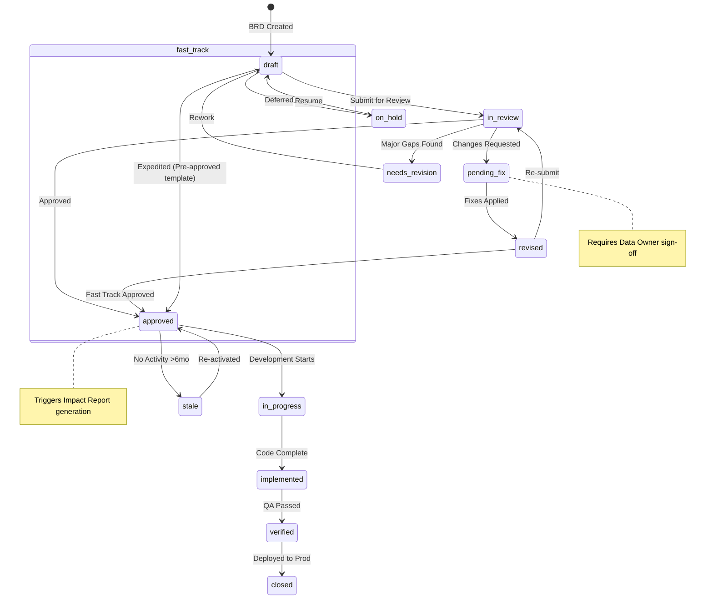
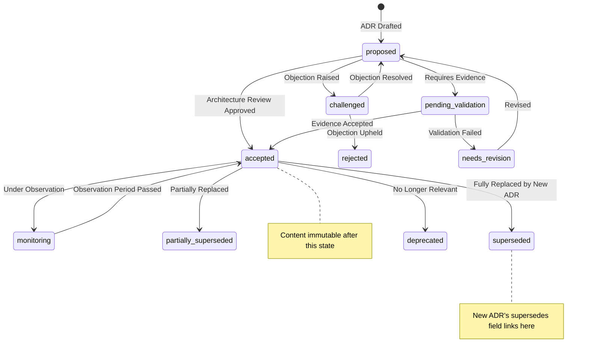

# BRD/ADR Lifecycle State Machine

> **Origin**: §23.4 of [`docs/03-architecture.md`](../../03-architecture.md) | **Sub-project**: [brd-adr-lifecycle](README.md)

## Purpose

This module defines the **extended state machines** that govern the lifecycle of BRDs and ADRs. A BRD or ADR is never just "created then done" — enterprise requirements management demands richer intermediate states: blocking on external dependencies, partial implementation, verification-and-fix cycles, stakeholder approval gating, deferral, and staleness detection. Likewise, an ADR's path from proposal to acceptance needs states for challenge, evidence-gathering, and revision before the decision becomes immutable.

This module covers §23.4 in full:
- §23.4.1 BRD Lifecycle — the **16-state** extended state machine (with the 9 core flow states).
- §23.4.2 ADR Lifecycle — the **12-state** extended state machine (with the 7 core flow states), including the immutability invariant at `accepted`.
- §23.4.3 State Transition Diagrams — Mermaid `stateDiagram-v2` for both.
- §23.4.4 Guard Conditions — the conditions that gate the most important transitions.

The states here are driven by the `status` fields defined in the entity models ([BRD Entity Model](brd-entity-model.md) §23.2.1, [ADR Entity Model](adr-entity-model.md) §23.3.1).

## Boundaries

**In scope**

- The full BRD state machine: all 16 states, the transitions between them, the intermediate-state behaviour table, and the auto-triggered `needs_update` mechanism.
- The full ADR state machine: all 12 states, the pre-acceptance intermediate states (`needs_revision`, `challenged`, `pending_validation`), the post-acceptance status markers (`monitoring`, `partially_superseded`, `deprecated`, `superseded`), and the **immutability invariant** at `accepted`.
- The Mermaid state-transition diagrams for both machines (§23.4.3).
- The guard-conditions table (§23.4.4).

**Out of scope**

- The **entity schemas** whose `status` fields this machine drives — see [BRD Entity Model](brd-entity-model.md) and [ADR Entity Model](adr-entity-model.md).
- The **AI-assisted generation** that produces the draft entering `draft` / `proposed` — see [Generation Pipeline](generation-pipeline.md).
- The **Code Graph node/edge storage** that records state changes — owned by [`knowledge-services`](../knowledge-services/).
- The **Workbench UI** implementation detail (flags/attributes vs. independent state options) is noted as a design note but the UI itself is out of scope.

## Interfaces

- **Entity `status` field** — the state machine reads and writes the `status` field of the BRD/ADR YAML (§23.2.1 / §23.3.1). Each transition is a guarded update to this field, persisted to Git and re-materialised in the Code Graph.
- **Workbench UI** — the user-facing surfaces that present the allowed actions per state (e.g., "Submit for Review", "Add clarification", "Resolve objection"). Intermediate states are surfaced via flags/attributes (see design notes) rather than as independent dropdown options.
- **Notification service** — auto-reminders and escalations (e.g., 7-day stakeholder timeout, 24h dependency status check, deferred-date reminders) are emitted on state entry/timeout.
- **Code Graph / Change Intelligence** — entity-change events drive the auto-triggered `needs_update` (BRD) and the architecturally-significant-change detection that can lead to ADR creation (see [Generation Pipeline](generation-pipeline.md) §23.5.8 / §23.5.9).
- **CI/CD Fitness Functions** — guard conditions such as `proposed → accepted` ("fitness functions pass") are evaluated by the Compliance Mapper (§23.8).

## Dependencies

- **Code Graph** — records state transitions and supports the dependency-graph traversal that powers `needs_update` Suspect Flags and the ADR supersession chain. Owned by [`knowledge-services`](../knowledge-services/).
- **Change Intelligence** — emits entity-change events (KB entry modified, Data Source schema change, BRD approved, etc.) that drive auto-transitions. Owned by [`knowledge-services`](../knowledge-services/).
- **Notification service / Event Bus** — delivers the timeout/escalation reminders referenced in the intermediate-state tables. Owned by [`platform-core`](../platform-core/).
- **E2E test suites** — the `in_verification` state auto-runs related E2E test suites and generates a Verification Report.
- **Issue/Ticket system** — the `needs_fix` state auto-creates an Issue with failed AC, related logs, and data snapshot, linked to the failed test case.

## Data Model

### §23.4 BRD/ADR Lifecycle State Machine

#### §23.4.1 BRD Lifecycle (Extended State Machine)

> **Design Note**: Of the 16 states below, intermediate states such as `partially_implemented`, `needs_clarification`, `pending_stakeholder`, `blocked`, `deferred`, and `partially_verified` are implemented in the Workbench UI via flags/attributes (e.g., `completion_pct`, `blocked_reason`, `deferred_until`) rather than exposed as independent state options. The core flow states are 9: draft → in_review → approved → in_progress → implemented → verified → deprecated/superseded/rejected.

The BRD needs to support richer intermediate states beyond "draft → approval → implementation" to reflect real-world enterprise requirements management scenarios such as blocking, partial implementation, and verification-fix cycles:

```
                              ┌─────────────┐
                              │    draft    │  ← AI generates draft / user manually creates
                              └──────┬──────┘
                                     │ submit_for_review
                                     ▼
                              ┌─────────────┐
                 ┌────────────│  in_review  │────────────┐
                 │            └──────┬──────┘            │
                 │                   │                   │
                 ▼                   ▼                   ▼
          ┌──────────────┐  ┌──────────────┐  ┌──────────────────┐
          │needs_clarifi- │  │   approved   │  │    rejected      │
          │ cation (AI/re-│  └──────┬───────┘  │ (final rejection, │
          │ viewer found  │         │          │  archived)        │
          │ ambiguities)  │         │          └──────────────────┘
          └───────┬───────┘         │
                  │                 ▼
                  │          ┌──────────────┐
                  │          │ in_progress  │
                  │          └──────┬───────┘
                  │                 │
                  │     ┌───────────┼───────────┐
                  │     ▼           ▼           ▼
                  │  ┌────────┐ ┌──────────┐ ┌──────────────┐
                  │  │blocked │ │partially │ │ implemented  │
                  │  │(ext de-│ │_implemented│ │ (fully done)│
                  │  │pendency│ └────┬─────┘ └──────┬───────┘
                  │  │blocks) │      │              │
                  │  └───┬────┘      │              ▼
                  │      │           │       ┌──────────────┐
                  │      └───────────┤       │in_verification│
                  │                  │       └──────┬───────┘
                  │                  │              │
                  │                  │     ┌────────┼────────┐
                  │                  │     ▼        ▼        ▼
                  │                  │ ┌────────┐ ┌──────┐ ┌──────────┐
                  │                  │ │verified│ │needs │ │ partially│
                  │                  │ │(passed)│ │_fix  │ │_verified │
                  │                  │ └────────┘ └──┬───┘ └──────────┘
                  │                  │               │
                  └──────────────────┴───────────────┘
                                     │
              ┌──────────────────────┼──────────────────────┐
              ▼                      ▼                      ▼
       ┌────────────┐       ┌──────────────┐       ┌──────────────┐
       │ deprecated │       │ needs_update │       │  superseded  │
       │(no longer  │       │(linked WF    │       │(replaced by  │
       │ needed)    │       │ change auto- │       │ new BRD)     │
       └────────────┘       │ triggers)    │       └──────────────┘
                            └──────┬───────┘
                                   │ update complete
                                   ▼
                            ┌──────────────┐
                            │  in_review   │ (re-enter approval)
                            └──────────────┘
```

**Key Intermediate States Explained**

| State                    | Trigger Condition                                                                           | Allowed Actions                   | Automatic Behavior                                                                               |
| ----------------------- | ------------------------------------------------------------------------------------------- | -------------------------------- | ------------------------------------------------------------------------------------------------- |
| `needs_clarification`   | AI/reviewer discovers requirement ambiguity, missing data source, or calculation conflict   | Add clarification, resubmit     | **LLM auto-tags specific ambiguity points** (citing conflicting KB entries); notifies author with specific question list |
| `pending_stakeholder`   | Requires confirmation from specific stakeholder (e.g., CFO confirms report methodology)     | Stakeholder comment/confirm/reject | Auto-reminder after 7 days timeout; configurable escalation (→ notify supervisor)                |
| `blocked`               | External dependency not ready (e.g., ERP system upgrade in progress, upstream BRD incomplete) | Record block reason, manually unblock | Periodic dependency status check (every 24h); auto-notify Owner when dependency resolved          |
| `partially_implemented` | Some requirements live, some still in development                                           | Continue implementing, mark blocked | Code Graph displays completion percentage (e.g., 7/12 requirements implemented)                   |
| `in_verification`       | Implementation marked complete                                                              | Pass verification, mark needs fix | Auto-run related E2E test suites; generate Verification Report (with test results + data preview) |
| `needs_fix`             | Verification found inconsistency with acceptance criteria                                   | Fix issues, re-enter implementation | **Auto-create Issue/Ticket** (with failed AC, related logs, data snapshot); link to failed test case |
| `needs_update`          | **Auto-triggered**: related Workflow changed, related ADR superseded, related KB entry changed, compliance standards updated | Update requirements, mark deprecated | Code Graph detects related entity changes → auto-tag + notify BRD Owner + generate Impact Summary |
| `deferred`              | Actively postponed (resource/priority adjustment)                                           | Set revisit date                | Auto-reminder on date; escalate if >30 days past revisit without action                           |

#### §23.4.2 ADR Lifecycle (Extended State Machine)

> **Design Note**: Of the 12 states below, the core flow states are 7: proposed → in_discussion → accepted → deprecated/superseded/rejected/withdrawn. `challenged`, `needs_revision`, and `pending_validation` are implemented in the Workbench UI via discussion thread attributes rather than exposed as independent states.

The ADR's core principle remains unchanged — **content is immutable after `accepted`**. However, on the `proposed → accepted` path, intermediate states such as `challenged`, `pending_validation`, and `needs_revision` are added to support more rigorous decision discussions:

```
                              ┌─────────────┐
                              │  proposed   │  ← AI auto-detect / manual create
                              └──────┬──────┘
                                     │ submit_for_discussion
                                     ▼
                              ┌─────────────┐
                 ┌────────────│in_discussion│────────────┐
                 │            └──────┬──────┘            │
                 │                   │                   │
                 ▼                   ▼                   ▼
          ┌──────────────┐  ┌──────────────┐  ┌──────────────────┐
          │needs_revision│  │  challenged  │  │pending_validation│
          │(feedback re- │  │(objection    │  │(awaiting proto-  │
          │ quests revi- │  │ raised)      │  │ type/PoC result) │
          │ sions)       │  └──────┬───────┘  └────────┬─────────┘
                  │                │                    │
                  └────────────────┼────────────────────┘
                                   │
                                   ▼
                            ┌─────────────┐
                            │   accepted  │ ← ⚠️ immutable from this point (IMMUTABLE)
                            └──────┬──────┘
                                   │
            ┌──────────────────────┼──────────────────────┐
            │                      │                      │
            ▼                      ▼                      ▼
     ┌─────────────┐       ┌──────────────┐       ┌──────────────┐
     │ monitoring  │       │  partially   │       │  deprecated  │
     │(under ob-   │       │ _superseded  │       │(decision no  │
     │ servation,  │       └──────┬───────┘       │ longer rele- │
     │ review set) │              │               │ vant)        │
     └─────────────┘              │               └──────────────┘
                                  ▼
                           ┌──────────────┐
                           │  superseded  │ ← fully replaced by new ADR
                           └──────────────┘
        rejected (final denial)     withdrawn (author retracts)
```

**Important Intermediate States Before Acceptance**

| State | Trigger Condition | Behavior |
| -------------------- | ------------------------------------------------------------------------------------- | -------------------------------------------------------------------------------------------------------------------- |
| `needs_revision` | Discussion received specific revision requests (e.g., "needs security boundary consideration", "missing performance baseline") | Author revises and resubmits → `in_discussion`; changes recorded as diffs |
| `challenged` | Someone provides **concrete evidence** opposing the decision (e.g., "selected library has known CVE", "this approach conflicts with our existing XX architecture") | Opposer must provide specific reasons + alternatives; triggers architecture review vote (Team Lead can adjudicate); result: → `in_discussion` (revised) or → `rejected` |
| `pending_validation` | Decision depends on prototype validation / PoC / performance test results                                                       | Set validation deadline (max 14 days); auto-remind and escalate on expiry; result: → `in_discussion` or → `rejected` |
| `rejected`           | Decision was rejected                                                                                                          | **Record rejection reason and rejector**; ADR retained as historical reference (not deleted); can be cited by later ADRs as "why we didn't choose this approach" |
| `withdrawn`          | Author voluntarily retracts                                                                                                    | Retain record but mark inactive; reason optional                                                                     |

**Key States After Acceptance** (original decision content cannot be modified, only status markers change):

| State                   | Meaning                                                        | When to Use                                                                                  |
| ---------------------- | -------------------------------------------------------------- | -------------------------------------------------------------------------------------------- |
| `accepted`             | Decision is in effect, guiding current implementation          | Default                                                                                      |
| `monitoring`           | Decision in effect but flagged for observation (e.g., stability after new tech stack introduction) | Set observation period (e.g., 3 months); auto-remind for review on expiry; can attach metrics (e.g., "Ray task failure rate <1%") |
| `partially_superseded` | Partially replaced by new ADR, partially still in effect       | E.g., "Use PG as primary storage" partially superseded by "Introduce TiDB for multi-region" — single-region still uses PG |
| `deprecated`           | Decision no longer relevant                                    | System evolution made decision naturally obsolete (e.g., "Docker Compose local dev" deprecated after full migration to Dev Containers) |
| `superseded`           | Fully replaced by new ADR                                      | New ADR's `supersedes` field points to old ADR, forming an immutable decision chain           |

#### §23.4.3 State Transition Diagrams

**BRD State Machine** (16 states):

> **Simplified View**: The Mermaid diagram below shows the primary lifecycle path (9 core states). The full 16-state model — including intermediate states (`needs_clarification`, `in_verification`, `partially_implemented`, `blocked`, `partially_verified`, `needs_fix`, `deprecated`) — is detailed in the ASCII diagram and table above (§23.4.1).



**ADR State Machine** (12 states):

> **Simplified View**: The Mermaid diagram below shows the primary lifecycle path (10 core states). The full 12-state model — including `in_discussion` and `withdrawn` — is detailed in the ASCII diagram above (§23.4.2).



#### §23.4.4 Guard Conditions (Selection)

| Transition                   | Guard Condition                                            |
| ---------------------------- | ---------------------------------------------------------- |
| `draft → in_review`          | All required sections filled; fuzzy_nodes resolved         |
| `in_review → approved`       | ≥2 approvers (1 Business, 1 Architecture); all AC verified |
| `in_review → pending_fix`    | Reviewer comments > 0 AND severity ≤ Medium                |
| `in_review → needs_revision` | Critical issue found OR >5 Medium issues                   |
| `proposed → accepted`        | Architecture review quorum met; fitness functions pass     |
| `accepted → superseded`      | New ADR explicitly references this ADR in `supersedes`     |

## Failure Modes & Recovery

| Failure mode | Detection | Impact | Recovery |
|--------------|-----------|--------|----------|
| **BRD stuck in `blocked`** (external dependency never resolves) | Periodic dependency status check (every 24h); deferred/escalation timer | Implementation cannot proceed; dependent requirements stall | Auto-notify BRD Owner on each check; if dependency remains unresolved, Owner may transition to `deferred` (set revisit date) or `needs_update`. Dependency resolution auto-notifies Owner to unblock. |
| **BRD `needs_fix` loop** (verification repeatedly finds AC violations) | E2E suite failures on each `in_verification` entry; Issue/Ticket churn | Implementation oscillates between `in_progress` ↔ `in_verification` ↔ `needs_fix` | Each `needs_fix` auto-creates an Issue with the failed AC. After repeated failures, escalate (same-section max-attempts rule from §23.5.5 applies analogously) for human resolution. |
| **ADR `pending_validation` deadline expires** | Auto-remind/escalate on validation deadline (max 14 days) | Decision cannot reach `accepted`; related work blocked on the outcome | Escalate; result is forced to `in_discussion` (revised) or `rejected` — the decision cannot linger indefinitely. |
| **ADR `challenged` with no resolution** | Architecture review vote adjudication (Team Lead can adjudicate) | Decision stalls | Team Lead adjudicates: → `in_discussion` (revised) or → `rejected`. The challenge mechanism exists precisely to prevent indefinite stalling. |
| **Stale BRD never re-approved after `needs_update`** | `needs_update → in_review` requires re-entering approval; staleness timer | BRD content drifts from current reality while awaiting re-approval | `needs_update` auto-generates an Impact Summary and notifies the Owner; the 6-month staleness path (`approved → stale`, Mermaid) is the backstop. |
| **Attempted mutation of accepted ADR content** | Immutability invariant at `accepted` (review + Code Graph consistency) | Immutable decision chain compromised | Reject the change; require a new superseding ADR (`accepted → superseded`). |

## Non-Functional Requirements

- **Auto-detection of staleness** — the Code Graph dependency traversal must catch every entity change (KB entry, ADR supersession, Workflow change, compliance standard update) that affects a BRD, within the event-driven latency of the Suspect Flag mechanism (see [Generation Pipeline](generation-pipeline.md) §23.5.8). Precision is to the Requirement level.
- **No indefinite lingering** — every intermediate state has a timeout or adjudication path: `pending_stakeholder` (7-day timeout + escalation), `blocked` (24h dependency check), `pending_validation` (14-day max), `challenged` (Team Lead adjudication), `deferred` (revisit-date reminder + >30-day escalation). No state is a permanent parking spot.
- **Immutability enforcement (ADR)** — once `accepted`, the ADR decision content (`context`, `decision_drivers`, `options`, `decision`, `consequences`) must be unchangeable; only the status marker may evolve. This is verified structurally.
- **Auditability** — every state transition is recorded (Git history for the YAML status field; Code Graph for the transition event). Rejection reasons and rejectors are recorded (`rejected`); block reasons are recorded (`blocked`); revisit dates are recorded (`deferred`).
- **Workbench UX** — intermediate states are surfaced via flags/attributes (`completion_pct`, `blocked_reason`, `deferred_until`) rather than as independent dropdown options, to keep the core flow legible while preserving the full state space for the machine.

## Key Flows

### BRD core lifecycle (9 core states)

1. `draft` — AI generates draft (see [Generation Pipeline](generation-pipeline.md)) or user manually creates. (Guard to `in_review`: all required sections filled; fuzzy_nodes resolved.)
2. `in_review` — submit for review. Branches to `needs_clarification` (ambiguity), `approved`, or `rejected` (final, archived).
3. `approved` — (Guard: ≥2 approvers incl. 1 Business + 1 Architecture; all AC verified.) Triggers Impact Report generation. Can staleness-transition to `stale` after >6mo inactivity, or to `needs_update` auto on related-entity change.
4. `in_progress` — development starts. Can be `blocked` (external dependency), `partially_implemented`, or reach `implemented`.
5. `implemented` — code complete → `in_verification`.
6. `in_verification` — auto-runs E2E suites, generates Verification Report → `verified` / `needs_fix` / `partially_verified`. `needs_fix` auto-creates an Issue and returns to `in_progress`.
7. Terminal/transition states: `deprecated` (no longer needed), `needs_update` (auto, re-enters `in_review`), `superseded` (replaced by new BRD).

### BRD stale-detection auto-flow (`needs_update`)

1. A related entity changes (Workflow, ADR, KB entry, compliance standard).
2. Code Graph traverses the dependency graph and finds all BRDs referencing that entity (Requirement-level precision).
3. Affected BRD is auto-flagged `needs_update` (Suspect Flag) and the Owner is notified with an Impact Summary.
4. Owner adjudicates: update requirements → on update complete, re-enter `in_review` for re-approval; or mark `deprecated`.

### ADR core lifecycle (7 core states, immutability at `accepted`)

1. `proposed` — AI auto-detects an architecturally significant change (see [Generation Pipeline](generation-pipeline.md) §23.5.9) or manual create.
2. `in_discussion` — submit for discussion. May pass through `needs_revision`, `challenged`, or `pending_validation` (each with its own timeout/adjudication).
3. `accepted` — (Guard: architecture review quorum met; fitness functions pass.) **Content becomes immutable from this point.** Code Graph adds the ADR node + edges; affected component Owners are notified (FR37).
4. Post-acceptance status markers (content unchanged): `monitoring` (observation period with metrics), `partially_superseded`, `deprecated`, `superseded` (new ADR's `supersedes` points here — the immutable decision chain).
5. Pre-acceptance terminals: `rejected` (reason + rejector recorded; retained as historical reference), `withdrawn` (author retracts).

### ADR supersession flow

1. A new ADR is `accepted` whose `supersedes` field references this ADR (guard: `accepted → superseded` requires the new ADR to explicitly reference this one in `supersedes`).
2. This ADR transitions `accepted → superseded` (or `partially_superseded` if only partially replaced).
3. The supersession edge is recorded on both ADRs; the chain is immutable from there.

## Design References

- **§23.4 BRD/ADR Lifecycle State Machine** — the source section in [`docs/03-architecture.md`](../../03-architecture.md).
- [BRD Entity Model](brd-entity-model.md) §23.2.1 — the BRD `status` field this machine drives.
- [ADR Entity Model](adr-entity-model.md) §23.3.1 — the ADR `status`, `supersedes`, and `superseded_by` fields this machine drives.
- [Generation Pipeline](generation-pipeline.md) §23.5.8 — the event-driven Suspect Flag mechanism that auto-triggers `needs_update`.
- [Generation Pipeline](generation-pipeline.md) §23.5.9 — the ADR Generation Flow that produces `proposed` ADRs from architecturally significant code changes.
- **§23.8 External Tool Integration** — the Compliance Mapper / Fitness Functions that evaluate the `proposed → accepted` guard, in [`docs/03-architecture.md`](../../03-architecture.md).
- [ADR-0010](../../../adr/0010-brd-adr-first-class.md) — BRD/ADR as First-Class Entities.
- [`docs/glossary.md`](../../glossary.md) — definitions of BRD, ADR, Suspect Flag, and related terms.
- Sub-project README — [`docs/sub-projects/brd-adr-lifecycle/README.md`](README.md).
